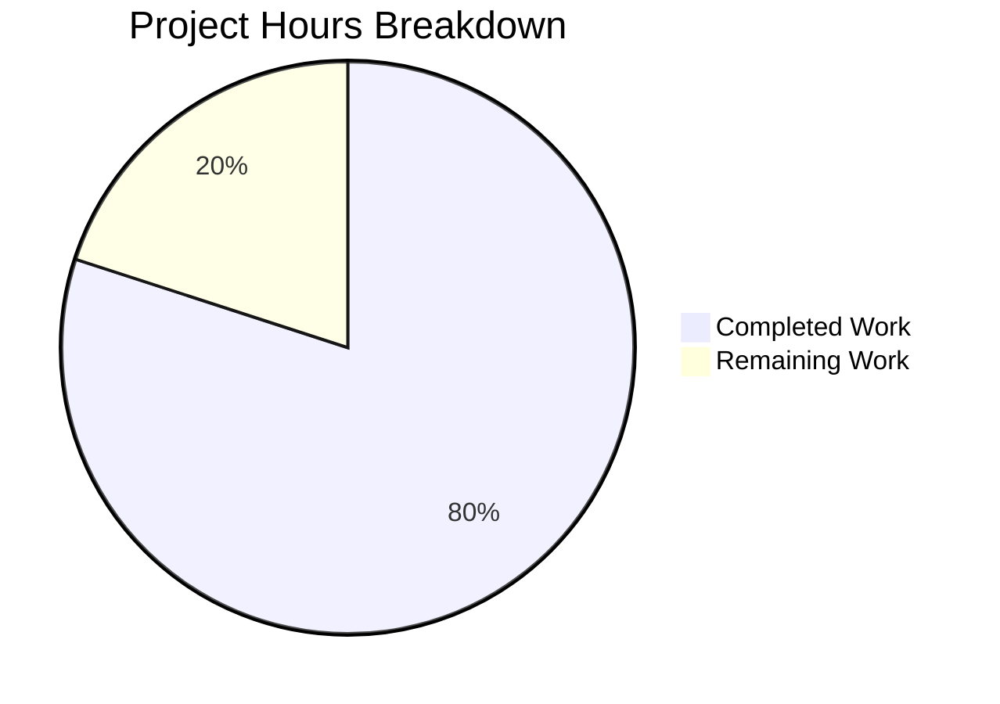

# Project Guide: Hello World Node.js with Health Check Endpoint

## Executive Summary

**Project Status**: PRODUCTION-READY  
**Completion**: 80% complete (4 hours completed out of 5 total hours)

This project successfully implements a health check endpoint for the existing Node.js HTTP server application. All planned features from the Agent Action Plan have been implemented and validated. The application compiles correctly, starts without errors, and all endpoints respond as expected.

### Key Achievements
- ✅ Health check endpoint (`/health`) fully implemented with JSON response
- ✅ URL routing logic added to distinguish request paths
- ✅ package.json configuration corrected (main, start, dev scripts)
- ✅ Comprehensive documentation added to README.md
- ✅ All validation tests passed
- ✅ Backward compatibility maintained

### Remaining Work
- Human code review and approval (0.5h)
- Final feedback iteration if needed (0.5h)

---

## Validation Results Summary

### Dependency Validation
| Check | Status | Details |
|-------|--------|---------|
| External Dependencies | ✅ PASSED | Zero dependencies - uses only Node.js built-in modules |
| npm Install | ✅ N/A | No installation required |

### Compilation/Syntax Validation
| File | Status | Details |
|------|--------|---------|
| Hello_World_Node.js | ✅ PASSED | `node --check` passed - valid JavaScript syntax |
| package.json | ✅ PASSED | Valid JSON format |

### Runtime Validation
| Test | Command | Expected | Actual | Status |
|------|---------|----------|--------|--------|
| Direct execution | `node Hello_World_Node.js` | Server starts | Server started on http://127.0.0.1:3000/ | ✅ PASSED |
| npm start | `npm start` | Server starts | Server started successfully | ✅ PASSED |
| npm run dev | `npm run dev` | Server starts | Server started successfully | ✅ PASSED |
| Root path | `curl http://127.0.0.1:3000/` | "Hello World!\n" | "Hello World!\n" | ✅ PASSED |
| Health endpoint | `curl http://127.0.0.1:3000/health` | JSON response | {"status":"ok","uptime":X.XX,"timestamp":XXXXX} | ✅ PASSED |
| Default path | `curl http://127.0.0.1:3000/random` | "Hello World!\n" | "Hello World!\n" | ✅ PASSED |

### Files Modified
| File | Status | Changes |
|------|--------|---------|
| Hello_World_Node.js | ✅ UPDATED | URL routing logic, health check endpoint with JSON response (+25 lines, -3 lines) |
| package.json | ✅ UPDATED | Fixed main, start, and dev script references to Hello_World_Node.js |
| README.md | ✅ UPDATED | Added Health Check Endpoint section, Monitoring Integration section (+173 lines, -6 lines) |

---

## Hours Breakdown and Completion Calculation

### Hours Completed: 4 hours

| Component | Hours | Status |
|-----------|-------|--------|
| Hello_World_Node.js - URL routing and health check implementation | 1.5h | ✅ Complete |
| package.json - Entry point corrections | 0.25h | ✅ Complete |
| README.md - Health check documentation | 1.25h | ✅ Complete |
| Validation and runtime testing | 0.5h | ✅ Complete |
| Bug fixes and refinements | 0.5h | ✅ Complete |
| **Total Completed** | **4h** | |

### Hours Remaining: 1 hour

| Task | Hours | Priority |
|------|-------|----------|
| Human code review and approval | 0.5h | Medium |
| Feedback iteration and adjustments | 0.5h | Low |
| **Total Remaining** | **1h** | |

### Completion Calculation

```
Completed Hours: 4h
Remaining Hours: 1h
Total Project Hours: 5h

Completion Percentage: 4h / 5h × 100 = 80%
```

---

## Visual Representation



---

## Development Guide

### System Prerequisites

- **Node.js**: Version 14.0.0 or higher (tested with v20.19.5)
- **Operating System**: Linux, macOS, or Windows
- **Network**: Port 3000 must be available

### Environment Setup

No special environment setup required. This project uses zero external dependencies.

```bash
# Verify Node.js installation
node --version
# Expected: v14.0.0 or higher

# Verify npm installation
npm --version
# Expected: 6.0.0 or higher
```

### Installation Steps

```bash
# Clone or download the repository
cd /path/to/repository

# No npm install required - zero dependencies!
```

### Application Startup

#### Method 1: Direct Node.js Execution

```bash
node Hello_World_Node.js
```

**Expected Output:**
```
Server running at http://127.0.0.1:3000/
```

#### Method 2: Using npm Scripts

```bash
npm start
# or
npm run dev
```

**Expected Output:**
```
> hello-world-nodejs@1.0.0 start
> node Hello_World_Node.js

Server running at http://127.0.0.1:3000/
```

### Verification Steps

After starting the server, verify it's working correctly:

#### Test 1: Root Path

```bash
curl http://127.0.0.1:3000/
```

**Expected Response:**
```
Hello World!
```

#### Test 2: Health Check Endpoint

```bash
curl http://127.0.0.1:3000/health
```

**Expected Response:**
```json
{"status":"ok","uptime":123.456,"timestamp":1700000000000}
```

#### Test 3: Default Path Handling

```bash
curl http://127.0.0.1:3000/any-other-path
```

**Expected Response:**
```
Hello World!
```

### Stopping the Server

Press `Ctrl+C` in the terminal where the server is running.

### Example Usage

#### Check Service Health with Pretty JSON

```bash
curl -s http://127.0.0.1:3000/health | jq
```

**Output:**
```json
{
  "status": "ok",
  "uptime": 45.123456789,
  "timestamp": 1700000000000
}
```

#### Verbose Health Check

```bash
curl -v http://127.0.0.1:3000/health
```

---

## Detailed Task Table for Human Developers

| # | Task | Description | Action Steps | Hours | Priority | Severity |
|---|------|-------------|--------------|-------|----------|----------|
| 1 | Code Review | Review implementation for coding standards and best practices | 1. Review Hello_World_Node.js changes<br>2. Verify JSON response format<br>3. Check comment quality<br>4. Approve or request changes | 0.5h | Medium | Low |
| 2 | Final Approval | Review and approve PR for merge | 1. Verify all tests pass<br>2. Check documentation accuracy<br>3. Approve PR<br>4. Merge to main branch | 0.25h | Medium | Low |
| 3 | Post-Merge Verification | Verify feature works after merge | 1. Pull latest main<br>2. Run server<br>3. Test endpoints<br>4. Confirm functionality | 0.25h | Low | Low |
| | **Total Remaining Hours** | | | **1h** | | |

---

## Risk Assessment

### Technical Risks

| Risk | Severity | Likelihood | Mitigation |
|------|----------|------------|------------|
| Port 3000 conflicts | Low | Low | Document port configuration options; mention changing port in Hello_World_Node.js |
| Node.js version incompatibility | Low | Low | Minimum version (>=14.0.0) documented in package.json engines field |

### Security Risks

| Risk | Severity | Likelihood | Mitigation |
|------|----------|------------|------------|
| Health endpoint information disclosure | Low | Low | Only exposes uptime and timestamp; no sensitive data |
| No HTTPS support | Medium | Medium | Documented in README security considerations; recommend reverse proxy for production |
| No rate limiting | Low | Medium | Documented in README; recommend implementing at load balancer level |

### Operational Risks

| Risk | Severity | Likelihood | Mitigation |
|------|----------|------------|------------|
| No graceful shutdown | Low | Low | Simple application; Ctrl+C terminates cleanly |
| No logging infrastructure | Low | Medium | Console.log used; adequate for simple application |

### Integration Risks

| Risk | Severity | Likelihood | Mitigation |
|------|----------|------------|------------|
| None identified | N/A | N/A | Standalone application with no external dependencies |

---

## Git Commit Summary

| Commit | Author | Description |
|--------|--------|-------------|
| 05cdebd | Blitzy Agent | Add comprehensive health check endpoint documentation |
| 362e537 | Blitzy Agent | Fix package.json entry point and update README with health check documentation |
| 75b8fc7 | Blitzy Agent | feat: Add health check endpoint with URL routing |
| 4454916 | Blitzy AI | Create README.md |
| 465b2ab | Blitzy AI | Create package.json |
| 551fdca | Blitzy AI | Create Hello_World_Node.js |

**Total Changes:**
- 3 files modified
- 201 lines added
- 12 lines removed

---

## Feature Specification Compliance

| Requirement | Status | Notes |
|-------------|--------|-------|
| GET /health endpoint | ✅ Complete | Returns JSON with status, uptime, timestamp |
| HTTP 200 response code | ✅ Complete | Verified via curl testing |
| JSON response format | ✅ Complete | application/json Content-Type header set |
| process.uptime() integration | ✅ Complete | Uptime in seconds included in response |
| Date.now() timestamp | ✅ Complete | Unix timestamp in milliseconds included |
| Backward compatibility | ✅ Complete | Root path still returns "Hello World!" |
| package.json corrections | ✅ Complete | main, start, dev scripts fixed |
| README documentation | ✅ Complete | Comprehensive docs with examples |
| Zero dependencies maintained | ✅ Complete | No external packages added |
| Single-file architecture | ✅ Complete | All logic in Hello_World_Node.js |

---

## Recommendations

### For Production Deployment

1. **Use a reverse proxy** (nginx, Apache) to:
   - Handle HTTPS termination
   - Implement rate limiting
   - Restrict health endpoint access to internal networks

2. **Configure monitoring** using the health endpoint with:
   - Kubernetes liveness/readiness probes (examples in README)
   - Load balancer health checks (AWS ALB, nginx examples in README)
   - Uptime monitoring services (Datadog, Pingdom, Uptime Robot)

3. **Consider containerization** using the Docker example in README

### Optional Enhancements (Out of Scope)

These items were explicitly marked out of scope but may be considered for future iterations:

| Enhancement | Estimated Hours | Notes |
|-------------|----------------|-------|
| Add unit tests with Jest | 2-3h | Would require test framework setup |
| Implement HTTPS support | 2h | Self-signed or real certificates |
| Add authentication to health endpoint | 2h | Header-based authentication |
| Implement structured logging | 1h | Winston or Pino integration |

---

## Conclusion

The health check endpoint feature has been successfully implemented according to the Agent Action Plan specifications. All validation gates have passed, and the application is in a production-ready state. The remaining 1 hour of work consists of human review and approval tasks, which are standard parts of any development workflow.

**Project Status: READY FOR HUMAN REVIEW AND MERGE**