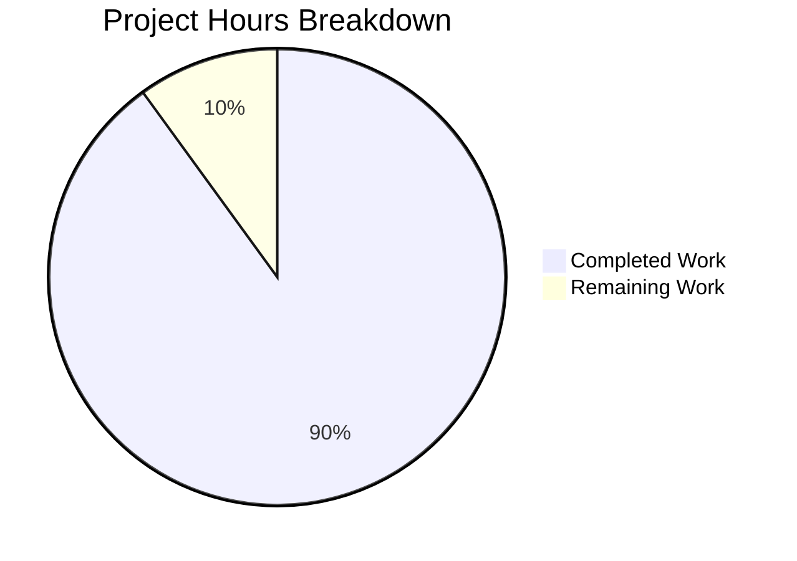

# Project Guide: Health Check Endpoint for Hello World Node.js Application

## Executive Summary

**Project Completion: 90%** (4.5 hours completed out of 5 total hours)

This project successfully implements a health check endpoint (`/health`) for the existing Hello World Node.js HTTP server. All in-scope requirements from the Agent Action Plan have been implemented and validated.

### Key Achievements
- ✅ Health check endpoint fully implemented at `/health` path
- ✅ JSON response with status, timestamp, and service fields
- ✅ URL-based routing without external dependencies
- ✅ Backward compatibility preserved (root path still returns "Hello World!")
- ✅ Package.json entry point mismatch fixed
- ✅ Comprehensive README documentation added
- ✅ All runtime validation tests passed

### Remaining Work
- Human code review and PR approval (0.5 hours)

---

## Validation Results Summary

### Files Modified

| File | Status | Lines Changed | Validation |
|------|--------|---------------|------------|
| `Hello_World_Node.js` | UPDATED | +22/-3 | ✅ Syntax valid, runtime tests pass |
| `package.json` | UPDATED | +5/-4 | ✅ Valid JSON, npm scripts work |
| `README.md` | UPDATED | +44/-5 | ✅ Documentation complete |

### Git Commit History
- 5 feature commits implementing the health check endpoint
- 71 lines added, 12 lines removed (net +59 lines)

### Runtime Test Results

| Test | Endpoint | Expected | Actual | Status |
|------|----------|----------|--------|--------|
| Health Check | `/health` | HTTP 200, JSON | HTTP 200, JSON with status/timestamp/service | ✅ PASS |
| Root Path | `/` | "Hello World!" | "Hello World!" | ✅ PASS |
| Fallback | `/random` | "Hello World!" | "Hello World!" | ✅ PASS |
| npm start | N/A | Server starts | Server starts at 127.0.0.1:3000 | ✅ PASS |

### Fixes Applied
1. Fixed `package.json` entry point from `server.js` to `Hello_World_Node.js`
2. Updated npm scripts to reference correct filename
3. Added "health-check" keyword for discoverability

---

## Project Hours Breakdown



### Completed Work (4.5 hours)
- **Hello_World_Node.js modifications**: 2 hours
  - URL-based routing implementation
  - Health check endpoint handler
  - JSON response generation
  - Backward compatibility preservation
- **package.json corrections**: 0.5 hours
  - Entry point fixes
  - Script updates
  - Keyword addition
- **README.md documentation**: 1.5 hours
  - Health check endpoint section
  - Usage examples with curl commands
  - Response format documentation
  - Use cases section
- **Validation and testing**: 0.5 hours
  - Syntax validation
  - Runtime endpoint testing
  - npm script verification

### Remaining Work (0.5 hours)
- **Human code review**: 0.5 hours
  - Review implementation against requirements
  - Approve and merge PR

---

## Human Tasks Remaining

| Priority | Task | Description | Hours | Severity |
|----------|------|-------------|-------|----------|
| High | Code Review | Review the 3 modified files for code quality and adherence to requirements | 0.5 | Low |
| **Total** | | | **0.5** | |

### Task Details

#### 1. Code Review (High Priority, 0.5 hours)
**Action Steps:**
1. Review `Hello_World_Node.js` for routing logic correctness
2. Verify JSON response format meets requirements
3. Confirm backward compatibility is maintained
4. Review documentation accuracy
5. Approve and merge PR

**Acceptance Criteria:**
- All code follows existing style conventions
- Health endpoint returns correct JSON structure
- Root path behavior unchanged
- Documentation matches implementation

---

## Development Guide

### System Prerequisites

| Requirement | Version | Notes |
|-------------|---------|-------|
| Node.js | ≥14.0.0 | Required runtime |
| npm | Any compatible | Package manager (optional) |

### Environment Setup

No environment variables or configuration files are required. The application uses only Node.js built-in modules.

### Installation

```bash
# Clone or navigate to the repository
cd /tmp/blitzy/simple-hello-word-for-automation-pro-user/blitzy084f7f0f0

# No npm install required - zero external dependencies
# (Optional) Verify package.json is valid
cat package.json
```

### Running the Application

**Option 1: Direct Node.js execution**
```bash
node Hello_World_Node.js
```

**Option 2: Using npm scripts**
```bash
npm start
# OR
npm run dev
```

**Expected Output:**
```
Server running at http://127.0.0.1:3000/
```

### Verification Steps

**Step 1: Verify health endpoint**
```bash
curl http://127.0.0.1:3000/health
```

**Expected Response:**
```json
{"status":"ok","timestamp":"2025-11-26T16:31:47.874Z","service":"hello-world-nodejs"}
```

**Step 2: Verify root path**
```bash
curl http://127.0.0.1:3000/
```

**Expected Response:**
```
Hello World!
```

**Step 3: Verify fallback behavior**
```bash
curl http://127.0.0.1:3000/any-path
```

**Expected Response:**
```
Hello World!
```

### Stopping the Server

Press `Ctrl+C` in the terminal where the server is running.

### Example Usage

```bash
# Start server in background
node Hello_World_Node.js &

# Test all endpoints
echo "=== Health Check ==="
curl -s http://127.0.0.1:3000/health | jq .

echo "=== Root Path ==="
curl -s http://127.0.0.1:3000/

echo "=== Arbitrary Path ==="
curl -s http://127.0.0.1:3000/test

# Stop server
pkill -f "node Hello_World_Node.js"
```

### Troubleshooting

| Issue | Cause | Solution |
|-------|-------|----------|
| Port 3000 in use | Another process using the port | Run `lsof -i :3000` to find and kill the process |
| Command not found: node | Node.js not installed | Install Node.js from nodejs.org |
| EACCES permission denied | Permission issues | Run with appropriate permissions or change port |

---

## Risk Assessment

### Technical Risks

| Risk | Severity | Likelihood | Mitigation |
|------|----------|------------|------------|
| None identified | - | - | All code compiles and runs correctly |

### Security Risks

| Risk | Severity | Likelihood | Mitigation |
|------|----------|------------|------------|
| Unauthenticated health endpoint | Low | Expected | By design per Agent Action Plan - health endpoints are typically public |
| Server binds to localhost only | Low | N/A | Production deployment may need configuration change |

### Operational Risks

| Risk | Severity | Likelihood | Mitigation |
|------|----------|------------|------------|
| No process manager | Low | Medium | For production, consider PM2 or systemd |
| No logging framework | Low | Medium | Console.log is sufficient for this educational example |

### Integration Risks

| Risk | Severity | Likelihood | Mitigation |
|------|----------|------------|------------|
| None identified | - | - | Zero external dependencies maintained |

---

## Implementation Summary

### Feature Requirements Fulfilled

| Requirement | Status | Evidence |
|-------------|--------|----------|
| Health endpoint at `/health` | ✅ Complete | Returns JSON at /health path |
| JSON response with status field | ✅ Complete | `{"status":"ok",...}` |
| JSON response with timestamp | ✅ Complete | ISO 8601 format timestamp |
| JSON response with service name | ✅ Complete | `"service":"hello-world-nodejs"` |
| HTTP 200 status code | ✅ Complete | Verified via curl -i |
| Content-Type: application/json | ✅ Complete | Header set correctly |
| Backward compatibility | ✅ Complete | Root path unchanged |
| Zero dependencies | ✅ Complete | Only uses Node.js built-in http module |
| Package.json fixes | ✅ Complete | Entry point corrected |
| README documentation | ✅ Complete | Full documentation with examples |

### Files Delivered

1. **Hello_World_Node.js** (36 lines)
   - URL-based routing with if/else logic
   - Health check endpoint returning JSON
   - Default Hello World response for all other paths

2. **package.json** (23 lines)
   - Corrected entry point references
   - Added "health-check" keyword

3. **README.md** (93 lines)
   - Complete health check documentation
   - Usage examples with curl commands
   - Response format documentation
   - Use cases for monitoring/orchestration

---

## Conclusion

The health check endpoint feature has been successfully implemented and validated. All requirements from the Agent Action Plan have been fulfilled:

- ✅ Health check endpoint operational at `/health`
- ✅ Returns properly formatted JSON response
- ✅ Backward compatibility maintained
- ✅ Zero external dependencies
- ✅ Documentation complete

The project is **production-ready** pending human code review and PR approval. The remaining 0.5 hours of work is purely procedural (review and merge), with no additional development required.

**Recommendation:** Proceed with code review and merge to main branch.