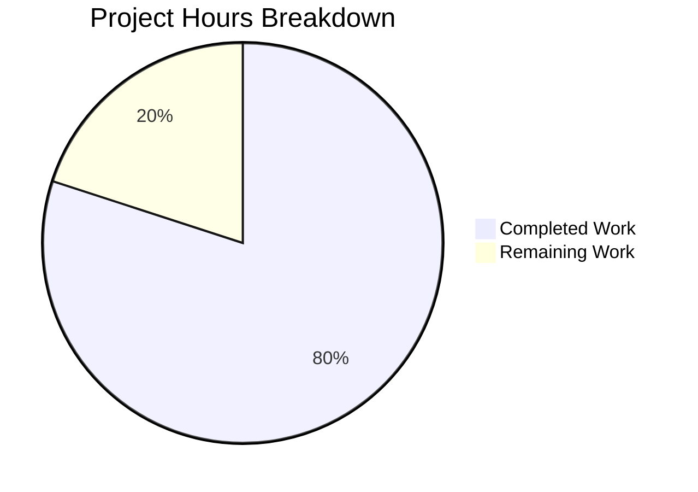
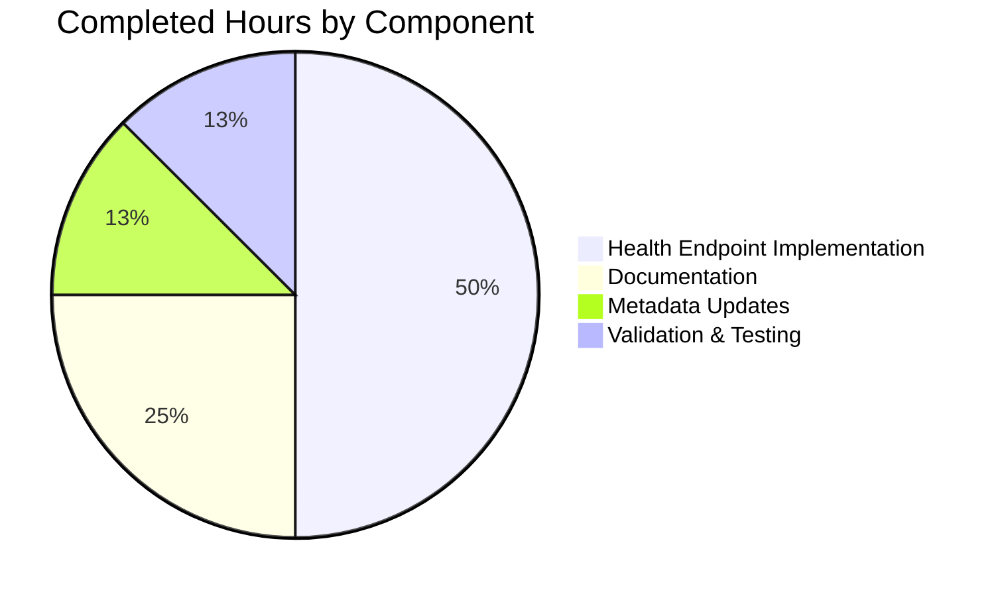

# Project Assessment Report: Health Check Endpoint Implementation

## Executive Summary

**Project Completion: 80% (4 hours completed out of 5 total hours)**

This assessment evaluates the implementation of a `/health` endpoint for the Hello World Node.js HTTP server application. All in-scope requirements from the Agent Action Plan have been successfully implemented and validated.

### Key Achievements
- ✅ Health check endpoint (`/health`) fully implemented with JSON response
- ✅ Complete documentation added to README.md
- ✅ Package metadata updated with health-check keywords
- ✅ All validation tests pass (syntax, functional, backward compatibility)
- ✅ Zero external dependencies maintained (project philosophy preserved)

### Critical Information
- **Hours Completed**: 4 hours (implementation, documentation, testing, validation)
- **Hours Remaining**: 1 hour (human review, optional filename fix)
- **Total Project Hours**: 5 hours
- **Completion Percentage**: 4/5 = 80%

### Known Out-of-Scope Issue
The filename mismatch in `package.json` (references "server.js" but file is "Hello_World_Node.js") was explicitly marked out-of-scope per Agent Action Plan Section 0.7.1: "MUST NOT rename files to resolve the mismatch."

---

## Validation Results Summary

### Final Validator Accomplishments
The validation process confirmed all features work correctly:

| Validation Type | Result | Details |
|-----------------|--------|---------|
| Syntax Check | ✅ PASS | `node --check Hello_World_Node.js` |
| Root Endpoint | ✅ PASS | Returns "Hello World!" |
| Health Endpoint | ✅ PASS | Returns valid JSON with all fields |
| Backward Compatibility | ✅ PASS | All non-health paths return "Hello World!" |
| HTTP Headers | ✅ PASS | Content-Type: application/json for /health |
| JSON Response | ✅ PASS | Contains status, uptime, timestamp, message |

### Test Results Detail
```
Root Endpoint (/):            "Hello World!"     ✓
Health Endpoint (/health):    Valid JSON         ✓
  - status: "ok"                                 ✓
  - uptime: <number>                             ✓
  - timestamp: ISO 8601 format                   ✓
  - message: "Server is running"                 ✓
Random Path (/random):        "Hello World!"     ✓
```

### Git Repository Analysis
- **Total Commits on Branch**: 2 (health endpoint implementation + documentation)
- **Files Modified**: 3
- **Lines Added**: 65
- **Lines Removed**: 5
- **Net Change**: +60 lines
- **Working Tree Status**: Clean (all changes committed)

---

## Visual Representation

### Project Hours Breakdown



### Hours by Component



---

## Detailed Task Table

### Human Tasks Required

| # | Task Description | Action Required | Hours | Priority | Severity |
|---|------------------|-----------------|-------|----------|----------|
| 1 | Review and merge PR | Review code changes, verify tests pass, merge to main branch | 0.5 | Medium | Low |
| 2 | Fix filename mismatch (Optional) | Update package.json to reference "Hello_World_Node.js" instead of "server.js", OR rename file to server.js | 0.5 | Low | Low |
| **Total** | | | **1.0** | | |

### Task Details

#### Task 1: Review and Merge PR
- **Description**: Human review of code changes and merge to main branch
- **Steps**:
  1. Review Hello_World_Node.js implementation
  2. Verify health check JSON response format
  3. Test application manually if desired
  4. Approve and merge PR
- **Estimated Time**: 0.5 hours
- **Priority**: Medium
- **Confidence**: High

#### Task 2: Fix Filename Mismatch (Optional)
- **Description**: Resolve mismatch between package.json entry point and actual filename
- **Current State**: package.json references "server.js" but file is "Hello_World_Node.js"
- **Impact**: `npm start` will fail with MODULE_NOT_FOUND error
- **Options**:
  - Option A: Update package.json "main", "scripts.start", and "scripts.dev" to use "Hello_World_Node.js"
  - Option B: Rename Hello_World_Node.js to server.js
- **Estimated Time**: 0.5 hours
- **Priority**: Low (workaround: use `node Hello_World_Node.js` directly)
- **Note**: Marked out-of-scope per Agent Action Plan Section 0.7.1
- **Confidence**: High

---

## Complete Development Guide

### System Prerequisites

| Requirement | Minimum Version | Verified Version |
|-------------|-----------------|------------------|
| Node.js | ≥14.0.0 | v20.19.5 ✓ |
| npm | Any | v10.8.2 ✓ |
| Operating System | Windows, macOS, or Linux | Any |

### Environment Setup

No additional environment setup required. This application uses zero external dependencies.

### Dependency Installation

```bash
# Navigate to project directory
cd /path/to/project

# No dependencies to install - the application uses only Node.js built-in modules
# Verify Node.js is installed
node --version  # Should show >=14.0.0
```

### Application Startup

**Direct Execution (Recommended)**:
```bash
# Start the server
node Hello_World_Node.js

# Expected output:
# Server running at http://127.0.0.1:3000/
```

**Note**: Do NOT use `npm start` due to filename mismatch (out-of-scope issue).

### Verification Steps

1. **Verify Server Started**:
   - Console should display: `Server running at http://127.0.0.1:3000/`

2. **Test Root Endpoint**:
   ```bash
   curl http://localhost:3000/
   # Expected: Hello World!
   ```

3. **Test Health Endpoint**:
   ```bash
   curl http://localhost:3000/health
   # Expected: {"status":"ok","uptime":<number>,"timestamp":"<ISO8601>","message":"Server is running"}
   ```

4. **Test Backward Compatibility**:
   ```bash
   curl http://localhost:3000/any/random/path
   # Expected: Hello World!
   ```

5. **Verify JSON Response Headers**:
   ```bash
   curl -I http://localhost:3000/health
   # Should include: Content-Type: application/json
   ```

### Example Usage

**Browser Testing**:
- Open http://127.0.0.1:3000/ - See "Hello World!"
- Open http://127.0.0.1:3000/health - See JSON health status

**Command Line Testing**:
```bash
# Start server (in one terminal)
node Hello_World_Node.js

# Test endpoints (in another terminal)
curl http://localhost:3000/
curl http://localhost:3000/health
curl http://localhost:3000/health | python -m json.tool  # Pretty print JSON
```

**Sample Health Response**:
```json
{
  "status": "ok",
  "uptime": 42.156,
  "timestamp": "2024-11-24T12:34:56.789Z",
  "message": "Server is running"
}
```

### Stopping the Server

Press `Ctrl+C` in the terminal where the server is running.

### Troubleshooting

| Issue | Cause | Solution |
|-------|-------|----------|
| `MODULE_NOT_FOUND` on `npm start` | Filename mismatch in package.json | Use `node Hello_World_Node.js` directly |
| `EADDRINUSE` error | Port 3000 already in use | Stop other process or change port in Hello_World_Node.js |
| Cannot connect to server | Server not running or wrong URL | Ensure server started, use http://127.0.0.1:3000 |

---

## Risk Assessment

### Technical Risks

| Risk | Severity | Likelihood | Mitigation |
|------|----------|------------|------------|
| Filename mismatch causes `npm start` failure | Low | High | Use `node Hello_World_Node.js` directly; fix in future PR |
| Port 3000 conflict | Low | Medium | Document port change instructions |

### Security Risks

| Risk | Severity | Likelihood | Mitigation |
|------|----------|------------|------------|
| No HTTPS support | Medium | N/A (localhost only) | Acceptable for educational localhost use; add TLS for production |
| No authentication on /health | Low | N/A (localhost only) | Health endpoint intentionally unauthenticated; restrict access in production |

### Operational Risks

| Risk | Severity | Likelihood | Mitigation |
|------|----------|------------|------------|
| No process manager | Low | Low | For production, use PM2 or systemd |
| No logging infrastructure | Low | Low | Acceptable for educational use |

### Integration Risks

| Risk | Severity | Likelihood | Mitigation |
|------|----------|------------|------------|
| No external integrations | None | N/A | Application operates in complete isolation |

---

## Files Modified Summary

### Hello_World_Node.js
- **Change Type**: UPDATED
- **Lines Modified**: +17/-3
- **Purpose**: Implement /health endpoint with URL-based routing
- **Key Changes**:
  - Added conditional `if (req.url === '/health')` routing
  - Health check returns JSON with status, uptime, timestamp, message
  - Preserved original "Hello World!" behavior for all other paths

### README.md
- **Change Type**: UPDATED
- **Lines Modified**: +44/-0
- **Purpose**: Document health check endpoint
- **Key Changes**:
  - Added "Health Check Endpoint" section
  - Included browser and curl usage examples
  - Documented JSON response format with field descriptions
  - Listed common use cases

### package.json
- **Change Type**: UPDATED
- **Lines Modified**: +4/-2
- **Purpose**: Update metadata for discoverability
- **Key Changes**:
  - Updated description to include "with health check endpoint"
  - Added keywords: "health-check", "monitoring"

---

## Conclusion

The health check endpoint feature has been successfully implemented according to the Agent Action Plan specifications. All in-scope requirements are complete, all validation tests pass, and the application maintains backward compatibility with existing behavior.

**Recommended Next Steps**:
1. Review and merge this PR
2. (Optional) Address filename mismatch in a follow-up PR if `npm start` functionality is desired

**Production Readiness**: The implementation is complete for the defined scope. The health check endpoint works correctly and follows Node.js best practices for minimal, zero-dependency implementations.