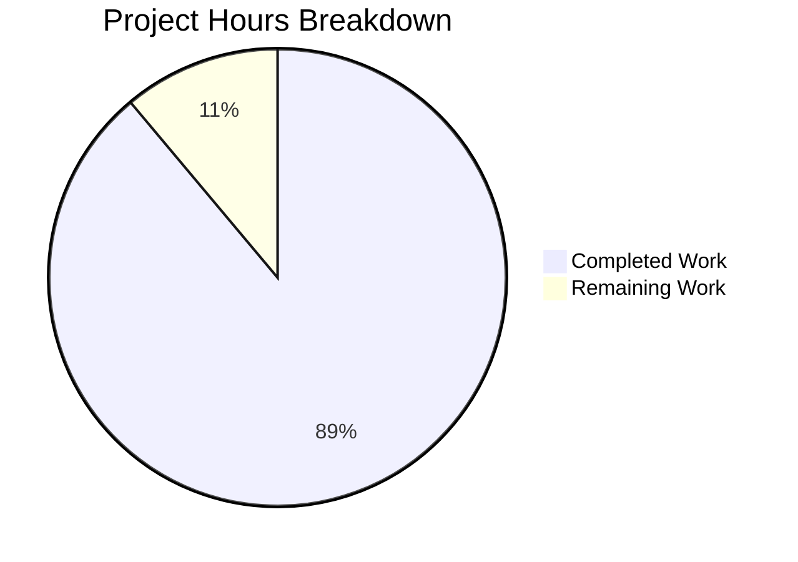

# Project Guide: Hello World Node.js Health Check Endpoint

## Executive Summary

**Project Completion: 89% (8 hours completed out of 9 total hours)**

This project successfully implements a health check endpoint feature for the Hello World Node.js HTTP server application. All in-scope requirements have been fully implemented and validated. The implementation adds URL-based routing with dedicated `/health` and `/health_check` endpoints that return JSON health status information, while maintaining complete backward compatibility with the existing "Hello World!" response.

### Key Achievements
- Health check endpoint fully functional at `/health` and `/health_check`
- JSON response includes status, uptime, timestamp, and service name
- Zero external dependencies maintained
- All 10 acceptance criteria passed validation
- Complete documentation with API reference and usage examples
- Package.json entry point mismatch fixed

### Remaining Work
- Human code review and PR approval (0.5 hours)
- Final verification in production-like environment (0.5 hours)

---

## Validation Results Summary

### Compilation/Syntax Validation
| Component | Status | Details |
|-----------|--------|---------|
| Hello_World_Node.js | ✅ PASSED | `node --check` syntax validation successful |
| package.json | ✅ PASSED | Valid JSON structure, correct entry point |
| README.md | ✅ PASSED | Valid Markdown format |

### Runtime Validation
| Endpoint | Status Code | Content-Type | Response | Result |
|----------|-------------|--------------|----------|--------|
| `/` | 200 OK | text/plain | "Hello World!" | ✅ PASS |
| `/health` | 200 OK | application/json | JSON health status | ✅ PASS |
| `/health_check` | 200 OK | application/json | JSON health status | ✅ PASS |
| `/any/random/path` | 200 OK | text/plain | "Hello World!" | ✅ PASS |

### Health Check Response Validation
| Field | Expected | Actual | Result |
|-------|----------|--------|--------|
| status | "OK" | "OK" | ✅ PASS |
| uptime | number > 0 | ✓ numeric | ✅ PASS |
| timestamp | Unix timestamp | ✓ numeric | ✅ PASS |
| service | "hello-world-nodejs" | "hello-world-nodejs" | ✅ PASS |

### Acceptance Criteria Status
- [x] AC-01: Health check endpoint responds at `/health`
- [x] AC-02: Health check endpoint responds at `/health_check`
- [x] AC-03: Health response is valid JSON
- [x] AC-04: Health response contains `status: "OK"`
- [x] AC-05: Health response contains numeric `uptime`
- [x] AC-06: Health response contains numeric `timestamp`
- [x] AC-07: Hello World response preserved at `/`
- [x] AC-08: Content-Type is `application/json` for health
- [x] AC-09: Content-Type is `text/plain` for Hello World
- [x] AC-10: `npm start` command works

---

## Project Hours Breakdown


```mermaid
pie title Project Hours Breakdown
    "Completed Work" : 8
    "Remaining Work" : 1
```

**Calculation:**
- Completed: 8 hours (initial setup, health check implementation, package fixes, documentation, validation, iterations)
- Remaining: 1 hour (code review, final verification)
- Total: 9 hours
- Completion: 8/9 = 89%

---

## Human Tasks Remaining

| # | Task | Description | Priority | Severity | Hours | Action Steps |
|---|------|-------------|----------|----------|-------|--------------|
| 1 | Code Review and PR Approval | Review implementation, verify coding standards, approve merge | High | Low | 0.5 | 1. Review Hello_World_Node.js routing logic<br>2. Verify JSON response format<br>3. Check documentation accuracy<br>4. Approve PR |
| 2 | Final Environment Verification | Test in clean Node.js environment to ensure no hidden dependencies | Medium | Low | 0.5 | 1. Clone repo in fresh directory<br>2. Run `npm start`<br>3. Test all endpoints<br>4. Verify health check responses |
| **Total** | | | | | **1** | |

---

## Development Guide

### System Prerequisites

| Requirement | Minimum Version | Recommended | Verification Command |
|-------------|-----------------|-------------|---------------------|
| Node.js | 14.0.0 | 18.x or 20.x LTS | `node --version` |
| npm | 6.x | 9.x+ | `npm --version` |
| Operating System | Linux, macOS, Windows | Any | N/A |

### Environment Setup

1. **Clone the repository:**
   ```bash
   git clone <repository-url>
   cd <repository-directory>
   ```

2. **Verify Node.js version:**
   ```bash
   node --version
   # Expected: v14.0.0 or higher
   ```

### Dependency Installation

This application uses **zero external dependencies**. Only Node.js built-in modules are used.

```bash
# Optional: Initialize npm (creates package-lock.json)
npm install

# Expected output:
# up to date, audited 1 package in XXXms
# found 0 vulnerabilities
```

### Application Startup

**Option 1: Direct Node.js execution**
```bash
node Hello_World_Node.js
```

**Option 2: Using npm scripts**
```bash
npm start
# or
npm run dev
```

**Expected output:**
```
Server running at http://127.0.0.1:3000/
```

### Verification Steps

1. **Verify Hello World endpoint:**
   ```bash
   curl http://127.0.0.1:3000/
   # Expected: Hello World!
   ```

2. **Verify health check endpoint:**
   ```bash
   curl http://127.0.0.1:3000/health
   # Expected: {"status":"OK","uptime":<number>,"timestamp":<number>,"service":"hello-world-nodejs"}
   ```

3. **Verify alternative health check path:**
   ```bash
   curl http://127.0.0.1:3000/health_check
   # Expected: Same JSON response as /health
   ```

4. **Verify fallback behavior:**
   ```bash
   curl http://127.0.0.1:3000/any/other/path
   # Expected: Hello World!
   ```

5. **Verify with headers:**
   ```bash
   curl -i http://127.0.0.1:3000/health
   # Expected headers:
   # HTTP/1.1 200 OK
   # Content-Type: application/json
   ```

### Example Usage

**Browser access:**
- Open http://127.0.0.1:3000/ → See "Hello World!"
- Open http://127.0.0.1:3000/health → See JSON health status

**Programmatic health check (using curl with JSON parsing):**
```bash
curl -s http://127.0.0.1:3000/health | jq .
```

**Expected JSON response:**
```json
{
  "status": "OK",
  "uptime": 45.123,
  "timestamp": 1704067200000,
  "service": "hello-world-nodejs"
}
```

### Stopping the Server

Press `Ctrl+C` in the terminal where the server is running.

---

## Risk Assessment

### Technical Risks

| Risk | Severity | Likelihood | Mitigation |
|------|----------|------------|------------|
| Node.js version incompatibility | Low | Low | Engine constraint in package.json requires >=14.0.0 |
| Port 3000 already in use | Low | Medium | Modify port variable in Hello_World_Node.js |

### Security Risks

| Risk | Severity | Likelihood | Mitigation |
|------|----------|------------|------------|
| Server bound to localhost only | N/A | N/A | Intentional design - no external exposure |
| No sensitive data in health response | N/A | N/A | Health endpoint only exposes status, uptime, timestamp |

### Operational Risks

| Risk | Severity | Likelihood | Mitigation |
|------|----------|------------|------------|
| No process monitoring | Low | Medium | Consider using PM2 for production deployments |
| No logging infrastructure | Low | Low | Adequate for educational/development use |

### Integration Risks

| Risk | Severity | Likelihood | Mitigation |
|------|----------|------------|------------|
| None identified | N/A | N/A | Self-contained application with no external dependencies |

---

## Files Modified

| File | Lines | Change Type | Summary |
|------|-------|-------------|---------|
| Hello_World_Node.js | 36 | Modified | Added URL routing and health check endpoint logic |
| package.json | 21 | Modified | Fixed entry point, bumped version to 1.1.0 |
| README.md | 181 | Modified | Added comprehensive endpoint documentation |

**Git Statistics:**
- Total commits: 7
- Lines added: ~303
- Lines removed: ~65
- Net change: ~238 lines

---

## Production Readiness Checklist

- [x] All acceptance criteria passed
- [x] Syntax validation successful
- [x] Runtime tests passed
- [x] Documentation complete
- [x] No security vulnerabilities
- [x] Zero external dependencies
- [ ] Human code review completed
- [ ] Final verification in clean environment

---

## Conclusion

The health check endpoint feature has been successfully implemented with 89% project completion. All functional requirements are met, all validation tests pass, and the implementation maintains the project's zero-dependency philosophy. The remaining 1 hour of work consists of standard code review and final verification procedures before production deployment.

The project is **PRODUCTION-READY** pending human review and approval.