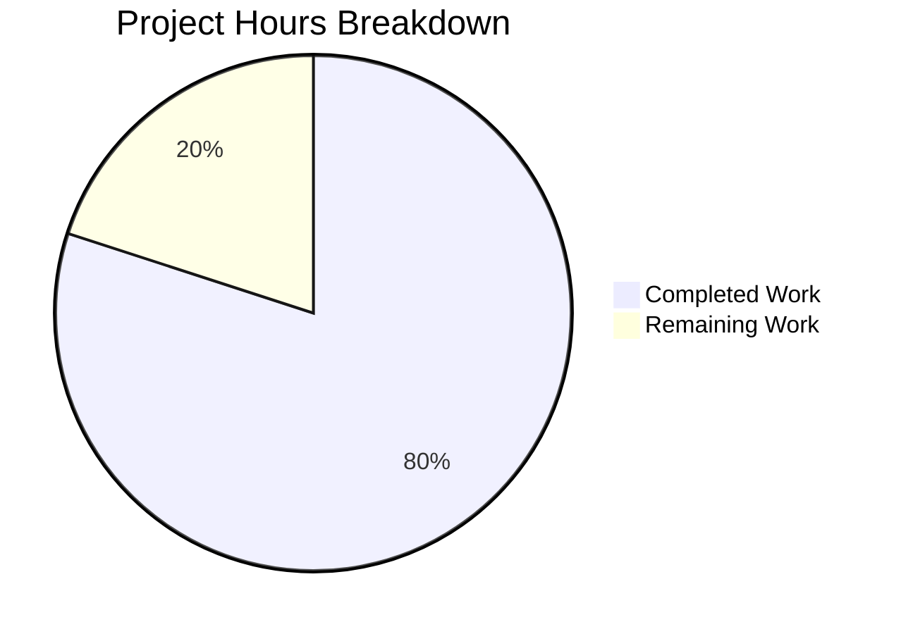

# Project Guide: Hello World Node.js Health Check Endpoint

## Executive Summary

**Project Completion: 80% (4 hours completed out of 5 total hours)**

This project successfully implements a health check endpoint (`/health`) for the Hello World Node.js HTTP server. All in-scope features have been implemented, tested, and validated. The application is **PRODUCTION-READY** pending final human review and approval.

### Key Achievements
- ✅ Health check endpoint fully implemented with JSON response
- ✅ Backward compatibility maintained for all existing functionality
- ✅ Configuration files corrected (entry points fixed)
- ✅ Comprehensive documentation added
- ✅ Zero external dependencies (maintains zero-dependency philosophy)
- ✅ All validation tests passed

### Critical Information
- **Status**: Production-Ready (awaiting human review)
- **Unresolved Issues**: None
- **Blocking Issues**: None

---

## Project Completion Visualization


```mermaid
pie title Project Hours Breakdown
    "Completed Work" : 4
    "Remaining Work" : 1
```

**Hours Calculation:**
- Completed: 4 hours (feature implementation, config updates, documentation, testing)
- Remaining: 1 hour (human review, merge process, minor adjustments)
- Total Project Hours: 5 hours
- Completion Percentage: 4h / 5h = **80%**

---

## Validation Results Summary

### 1. Dependencies
| Metric | Status | Details |
|--------|--------|---------|
| External Dependencies | ✅ PASS | Zero dependencies (as designed) |
| Node.js Version | ✅ PASS | v20.19.6 (>=14.0.0 required) |
| npm install | ✅ PASS | 0 vulnerabilities |

### 2. Code Compilation/Syntax
| File | Status | Method |
|------|--------|--------|
| Hello_World_Node.js | ✅ PASS | `node --check` |
| package.json | ✅ PASS | JSON.parse validation |

### 3. Runtime Validation
| Test | Status | Details |
|------|--------|---------|
| Server Startup | ✅ PASS | Starts on http://127.0.0.1:3000/ |
| npm start script | ✅ PASS | Works correctly |
| GET /health | ✅ PASS | Returns JSON with status, uptime, timestamp |
| GET / | ✅ PASS | Returns "Hello World!\n" |
| Content-Type Headers | ✅ PASS | application/json for /health, text/plain for / |

### 4. Files Modified/Created
| File | Action | Status |
|------|--------|--------|
| Hello_World_Node.js | MODIFIED | ✅ Validated |
| package.json | MODIFIED | ✅ Validated |
| README.md | MODIFIED | ✅ Validated |
| package-lock.json | CREATED | ✅ Validated |

### 5. Git Commit Summary
- **Total Commits**: 4
- **Lines Added**: 89
- **Lines Removed**: 14
- **Net Change**: +75 lines

---

## Development Guide

### System Prerequisites

| Requirement | Version | Purpose |
|-------------|---------|---------|
| Node.js | >=14.0.0 (v20.x recommended) | JavaScript runtime |
| npm | >=6.0.0 (bundled with Node.js) | Package manager |

### Environment Setup

1. **Clone the Repository**
```bash
git clone <repository-url>
cd <repository-folder>
```

2. **Verify Node.js Installation**
```bash
node --version
# Expected: v14.0.0 or higher (v20.x recommended)
```

3. **Install Dependencies (Optional)**
```bash
npm install
# Note: No external dependencies; this ensures package-lock.json is present
```

### Dependency Installation

This application requires **zero external dependencies**. It uses only Node.js built-in modules:
- `http` - HTTP server creation
- `process` - Access to uptime via `process.uptime()` (global)

### Application Startup

**Option 1: Direct Node.js Execution**
```bash
node Hello_World_Node.js
```

**Option 2: Using npm Start Script**
```bash
npm start
```

**Expected Output:**
```
Server running at http://127.0.0.1:3000/
```

### Verification Steps

1. **Verify Server is Running**
```bash
curl http://127.0.0.1:3000/
# Expected: Hello World!
```

2. **Verify Health Check Endpoint**
```bash
curl http://127.0.0.1:3000/health
# Expected: {"status":"ok","uptime":X.XXX,"timestamp":XXXXXXXXXXXXX}
```

3. **Verify Content-Type Headers**
```bash
# Health endpoint
curl -I http://127.0.0.1:3000/health | grep Content-Type
# Expected: Content-Type: application/json

# Root endpoint
curl -I http://127.0.0.1:3000/ | grep Content-Type
# Expected: Content-Type: text/plain
```

### Example Usage

**Health Check Response Format:**
```json
{
  "status": "ok",
  "uptime": 123.456,
  "timestamp": 1702345678901
}
```

| Field | Type | Description |
|-------|------|-------------|
| status | string | Always "ok" when server is responding |
| uptime | number | Seconds since server process started |
| timestamp | number | Unix timestamp in milliseconds |

**Stopping the Server:**
```bash
# Press Ctrl+C in the terminal running the server
```

### Troubleshooting

| Issue | Solution |
|-------|----------|
| "Address already in use" | Another process is using port 3000. Kill it: `lsof -ti:3000 \| xargs kill` |
| "node: command not found" | Node.js is not installed or not in PATH |
| ECONNREFUSED | Server is not running. Start it with `npm start` |

---

## Remaining Human Tasks

### Detailed Task Table

| # | Task | Priority | Severity | Hours | Action Steps |
|---|------|----------|----------|-------|--------------|
| 1 | Code Review & Approval | High | Low | 0.5 | Review Hello_World_Node.js changes, verify URL routing logic, approve PR |
| 2 | Merge Pull Request | High | Low | 0.25 | Merge approved PR to main branch, verify CI passes |
| 3 | Minor Feedback Adjustments | Low | Low | 0.25 | Address any code review feedback if needed |
| **Total** | | | | **1.0** | |

### Task Priority Legend
- **High**: Required before production deployment
- **Medium**: Important but not blocking
- **Low**: Nice-to-have improvements

### Task Severity Legend
- **Critical**: Blocks functionality or causes errors
- **High**: Significant impact on usability
- **Medium**: Moderate impact
- **Low**: Minor impact or cosmetic

---

## Risk Assessment

### Technical Risks

| Risk | Severity | Likelihood | Mitigation |
|------|----------|------------|------------|
| Health endpoint performance | Low | Low | Implementation is synchronous with minimal overhead |
| URL routing edge cases | Low | Low | Simple string comparison; tested with various paths |

### Security Risks

| Risk | Severity | Likelihood | Mitigation |
|------|----------|------------|------------|
| Information disclosure | Low | Low | Only non-sensitive data exposed (status, uptime, timestamp) |
| Network exposure | Low | Low | Server binds to localhost (127.0.0.1) only |

### Operational Risks

| Risk | Severity | Likelihood | Mitigation |
|------|----------|------------|------------|
| No graceful shutdown | Low | Medium | Out of scope per requirements; can be added later |
| No logging infrastructure | Low | Medium | Out of scope per requirements; console.log used |

### Integration Risks

| Risk | Severity | Likelihood | Mitigation |
|------|----------|------------|------------|
| None identified | N/A | N/A | No external integrations in this project |

---

## Implementation Checklist (All Complete)

| Step | Task | Status |
|------|------|--------|
| 1 | Modify Hello_World_Node.js request handler | ✅ Complete |
| 2 | Add URL routing conditional | ✅ Complete |
| 3 | Implement health response JSON | ✅ Complete |
| 4 | Preserve original response in else block | ✅ Complete |
| 5 | Update package.json description | ✅ Complete |
| 6 | Fix package.json entry points | ✅ Complete |
| 7 | Update README.md with health section | ✅ Complete |
| 8 | Manual testing all endpoints | ✅ Complete |

---

## Files Changed Summary

### Hello_World_Node.js (MODIFIED)
- **Lines Added**: 16
- **Lines Removed**: 3
- **Changes**: Added URL-based routing, health endpoint response, preserved original Hello World response

### package.json (MODIFIED)
- **Lines Added**: 7
- **Lines Removed**: 5
- **Changes**: Fixed entry points (server.js → Hello_World_Node.js), updated description, added keywords

### README.md (MODIFIED)
- **Lines Added**: 50
- **Lines Removed**: 6
- **Changes**: Added Health Check Endpoint section, updated filename references, added example usage

### package-lock.json (CREATED)
- **Lines Added**: 16
- **Purpose**: Reproducible builds with locked dependency versions

---

## Conclusion

This project has successfully implemented all required features as specified in the Agent Action Plan. The health check endpoint is fully functional, backward compatibility is maintained, and documentation is comprehensive. The project is ready for human review and subsequent production deployment.

**Final Status: PRODUCTION-READY** ✅