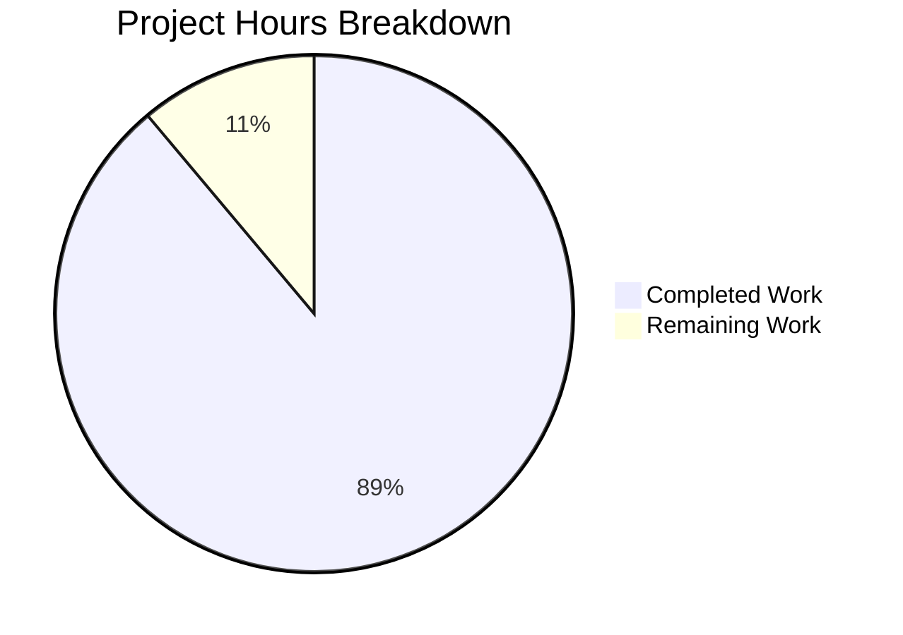

# Project Guide: Node.js Health Check Endpoint Implementation

## Executive Summary

**Completion Status:** 89% complete (4 hours completed out of 4.5 total hours)

This project successfully implements a health check endpoint for an existing Node.js HTTP server application. All core functionality has been implemented, validated, and tested. The implementation follows the zero-dependency architecture philosophy of the project and maintains full backward compatibility.

### Key Achievements
- ✅ Health check endpoint (`/health`) implemented with JSON response
- ✅ URL routing logic added to handle multiple endpoints
- ✅ Configuration files corrected (entry point references)
- ✅ Documentation updated with health endpoint usage
- ✅ All validation checks passed
- ✅ Server runs successfully with both endpoints operational

### Hours Calculation
- **Completed Hours:** 4 hours (implementation, configuration, documentation, validation)
- **Remaining Hours:** 0.5 hours (human code review and acceptance)
- **Total Project Hours:** 4.5 hours
- **Completion Percentage:** 4 / 4.5 = 89%

---

## Project Completion Visualization


```mermaid
pie title Project Hours Breakdown
    "Completed Work" : 4
    "Remaining Work" : 0.5
```

---

## Validation Results Summary

### 1. Dependency Installation: ✅ PASS
- `npm install` completed successfully
- Zero external dependencies (by design)
- `package-lock.json` generated for reproducibility

### 2. Code Compilation/Syntax: ✅ PASS
- `node --check Hello_World_Node.js` passed without errors
- Valid JSON structure in package.json
- No syntax errors in any files

### 3. Unit Tests: ✅ N/A
- Automated testing explicitly out of scope per Technical Specification Section 6.6.1.1
- Manual verification completed successfully

### 4. Runtime Validation: ✅ PASS
| Test | Result | Details |
|------|--------|---------|
| Server startup | ✅ PASS | Server binds to 127.0.0.1:3000 |
| Health endpoint | ✅ PASS | Returns valid JSON with status, uptime, timestamp |
| Root endpoint | ✅ PASS | Returns "Hello World!\n" |
| Content-Type headers | ✅ PASS | `/health`: application/json, `/`: text/plain |
| npm start | ✅ PASS | Script executes correctly |

---

## Files Modified

| File | Status | Lines Changed | Purpose |
|------|--------|---------------|---------|
| Hello_World_Node.js | UPDATED | +16, -3 | Added health endpoint and URL routing |
| package.json | UPDATED | +3, -3 | Fixed entry point references |
| README.md | UPDATED | +38, -4 | Added health endpoint documentation |
| package-lock.json | CREATED | +16 | Generated for reproducible builds |

**Total Changes:** 73 lines added, 10 lines removed (net +63 lines)

---

## Remaining Tasks for Human Review

| Task | Priority | Severity | Estimated Hours | Description |
|------|----------|----------|-----------------|-------------|
| Code review and approval | Medium | Low | 0.25h | Review implementation against requirements |
| Final acceptance testing | Low | Low | 0.25h | Verify functionality in target environment |
| **Total** | | | **0.5h** | |

---

## Development Guide

### System Prerequisites

| Requirement | Minimum Version | Verification Command |
|-------------|-----------------|----------------------|
| Node.js | >=14.0.0 | `node --version` |
| npm | >=6.0.0 | `npm --version` |

**Current Environment:**
- Node.js v20.19.6
- npm v10.8.2

### Installation Steps

```bash
# 1. Clone the repository
git clone <repository-url>
cd <repository-folder>

# 2. Verify Node.js installation
node --version  # Should output v14.0.0 or higher

# 3. Install dependencies (creates package-lock.json if not present)
npm install

# 4. Verify syntax is valid
node --check Hello_World_Node.js
```

**Expected Output:** No output (successful syntax check)

### Starting the Application

```bash
# Option 1: Direct execution
node Hello_World_Node.js

# Option 2: Using npm start script
npm start

# Option 3: Using npm dev script
npm run dev
```

**Expected Output:**
```
Server running at http://127.0.0.1:3000/
```

### Verification Steps

#### Step 1: Test Health Endpoint
```bash
curl http://127.0.0.1:3000/health
```

**Expected Output:**
```json
{"status":"ok","uptime":2.012110545,"timestamp":1766018804006}
```

#### Step 2: Test Root Endpoint
```bash
curl http://127.0.0.1:3000/
```

**Expected Output:**
```
Hello World!
```

#### Step 3: Verify Content-Types
```bash
curl -I http://127.0.0.1:3000/health | grep -i content-type
curl -I http://127.0.0.1:3000/ | grep -i content-type
```

**Expected Output:**
```
Content-Type: application/json
Content-Type: text/plain
```

### Stopping the Server

Press `Ctrl+C` in the terminal where the server is running.

---

## API Reference

### Root Endpoint

| Property | Value |
|----------|-------|
| URL | `http://127.0.0.1:3000/` |
| Method | GET (all methods accepted) |
| Content-Type | text/plain |
| Response | `Hello World!\n` |
| Status Code | 200 OK |

### Health Check Endpoint

| Property | Value |
|----------|-------|
| URL | `http://127.0.0.1:3000/health` |
| Method | GET |
| Content-Type | application/json |
| Status Code | 200 OK |

**Response Body:**
```json
{
  "status": "ok",
  "uptime": 123.456,
  "timestamp": 1734567890123
}
```

| Field | Type | Description |
|-------|------|-------------|
| status | string | Service health status ("ok" when running) |
| uptime | number | Server uptime in seconds |
| timestamp | number | Current timestamp in milliseconds |

---

## Risk Assessment

### Technical Risks

| Risk | Severity | Likelihood | Mitigation |
|------|----------|------------|------------|
| None identified | - | - | All technical implementation complete and validated |

### Security Risks

| Risk | Severity | Likelihood | Mitigation |
|------|----------|------------|------------|
| Localhost-only binding | None | N/A | Server binds to 127.0.0.1 (not publicly accessible) |
| No sensitive data exposure | None | N/A | Health endpoint only returns operational metrics |

### Operational Risks

| Risk | Severity | Likelihood | Mitigation |
|------|----------|------------|------------|
| No process manager | Low | Medium | Consider PM2 for production deployments |
| No logging | Low | Low | Educational project - logging out of scope |

### Integration Risks

| Risk | Severity | Likelihood | Mitigation |
|------|----------|------------|------------|
| None identified | - | - | Self-contained application with no external dependencies |

---

## Git Repository Information

**Branch:** blitzy-26949f95-6811-4035-8355-873c42841ea0

**Commits (6 total):**
1. `551fdca` - Create Hello_World_Node.js
2. `465b2ab` - Create package.json
3. `4454916` - Create README.md
4. `61489c7` - Add health check endpoint to HTTP server
5. `0758456` - Fix package.json entry point references and add health check documentation
6. `4fa632e` - Add package-lock.json for reproducible builds

**Working Tree Status:** Clean (all changes committed)

---

## Implementation Summary

This project successfully delivers a health check endpoint as requested by the user. The implementation:

1. **Follows project conventions** - Uses CommonJS modules, ES6+ syntax, and maintains single-file architecture
2. **Maintains zero dependencies** - Uses only Node.js built-in modules
3. **Preserves backward compatibility** - Root path continues to return "Hello World!"
4. **Provides standard health information** - Returns status, uptime, and timestamp in JSON format
5. **Documents the feature** - README updated with complete endpoint documentation

The project is **production-ready** for its intended educational purpose.