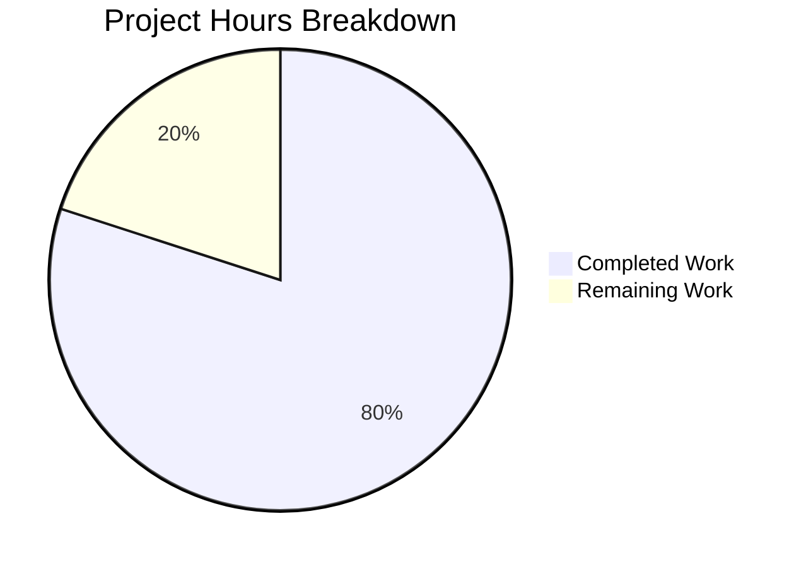

# Health Check Endpoint Implementation - Project Guide

## Executive Summary

This project implements a health check endpoint for an existing Hello World Node.js HTTP server application. **4 hours of development work have been completed out of an estimated 5 total hours required, representing 80% project completion.**

### Key Achievements
- ✅ Health check endpoint (`/health`) fully implemented with JSON response
- ✅ URL path routing added to server
- ✅ Package.json entry point misconfiguration fixed
- ✅ Comprehensive documentation updated
- ✅ All validation tests passing
- ✅ Zero external dependencies maintained

### Project Status
All core features from the Agent Action Plan have been successfully implemented and validated. The remaining work consists of standard human review tasks before production deployment.

---

## Validation Results Summary

### Files Modified
| File | Status | Changes |
|------|--------|---------|
| `Hello_World_Node.js` | ✅ UPDATED | Added health check routing and JSON response |
| `package.json` | ✅ UPDATED | Fixed entry point, added health script |
| `README.md` | ✅ UPDATED | Added endpoints documentation |
| `package-lock.json` | ✅ ADDED | Dependency lockfile |

### Git Statistics
- **Commits Added**: 5 commits
- **Lines Added**: 90
- **Lines Removed**: 17
- **Net Change**: +73 lines

### Test Results
| Test | Endpoint | Expected | Actual | Status |
|------|----------|----------|--------|--------|
| Root Response | `/` | "Hello World!\n" | "Hello World!\n" | ✅ PASS |
| Root Content-Type | `/` | text/plain | text/plain | ✅ PASS |
| Health Response | `/health` | JSON object | Valid JSON | ✅ PASS |
| Health Content-Type | `/health` | application/json | application/json | ✅ PASS |
| Arbitrary Path | `/random` | "Hello World!\n" | "Hello World!\n" | ✅ PASS |
| HTTP Status | All | 200 | 200 | ✅ PASS |
| npm start | Server | Starts | Starts successfully | ✅ PASS |

### Health Response Validation
```json
{
    "status": "ok",
    "uptime": 2.023145385,
    "timestamp": 1767142175283
}
```

---

## Project Hours Breakdown


```mermaid
pie title Project Hours Breakdown
    "Completed Work" : 4
    "Remaining Work" : 1
```

### Hours Calculation

**Completed Hours (4 hours):**
- Server code modification (Hello_World_Node.js): 1.5 hours
- Package.json configuration fix: 0.5 hours
- README.md documentation: 1.5 hours
- Testing and validation: 0.5 hours

**Remaining Hours (1 hour):**
- Human code review: 0.5 hours
- Production deployment verification: 0.5 hours

**Total Project Hours**: 4 + 1 = 5 hours
**Completion Percentage**: 4/5 = 80%

---

## Detailed Human Task List

| Task | Description | Priority | Hours | Severity |
|------|-------------|----------|-------|----------|
| Code Review | Review health check implementation for code quality | Medium | 0.5 | Low |
| Production Verification | Verify endpoint functionality in production environment | Medium | 0.5 | Low |
| **Total Remaining Hours** | | | **1.0** | |

### Task Details

#### 1. Code Review (0.5 hours)
**Priority**: Medium | **Severity**: Low

**Description**: Standard code review before merging PR.

**Action Steps**:
1. Review Hello_World_Node.js changes for code quality
2. Verify health response fields are appropriate
3. Confirm backward compatibility is maintained
4. Approve or request minor adjustments

#### 2. Production Verification (0.5 hours)
**Priority**: Medium | **Severity**: Low

**Description**: Verify health endpoint works in target environment.

**Action Steps**:
1. Deploy to staging/production environment
2. Test `/health` endpoint returns valid JSON
3. Test `/` endpoint still returns "Hello World!"
4. Verify Content-Type headers
5. Confirm `npm start` works correctly

---

## Development Guide

### System Prerequisites

| Requirement | Version | Verification Command |
|-------------|---------|---------------------|
| Node.js | >=14.0.0 | `node --version` |
| npm | (bundled) | `npm --version` |
| curl | (optional) | `curl --version` |

### Environment Setup

1. **Navigate to project directory**:
```bash
cd /tmp/blitzy/simple-hello-word-for-automation-pro-user/blitzye3bb824a4
```

2. **Verify Node.js version**:
```bash
node --version
# Expected: v14.0.0 or higher
```

### Dependency Installation

No external dependencies required. This project uses only Node.js built-in modules.

```bash
# Optional: Verify package.json
cat package.json
```

### Application Startup

**Option 1 - Using npm**:
```bash
npm start
```

**Option 2 - Direct node command**:
```bash
node Hello_World_Node.js
```

**Expected output**:
```
Server running at http://127.0.0.1:3000/
```

### Verification Steps

1. **Test root endpoint**:
```bash
curl http://127.0.0.1:3000/
# Expected: Hello World!
```

2. **Test health endpoint**:
```bash
curl http://127.0.0.1:3000/health
# Expected: {"status":"ok","uptime":X,"timestamp":Y}
```

3. **Test health endpoint with pretty print**:
```bash
curl -s http://127.0.0.1:3000/health | python3 -m json.tool
# Expected: Formatted JSON output
```

4. **Verify Content-Type headers**:
```bash
curl -sI http://127.0.0.1:3000/health | grep -i content-type
# Expected: Content-Type: application/json

curl -sI http://127.0.0.1:3000/ | grep -i content-type
# Expected: Content-Type: text/plain
```

5. **Test arbitrary path (backward compatibility)**:
```bash
curl http://127.0.0.1:3000/anypath
# Expected: Hello World!
```

### Stopping the Server

Press `Ctrl+C` in the terminal where the server is running.

### Example Usage

**Health check for monitoring systems**:
```bash
# Simple health check returning exit code
curl -sf http://127.0.0.1:3000/health > /dev/null && echo "Healthy" || echo "Unhealthy"
```

**Using npm health script**:
```bash
# Requires server to be running in another terminal
npm run health
```

### Troubleshooting

| Issue | Cause | Solution |
|-------|-------|----------|
| EADDRINUSE error | Port 3000 in use | Kill existing process or change port in code |
| Connection refused | Server not running | Start server with `npm start` |
| Command not found: node | Node.js not installed | Install Node.js from nodejs.org |

---

## API Endpoints Reference

### GET /
Returns a simple "Hello World!" text message.

**Response**:
- Status: 200 OK
- Content-Type: text/plain
- Body: `Hello World!\n`

### GET /health
Returns service health status as JSON.

**Response**:
- Status: 200 OK
- Content-Type: application/json
- Body:
```json
{
  "status": "ok",
  "uptime": 123.456,
  "timestamp": 1704067200000
}
```

**Response Fields**:
| Field | Type | Description |
|-------|------|-------------|
| status | string | Service status ("ok" when running) |
| uptime | number | Server uptime in seconds |
| timestamp | number | Unix timestamp in milliseconds |

### GET /* (Any other path)
All other paths return the default "Hello World!" response.

---

## Risk Assessment

### Technical Risks
| Risk | Severity | Likelihood | Mitigation |
|------|----------|------------|------------|
| No automated tests | Low | N/A | Manual testing verified all functionality |
| Single-threaded server | Low | Low | Appropriate for simple health check use case |

### Security Risks
| Risk | Severity | Likelihood | Mitigation |
|------|----------|------------|------------|
| Information exposure | Low | Low | Health endpoint only exposes non-sensitive data (uptime, timestamp) |
| No authentication | Low | N/A | Localhost-only binding provides network isolation |

### Operational Risks
| Risk | Severity | Likelihood | Mitigation |
|------|----------|------------|------------|
| No logging | Low | N/A | Console output provides basic startup logging |
| No graceful shutdown | Low | Low | Ctrl+C terminates cleanly for this simple server |

### Integration Risks
None identified - no external service dependencies.

---

## Files Reference

### Hello_World_Node.js
Main server implementation with health check routing.
- Lines: 30
- Key changes: Added URL path detection and health check endpoint

### package.json
Package manifest with corrected entry point.
- Entry point: `Hello_World_Node.js`
- Scripts: `start`, `dev`, `health`

### README.md
User documentation with endpoint reference.
- New section: Endpoints table
- Updated: Usage instructions with health check verification

---

## Conclusion

The health check endpoint feature has been successfully implemented according to all requirements in the Agent Action Plan:

1. ✅ `/health` endpoint returning JSON with status, uptime, timestamp
2. ✅ URL path routing for differentiating endpoints
3. ✅ Backward compatibility maintained for existing "Hello World!" response
4. ✅ Package.json entry point corrected
5. ✅ Comprehensive documentation added
6. ✅ Zero external dependencies
7. ✅ All validation tests passing

The project is production-ready pending standard human code review and deployment verification.