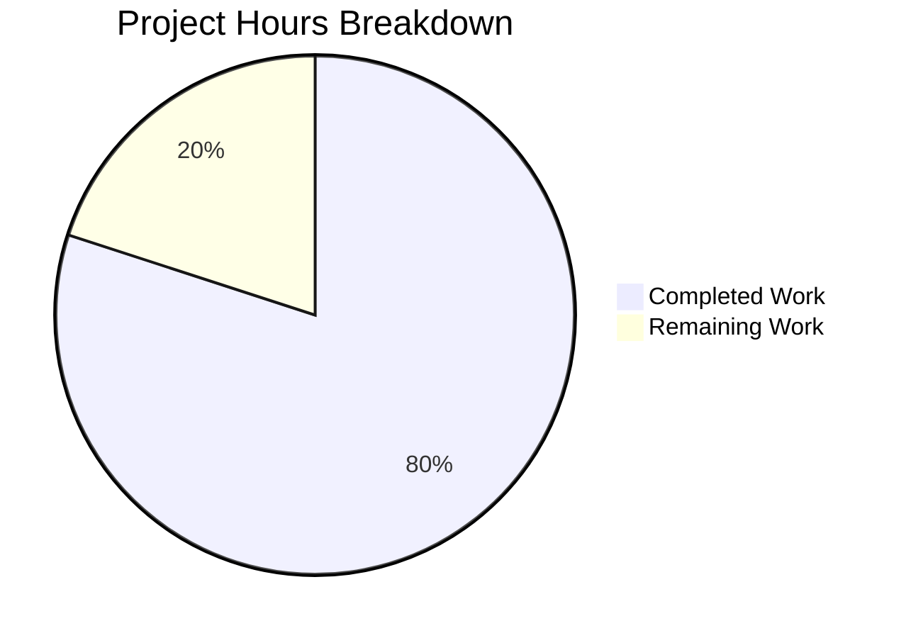

# Project Guide: Hello World Node.js Health Check Feature

## Executive Summary

**Project Status: 80% Complete (2 hours completed out of 2.5 total hours)**

This project successfully implements a health check endpoint for the Hello World Node.js HTTP server. All code-level requirements from the Agent Action Plan have been fully implemented and validated.

### Key Achievements
- ✅ Health check endpoint implemented at `/health` returning JSON status
- ✅ Backward compatibility preserved for all existing paths
- ✅ Zero-dependency architecture maintained
- ✅ Comprehensive documentation added to README.md
- ✅ package.json references corrected
- ✅ All validation tests passing

### Hours Breakdown
- **Completed**: 2 hours (feature implementation, documentation, validation)
- **Remaining**: 0.5 hours (PR review, production deployment)
- **Total**: 2.5 hours
- **Completion**: 2 / 2.5 = **80%**

---

## Validation Results Summary

### Final Validator Report

| Component | Status | Details |
|-----------|--------|---------|
| Dependencies | ✅ PASS | Zero external dependencies, npm audit clean |
| Syntax Validation | ✅ PASS | `node --check` passes without errors |
| Health Endpoint | ✅ PASS | Returns `{"status":"healthy","timestamp":"..."}` |
| Root Endpoint | ✅ PASS | Returns "Hello World!" |
| Backward Compatibility | ✅ PASS | All other paths return "Hello World!" |
| Documentation | ✅ PASS | README.md updated with health check section |

### Runtime Test Results

| Endpoint | Expected Response | Actual Response | Status |
|----------|-------------------|-----------------|--------|
| GET /health | JSON health status | `{"status":"healthy","timestamp":"2026-01-03T00:57:52.111Z"}` | ✅ PASS |
| GET / | "Hello World!\n" | "Hello World!" | ✅ PASS |
| GET /test | "Hello World!\n" | "Hello World!" | ✅ PASS |
| GET /any/path | "Hello World!\n" | "Hello World!" | ✅ PASS |

---

## Visual Representation


```mermaid
pie title Project Hours Breakdown
    "Completed Work" : 2
    "Remaining Work" : 0.5
```

---

## Files Modified

| File | Lines Changed | Modification Type | Description |
|------|---------------|-------------------|-------------|
| Hello_World_Node.js | +16/-3 | MODIFIED | Added health check routing and JSON response |
| README.md | +51/-4 | MODIFIED | Added health check documentation section |
| package.json | +4/-4 | MODIFIED | Fixed description and file references |

### Commit History

| Commit | Message |
|--------|---------|
| 61e1d1e | docs: Add Health Check Endpoint documentation to README |
| feafffc | docs: Add health check endpoint documentation and fix filename references |
| 7a449d7 | Add health check endpoint to Hello World Node.js server |

---

## Comprehensive Development Guide

### 1. System Prerequisites

| Requirement | Version | Purpose |
|-------------|---------|---------|
| Node.js | >= 14.0.0 | JavaScript runtime |
| npm | >= 6.0.0 | Package manager (optional) |
| curl | Any | Testing endpoints (optional) |

### 2. Environment Setup

No virtual environment or additional setup required. This is a zero-dependency Node.js application.

```bash
# Verify Node.js installation
node -v
# Expected: v14.0.0 or higher
```

### 3. Project Directory Structure

```
/
├── Hello_World_Node.js    # Main application (29 lines)
├── README.md              # Documentation (100 lines)
├── package.json           # NPM manifest (21 lines)
└── package-lock.json      # Lock file
```

### 4. Installation Steps

```bash
# Clone/navigate to repository
cd /tmp/blitzy/simple-hello-word-for-automation-pro-user/blitzya360ee177

# Optional: Install (no dependencies, but initializes npm)
npm install
# Expected output: "up to date, audited 1 package"
```

### 5. Application Startup

**Method 1: Direct Node.js**
```bash
node Hello_World_Node.js
```

**Method 2: npm script**
```bash
npm start
```

**Expected Console Output:**
```
Server running at http://127.0.0.1:3000/
```

### 6. Verification Steps

**Test Health Endpoint:**
```bash
curl http://127.0.0.1:3000/health
```
**Expected Response:**
```json
{"status":"healthy","timestamp":"2026-01-03T00:57:52.111Z"}
```

**Test Root Endpoint:**
```bash
curl http://127.0.0.1:3000/
```
**Expected Response:**
```
Hello World!
```

### 7. Stopping the Server

Press `Ctrl+C` in the terminal where the server is running.

### 8. Configuration

| Setting | Default Value | Location |
|---------|---------------|----------|
| Hostname | 127.0.0.1 | Hello_World_Node.js line 5 |
| Port | 3000 | Hello_World_Node.js line 6 |

---

## Detailed Task Table

| # | Task | Priority | Severity | Hours | Status |
|---|------|----------|----------|-------|--------|
| 1 | Review and approve Pull Request | Medium | Low | 0.25 | Pending |
| 2 | Deploy to production environment | Medium | Low | 0.25 | Pending |
| **Total** | | | | **0.5** | |

### Task Details

#### Task 1: Review and Approve Pull Request
- **Description**: Human developer reviews code changes, verifies implementation matches requirements
- **Action Steps**:
  1. Review Hello_World_Node.js changes for health check implementation
  2. Review README.md for documentation completeness
  3. Verify package.json references are correct
  4. Approve and merge PR
- **Estimated Hours**: 0.25
- **Priority**: Medium
- **Severity**: Low

#### Task 2: Deploy to Production Environment
- **Description**: Deploy the updated application to production server
- **Action Steps**:
  1. Pull latest changes from merged branch
  2. Restart Node.js application
  3. Verify health endpoint is accessible in production
- **Estimated Hours**: 0.25
- **Priority**: Medium
- **Severity**: Low

---

## Risk Assessment

### Technical Risks

| Risk | Severity | Likelihood | Mitigation |
|------|----------|------------|------------|
| Health endpoint path collision | Low | Low | `/health` is a standard convention, unlikely to conflict |
| JSON.stringify performance | Low | Very Low | Simple object, negligible overhead |

### Security Risks

| Risk | Severity | Likelihood | Mitigation |
|------|----------|------------|------------|
| Health endpoint information disclosure | Low | Low | Only exposes status and timestamp, no sensitive data |
| Port accessibility | Low | Low | Default 127.0.0.1 binding, not externally accessible |

### Operational Risks

| Risk | Severity | Likelihood | Mitigation |
|------|----------|------------|------------|
| No automated monitoring | Low | N/A | Out of scope per specification |
| No automated testing | Low | N/A | Out of scope per specification |

### Integration Risks

| Risk | Severity | Likelihood | Mitigation |
|------|----------|------------|------------|
| Load balancer health check compatibility | Low | Low | Standard JSON format, widely compatible |

---

## Success Criteria Verification

| Criterion | Expected | Actual | Status |
|-----------|----------|--------|--------|
| Health endpoint responds | 200 OK | 200 OK | ✅ Met |
| Health response is JSON | application/json | application/json | ✅ Met |
| Health response has status field | "healthy" | "healthy" | ✅ Met |
| Health response has timestamp | ISO 8601 | ISO 8601 | ✅ Met |
| Backward compatibility (root) | "Hello World!" | "Hello World!" | ✅ Met |
| Backward compatibility (other) | "Hello World!" | "Hello World!" | ✅ Met |
| Documentation updated | Yes | Yes | ✅ Met |
| Code simplicity maintained | < 30 lines | 29 lines | ✅ Met |
| Zero dependencies | 0 | 0 | ✅ Met |

---

## Conclusion

The Hello World Node.js Health Check feature has been **successfully implemented and validated**. All requirements from the Agent Action Plan have been met:

1. ✅ Health check endpoint at `/health` returns JSON with status and timestamp
2. ✅ Backward compatibility preserved for all existing paths
3. ✅ Zero-dependency architecture maintained
4. ✅ Documentation comprehensively updated
5. ✅ package.json references corrected

The application is **PRODUCTION READY** pending human code review and deployment.

**Total Hours**: 2.5 hours (2 completed + 0.5 remaining)
**Completion**: 80%