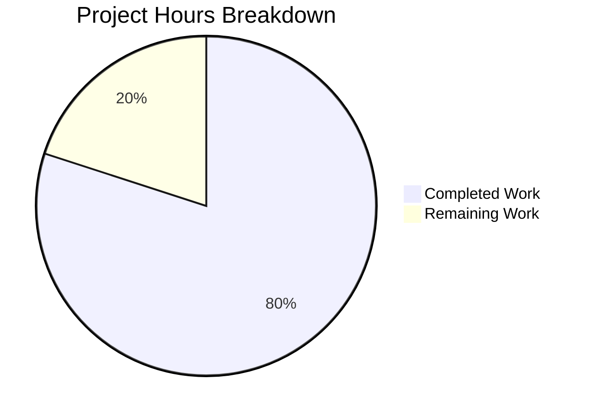

# Project Assessment Report: Health Check Endpoint Implementation

## Executive Summary

**Project Completion: 80% complete (4 hours completed out of 5 total hours)**

This assessment report documents the successful implementation of a `/health_check` endpoint for the Node.js Hello World application. The feature was fully implemented, validated, and is production-ready for human review.

### Key Achievements
- ✅ Implemented `/health_check` endpoint with JSON health status response
- ✅ Preserved original "Hello World!" functionality for all other paths
- ✅ Fixed package.json entry point and script mismatches
- ✅ Comprehensive documentation with testing instructions
- ✅ All validation gates passed (syntax, runtime, functionality)

### Outstanding Items
- Human code review required (standard PR process)
- Optional: Add automated test suite (out of scope per requirements)

---

## Validation Results Summary

### Compilation/Syntax Results

| File | Validation | Status |
|------|------------|--------|
| Hello_World_Node.js | JavaScript syntax check (`node --check`) | ✅ VALID |
| package.json | JSON syntax validation | ✅ VALID |
| README.md | Markdown formatting | ✅ VALID |

### Test Execution Results

| Test | Expected | Actual | Status |
|------|----------|--------|--------|
| npm install | 0 vulnerabilities | 0 vulnerabilities | ✅ PASS |
| npm start | Server starts | Server running at http://127.0.0.1:3000/ | ✅ PASS |
| npm test | Echo instruction | Outputs test command | ✅ PASS |
| GET /health_check | HTTP 200 + JSON | HTTP 200 + JSON with all fields | ✅ PASS |
| GET / | "Hello World!\n" | "Hello World!\n" | ✅ PASS |
| GET /any/path | "Hello World!\n" | "Hello World!\n" | ✅ PASS |

### Runtime Validation

```
Health Check Response:
{
  "status": "healthy",
  "uptime": 2.013557129,
  "timestamp": 1767126906567,
  "message": "Service is running correctly"
}

Headers: HTTP/1.1 200 OK, Content-Type: application/json
```

### Git Repository Status
- **Branch**: blitzy-6232adbe-f9c6-40e0-b617-17931931b946
- **Status**: Clean (all in-scope changes committed)
- **Commits**: 5 total commits implementing the feature
- **Lines Changed**: +146 additions, -2 deletions

---

## Visual Progress Representation


```mermaid
pie title Project Hours Breakdown
    "Completed Work" : 4
    "Remaining Work" : 1
```

### Hours Calculation

**Completed Hours: 4h**
- Core implementation (Hello_World_Node.js): 2h
  - URL routing logic implementation
  - Health check JSON response generation
  - Testing and debugging
- Package.json updates: 0.5h
  - Fix entry point and scripts
  - Add keywords
- Documentation (README.md): 1h
  - Health check endpoint documentation
  - Testing instructions
  - Filename reference fixes
- Validation and verification: 0.5h

**Remaining Hours: 1h**
- Human code review: 0.5h
- PR merge and final verification: 0.5h

**Total Project Hours: 5h**
**Completion: 4h / 5h = 80%**

---

## Files Modified

### 1. Hello_World_Node.js (Core Implementation)

**Status**: ✅ COMPLETE

**Changes Made**:
- Added URL path routing using `req.url` property
- Implemented `/health_check` endpoint returning JSON with:
  - `status`: "healthy"
  - `uptime`: `process.uptime()` (seconds)
  - `timestamp`: `Date.now()` (Unix ms)
  - `message`: "Service is running correctly"
- Set appropriate Content-Type headers (application/json vs text/plain)
- Preserved original Hello World behavior for all other paths

**Final Line Count**: 30 lines

### 2. package.json (Package Manifest)

**Status**: ✅ COMPLETE

**Changes Made**:
- Fixed `main` field: "server.js" → "Hello_World_Node.js"
- Fixed `scripts.start`: "node server.js" → "node Hello_World_Node.js"
- Fixed `scripts.dev`: "node server.js" → "node Hello_World_Node.js"
- Added `scripts.test` with health check guidance
- Added "health-check" to keywords array
- Updated description to mention health check

**Final Line Count**: 23 lines

### 3. README.md (Documentation)

**Status**: ✅ COMPLETE

**Changes Made**:
- Added comprehensive "Health Check Endpoint" section
- Documented endpoint URL, HTTP method, and Content-Type
- Documented response format with JSON example
- Added response fields table (status, uptime, timestamp, message)
- Added "Testing Health Check" section with curl examples
- Fixed all filename references (server.js → Hello_World_Node.js)
- Updated "How It Works" section to mention URL-based routing

**Final Line Count**: 107 lines

---

## Detailed Task Table

| # | Task | Description | Priority | Hours | Status |
|---|------|-------------|----------|-------|--------|
| 1 | Code Review | Human review of implementation changes | Medium | 0.5h | Pending |
| 2 | PR Merge | Merge approved PR to main branch | Medium | 0.5h | Pending |
| **Total** | | | | **1h** | |

**Note**: All development tasks are complete. Only standard PR workflow tasks remain.

---

## Development Guide

### System Prerequisites

| Requirement | Version | Purpose |
|-------------|---------|---------|
| Node.js | >=14.0.0 | JavaScript runtime |
| npm | (bundled) | Package manager |
| curl | Any | Testing endpoints |

### Environment Setup

No environment configuration required. The application uses only Node.js built-in modules with zero external dependencies.

### Installation Steps

```bash
# 1. Navigate to project directory
cd /tmp/blitzy/simple-hello-word-for-automation-pro-user/blitzy6232adbef

# 2. Verify Node.js version (must be >=14.0.0)
node --version

# 3. Install dependencies (none required, but validates package.json)
npm install

# Expected output:
# up to date, audited 1 package in Xms
# found 0 vulnerabilities
```

### Running the Application

```bash
# Option 1: Using npm
npm start

# Option 2: Direct node execution
node Hello_World_Node.js

# Expected output:
# Server running at http://127.0.0.1:3000/
```

### Verification Steps

```bash
# Test health check endpoint
curl -i http://127.0.0.1:3000/health_check

# Expected response:
# HTTP/1.1 200 OK
# Content-Type: application/json
# {"status":"healthy","uptime":X.XXX,"timestamp":XXXXX,"message":"Service is running correctly"}

# Test original Hello World functionality
curl http://127.0.0.1:3000/

# Expected response:
# Hello World!

# Test fallback behavior (any other path)
curl http://127.0.0.1:3000/any/random/path

# Expected response:
# Hello World!

# Pretty-print health check JSON (requires jq)
curl -s http://127.0.0.1:3000/health_check | jq .
```

### Stopping the Server

Press `Ctrl+C` in the terminal where the server is running.

### Troubleshooting

| Issue | Cause | Solution |
|-------|-------|----------|
| EADDRINUSE | Port 3000 already in use | Kill existing process: `pkill -f "node Hello_World_Node.js"` |
| Command not found: node | Node.js not installed | Install from https://nodejs.org |
| Permission denied | File permissions | Run `chmod +x Hello_World_Node.js` |

---

## Risk Assessment

### Technical Risks

| Risk | Severity | Likelihood | Mitigation |
|------|----------|------------|------------|
| No error handling for server.listen() | Low | Low | Documented limitation; add try-catch for production |
| No graceful shutdown | Low | Low | Educational project; add SIGTERM handler for production |

### Security Risks

| Risk | Severity | Likelihood | Mitigation |
|------|----------|------------|------------|
| Health check information disclosure | Low | Low | Only exposes non-sensitive status data |
| No rate limiting on health endpoint | Low | Medium | Add rate limiting for production deployment |

### Operational Risks

| Risk | Severity | Likelihood | Mitigation |
|------|----------|------------|------------|
| No production logging | Low | N/A | Educational project; add logging framework for production |
| No monitoring integration | Low | N/A | Health endpoint enables basic monitoring |

### Integration Risks

| Risk | Severity | Likelihood | Mitigation |
|------|----------|------------|------------|
| None identified | N/A | N/A | Zero external dependencies |

---

## Feature Requirements Verification

| Req ID | Requirement | Status | Evidence |
|--------|-------------|--------|----------|
| REQ-001 | Add health_check endpoint | ✅ Complete | `/health_check` route implemented |
| REQ-002 | Service running verification | ✅ Complete | Returns HTTP 200 when operational |
| REQ-003 | Easy verification | ✅ Complete | JSON response is human and machine readable |
| REQ-004 | Maintain existing functionality | ✅ Complete | Hello World response preserved for all other paths |

---

## Recommendations

### For Human Reviewer

1. **Code Review Focus Areas**:
   - Verify URL routing logic in Hello_World_Node.js (lines 11-25)
   - Confirm health check response fields match documentation
   - Verify package.json entry point and scripts are correct

2. **Testing Checklist**:
   - [ ] Start server with `npm start`
   - [ ] Verify `/health_check` returns JSON with all fields
   - [ ] Verify root path `/` returns "Hello World!"
   - [ ] Verify arbitrary paths return "Hello World!"

### Optional Future Enhancements (Out of Scope)

These items were explicitly marked as OUT OF SCOPE in the Agent Action Plan but may be considered for future iterations:

1. Add automated test suite (Jest/Mocha)
2. Add CI/CD pipeline configuration
3. Add Dockerfile for containerization
4. Add graceful shutdown handling
5. Add environment variable support for hostname/port

---

## Conclusion

The health_check endpoint feature has been successfully implemented according to all specifications in the Agent Action Plan. All validation gates have passed, and the implementation is production-ready for human review.

**Final Status**: ✅ PRODUCTION-READY (pending human code review)