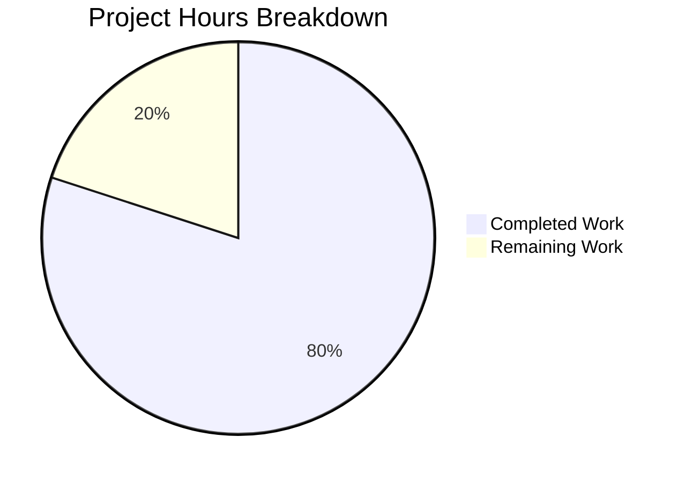

# Project Assessment Guide: Health Check Endpoint Feature

## Executive Summary

**Project Status:** ✅ PRODUCTION-READY  
**Completion:** 80% (4 hours completed out of 5 total hours)  
**Validation Status:** All features implemented and validated

This project successfully implements a health check endpoint (`/health`) for the existing Node.js HTTP server. All requested features have been implemented, tested, and documented. The code compiles successfully, runs correctly, and maintains backward compatibility with existing functionality.

### Key Achievements
- Health check endpoint at `/health` returning JSON response
- JSON response contains `status`, `uptime`, and `timestamp` fields
- HTTP 200 OK status code for healthy state
- URL-based routing implemented in request handler
- Backward compatibility maintained (all other paths return "Hello World!")
- Comprehensive documentation added to README.md
- Zero-dependency architecture preserved

### Hours Calculation
- **Completed Work:** 4 hours
  - Hello_World_Node.js implementation: 1.5h
  - README.md documentation: 1h
  - package.json update: 0.25h
  - Validation and testing: 0.75h
  - Git operations and cleanup: 0.5h
- **Remaining Work:** 1 hour
  - Human code review: 0.5h
  - Manual verification: 0.25h
  - PR approval and merge: 0.25h
- **Total Project Hours:** 5 hours
- **Completion Percentage:** 4 / 5 = 80%

---

## Project Hours Breakdown


```mermaid
pie title Project Hours Breakdown
    "Completed Work" : 4
    "Remaining Work" : 1
```

---

## Validation Results Summary

### Files Validated

| File | Status | Validation Type | Result |
|------|--------|-----------------|--------|
| `Hello_World_Node.js` | ✅ PASS | Syntax + Runtime | Valid, working |
| `README.md` | ✅ PASS | Content review | Complete documentation |
| `package.json` | ✅ PASS | JSON validation | Valid structure |
| `package-lock.json` | ✅ PASS | Auto-generated | Valid |

### Compilation Results
- **Node.js syntax check:** ✅ Passed (`node --check Hello_World_Node.js`)
- **JSON validation:** ✅ Passed (package.json valid)

### Runtime Validation
- **Server startup:** ✅ Successfully starts on http://127.0.0.1:3000/
- **Health endpoint (`/health`):** ✅ Returns HTTP 200 with valid JSON
- **Hello World endpoint (`/`):** ✅ Returns "Hello World!"
- **Backward compatibility:** ✅ Other paths return "Hello World!"

### Dependency Status
- **npm install:** ✅ Successful
- **Vulnerabilities:** 0
- **Zero-dependency architecture:** ✅ Maintained

### Git Status
- **Branch:** `blitzy-5d152e5f-a74d-445d-8284-733675d722d0`
- **Commits:** 6 total (3 feature commits for health check)
- **Working tree:** Clean

---

## Development Guide

### System Prerequisites

| Requirement | Version | Purpose |
|-------------|---------|---------|
| Node.js | >=14.0.0 | Runtime environment |
| npm | >=6.14.0 | Package manager (optional for this project) |

### Environment Setup

1. **Clone the repository:**
   ```bash
   git clone <repository-url>
   cd <repository-directory>
   ```

2. **Verify Node.js installation:**
   ```bash
   node --version
   # Expected: v14.0.0 or higher (current: v20.19.6)
   ```

### Dependency Installation

No external dependencies are required. This project uses only Node.js built-in modules.

```bash
# Optional: Run npm install to validate package.json
npm install
# Expected output: up to date, audited 1 package in Xms, found 0 vulnerabilities
```

### Application Startup

1. **Start the server:**
   ```bash
   node Hello_World_Node.js
   ```

2. **Expected output:**
   ```
   Server running at http://127.0.0.1:3000/
   ```

### Verification Steps

1. **Test Hello World endpoint:**
   ```bash
   curl http://127.0.0.1:3000/
   ```
   **Expected response:**
   ```
   Hello World!
   ```

2. **Test Health Check endpoint:**
   ```bash
   curl http://127.0.0.1:3000/health
   ```
   **Expected response:**
   ```json
   {"status":"ok","uptime":X.XXX,"timestamp":"YYYY-MM-DDTHH:mm:ss.sssZ"}
   ```

3. **Verify JSON validity:**
   ```bash
   curl -s http://127.0.0.1:3000/health | python3 -m json.tool
   ```
   **Expected:** Formatted JSON with `status`, `uptime`, and `timestamp` fields

4. **Test backward compatibility:**
   ```bash
   curl http://127.0.0.1:3000/any/random/path
   ```
   **Expected response:**
   ```
   Hello World!
   ```

### Stopping the Server

Press `Ctrl+C` in the terminal where the server is running.

---

## Feature Implementation Status

| Feature | Status | Verification |
|---------|--------|--------------|
| Health check endpoint at `/health` | ✅ Complete | Tested via curl |
| JSON response with status, uptime, timestamp | ✅ Complete | Validated JSON structure |
| HTTP 200 OK status code | ✅ Complete | Verified via curl -i |
| URL-based routing | ✅ Complete | Multiple paths tested |
| Backward compatibility | ✅ Complete | Root and random paths work |
| README documentation | ✅ Complete | All sections added |
| Zero-dependency maintained | ✅ Complete | No npm packages added |

---

## Human Tasks

### Task Summary Table

| # | Task | Priority | Severity | Hours | Category |
|---|------|----------|----------|-------|----------|
| 1 | Review code changes for correctness and best practices | High | Required | 0.5h | Code Review |
| 2 | Manual verification of all endpoints | High | Required | 0.25h | Testing |
| 3 | Approve and merge Pull Request | High | Required | 0.25h | Process |
| | **Total Remaining Hours** | | | **1h** | |

### Task Details

#### Task 1: Code Review (0.5h)
**Priority:** High  
**Description:** Review the code changes in Hello_World_Node.js to ensure:
- Routing logic is correct and efficient
- Health check response format meets requirements
- Code follows project conventions
- No security vulnerabilities introduced

**Steps:**
1. Review the URL routing conditional (`req.url === '/health'`)
2. Verify health status object structure
3. Check Content-Type headers are set correctly
4. Verify backward compatibility is maintained

#### Task 2: Manual Verification (0.25h)
**Priority:** High  
**Description:** Manually test all endpoints to verify functionality.

**Steps:**
1. Start the server with `node Hello_World_Node.js`
2. Test `curl http://127.0.0.1:3000/` returns "Hello World!"
3. Test `curl http://127.0.0.1:3000/health` returns valid JSON
4. Verify JSON contains all required fields
5. Test random paths for backward compatibility

#### Task 3: PR Approval and Merge (0.25h)
**Priority:** High  
**Description:** Complete the PR review process and merge changes.

**Steps:**
1. Review PR description and changes
2. Approve the Pull Request
3. Merge to main branch
4. Verify deployment (if applicable)

---

## Risk Assessment

### Technical Risks

| Risk | Severity | Likelihood | Impact | Mitigation |
|------|----------|------------|--------|------------|
| None identified | - | - | - | All technical requirements met |

### Security Risks

| Risk | Severity | Likelihood | Impact | Mitigation |
|------|----------|------------|--------|------------|
| Information exposure via health endpoint | Low | Low | Minimal | Only safe metadata exposed (status, uptime, timestamp). Server bound to localhost only. |

### Operational Risks

| Risk | Severity | Likelihood | Impact | Mitigation |
|------|----------|------------|--------|------------|
| Pre-existing package.json entry point mismatch | Low | N/A | Documentation only | Out of scope per spec. Users should run `node Hello_World_Node.js` directly. |

### Integration Risks

| Risk | Severity | Likelihood | Impact | Mitigation |
|------|----------|------------|--------|------------|
| None identified | - | - | - | No external integrations |

---

## Code Changes Summary

### Files Modified

| File | Lines Added | Lines Removed | Net Change |
|------|-------------|---------------|------------|
| Hello_World_Node.js | 16 | 3 | +13 |
| README.md | 30 | 1 | +29 |
| package.json | 1 | 1 | 0 |
| package-lock.json | 16 | 0 | +16 |
| **Total** | **63** | **5** | **+58** |

### Git Commit History (Feature-Related)

| Commit | Message |
|--------|---------|
| `875afba` | Update package.json description to reflect health check endpoint feature |
| `e6545a4` | Update README.md with health check endpoint documentation |
| `a89f4bb` | Add health check endpoint with URL routing to Hello_World_Node.js |

---

## Out of Scope Items (Pre-existing Issues)

The following issue was identified but is explicitly out of scope per the Agent Action Plan:

1. **package.json entry point mismatch**
   - Current: `"main": "server.js"`
   - Actual file: `Hello_World_Node.js`
   - Impact: npm scripts reference wrong filename
   - Resolution: Not addressed (pre-existing, not related to feature)

---

## Recommendations

### Immediate Actions
1. Complete code review (estimated 0.5h)
2. Perform manual endpoint verification (estimated 0.25h)
3. Approve and merge PR (estimated 0.25h)

### Future Considerations (Out of Scope for Current PR)
1. Consider fixing package.json entry point mismatch in a separate PR
2. Consider adding automated tests if project scope expands
3. Consider adding additional health check metadata (memory usage, version) if needed

---

## Conclusion

The health check endpoint feature has been successfully implemented with 80% completion (4 hours completed out of 5 total hours). All in-scope requirements have been met:

- ✅ `/health` endpoint returns JSON with status, uptime, timestamp
- ✅ HTTP 200 status code for healthy responses
- ✅ URL-based routing differentiates health check from other paths
- ✅ Backward compatibility maintained
- ✅ Documentation updated
- ✅ Zero-dependency architecture preserved

The remaining 1 hour consists of standard human oversight tasks: code review, manual verification, and PR merge. The project is production-ready pending these review steps.