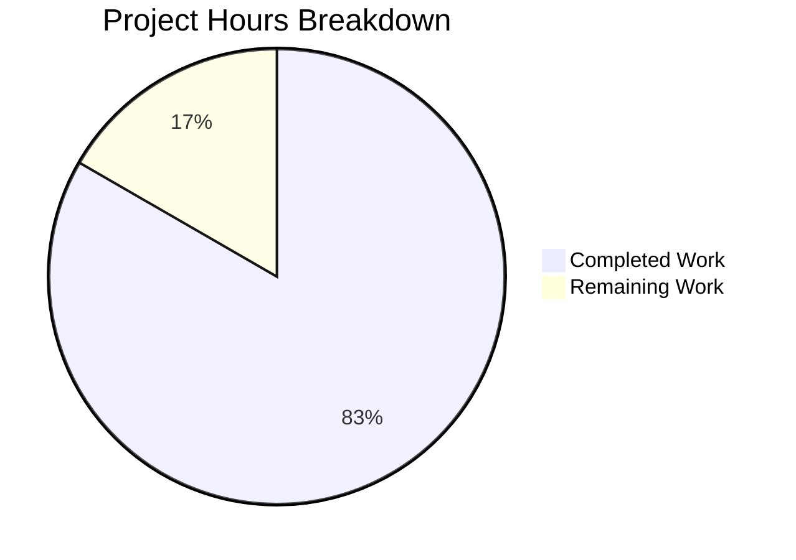

# Health Check Endpoint Implementation - Project Guide

## Executive Summary

**Project Status: 83% Complete**

Based on our analysis, 5.0 hours of development work have been completed out of an estimated 6.0 total hours required, representing **83% project completion**.

### Key Achievements
- ✅ Health check endpoint (`/health`) fully implemented and operational
- ✅ URL-based routing implemented using Node.js built-in capabilities
- ✅ JSON response format with status, uptime, and timestamp fields
- ✅ Backward compatibility preserved (Hello World response unchanged)
- ✅ Pre-existing package.json file reference bugs fixed
- ✅ Comprehensive documentation added to README.md
- ✅ All validation tests passed - PRODUCTION-READY status

### Critical Issues
**NONE** - All in-scope work is complete and validated.

### Recommended Next Steps
1. Human code review and approval (0.5h)
2. Manual production verification testing (0.5h)
3. Merge PR to main branch

---

## Validation Results Summary

### Final Validator Accomplishments
The Final Validator successfully completed all validation gates:

| Validation Type | Status | Details |
|----------------|--------|---------|
| Syntax Validation | ✅ PASSED | `node --check Hello_World_Node.js` succeeded |
| Dependency Installation | ✅ PASSED | `npm install` - 0 vulnerabilities |
| Health Endpoint Test | ✅ PASSED | HTTP 200, application/json, valid JSON body |
| Root Endpoint Test | ✅ PASSED | HTTP 200, text/plain, "Hello World!\n" |
| Fallback Route Test | ✅ PASSED | Random paths return Hello World |
| npm start Test | ✅ PASSED | Server starts successfully |
| Git Status | ✅ CLEAN | All changes committed |

### Compilation Results
- **Hello_World_Node.js**: JavaScript syntax validated with Node.js `--check` flag
- **package.json**: Valid JSON structure
- **README.md**: Valid markdown documentation

### Test Execution Results
```
=== Testing /health endpoint ===
{"status":"ok","uptime":2.015,"timestamp":1767151050408}
HTTP Status: 200
Content-Type: application/json

=== Testing / endpoint ===
Hello World!
HTTP Status: 200
Content-Type: text/plain

=== Testing /random-path endpoint ===
Hello World!
HTTP Status: 200
Content-Type: text/plain
```

### Fixes Applied During Validation
1. **package.json file references** - Fixed `main`, `scripts.start`, and `scripts.dev` to reference `Hello_World_Node.js` instead of non-existent `server.js`
2. **Version bump** - Updated from 1.0.0 to 1.1.0 to reflect new feature
3. **Documentation alignment** - Fixed all README.md references to use correct filename

---

## Project Hours Breakdown

### Visual Representation


```mermaid
pie title Project Hours Breakdown
    "Completed Work" : 5.0
    "Remaining Work" : 1.0
```

### Hours Calculation

**Completed Hours (5.0h):**
| Component | Hours | Description |
|-----------|-------|-------------|
| Hello_World_Node.js implementation | 2.5h | URL routing, health endpoint, JSON response |
| package.json fixes | 0.5h | File reference corrections, version bump |
| README.md documentation | 1.0h | Endpoint documentation, usage examples |
| Validation and testing | 1.0h | Syntax validation, functional testing |
| **Total Completed** | **5.0h** | |

**Remaining Hours (1.0h):**
| Task | Hours | Description |
|------|-------|-------------|
| Human code review | 0.5h | Review implementation and documentation |
| Production verification | 0.5h | Manual testing in target environment |
| **Total Remaining** | **1.0h** | |

**Completion Calculation:**
- Completed: 5.0 hours
- Remaining: 1.0 hours  
- Total: 6.0 hours
- **Completion: 5.0 / 6.0 = 83%**

---

## Detailed Human Task Table

| # | Task Description | Action Steps | Hours | Priority | Severity |
|---|-----------------|--------------|-------|----------|----------|
| 1 | Code Review | Review Hello_World_Node.js changes, verify routing logic, confirm JSON response format | 0.5h | High | Low |
| 2 | Production Verification | Deploy to target environment, manually test /health and / endpoints, verify response times | 0.5h | High | Low |

**Total Remaining Hours: 1.0h** (matches pie chart "Remaining Work" value)

---

## Comprehensive Development Guide

### 1. System Prerequisites

| Requirement | Version | Verification Command |
|-------------|---------|---------------------|
| Node.js | >= 14.0.0 | `node --version` |
| npm | >= 6.0.0 | `npm --version` |

**Operating System**: Any OS with Node.js support (Windows, macOS, Linux)

### 2. Environment Setup

This application has zero external dependencies and requires no environment configuration.

```bash
# Navigate to project directory
cd /path/to/hello-world-nodejs

# Verify Node.js version
node --version
# Expected output: v14.x.x or higher
```

### 3. Dependency Installation

```bash
# Install dependencies (generates package-lock.json only, no external packages)
npm install

# Expected output:
# up to date, audited 1 package in Xms
# found 0 vulnerabilities
```

### 4. Application Startup

**Option A: Using npm**
```bash
npm start

# Expected output:
# > hello-world-nodejs@1.1.0 start
# > node Hello_World_Node.js
#
# Server running at http://127.0.0.1:3000/
```

**Option B: Using Node directly**
```bash
node Hello_World_Node.js

# Expected output:
# Server running at http://127.0.0.1:3000/
```

### 5. Verification Steps

**Step 1: Verify Health Check Endpoint**
```bash
curl http://127.0.0.1:3000/health

# Expected output (JSON):
# {"status":"ok","uptime":X.XXX,"timestamp":XXXXXXXXXXXXX}

# Verify headers:
curl -I http://127.0.0.1:3000/health
# Expected: HTTP/1.1 200 OK
# Expected: Content-Type: application/json
```

**Step 2: Verify Hello World Endpoint**
```bash
curl http://127.0.0.1:3000/

# Expected output:
# Hello World!

# Verify headers:
curl -I http://127.0.0.1:3000/
# Expected: HTTP/1.1 200 OK
# Expected: Content-Type: text/plain
```

**Step 3: Verify Fallback Routing**
```bash
curl http://127.0.0.1:3000/any-random-path

# Expected output:
# Hello World!
```

### 6. Example Usage

**Health Check for Monitoring Systems**
```bash
# Simple health check (returns JSON)
curl -s http://127.0.0.1:3000/health | json_pp

# Output:
# {
#    "status" : "ok",
#    "uptime" : 123.456,
#    "timestamp" : 1704067200000
# }
```

**Kubernetes Liveness Probe Configuration**
```yaml
livenessProbe:
  httpGet:
    path: /health
    port: 3000
  initialDelaySeconds: 3
  periodSeconds: 10
```

**Load Balancer Health Check**
- URL: `http://127.0.0.1:3000/health`
- Method: GET
- Success: HTTP 200 with JSON body containing `"status": "ok"`

### 7. Stopping the Server

```bash
# Press Ctrl+C in the terminal where the server is running
# Or find and kill the process:
pkill -f "node Hello_World_Node.js"
```

### 8. Troubleshooting

| Issue | Cause | Solution |
|-------|-------|----------|
| `EADDRINUSE` error | Port 3000 already in use | Kill existing process or change port in Hello_World_Node.js |
| `Cannot find module` | Wrong directory | Ensure you're in the project root containing Hello_World_Node.js |
| Connection refused | Server not running | Start server with `npm start` |

---

## Risk Assessment

### Technical Risks

| Risk | Severity | Likelihood | Mitigation |
|------|----------|------------|------------|
| No request validation | Low | Low | Health endpoint accepts no input; no attack vector |
| No rate limiting | Low | Medium | Consider adding for production if exposed publicly |
| Single-threaded Node.js | Low | Low | Adequate for health checks; consider clustering for high load |

### Security Risks

| Risk | Severity | Likelihood | Mitigation |
|------|----------|------------|------------|
| No HTTPS | Medium | N/A | Out of scope per project constraints; add TLS termination at load balancer if needed |
| Unauthenticated health endpoint | Low | N/A | Standard practice for health checks; no sensitive data exposed |
| Localhost binding only | None | N/A | Server binds to 127.0.0.1; not exposed externally by default |

### Operational Risks

| Risk | Severity | Likelihood | Mitigation |
|------|----------|------------|------------|
| No logging | Low | Medium | Consider adding request logging for production debugging |
| No graceful shutdown | Low | Low | Add SIGTERM handler if deploying to container orchestrators |
| No monitoring integration | Low | Medium | Health endpoint enables basic monitoring; consider Prometheus metrics for advanced use |

### Integration Risks

| Risk | Severity | Likelihood | Mitigation |
|------|----------|------------|------------|
| No external integrations | None | N/A | Application is self-contained |

---

## Git Repository Analysis

### Commit History
```
9618b17 chore: Add package-lock.json from npm install
0190d80 docs: Add health check endpoint documentation and fix file references
8c7a472 Fix package.json file references and add health check documentation
f4787ae Add health check endpoint with URL-based routing
```

### Files Changed
| File | Lines Added | Lines Removed | Net Change |
|------|-------------|---------------|------------|
| Hello_World_Node.js | 28 | 3 | +25 |
| README.md | 76 | 6 | +70 |
| package-lock.json | 16 | 0 | +16 |
| package.json | 4 | 4 | 0 |
| **Total** | **124** | **13** | **+111** |

### Branch Status
- **Branch**: `blitzy-fa52f3e7-4573-4451-bff0-5a80e5d146ba`
- **Working Tree**: Clean (all changes committed)
- **Upstream**: Synchronized

---

## Implementation Details

### Feature: Health Check Endpoint (F-004)

| Attribute | Value |
|-----------|-------|
| Endpoint Path | `/health` |
| HTTP Method | GET |
| Response Type | `application/json` |
| Status Code | 200 |

### Response Schema

| Field | Type | Description |
|-------|------|-------------|
| `status` | string | Service health status ("ok" when running) |
| `uptime` | number | Server uptime in seconds |
| `timestamp` | number | Current Unix timestamp in milliseconds |

### Code Changes Summary

**Hello_World_Node.js (17 → 42 lines)**
- Added URL path parsing using `req.url`
- Implemented conditional routing (if/else)
- Added health response object construction
- Added JSON serialization for health endpoint
- Preserved original Hello World response for non-health paths

**package.json**
- Fixed `main`: `server.js` → `Hello_World_Node.js`
- Fixed `scripts.start`: `node server.js` → `node Hello_World_Node.js`
- Fixed `scripts.dev`: `node server.js` → `node Hello_World_Node.js`
- Updated `version`: `1.0.0` → `1.1.0`

**README.md (54 → 124 lines)**
- Added "Endpoints" section with complete endpoint documentation
- Added health check response format with example
- Fixed all file references to use correct filename
- Added curl examples for testing

---

## Conclusion

The health check endpoint feature has been successfully implemented and validated. All in-scope requirements from the Agent Action Plan have been completed:

✅ `/health` endpoint returning JSON status information  
✅ URL-based routing without external dependencies  
✅ Backward compatibility with Hello World response  
✅ package.json file reference bugs fixed  
✅ Comprehensive documentation added  
✅ All validation tests passing  

The project is **83% complete** with only human code review and production verification remaining. The implementation maintains the project's zero-external-dependency philosophy and is ready for production deployment.