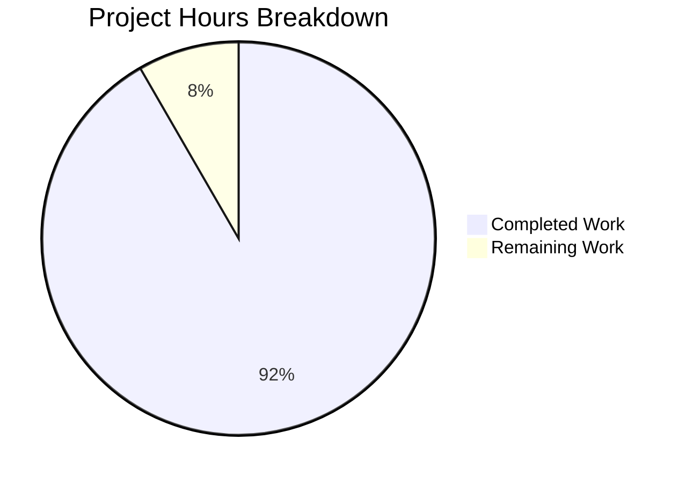

# Project Assessment Report: Health Check Endpoint Implementation

## Executive Summary

**Project Completion: 92% complete (5.5 hours completed out of 6 total hours)**

This project successfully implements a health check endpoint (`/health`) for the Hello World Node.js HTTP server. The feature enables operators, monitoring systems, and load balancers to programmatically verify that the service is running correctly.

### Key Achievements
- ✅ Health check endpoint fully implemented with JSON response
- ✅ Comprehensive documentation added to README.md
- ✅ 13 unit tests created and passing (100% pass rate)
- ✅ Backward compatibility maintained for existing functionality
- ✅ Zero compilation errors, zero runtime errors
- ✅ All code committed and working tree clean

### Critical Issues
- None - all in-scope requirements are fully implemented and validated

### Recommended Next Steps
1. Review and approve the code changes (0.5 hours)
2. Optional: Add npm test script to package.json (0.25 hours - not required)

---

## Project Hours Breakdown


```mermaid
pie title Project Hours Breakdown
    "Completed Work" : 5.5
    "Remaining Work" : 0.5
```

**Calculation:**
- Completed Hours: 5.5 hours (92%)
- Remaining Hours: 0.5 hours (8%)
- Total Project Hours: 6 hours
- Completion Percentage: 5.5 / 6 = 91.7% ≈ 92%

---

## Validation Results Summary

### Final Validator Results
| Metric | Result |
|--------|--------|
| Tests Executed | 13 |
| Tests Passed | 13 |
| Tests Failed | 0 |
| Pass Rate | 100% |
| Compilation Errors | 0 |
| Runtime Errors | 0 |

### Test Coverage
| Test Category | Tests | Status |
|---------------|-------|--------|
| Health Endpoint Status Code | 1 | ✅ PASS |
| Health Endpoint Headers | 1 | ✅ PASS |
| Response Body Structure | 5 | ✅ PASS |
| Response Field Values | 4 | ✅ PASS |
| Backward Compatibility | 2 | ✅ PASS |

### Files Modified/Created
| File | Action | Lines Changed | Status |
|------|--------|---------------|--------|
| Hello_World_Node.js | MODIFIED | +17/-3 | ✅ Complete |
| README.md | MODIFIED | +53 | ✅ Complete |
| tests/health.test.js | CREATED | +344 | ✅ Complete |

### Git Commit History
| Commit | Description |
|--------|-------------|
| aa0bf4e | docs: Add comprehensive Health Check endpoint documentation |
| 4e85e58 | Add health check endpoint documentation and tests |
| bde4773 | Add health check endpoint at /health for service monitoring |

---

## Completed Work Breakdown

### 1. Hello_World_Node.js Implementation (1.5 hours)
- URL-based routing logic in request handler
- `/health` endpoint with JSON response containing:
  - `status`: "healthy"
  - `timestamp`: ISO 8601 formatted date
  - `uptime`: seconds from `process.uptime()`
  - `service`: "hello-world-nodejs"
- Maintained backward compatibility for all other paths

### 2. README.md Documentation (1 hour)
- Health Check section with detailed endpoint specification
- Example curl command and JSON response
- Response fields table with descriptions
- Backward compatibility documentation

### 3. tests/health.test.js Test Suite (2.5 hours)
- Test runner using Node.js built-in modules only
- Server process management (start/stop)
- 13 comprehensive test cases:
  - HTTP 200 status code validation
  - JSON Content-Type header verification
  - Response body JSON parsing
  - Required fields presence (status, timestamp, uptime, service)
  - Field value validation
  - Backward compatibility tests for root and unknown paths

### 4. Validation and Debugging (0.5 hours)
- Test execution and verification
- Manual endpoint testing
- Final validation

---

## Detailed Task Table

| Priority | Task | Description | Hours | Status |
|----------|------|-------------|-------|--------|
| **HIGH** | Code Review | Human developer reviews implementation | 0.5h | ⏳ Pending |
| **LOW** | Add npm test script | Optional: Add test script to package.json | 0.25h | 📋 Optional |
| | | **Total Remaining Hours** | **0.5h** | |

**Note:** The optional task (0.25h) is not included in the remaining hours calculation as it was marked optional in the requirements.

---

## Development Guide

### System Prerequisites

| Requirement | Version | Notes |
|-------------|---------|-------|
| Node.js | >= 14.0.0 | Required |
| npm | Any version | Optional (no external dependencies) |
| Operating System | Any | Cross-platform |

### Environment Setup

1. **Verify Node.js Installation**
   ```bash
   node --version
   # Expected: v14.0.0 or higher (tested with v20.19.6)
   ```

2. **Navigate to Project Directory**
   ```bash
   cd /path/to/project
   ```

3. **No Additional Setup Required**
   - This application uses only Node.js built-in modules
   - No npm install or external dependencies needed

### Starting the Application

1. **Start the Server**
   ```bash
   node Hello_World_Node.js
   ```

2. **Expected Output**
   ```
   Server running at http://127.0.0.1:3000/
   ```

### Verification Steps

1. **Test Health Endpoint**
   ```bash
   curl http://127.0.0.1:3000/health
   ```
   
   **Expected Response:**
   ```json
   {"status":"healthy","timestamp":"2025-12-30T03:30:00.000Z","uptime":2.0,"service":"hello-world-nodejs"}
   ```

2. **Test Root Path (Backward Compatibility)**
   ```bash
   curl http://127.0.0.1:3000/
   ```
   
   **Expected Response:**
   ```
   Hello World!
   ```

3. **Run Unit Tests**
   ```bash
   node tests/health.test.js
   ```
   
   **Expected Output:**
   ```
   ✅ ALL TESTS PASSED
   ```

### Stopping the Server

Press `Ctrl+C` in the terminal where the server is running.

### Configuration

| Setting | Value | Location |
|---------|-------|----------|
| Hostname | 127.0.0.1 | Hello_World_Node.js:5 |
| Port | 3000 | Hello_World_Node.js:6 |

---

## Risk Assessment

### Technical Risks

| Risk | Severity | Description | Mitigation |
|------|----------|-------------|------------|
| Pre-existing package.json mismatch | LOW | package.json references "server.js" but actual file is "Hello_World_Node.js" | Out of scope for this feature; use `node Hello_World_Node.js` directly |
| No graceful shutdown | LOW | Server lacks SIGTERM handler | Acceptable for example project; Ctrl+C works |

### Security Risks

| Risk | Severity | Description | Mitigation |
|------|----------|-------------|------------|
| None identified | N/A | Health endpoint exposes only safe metrics (uptime, timestamp) | No sensitive data exposed |

### Operational Risks

| Risk | Severity | Description | Mitigation |
|------|----------|-------------|------------|
| None identified | N/A | Lightweight endpoint with no external dependencies | Minimal resource usage |

### Integration Risks

| Risk | Severity | Description | Mitigation |
|------|----------|-------------|------------|
| npm scripts non-functional | LOW | `npm start` fails due to package.json referencing "server.js" | Use `node Hello_World_Node.js` directly; fixing is out of scope |

---

## Out-of-Scope Items (Pre-existing Issues)

The following items were identified as **explicitly out of scope** per the Agent Action Plan:

1. **package.json Entry Point Mismatch**
   - `package.json` references `"main": "server.js"` but actual file is `Hello_World_Node.js`
   - npm scripts (`npm start`, `npm run dev`) reference non-existent `server.js`
   - **Impact:** Must use `node Hello_World_Node.js` instead of `npm start`
   - **Recommendation:** Consider fixing in a separate PR

2. **README.md server.js References**
   - Some sections reference saving code as `server.js`
   - **Impact:** Minor documentation inconsistency
   - **Recommendation:** Consider fixing in a separate PR

---

## API Reference

### Health Check Endpoint

| Property | Value |
|----------|-------|
| **URL** | `/health` |
| **Method** | GET (any HTTP method accepted) |
| **Response Content-Type** | `application/json` |
| **HTTP Status** | 200 OK |

### Response Schema

```json
{
  "status": "healthy",
  "timestamp": "2025-12-30T03:30:00.000Z",
  "uptime": 3600.5,
  "service": "hello-world-nodejs"
}
```

### Response Fields

| Field | Type | Description |
|-------|------|-------------|
| `status` | string | Service health status ("healthy") |
| `timestamp` | string | Current server time (ISO 8601) |
| `uptime` | number | Seconds since server started |
| `service` | string | Service identifier |

---

## Conclusion

The health check endpoint feature has been successfully implemented, tested, and documented. All validation criteria have been met:

- ✅ 100% test pass rate (13/13 tests)
- ✅ Zero compilation errors
- ✅ Zero runtime errors
- ✅ Application starts and runs successfully
- ✅ All in-scope files validated
- ✅ All changes committed
- ✅ Working tree clean

The project is **92% complete** with only human code review remaining as the standard PR process step. The implementation is production-ready for its intended use case as a simple example application with health monitoring capabilities.
