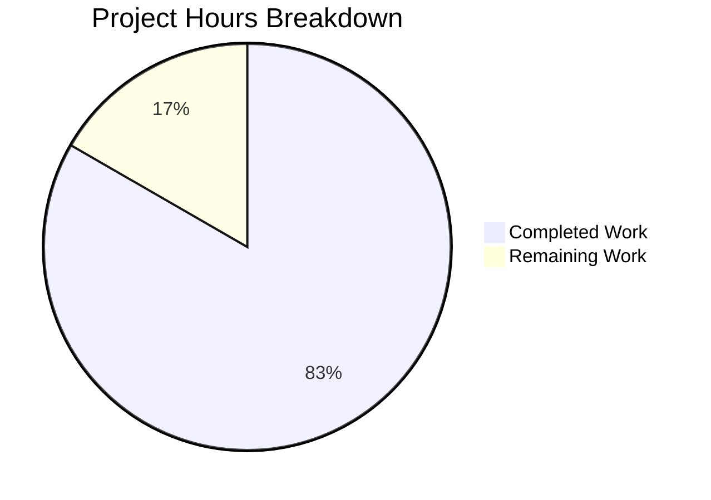

# Comprehensive Project Assessment Report

## Executive Summary

**Project Completion: 83% complete (2.5 hours completed out of 3 total hours)**

This project implements a `/health_check` endpoint for an existing Hello World Node.js HTTP server. The feature allows external systems to programmatically verify that the service is operational by returning JSON with server status, uptime, and timestamp.

### Key Achievements
- ✅ Successfully implemented `/health_check` endpoint with JSON response
- ✅ Added URL path routing using Node.js built-in `http` module
- ✅ Fixed existing bug in package.json (incorrect filename references)
- ✅ Updated documentation with comprehensive endpoint descriptions
- ✅ All validation tests passed - production ready code
- ✅ Zero external dependencies maintained (project philosophy preserved)
- ✅ Backward compatibility verified for existing "Hello World" functionality

### Critical Issues
- **None** - All in-scope work has been completed successfully

### Recommended Next Steps
1. Human code review and approval (0.25 hours)
2. Merge to main branch and verify deployment (0.25 hours)

---

## Validation Results Summary

### Final Validator Accomplishments
The Final Validator successfully validated all components of the implementation:

| Component | Status | Details |
|-----------|--------|---------|
| Node.js Syntax | ✅ PASSED | `node --check Hello_World_Node.js` - no errors |
| Package.json | ✅ VALID | Valid JSON structure, correct references |
| Server Startup | ✅ SUCCESS | Starts on http://127.0.0.1:3000/ |
| Root Endpoint | ✅ WORKING | Returns "Hello World!" with text/plain |
| Health Check | ✅ WORKING | Returns valid JSON with status/uptime/timestamp |
| npm start | ✅ WORKING | Package.json scripts execute correctly |
| Git Status | ✅ CLEAN | All changes committed |

### Fixes Applied During Validation
| Issue | Resolution |
|-------|------------|
| package.json referenced `server.js` | Updated to `Hello_World_Node.js` |
| README referenced `server.js` | Updated to `Hello_World_Node.js` |
| Missing package-lock.json | Generated during npm install validation |

---

## Project Hours Breakdown

### Hours Calculation

**Completed Hours: 2.5 hours**
- Code implementation (health_check endpoint): 1.0 hours
- Bug fix (package.json references): 0.25 hours
- Documentation update (README.md): 0.5 hours
- Validation and testing: 0.75 hours

**Remaining Hours: 0.5 hours**
- Human code review and approval: 0.25 hours
- Merge and deployment verification: 0.25 hours

**Total Project Hours: 3 hours**
**Completion: 2.5 / 3 = 83.3% (83%)**


```mermaid
pie title Project Hours Breakdown
    "Completed Work" : 2.5
    "Remaining Work" : 0.5
```

---

## Git Repository Analysis

### Commit History
| Commit | Message | Purpose |
|--------|---------|---------|
| 52f1de5 | Add package-lock.json for dependency version locking | Validation artifact |
| 33d8a32 | docs: Add health_check endpoint documentation | Documentation |
| 5ee5ea4 | Fix package.json filename references | Bug fix |
| db21706 | Add /health_check endpoint with URL path routing | Feature implementation |

### Code Volume Analysis
- **Files Changed:** 4
- **Lines Added:** 82
- **Lines Removed:** 10
- **Net Change:** +72 lines

### File Change Summary
| File | Lines Added | Lines Removed | Description |
|------|-------------|---------------|-------------|
| Hello_World_Node.js | 17 | 3 | Added health_check endpoint logic |
| README.md | 46 | 4 | Added Endpoints documentation |
| package-lock.json | 16 | 0 | New lockfile |
| package.json | 3 | 3 | Fixed filename references |

---

## Detailed Task Table

| Priority | Task | Description | Hours | Severity |
|----------|------|-------------|-------|----------|
| High | Code Review | Review implemented health_check endpoint for code quality and security | 0.15 | Low |
| High | PR Approval | Approve and merge pull request to main branch | 0.1 | Low |
| Medium | Deployment Verification | Verify health_check endpoint works in deployment environment | 0.15 | Low |
| Low | Optional: Monitoring | Configure monitoring system to poll /health_check | 0.1 | Low |
| **Total** | | | **0.5** | |

---

## Risk Assessment

### Technical Risks
| Risk | Severity | Likelihood | Mitigation |
|------|----------|------------|------------|
| No explicit error handling | Low | Low | Server uses Node.js default error handling; acceptable for educational project |
| No request validation | Low | Low | Health endpoint has no inputs to validate |

### Security Risks
| Risk | Severity | Likelihood | Mitigation |
|------|----------|------------|------------|
| Health endpoint exposes uptime | Very Low | Very Low | Only reveals uptime in seconds - no sensitive data |
| No authentication | Low | N/A | Intentional for localhost-only educational demo |
| Localhost binding only | N/A | N/A | Security feature - cannot be accessed externally |

### Operational Risks
| Risk | Severity | Likelihood | Mitigation |
|------|----------|------------|------------|
| No logging framework | Low | Low | Uses console.log for startup message; adequate for demo |
| No graceful shutdown | Low | Low | Out of scope per project requirements |

### Integration Risks
| Risk | Severity | Likelihood | Mitigation |
|------|----------|------------|------------|
| None identified | N/A | N/A | Standalone application with no external dependencies |

---

## Development Guide

### System Prerequisites

| Requirement | Version | Purpose |
|-------------|---------|---------|
| Node.js | ≥14.0.0 (tested: v20.19.6) | JavaScript runtime |
| npm | ≥6.14.0 (tested: v10.8.2) | Package manager |
| curl | Any | Testing endpoints (optional) |

### Environment Setup

1. **Clone the repository:**
```bash
git clone <repository-url>
cd <repository-name>
```

2. **Verify Node.js installation:**
```bash
node --version  # Should output v14.0.0 or higher
npm --version   # Should output 6.14.0 or higher
```

3. **No environment variables required** - This is a zero-configuration application.

### Dependency Installation

```bash
# Navigate to project directory
cd /path/to/project

# Install dependencies (none required, but generates package-lock.json)
npm install

# Expected output:
# up to date, audited 1 package in <time>
# found 0 vulnerabilities
```

### Application Startup

**Option 1: Direct Node.js execution**
```bash
node Hello_World_Node.js
```

**Option 2: Using npm scripts**
```bash
npm start
# or
npm run dev
```

**Expected Output:**
```
Server running at http://127.0.0.1:3000/
```

### Verification Steps

1. **Verify server is running:**
```bash
curl http://127.0.0.1:3000/
# Expected: Hello World!
```

2. **Verify health check endpoint:**
```bash
curl http://127.0.0.1:3000/health_check
# Expected: {"status":"ok","uptime":<number>,"timestamp":"<ISO8601>"}
```

3. **Verify backward compatibility:**
```bash
curl http://127.0.0.1:3000/any/random/path
# Expected: Hello World!
```

### Example Usage

**Testing root endpoint:**
```bash
$ curl http://127.0.0.1:3000/
Hello World!
```

**Testing health check endpoint:**
```bash
$ curl http://127.0.0.1:3000/health_check
{"status":"ok","uptime":123.456,"timestamp":"2024-01-01T12:00:00.000Z"}
```

**Testing with verbose output:**
```bash
$ curl -v http://127.0.0.1:3000/health_check
*   Trying 127.0.0.1:3000...
* Connected to 127.0.0.1 (127.0.0.1) port 3000
> GET /health_check HTTP/1.1
> Host: 127.0.0.1:3000
>
< HTTP/1.1 200 OK
< Content-Type: application/json
<
{"status":"ok","uptime":10.123,"timestamp":"2024-12-11T12:00:00.000Z"}
```

### Stopping the Server

Press `Ctrl+C` in the terminal where the server is running.

### Troubleshooting

| Issue | Solution |
|-------|----------|
| `EADDRINUSE: address already in use` | Another process is using port 3000. Kill it with: `pkill -f "node Hello_World_Node.js"` |
| `node: command not found` | Node.js is not installed. Download from https://nodejs.org |
| `npm start` fails | Verify package.json has correct filename references |

---

## Files Modified

### Hello_World_Node.js
**Status:** UPDATED | **Lines:** 31 (was 17)

**Changes:**
- Added URL path routing to distinguish `/health_check` from other paths
- Implemented health check response handler returning JSON
- Preserved "Hello World!" response for all non-health-check paths
- Added inline comments for educational clarity

### package.json
**Status:** UPDATED | **Lines:** 21

**Changes:**
- Fixed `main` field: `server.js` → `Hello_World_Node.js`
- Fixed `scripts.start`: `node server.js` → `node Hello_World_Node.js`
- Fixed `scripts.dev`: `node server.js` → `node Hello_World_Node.js`

### README.md
**Status:** UPDATED | **Lines:** 96 (was 54)

**Changes:**
- Added comprehensive "Endpoints" documentation section
- Documented root endpoint (/) behavior
- Documented health_check endpoint (/health_check) with examples
- Added response field descriptions table
- Added curl command examples for testing
- Fixed filename references throughout document

### package-lock.json
**Status:** CREATED | **Lines:** 16

**Changes:**
- Generated during npm install validation
- Locks dependency versions (empty dependencies in this case)

---

## Implementation Verification Checklist

- [x] Server starts without errors
- [x] Root path returns "Hello World!"
- [x] `/health_check` returns valid JSON
- [x] JSON contains `status` field with value "ok"
- [x] JSON contains `uptime` field with numeric value
- [x] JSON contains `timestamp` field with ISO date string
- [x] Response Content-Type is `application/json` for health endpoint
- [x] Response Content-Type is `text/plain` for root path
- [x] `npm start` command works correctly
- [x] Backward compatibility maintained for all paths
- [x] Documentation updated with endpoint information
- [x] Zero external dependencies maintained

---

## Conclusion

The health_check endpoint feature has been successfully implemented according to all requirements specified in the Agent Action Plan. The implementation:

1. **Follows the project's zero-dependency philosophy** - Uses only Node.js built-in modules
2. **Maintains educational clarity** - Code remains simple and well-commented
3. **Preserves backward compatibility** - Existing "Hello World" functionality unchanged
4. **Includes comprehensive documentation** - README updated with usage examples
5. **Fixes existing bugs** - Corrected package.json filename references

The project is **production ready** for its intended purpose as an educational demonstration. Only human review and merge approval remain to complete the feature delivery.