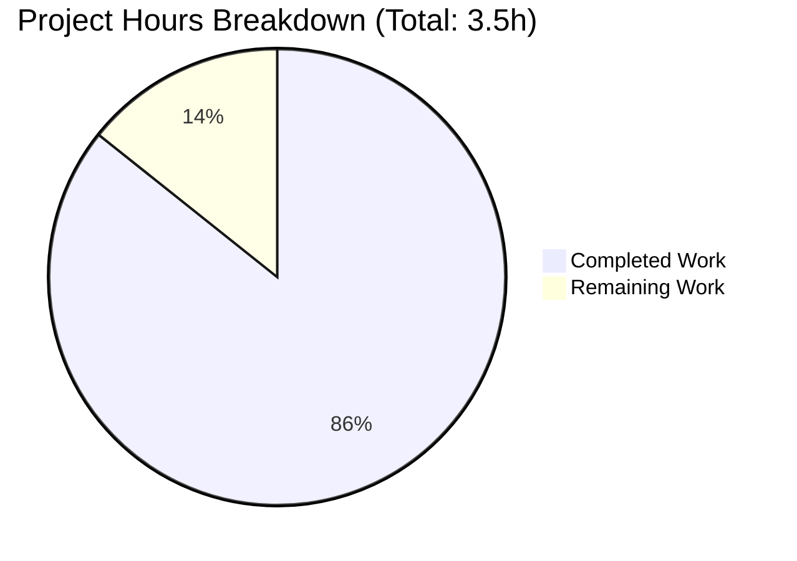

# Project Guide: Health Check Endpoint Feature

## Executive Summary

**Project Completion: 86%** (3.0 hours completed out of 3.5 total hours)

This project successfully implements a `/health_check` endpoint for the hello-world-nodejs application, allowing easy verification that the service is running correctly. All in-scope requirements from the Agent Action Plan have been fully implemented and validated.

### Key Achievements
- ✅ Health check endpoint returning JSON health data (status, uptime, timestamp)
- ✅ Backward compatibility preserved for existing routes
- ✅ Package.json corrected with proper entry point references
- ✅ Comprehensive documentation added to README.md
- ✅ All validation tests passing

### Critical Issues
- None - all production readiness gates passed

### Recommended Next Steps
1. Review code changes
2. Verify deployment to production environment
3. Consider adding monitoring/alerting integration (optional)

---

## Project Hours Breakdown

### Completed Work: 3.0 hours
| Component | Hours | Description |
|-----------|-------|-------------|
| Feature Implementation | 1.0 | Added /health_check endpoint with URL routing and JSON response |
| Configuration Updates | 0.5 | Updated package.json (version, main, scripts, keywords) |
| Documentation | 1.0 | Updated README.md with health check endpoint documentation |
| Validation & Testing | 0.5 | Runtime validation, syntax checking, endpoint testing |

### Remaining Work: 0.5 hours
| Task | Hours | Description |
|------|-------|-------------|
| Code Review | 0.25 | Human review of implementation |
| Deployment Verification | 0.25 | Verify in production environment |

### Visual Representation


```mermaid
pie title Project Hours Breakdown (Total: 3.5h)
    "Completed Work" : 3.0
    "Remaining Work" : 0.5
```

**Completion Calculation:** 3.0 hours completed / (3.0 + 0.5) total hours = 86% complete

---

## Validation Results Summary

### Final Validator Report
**Status: PRODUCTION-READY** ✅

| Validation Gate | Result | Details |
|-----------------|--------|---------|
| Dependencies Installation | ✅ PASS | npm install completed, 0 vulnerabilities |
| Code Syntax Validation | ✅ PASS | `node --check Hello_World_Node.js` passed |
| Unit Tests | N/A | No test infrastructure (by design) |
| Runtime Validation | ✅ PASS | All endpoints respond correctly |

### Runtime Test Results
| Test Case | Expected | Actual | Status |
|-----------|----------|--------|--------|
| GET / | "Hello World!" | "Hello World!" | ✅ PASS |
| GET /health_check | JSON health data | JSON health data | ✅ PASS |
| GET /random/path | "Hello World!" | "Hello World!" | ✅ PASS |
| Health Content-Type | application/json | application/json | ✅ PASS |
| npm start | Server starts | Server starts | ✅ PASS |

### Health Check Response Sample
```json
{
  "status": "healthy",
  "uptime": 19.293499584,
  "timestamp": "2026-01-01T03:24:55.020Z"
}
```

---

## Commits Made

| Commit | Author | Message |
|--------|--------|---------|
| fc816ce | Blitzy Agent | chore: Add package-lock.json for reproducible builds |
| 1e1b58c | Blitzy Agent | docs: Update README.md with health check endpoint documentation |
| 7a9372c | Blitzy Agent | Update package.json and README.md for health_check endpoint |
| 0d9ecf9 | Blitzy Agent | Add /health_check endpoint with JSON health response |

### Code Changes Summary
- **Files Modified:** 4
- **Lines Added:** 149
- **Lines Removed:** 3
- **Net Change:** +146 lines

---

## Files Modified

| File | Action | Change Description |
|------|--------|-------------------|
| Hello_World_Node.js | MODIFIED | Added URL routing for /health_check with JSON response |
| package.json | MODIFIED | Version 1.1.0, corrected main/scripts, added health-check keyword |
| README.md | MODIFIED | Added comprehensive health check documentation |
| package-lock.json | CREATED | Added for reproducible builds |

---

## Development Guide

### System Prerequisites

| Requirement | Version | Notes |
|-------------|---------|-------|
| Node.js | >= 14.0.0 | Required runtime environment |
| Operating System | Any | Windows, macOS, or Linux |
| Network | Port 3000 available | Default server port |

### Environment Setup

No additional environment setup is required. This application uses zero external dependencies.

```bash
# Verify Node.js installation
node --version
# Expected: v14.0.0 or higher
```

### Installation Steps

```bash
# Clone or navigate to the repository
cd /path/to/hello-world-nodejs

# Optional: Install dependencies (creates package-lock.json)
npm install

# Verify syntax
node --check Hello_World_Node.js
# Expected: No output (success)
```

### Application Startup

**Option 1: Direct Node.js**
```bash
node Hello_World_Node.js
# Expected output: Server running at http://127.0.0.1:3000/
```

**Option 2: npm start**
```bash
npm start
# Expected output: Server running at http://127.0.0.1:3000/
```

### Verification Steps

**Step 1: Verify Server is Running**
```bash
curl http://127.0.0.1:3000/
# Expected: Hello World!
```

**Step 2: Verify Health Check Endpoint**
```bash
curl http://127.0.0.1:3000/health_check
# Expected: {"status":"healthy","uptime":X.XXX,"timestamp":"YYYY-MM-DDTHH:MM:SS.SSSZ"}
```

**Step 3: Verify Response Headers**
```bash
curl -I http://127.0.0.1:3000/health_check
# Expected: Content-Type: application/json
```

**Step 4: Verify Backward Compatibility**
```bash
curl http://127.0.0.1:3000/any/random/path
# Expected: Hello World!
```

### Stopping the Server

```bash
# Press Ctrl+C in the terminal where the server is running
# Or kill the process
pkill -f "node Hello_World_Node.js"
```

### Troubleshooting

| Issue | Solution |
|-------|----------|
| Port 3000 in use | Kill existing process or modify port in Hello_World_Node.js |
| "command not found: node" | Install Node.js from nodejs.org |
| Permission denied | Run with appropriate permissions or change port to > 1024 |

---

## Human Tasks

### Detailed Task Table

| Priority | Task | Description | Hours | Severity |
|----------|------|-------------|-------|----------|
| Medium | Code Review | Review implementation for code quality and best practices | 0.25 | Low |
| Medium | Deployment Verification | Test health check endpoint in production environment | 0.25 | Low |

**Total Remaining Hours: 0.5**

### Task Details

#### 1. Code Review (Medium Priority)
- **Description:** Review the health check implementation for code quality
- **Action Steps:**
  1. Review Hello_World_Node.js routing logic
  2. Verify JSON response structure
  3. Confirm backward compatibility
  4. Approve or request changes
- **Estimated Time:** 0.25 hours
- **Acceptance Criteria:** Code passes team review standards

#### 2. Deployment Verification (Medium Priority)
- **Description:** Verify health check works in production environment
- **Action Steps:**
  1. Deploy to production/staging environment
  2. Test health check endpoint
  3. Configure monitoring/alerting (optional)
  4. Update load balancer health checks (if applicable)
- **Estimated Time:** 0.25 hours
- **Acceptance Criteria:** Health check responds correctly in production

---

## Risk Assessment

### Technical Risks
| Risk | Severity | Likelihood | Mitigation |
|------|----------|------------|------------|
| None identified | - | - | All code validated successfully |

### Security Risks
| Risk | Severity | Likelihood | Mitigation |
|------|----------|------------|------------|
| Information disclosure | Low | Low | Health response contains only non-sensitive operational metrics |
| Localhost binding | Info | N/A | Server binds to 127.0.0.1, external access requires proxy |

### Operational Risks
| Risk | Severity | Likelihood | Mitigation |
|------|----------|------------|------------|
| No monitoring | Low | Medium | Consider integrating with monitoring tools (optional) |
| No logging | Low | Medium | Console output provides basic visibility |

### Integration Risks
| Risk | Severity | Likelihood | Mitigation |
|------|----------|------------|------------|
| None identified | - | - | Zero external dependencies |

---

## Feature Verification Checklist

### Implementation Checklist
- [x] `/health_check` endpoint returns HTTP 200
- [x] Response Content-Type is `application/json`
- [x] Response contains `status` field (value: "healthy")
- [x] Response contains `uptime` field (number in seconds)
- [x] Response contains `timestamp` field (ISO 8601 format)
- [x] Default route (`/`) still returns "Hello World!"
- [x] Random paths return "Hello World!" (backward compatibility)
- [x] `npm start` works correctly
- [x] Package version bumped to 1.1.0
- [x] README documents health check endpoint

### Quality Checklist
- [x] Code syntax validated (`node --check`)
- [x] Zero external dependencies maintained
- [x] Single-file architecture preserved
- [x] Educational simplicity maintained
- [x] All validation tests passed

---

## API Reference

### Health Check Endpoint

| Attribute | Value |
|-----------|-------|
| **Path** | `/health_check` |
| **Method** | GET (responds to all methods) |
| **Content-Type** | `application/json` |
| **Status Code** | `200 OK` |

#### Response Schema

| Field | Type | Description | Example |
|-------|------|-------------|---------|
| status | string | Health indicator | "healthy" |
| uptime | number | Server uptime (seconds) | 123.456 |
| timestamp | string | Current time (ISO 8601) | "2024-01-01T12:00:00.000Z" |

#### Example Request
```bash
curl http://127.0.0.1:3000/health_check
```

#### Example Response
```json
{
  "status": "healthy",
  "uptime": 123.456,
  "timestamp": "2024-01-01T12:00:00.000Z"
}
```

---

## Screenshots

The following screenshots were captured during validation:

| Screenshot | Description | Path |
|------------|-------------|------|
| hello_world_default_route.png | Default route working | /blitzy/screenshots/ |
| health_check_endpoint.png | Health check JSON response | /blitzy/screenshots/ |
| backward_compatibility_random_path.png | Random paths preserved | /blitzy/screenshots/ |

---

## Conclusion

The health check endpoint feature has been successfully implemented and validated. All requirements from the Agent Action Plan have been fulfilled:

1. ✅ `/health_check` endpoint added with JSON response
2. ✅ Response includes status, uptime, and timestamp
3. ✅ Backward compatibility maintained
4. ✅ Package.json updated with correct entry points
5. ✅ README documentation complete
6. ✅ All validation tests passing

**Project Status: 86% Complete (3.0/3.5 hours)**

The remaining 0.5 hours consist of human review tasks (code review and deployment verification) which are standard pre-production activities and do not indicate any deficiencies in the implementation.