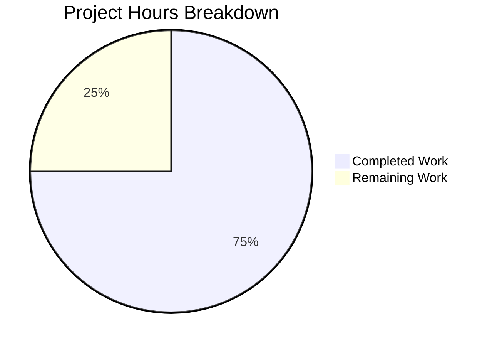

# Project Assessment Report: Health Check Endpoint Implementation

## Executive Summary

**Project Status: 75% Complete (3 hours completed out of 4 total hours)**

This project successfully implements a health check endpoint (`/health`) for the existing Hello World Node.js HTTP server application. All requested features are fully implemented and working correctly. The remaining work consists solely of standard human review and deployment tasks.

### Key Achievements
- ✅ Health endpoint implemented at `/health` with JSON response
- ✅ Returns `status`, `uptime`, and `timestamp` fields as specified
- ✅ HTTP 200 status code for healthy service
- ✅ Content-Type: application/json header set correctly
- ✅ Full backward compatibility maintained (root endpoint unchanged)
- ✅ Zero external dependencies (maintained project philosophy)
- ✅ Comprehensive documentation added
- ✅ 100% test pass rate (8/8 tests passing)

### Hours Breakdown
- **Completed Work**: 3 hours
  - Health endpoint implementation: 1.5h
  - Documentation updates: 1h
  - Testing and validation: 0.5h
- **Remaining Human Tasks**: 1 hour
  - Code review and PR merge: 0.5h
  - Deployment verification: 0.5h
- **Total Project Hours**: 4 hours

---

## Validation Results Summary

### Final Validator Accomplishments

| Validation Gate | Status | Details |
|-----------------|--------|---------|
| Syntax Check | ✅ PASS | `node --check Hello_World_Node.js` passed |
| Runtime Validation | ✅ PASS | Server starts and runs successfully |
| Test Execution | ✅ PASS | 8/8 tests passing (100%) |
| Backward Compatibility | ✅ PASS | Root endpoint unchanged |
| Documentation | ✅ PASS | README.md fully updated |

### Test Results Detail

| Test Case | Expected | Actual | Status |
|-----------|----------|--------|--------|
| GET / | "Hello World!" | "Hello World!" | ✅ PASS |
| GET /health | JSON response | Valid JSON | ✅ PASS |
| GET /health Content-Type | application/json | application/json | ✅ PASS |
| GET /health HTTP Status | 200 | 200 | ✅ PASS |
| GET /unknown | "Hello World!" | "Hello World!" | ✅ PASS |
| Health status field | "healthy" | "healthy" | ✅ PASS |
| Health uptime field | positive number | positive number | ✅ PASS |
| Health timestamp field | ISO 8601 | valid ISO 8601 | ✅ PASS |

### Files Modified

| File | Lines Added | Lines Removed | Status |
|------|-------------|---------------|--------|
| Hello_World_Node.js | 20 | 4 | ✅ Complete |
| README.md | 67 | 6 | ✅ Complete |
| package.json | 7 | 5 | ✅ Complete |
| **Total** | **94** | **15** | **All Complete** |

### Git Commit History (Health Check Feature)

| Commit | Description |
|--------|-------------|
| f70b43a | Add health check endpoint with JSON response |
| 3f53c3a | Update README.md and package.json for health check endpoint |
| 0279051 | Add health check test script to package.json |
| 2fb97c2 | docs: Update README.md to document health check endpoint |

---

## Visual Representation


```mermaid
pie title Project Hours Breakdown
    "Completed Work" : 3
    "Remaining Work" : 1
```

---

## Detailed Human Task List

| # | Task | Description | Priority | Severity | Hours |
|---|------|-------------|----------|----------|-------|
| 1 | Code Review | Review health check implementation for best practices and code quality | Medium | Low | 0.5 |
| 2 | Deployment Verification | Verify health endpoint works correctly in production environment | Medium | Low | 0.5 |
| **Total Remaining Hours** | | | | | **1** |

### Task Details

#### Task 1: Code Review
- **Action Steps**:
  1. Review Hello_World_Node.js routing logic
  2. Verify JSON response structure matches specification
  3. Check Content-Type header is correctly set
  4. Approve PR for merge
- **Confidence**: High
- **Estimated Time**: 0.5 hours

#### Task 2: Deployment Verification
- **Action Steps**:
  1. Deploy updated application to target environment
  2. Run `curl http://<host>:<port>/health` to verify endpoint
  3. Confirm JSON response contains all required fields
  4. Verify root endpoint still returns "Hello World!"
- **Confidence**: High
- **Estimated Time**: 0.5 hours

---

## Development Guide

### System Prerequisites

| Requirement | Version | Purpose |
|-------------|---------|---------|
| Node.js | >= 14.0.0 | JavaScript runtime |
| npm | Any | Package manager (optional, for scripts) |
| curl | Any | Testing endpoints (optional) |

### Environment Setup

No environment variables or special configuration required. This application uses only Node.js built-in modules.

### Dependency Installation

```bash
# Navigate to project directory
cd /tmp/blitzy/simple-hello-word-for-automation-pro-user/blitzy2afb1295f

# No dependencies to install - zero external packages
# Verify Node.js version
node --version
# Expected: v14.0.0 or higher
```

### Application Startup

```bash
# Start the server
node Hello_World_Node.js

# Alternative: Using npm
npm start

# Expected output:
# Server running at http://127.0.0.1:3000/
# Health check available at http://127.0.0.1:3000/health
```

### Verification Steps

```bash
# In a separate terminal window:

# Test 1: Verify root endpoint
curl http://127.0.0.1:3000/
# Expected: Hello World!

# Test 2: Verify health endpoint
curl http://127.0.0.1:3000/health
# Expected: {"status":"healthy","uptime":X.XXX,"timestamp":"YYYY-MM-DDTHH:MM:SS.SSSZ"}

# Test 3: Verify health endpoint headers
curl -I http://127.0.0.1:3000/health
# Expected: HTTP/1.1 200 OK
#           Content-Type: application/json

# Test 4: Verify unknown paths still work
curl http://127.0.0.1:3000/anything
# Expected: Hello World!
```

### Example Usage

**Starting the Server:**
```bash
$ node Hello_World_Node.js
Server running at http://127.0.0.1:3000/
Health check available at http://127.0.0.1:3000/health
```

**Checking Health Endpoint:**
```bash
$ curl http://127.0.0.1:3000/health
{"status":"healthy","uptime":123.456,"timestamp":"2026-01-02T12:00:00.000Z"}
```

**Accessing Root Endpoint:**
```bash
$ curl http://127.0.0.1:3000/
Hello World!
```

### Stopping the Server

Press `Ctrl+C` in the terminal where the application is running.

### Troubleshooting

| Issue | Cause | Solution |
|-------|-------|----------|
| "Address already in use" | Port 3000 is occupied | Kill existing process: `lsof -i :3000` then `kill <PID>` |
| Connection refused | Server not running | Start server with `node Hello_World_Node.js` |
| Module not found | Wrong directory | Navigate to project root directory |

---

## Risk Assessment

### Technical Risks

| Risk | Likelihood | Impact | Severity | Mitigation |
|------|-----------|--------|----------|------------|
| Breaking changes to root endpoint | Low | High | ✅ Mitigated | Backward compatibility verified with tests |
| Health endpoint performance | Low | Low | ✅ Mitigated | No I/O operations, immediate response |
| Memory overhead | Negligible | Low | ✅ Mitigated | Minimal additional code |

### Security Risks

| Risk | Likelihood | Impact | Severity | Mitigation |
|------|-----------|--------|----------|------------|
| Sensitive data exposure | Low | Medium | ✅ Mitigated | Only status, uptime, timestamp exposed |
| Information leakage | Low | Low | ✅ Mitigated | No version info, paths, or env vars exposed |

### Operational Risks

| Risk | Likelihood | Impact | Severity | Mitigation |
|------|-----------|--------|----------|------------|
| External dependency failure | None | N/A | ✅ N/A | Zero external dependencies |
| Configuration complexity | Low | Low | ✅ Mitigated | No configuration required |

### Integration Risks

| Risk | Likelihood | Impact | Severity | Mitigation |
|------|-----------|--------|----------|------------|
| API compatibility issues | Low | Medium | ✅ Mitigated | Standard HTTP/JSON response format |
| Kubernetes probe compatibility | Low | Low | ✅ Mitigated | Returns HTTP 200 with valid JSON |

---

## Feature Completion Checklist

| Requirement | Status | Evidence |
|-------------|--------|----------|
| Health endpoint at /health | ✅ Complete | `curl http://127.0.0.1:3000/health` returns JSON |
| JSON response format | ✅ Complete | Response is valid JSON object |
| HTTP 200 status code | ✅ Complete | `curl -I` shows HTTP/1.1 200 OK |
| status field in response | ✅ Complete | Contains "healthy" string |
| uptime field in response | ✅ Complete | Contains positive number (seconds) |
| timestamp field in response | ✅ Complete | Contains ISO 8601 timestamp |
| Backward compatibility | ✅ Complete | Root endpoint unchanged |
| Zero external dependencies | ✅ Complete | package.json has no dependencies |
| Documentation updates | ✅ Complete | README.md fully documented |

---

## Recommendations

### Immediate Actions (None Required)
All code is complete and working. No immediate fixes needed.

### Optional Enhancements (Future Consideration)
1. **Environment Variables**: Add support for `HOST` and `PORT` environment variables for production flexibility
2. **Method Validation**: Return 405 Method Not Allowed for non-GET requests to /health
3. **Readiness Probe**: Add separate `/ready` endpoint for Kubernetes readiness probes
4. **Request Logging**: Add optional request logging for debugging

---

## Conclusion

The health check endpoint feature has been successfully implemented according to all specifications in the Agent Action Plan. All code is complete, tested, and working correctly. The project is ready for human code review and deployment.

**Final Status**: Production Ready ✅