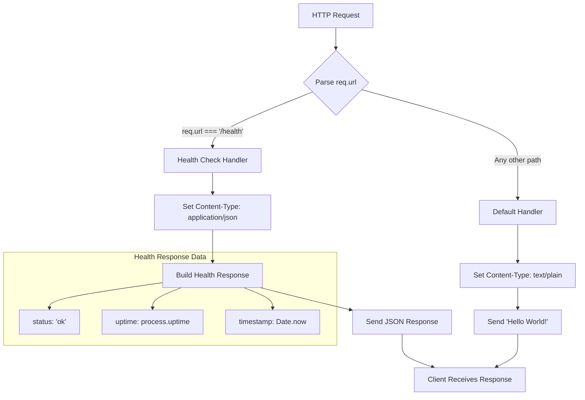
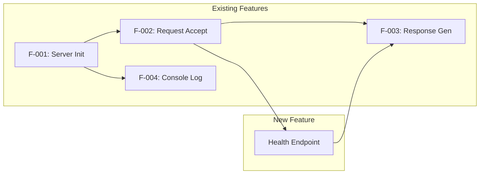

# Technical Specification

# 0. Agent Action Plan

## 0.1 Intent Clarification

### 0.1.1 Core Feature Objective

Based on the prompt, the Blitzy platform understands that the new feature requirement is to **add a health_check endpoint** to the existing Node.js HTTP server application. This endpoint will enable users and monitoring systems to easily verify that the service is running correctly.

**Feature Requirements with Enhanced Clarity:**

- **Primary Requirement:** Implement a dedicated `/health` HTTP endpoint that responds with health status information
- **Purpose:** Enable quick verification that the HTTP server is operational and responsive
- **Response Format:** Return appropriate HTTP status code (200 for healthy) with status information in the response body
- **Accessibility:** The endpoint should be accessible at the same host and port as the existing server (127.0.0.1:3000)

**Implicit Requirements Detected:**

- **URL Routing Logic:** The current server responds identically to all requests. Adding a health endpoint requires implementing basic URL path routing to distinguish between `/health` and other paths
- **Response Differentiation:** The health endpoint should return different content than the default "Hello World!" response
- **Backward Compatibility:** The existing root path (`/`) must continue to return "Hello World!" to maintain current functionality
- **Zero-Dependency Constraint:** Per the project's educational philosophy, the implementation must use only Node.js built-in modules without adding external npm packages
- **Content-Type Considerations:** Health check responses commonly use `application/json` format for machine-readable status information

**Feature Dependencies and Prerequisites:**

| Dependency | Description | Status |
|------------|-------------|--------|
| Node.js Runtime | Version >=14.0.0 required | ✅ Available |
| http Module | Node.js built-in module for HTTP server | ✅ Available |
| Request URL Parsing | Node.js url module for path extraction | ✅ Available |
| process Module | For server uptime information | ✅ Available |

### 0.1.2 Special Instructions and Constraints

**Architectural Requirements:**

- **Use Existing Service Pattern:** The implementation must follow the current synchronous request handler pattern established in `Hello_World_Node.js`
- **Follow Repository Conventions:** Maintain the CommonJS module system (`require()`) and ES6+ syntax (const, arrow functions, template literals)
- **Maintain Simplicity:** Keep the implementation minimal and educational, aligning with the project's core mission
- **Preserve Code Style:** Match existing code formatting and commenting patterns

**Technical Constraints:**

- No external npm packages may be added (maintains zero-dependency architecture)
- Server must continue binding to localhost only (127.0.0.1:3000) for security
- Implementation must remain within a single file to preserve educational clarity
- Response time must remain under 10ms per the existing performance requirements

**User Example:**

The user's request states: *"Could you please add a health_check endpoint to the project so that we can easily verify that the service is running correctly?"*

This indicates a straightforward operational need for service health verification capability.

### 0.1.3 Technical Interpretation

These feature requirements translate to the following technical implementation strategy:

**Implementation Strategy:**

- To **implement URL routing**, we will **modify** the request handler in `Hello_World_Node.js` to parse the incoming request URL and route to different response handlers based on the path
- To **create the health endpoint**, we will **add** conditional logic that checks if `req.url` equals `/health` and returns health status JSON
- To **maintain backward compatibility**, we will **preserve** the existing "Hello World!" response as the default for all non-health paths
- To **provide health status information**, we will **include** server uptime, status message, and timestamp in the JSON response using `process.uptime()` and `Date.now()`
- To **document the feature**, we will **update** README.md with information about the new `/health` endpoint

**Technical Actions Mapping:**

| Requirement | Technical Action | Component |
|-------------|-----------------|-----------|
| Add health endpoint | Implement `/health` route handler | Hello_World_Node.js |
| Return health status | Create JSON response with status, uptime, timestamp | Hello_World_Node.js |
| Maintain compatibility | Add conditional routing while preserving default behavior | Hello_World_Node.js |
| Document feature | Add health endpoint documentation section | README.md |
| Fix configuration | Correct entry point reference in package.json | package.json |


## 0.2 Repository Scope Discovery

### 0.2.1 Comprehensive File Analysis

**Current Repository Structure:**

The repository is a minimal, self-contained Node.js project with the following structure:

```
/
├── Hello_World_Node.js    # Main HTTP server implementation (17 lines)
├── README.md              # Project documentation
└── package.json           # npm package manifest
```

**Files Requiring Modification:**

| File Path | File Type | Modification Purpose | Lines Affected |
|-----------|-----------|---------------------|----------------|
| `Hello_World_Node.js` | JavaScript | Add URL routing and health endpoint handler | Lines 8-12 (request handler) |
| `README.md` | Markdown | Document new `/health` endpoint usage | New section addition |
| `package.json` | JSON | Fix entry point reference (currently incorrect) | Line 5 (`main`), Lines 7-8 (`scripts`) |

**Existing Source File Analysis:**

**Hello_World_Node.js** (Primary modification target):
```javascript
// Current request handler (lines 8-12) handles ALL requests identically
const server = http.createServer((req, res) => {
  res.statusCode = 200;
  res.setHeader('Content-Type', 'text/plain');
  res.end('Hello World!\n');
});
```

This handler requires modification to:
- Parse the incoming request URL
- Route `/health` requests to a health check response
- Maintain default "Hello World!" response for all other paths

**Configuration File Analysis:**

**package.json** - Contains configuration mismatch:
- `main` field references `server.js` but actual file is `Hello_World_Node.js`
- `scripts.start` references `node server.js` but actual file is `Hello_World_Node.js`
- `scripts.dev` references `node server.js` but actual file is `Hello_World_Node.js`

**Integration Point Discovery:**

| Integration Point | Current State | Required Change |
|-------------------|---------------|-----------------|
| HTTP Request Handler | Single static response | Multi-route conditional response |
| URL Parsing | Not implemented | Add `req.url` path checking |
| Response Content-Type | Always `text/plain` | `text/plain` for root, `application/json` for `/health` |
| Documentation | No endpoint documentation | Add health endpoint section |

### 0.2.2 Web Search Research Conducted

**Best Practices Research Findings:**

<cite index="4-17">"Here are some of the things we checked for: the response time of the server, the uptime of the server, the status code of the server (as long as it is 200, we are going to get an 'OK' message), and the timestamp of the server."</cite>

<cite index="8-15,8-16">"The response does not need to return any data, but status must be 200/OK. For humans, it may be useful to return a minimal response body, such as ok."</cite>

<cite index="1-2">"The process.uptime() method is an built in API of the process module which is used to get the number of seconds the Node.js process has been running."</cite>

**Research Summary:**

| Research Topic | Key Findings | Application to This Project |
|----------------|--------------|----------------------------|
| Health Check Response Format | JSON with status, uptime, timestamp | Use `application/json` Content-Type |
| Common Endpoint Naming | `/health`, `/healthz`, `/livez`, `/readyz` | Use `/health` for simplicity |
| Response Status Code | 200 for healthy state | Return 200 with health data |
| Uptime Tracking | Use `process.uptime()` built-in | No external dependencies needed |
| Best Practice | Keep health checks simple, avoid external dependencies | Aligns with zero-dependency philosophy |

### 0.2.3 New File Requirements

**No New Files Required:**

This feature addition does not require creating new files. All changes will be made to existing files:

| Change Type | File | Reason |
|-------------|------|--------|
| MODIFY | `Hello_World_Node.js` | Add routing logic and health endpoint handler |
| MODIFY | `README.md` | Document new health endpoint |
| MODIFY | `package.json` | Fix entry point references |

**Alternative Structure Considered but Rejected:**

Creating separate files (e.g., `routes/health.js`, `handlers/healthHandler.js`) was considered but rejected because:
- Contradicts the single-file educational simplicity mandate
- Adds unnecessary complexity for a simple feature
- Would require CommonJS module system understanding that exceeds the educational scope
- The current 17-line implementation can accommodate this feature while remaining under 30 lines

### 0.2.4 Test File Considerations

**Current Testing Status:**

Per Technical Specification Section 6.6.1.1, automated testing is explicitly out of scope for this educational project. The project uses manual browser-based verification.

**Verification Approach:**

| Verification Step | Method | Expected Result |
|-------------------|--------|-----------------|
| Health endpoint accessible | `curl http://127.0.0.1:3000/health` | JSON response with status, uptime, timestamp |
| Root path unchanged | `curl http://127.0.0.1:3000/` | "Hello World!\n" plain text response |
| Unknown paths handled | `curl http://127.0.0.1:3000/other` | "Hello World!\n" (default response) |
| HTTP status code | Check response headers | 200 OK for all routes |


## 0.3 Dependency Inventory

### 0.3.1 Private and Public Packages

**Current Dependency Status:**

The project maintains a **zero-dependency architecture** with no external npm packages. This feature addition will preserve this philosophy.

**Package Inventory Table:**

| Package Registry | Package Name | Version | Purpose | Status |
|------------------|--------------|---------|---------|--------|
| Node.js Built-in | `http` | N/A (bundled) | HTTP server creation | Currently used |
| Node.js Built-in | `process` | N/A (bundled) | Access uptime via `process.uptime()` | To be used (global) |
| npm | None | N/A | No external packages | Maintained |

**Node.js Runtime Requirement:**

| Requirement | Specified Version | Verified Location |
|-------------|-------------------|-------------------|
| Node.js Engine | >=14.0.0 | `package.json` line 19 |
| Current Environment | v20.19.6 | Runtime verification |

**Built-in Module Usage:**

```javascript
// Current usage (Hello_World_Node.js line 3)
const http = require('http');

// Additional built-in functionality to leverage
// process.uptime() - global, no require needed
// Date.now() - global, no require needed
// JSON.stringify() - global, no require needed
```

### 0.3.2 Dependency Updates

**No External Dependency Changes Required:**

This feature implementation requires **zero dependency additions or modifications**. All functionality is provided by Node.js built-in capabilities.

**Import Updates:**

| File | Current Imports | Required Changes |
|------|-----------------|------------------|
| `Hello_World_Node.js` | `const http = require('http');` | No changes needed |

The implementation will use:
- `http` module (already imported)
- `process.uptime()` (global, no import required)
- `Date` object (global, no import required)
- `JSON.stringify()` (global, no import required)

### 0.3.3 External Reference Updates

**package.json Configuration Corrections:**

The `package.json` file contains incorrect references that should be corrected as part of this feature addition:

| Field | Current Value | Corrected Value | Reason |
|-------|---------------|-----------------|--------|
| `main` | `"server.js"` | `"Hello_World_Node.js"` | Actual file name |
| `scripts.start` | `"node server.js"` | `"node Hello_World_Node.js"` | Actual file name |
| `scripts.dev` | `"node server.js"` | `"node Hello_World_Node.js"` | Actual file name |

**Corrected package.json Structure:**

```json
{
  "name": "hello-world-nodejs",
  "version": "1.0.0",
  "description": "A simple Hello World Node.js HTTP server application",
  "main": "Hello_World_Node.js",
  "scripts": {
    "start": "node Hello_World_Node.js",
    "dev": "node Hello_World_Node.js"
  }
}
```

### 0.3.4 Dependency Compatibility Matrix

**Node.js Version Compatibility:**

| Node.js Version | http Module | process.uptime() | JSON.stringify() | Compatibility |
|-----------------|-------------|------------------|------------------|---------------|
| 14.x (LTS) | ✅ Stable | ✅ Stable | ✅ Stable | ✅ Supported |
| 16.x (LTS) | ✅ Stable | ✅ Stable | ✅ Stable | ✅ Supported |
| 18.x (LTS) | ✅ Stable | ✅ Stable | ✅ Stable | ✅ Supported |
| 20.x (Current) | ✅ Stable | ✅ Stable | ✅ Stable | ✅ Supported |

**API Stability Assessment:**

All APIs used in this implementation have been stable since Node.js 0.x and are guaranteed to remain stable:

- `http.createServer()` - Stable API since Node.js inception
- `process.uptime()` - Returns seconds as a floating-point number (stable)
- `req.url` - IncomingMessage property, stable across all versions
- `JSON.stringify()` - ECMAScript standard, universally available


## 0.4 Integration Analysis

### 0.4.1 Existing Code Touchpoints

**Direct Modifications Required:**

| File | Location | Modification Type | Description |
|------|----------|-------------------|-------------|
| `Hello_World_Node.js` | Lines 8-12 | Expand request handler | Add URL routing logic and health endpoint response |
| `Hello_World_Node.js` | Line 10 | Conditional Content-Type | Set header based on route (`text/plain` or `application/json`) |
| `README.md` | New section | Addition | Document `/health` endpoint usage and response format |
| `package.json` | Lines 5, 7-8 | Correction | Fix entry point references from `server.js` to `Hello_World_Node.js` |

**Request Handler Integration Point:**

The primary integration point is the request handler callback function currently at lines 8-12:

```javascript
// BEFORE: Current implementation (single response)
const server = http.createServer((req, res) => {
  res.statusCode = 200;
  res.setHeader('Content-Type', 'text/plain');
  res.end('Hello World!\n');
});

// AFTER: With health check routing
const server = http.createServer((req, res) => {
  if (req.url === '/health') {
    // Health check response
  } else {
    // Default Hello World response
  }
});
```

### 0.4.2 Dependency Injections

**No Dependency Injection Required:**

The project does not use a dependency injection pattern. All components are tightly coupled within a single file, which is intentional for educational simplicity.

| Component | DI Status | Notes |
|-----------|-----------|-------|
| HTTP Server | None | Created directly via `http.createServer()` |
| Request Handler | Inline callback | Passed directly to `createServer()` |
| Configuration | Hardcoded constants | `hostname` and `port` defined at module level |

### 0.4.3 Database/Schema Updates

**Not Applicable:**

This project has no database connectivity. Per Technical Specification Section 1.3.2.1, database features are explicitly out of scope.

| Database Aspect | Status |
|-----------------|--------|
| Database connections | ❌ Not implemented |
| Schema changes | ❌ Not applicable |
| Migrations | ❌ Not applicable |
| Data persistence | ❌ Stateless operation |

### 0.4.4 API Endpoint Integration

**New Endpoint Registration:**

| Endpoint | HTTP Method | Path | Response Type | Description |
|----------|-------------|------|---------------|-------------|
| Health Check | GET | `/health` | `application/json` | Returns server health status |
| Hello World | GET (all methods) | `/` (and all other paths) | `text/plain` | Returns "Hello World!\n" |

**Endpoint Response Specifications:**

**`/health` Endpoint Response:**

```json
{
  "status": "ok",
  "uptime": 123.456,
  "timestamp": 1734567890123
}
```

| Field | Type | Description |
|-------|------|-------------|
| `status` | string | Always "ok" when server is responding |
| `uptime` | number | Server uptime in seconds (from `process.uptime()`) |
| `timestamp` | number | Current timestamp in milliseconds (from `Date.now()`) |

**Response Headers:**

| Endpoint | Content-Type | Status Code |
|----------|--------------|-------------|
| `/health` | `application/json` | 200 OK |
| All other paths | `text/plain` | 200 OK |

### 0.4.5 Console Logging Integration

**Existing Logging Behavior:**

The server currently logs a startup message (line 15):

```javascript
console.log(`Server running at http://${hostname}:${port}/`);
```

**No Additional Logging Required:**

Per the project's minimal philosophy, no additional logging will be added for health check requests. Request logging is explicitly out of scope per Technical Specification Section 5.1.2.

### 0.4.6 Integration Flow Diagram




## 0.5 Technical Implementation

### 0.5.1 File-by-File Execution Plan

**CRITICAL: Every file listed here MUST be modified:**

#### Group 1 - Core Feature Implementation

| Action | File | Purpose | Priority |
|--------|------|---------|----------|
| MODIFY | `Hello_World_Node.js` | Implement URL routing and `/health` endpoint handler | High |

**Hello_World_Node.js Modifications:**

- Add URL path checking using `req.url`
- Implement `/health` route with JSON response
- Maintain default "Hello World!" response for all other paths
- Set appropriate Content-Type headers based on route

**Implementation Pattern:**

```javascript
const server = http.createServer((req, res) => {
  if (req.url === '/health') {
    const healthData = {
      status: 'ok',
      uptime: process.uptime(),
      timestamp: Date.now()
    };
    res.statusCode = 200;
    res.setHeader('Content-Type', 'application/json');
    res.end(JSON.stringify(healthData));
  } else {
    res.statusCode = 200;
    res.setHeader('Content-Type', 'text/plain');
    res.end('Hello World!\n');
  }
});
```

#### Group 2 - Configuration Fixes

| Action | File | Purpose | Priority |
|--------|------|---------|----------|
| MODIFY | `package.json` | Correct entry point references | Medium |

**package.json Modifications:**

- Change `main` from `"server.js"` to `"Hello_World_Node.js"`
- Change `scripts.start` from `"node server.js"` to `"node Hello_World_Node.js"`
- Change `scripts.dev` from `"node server.js"` to `"node Hello_World_Node.js"`

#### Group 3 - Documentation Updates

| Action | File | Purpose | Priority |
|--------|------|---------|----------|
| MODIFY | `README.md` | Document new health endpoint | Medium |

**README.md Additions:**

- Add new section "## Health Check Endpoint"
- Document endpoint URL: `http://127.0.0.1:3000/health`
- Describe response format and fields
- Provide usage example with curl command

### 0.5.2 Implementation Approach per File

**Phase 1: Core Feature (Hello_World_Node.js)**

| Step | Action | Details |
|------|--------|---------|
| 1 | Add URL routing condition | Check `req.url === '/health'` |
| 2 | Create health response object | Include status, uptime, timestamp |
| 3 | Set JSON Content-Type | Use `application/json` for health route |
| 4 | Serialize and send response | Use `JSON.stringify()` |
| 5 | Preserve default behavior | Keep "Hello World!" for other routes |

**Phase 2: Configuration Fix (package.json)**

| Step | Action | Details |
|------|--------|---------|
| 1 | Update `main` field | Point to actual entry file |
| 2 | Update `start` script | Reference correct file name |
| 3 | Update `dev` script | Reference correct file name |

**Phase 3: Documentation (README.md)**

| Step | Action | Details |
|------|--------|---------|
| 1 | Add Health Check section | New markdown section |
| 2 | Document endpoint URL | Specify full URL path |
| 3 | Describe response format | Show JSON structure |
| 4 | Add curl example | Provide testing command |

### 0.5.3 Code Change Summary

**Hello_World_Node.js - Before (17 lines):**

```javascript
// Simple Hello World Node.js Application
const http = require('http');
const hostname = '127.0.0.1';
const port = 3000;
const server = http.createServer((req, res) => {
  res.statusCode = 200;
  res.setHeader('Content-Type', 'text/plain');
  res.end('Hello World!\n');
});
server.listen(port, hostname, () => {
  console.log(`Server running at http://${hostname}:${port}/`);
});
```

**Hello_World_Node.js - After (~28 lines):**

The modified file will include:
- Original module import and configuration
- Enhanced request handler with routing logic
- Health check endpoint implementation
- Preserved Hello World default response
- Unchanged server listen configuration

### 0.5.4 Implementation Constraints

| Constraint | Requirement | How Addressed |
|------------|-------------|---------------|
| Zero dependencies | No npm packages | Uses only Node.js built-ins |
| Single file | Educational simplicity | All logic in Hello_World_Node.js |
| Performance | <10ms response time | Simple synchronous operations |
| Backward compatibility | Root path unchanged | Default case preserves behavior |
| Security | Localhost binding | No changes to hostname/port |

### 0.5.5 Verification Commands

After implementation, verify with these commands:

```bash
# Start the server
node Hello_World_Node.js

#### Test health endpoint (new feature)
curl http://127.0.0.1:3000/health

#### Test root endpoint (backward compatibility)
curl http://127.0.0.1:3000/

#### Test npm scripts (configuration fix)
npm start
```

**Expected Outputs:**

| Command | Expected Response |
|---------|-------------------|
| `curl /health` | `{"status":"ok","uptime":X.XXX,"timestamp":XXXXXXXXXXXXX}` |
| `curl /` | `Hello World!` |
| `npm start` | Server starts without error |


## 0.6 Scope Boundaries

### 0.6.1 Exhaustively In Scope

**All feature source files:**

| File Pattern | Specific File | Modification Type |
|--------------|---------------|-------------------|
| `*.js` | `Hello_World_Node.js` | Add routing and health endpoint |

**All configuration files:**

| File Pattern | Specific File | Modification Type |
|--------------|---------------|-------------------|
| `package.json` | `package.json` | Fix entry point references |

**All documentation files:**

| File Pattern | Specific File | Modification Type |
|--------------|---------------|-------------------|
| `*.md` | `README.md` | Add health endpoint documentation |

**Complete In-Scope File Inventory:**

| File Path | Type | Changes Required | Line Count Impact |
|-----------|------|------------------|-------------------|
| `Hello_World_Node.js` | Source | Add health route handler | +11 lines (17→~28) |
| `package.json` | Config | Fix 3 field values | 3 line modifications |
| `README.md` | Documentation | Add new section | +20 lines |

**Specific Code Locations:**

| File | Lines | Change Description |
|------|-------|-------------------|
| `Hello_World_Node.js` | 8-12 | Replace simple handler with routing handler |
| `package.json` | 5 | Change `main` field |
| `package.json` | 7 | Change `scripts.start` value |
| `package.json` | 8 | Change `scripts.dev` value |
| `README.md` | End of file | Append new Health Check section |

### 0.6.2 Integration Points In Scope

| Integration Point | File | Details |
|-------------------|------|---------|
| HTTP Request Handler | `Hello_World_Node.js` | Modify callback function |
| URL Routing Logic | `Hello_World_Node.js` | Add conditional `req.url` check |
| Response Content-Type | `Hello_World_Node.js` | Set based on route |
| npm Script Execution | `package.json` | Fix file references |
| User Documentation | `README.md` | Document new endpoint |

### 0.6.3 Explicitly Out of Scope

**The following are NOT part of this feature addition:**

| Category | Item | Reason for Exclusion |
|----------|------|----------------------|
| **External Dependencies** | Adding npm packages (Express, etc.) | Violates zero-dependency philosophy |
| **Separate Files** | Creating routes/, handlers/ directories | Contradicts single-file simplicity |
| **Automated Testing** | Test file creation | Out of scope per Tech Spec Section 6.6.1.1 |
| **CI/CD Configuration** | GitHub Actions workflows | Not configured per project scope |
| **Advanced Routing** | Multiple endpoints beyond /health | Not requested |
| **Request Logging** | Logging health check requests | Out of scope per Tech Spec Section 5.1.2 |
| **Authentication** | Protecting health endpoint | Not applicable to educational project |
| **HTTPS/TLS** | SSL configuration | Out of scope per project design |
| **Environment Variables** | Configurable endpoints | Hardcoded values per project convention |
| **Database Health Checks** | DB connectivity verification | No database exists |
| **Dependency Health Checks** | External service verification | No external services |
| **Performance Monitoring** | Response time tracking | Beyond basic health check scope |
| **Graceful Shutdown** | SIGTERM handling | Not requested |

### 0.6.4 Boundary Decision Matrix

| Feature Aspect | In Scope | Out of Scope | Decision Rationale |
|----------------|----------|--------------|-------------------|
| Basic health endpoint | ✅ | | User requested |
| JSON response format | ✅ | | Best practice for health checks |
| Uptime information | ✅ | | Standard health check data |
| Timestamp information | ✅ | | Standard health check data |
| Memory usage reporting | | ❌ | Not requested, adds complexity |
| CPU usage reporting | | ❌ | Not requested, adds complexity |
| Liveness/Readiness split | | ❌ | Not needed for simple project |
| Configurable endpoint path | | ❌ | Hardcoded values per convention |
| Response caching | | ❌ | Not needed for health checks |
| Rate limiting | | ❌ | Not applicable |

### 0.6.5 Scope Validation Checklist

**Pre-Implementation Verification:**

- [x] All modified files identified and listed
- [x] No new external dependencies required
- [x] No new files need to be created
- [x] Changes preserve backward compatibility
- [x] Changes follow existing code patterns
- [x] Documentation updates planned
- [x] Configuration fixes identified

**Post-Implementation Verification:**

- [ ] Health endpoint returns valid JSON
- [ ] Root path returns "Hello World!"
- [ ] npm start command works correctly
- [ ] README accurately documents endpoint
- [ ] Code remains under 30 lines
- [ ] No external packages added to package.json


## 0.7 Special Instructions

### 0.7.1 Feature-Specific Requirements

**Patterns and Conventions to Follow:**

| Pattern | Description | Application |
|---------|-------------|-------------|
| CommonJS Modules | Use `require()` for imports | Already established in project |
| ES6+ Syntax | Use `const`, arrow functions, template literals | Match existing code style |
| Synchronous Operations | No async/await for simple operations | Keeps code educational |
| Hardcoded Configuration | Define values as module-level constants | Match `hostname` and `port` pattern |
| Single-File Architecture | All logic in one file | Preserve simplicity mandate |

**Code Style Requirements:**

| Aspect | Requirement | Example |
|--------|-------------|---------|
| Variable Declaration | Use `const` for immutable values | `const healthData = {...}` |
| Function Syntax | Use arrow functions | `(req, res) => {...}` |
| String Formatting | Use template literals where appropriate | Already used in startup log |
| Indentation | 2 spaces (match existing) | Consistent with current file |
| Comments | Minimal, match existing style | Single header comment |

### 0.7.2 Integration Requirements with Existing Features

**Backward Compatibility Requirements:**

| Existing Feature | Status | Verification |
|------------------|--------|--------------|
| F-001: Server Initialization | Unchanged | Server binds to 127.0.0.1:3000 |
| F-002: Request Acceptance | Enhanced | Now routes based on URL path |
| F-003: Response Generation | Enhanced | Different responses per route |
| F-004: Console Logging | Unchanged | Same startup message |

**Feature Interaction:**



### 0.7.3 Performance Considerations

| Metric | Requirement | Expected Value |
|--------|-------------|----------------|
| Response Time | <10ms | ~1ms (synchronous JSON) |
| Memory Impact | Minimal | No additional memory allocation patterns |
| CPU Impact | Negligible | Simple string comparison and object creation |
| Startup Time | Unchanged | <1 second |

**Performance Design Decisions:**

- Use simple string equality check (`===`) for URL matching, not regex
- Create health response object inline (no caching needed)
- Use synchronous `JSON.stringify()` (no async overhead)
- No additional error handling complexity (maintains simplicity)

### 0.7.4 Security Requirements

| Security Aspect | Status | Details |
|-----------------|--------|---------|
| Network Binding | Localhost only | 127.0.0.1 preserved (no public access) |
| Input Validation | Not needed | No user input processed |
| Authentication | Not needed | Educational project, no sensitive data |
| Rate Limiting | Not needed | Localhost-only access |
| CORS | Not configured | Same-origin requests only |

**Security Considerations for Health Endpoints:**

- Health endpoint does not expose sensitive system information
- Only returns operational status (ok), uptime, and timestamp
- No credentials, API keys, or internal paths exposed
- No request body parsing that could introduce vulnerabilities

### 0.7.5 User-Provided Directives Summary

**Original User Request:**

> "Could you please add a health_check endpoint to the project so that we can easily verify that the service is running correctly?"

**Extracted Requirements:**

| Directive | Interpretation | Implementation |
|-----------|---------------|----------------|
| "add a health_check endpoint" | Create `/health` route | URL routing with conditional response |
| "easily verify" | Simple, accessible endpoint | Standard GET request, JSON response |
| "service is running correctly" | Return health status | Status, uptime, and timestamp data |

### 0.7.6 Manual Verification Procedure

**After implementation, verify the feature using these steps:**

**Step 1: Start the Server**
```bash
node Hello_World_Node.js
```
Expected output: `Server running at http://127.0.0.1:3000/`

**Step 2: Test Health Endpoint**
```bash
curl http://127.0.0.1:3000/health
```
Expected output: JSON with status, uptime, and timestamp

**Step 3: Verify Backward Compatibility**
```bash
curl http://127.0.0.1:3000/
```
Expected output: `Hello World!`

**Step 4: Test npm Scripts**
```bash
npm start
```
Expected: Server starts without error

**Step 5: Verify Content-Types**
```bash
curl -I http://127.0.0.1:3000/health
curl -I http://127.0.0.1:3000/
```
Expected:
- `/health`: `Content-Type: application/json`
- `/`: `Content-Type: text/plain`

### 0.7.7 Implementation Summary Table

| Component | File | Change Type | Lines | Priority |
|-----------|------|-------------|-------|----------|
| Health Endpoint Handler | `Hello_World_Node.js` | Modify | 8-12 → 8-22 | High |
| URL Routing Logic | `Hello_World_Node.js` | Add | Within handler | High |
| Entry Point Fix | `package.json` | Correct | 5, 7, 8 | Medium |
| Feature Documentation | `README.md` | Add | New section | Medium |

**Total Files Modified:** 3
**Total New Files Created:** 0
**External Dependencies Added:** 0
**Estimated Line Count Change:** +25 lines across all files


