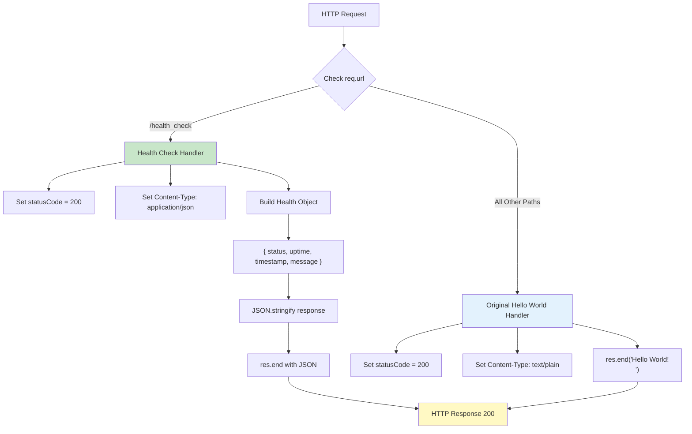
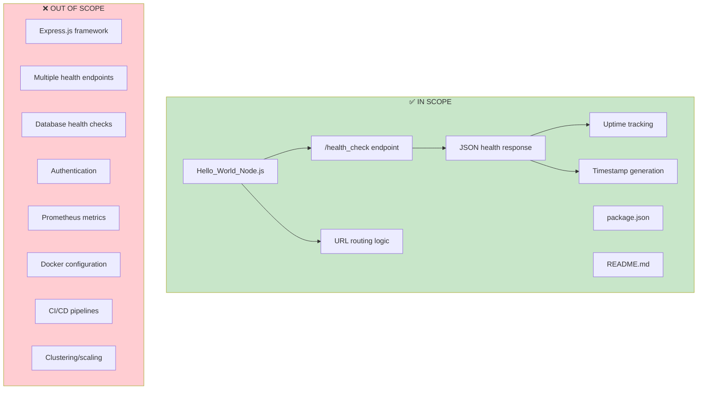

# Technical Specification

# 0. Agent Action Plan

## 0.1 Intent Clarification

Based on the prompt, the Blitzy platform understands that the new feature requirement is to **add a health_check endpoint** to an existing minimal Node.js HTTP server application, enabling operational verification that the service is running correctly.

### 0.1.1 Core Feature Objective

**Primary Requirement:** Implement a dedicated `/health_check` endpoint that returns a standardized health status response when queried, allowing operators, monitoring systems, and load balancers to verify service availability.

**Feature Requirements with Enhanced Clarity:**

| Requirement ID | Requirement | Technical Interpretation |
|----------------|-------------|-------------------------|
| REQ-001 | Add health_check endpoint | Create a new route `/health_check` that responds with health status information |
| REQ-002 | Service running verification | Return HTTP 200 status code when service is operational |
| REQ-003 | Easy verification | Provide human-readable and machine-parseable response format (JSON) |
| REQ-004 | Maintain existing functionality | Preserve the current "Hello World!" response for all other routes |

**Implicit Requirements Detected:**

- **URL Routing Capability:** The existing server responds identically to all requests; adding a specific endpoint requires implementing URL path-based routing logic
- **Response Differentiation:** The health_check endpoint must return JSON health status data, distinct from the existing plain text "Hello World!" response
- **Health Information:** Standard health check responses typically include uptime, timestamp, and status fields for operational monitoring
- **HTTP Method Support:** Health checks are conventionally GET requests that return lightweight responses

**Feature Dependencies and Prerequisites:**

- Node.js >=14.0.0 (already satisfied per package.json)
- Understanding of `req.url` property from Node.js http.IncomingMessage API
- JSON serialization for structured health check responses

### 0.1.2 Special Instructions and Constraints

**User-Specified Directives:**

- The endpoint name must be `/health_check` (with underscore) as specified by the user
- Purpose is "easily verify that the service is running correctly"
- No additional frameworks or dependencies specified—implementation should use only Node.js built-in modules to maintain project simplicity

**Architectural Requirements:**

- Follow existing code conventions: CommonJS modules, const declarations, arrow functions
- Maintain the minimalist educational nature of the project
- Preserve single-file architecture (no separate route handlers needed for this simple addition)
- Keep the existing loopback-only binding (127.0.0.1:3000)

**Web Search Research Conducted:**

| Research Topic | Key Findings |
|----------------|--------------|
| Node.js health check best practices | Health checks should return 200 status with JSON containing uptime, message, and timestamp |
| Standard health check response fields | `status`, `uptime` (via process.uptime()), `timestamp`, `message` |
| Kubernetes compatibility | HTTP GET endpoint returning 200 is the standard liveness/readiness pattern |
| Response time requirements | Health checks should respond quickly without heavy operations |

### 0.1.3 Technical Interpretation

These feature requirements translate to the following technical implementation strategy:

**To implement the health_check endpoint, we will:**

1. **Modify the request handler callback** in `Hello_World_Node.js` to examine the incoming request URL path using `req.url`
2. **Add conditional routing logic** to differentiate between `/health_check` requests and all other requests
3. **Create a health status response object** containing:
   - `status`: "ok" or "healthy" indicating service operational state
   - `uptime`: Server uptime in seconds via `process.uptime()`
   - `timestamp`: Current timestamp via `Date.now()`
   - `message`: Human-readable status message
4. **Return JSON response** with appropriate `Content-Type: application/json` header for the health_check endpoint
5. **Preserve existing behavior** for all other URL paths (return "Hello World!" as plain text)
6. **Update documentation** to reflect the new endpoint capability

**Technical Approach Summary:**

```
IF request.url === '/health_check'
    THEN return JSON health status (200 OK, application/json)
ELSE
    THEN return "Hello World!\n" (200 OK, text/plain)
```

**Alignment with Existing Architecture:**

The implementation integrates seamlessly with the existing Request Handler Component by adding minimal routing logic within the existing request callback, maintaining the project's educational simplicity while demonstrating URL-based request routing.

## 0.2 Repository Scope Discovery

### 0.2.1 Comprehensive File Analysis

**Current Repository Structure:**

The repository is a minimal Node.js project with only 3 files at the root level:

```
/
├── Hello_World_Node.js    (Main server implementation - MODIFY)
├── package.json           (NPM manifest - MODIFY)
├── README.md              (Documentation - MODIFY)
└── .git/                  (Git repository metadata - NO CHANGES)
```

**Existing Files to Modify:**

| File Path | Purpose | Modification Type | Scope of Changes |
|-----------|---------|-------------------|------------------|
| `Hello_World_Node.js` | Main HTTP server implementation | MODIFY | Add URL routing logic and health_check response handler |
| `package.json` | NPM package manifest | MODIFY | Update description and add test script for health check verification |
| `README.md` | Project documentation | MODIFY | Document new /health_check endpoint usage and response format |

**File-by-File Analysis:**

**1. Hello_World_Node.js (Lines 1-17) - PRIMARY MODIFICATION TARGET**

Current implementation characteristics:
- Single request handler callback processes ALL requests identically
- No URL path examination (`req.url` not accessed)
- Returns static "Hello World!\n" response
- Content-Type: text/plain for all responses

Required modifications:
- Line 8-12: Expand request handler to include URL path checking
- Add conditional logic: `if (req.url === '/health_check')`
- Add JSON response generation for health check endpoint
- Preserve existing behavior for non-health-check requests

**2. package.json (Lines 1-21) - SECONDARY MODIFICATION TARGET**

Current configuration:
- Entry point mismatch: `"main": "server.js"` but actual file is `Hello_World_Node.js`
- Scripts reference `server.js` which does not exist
- No test scripts defined

Required modifications:
- Fix entry point to reference correct file (`Hello_World_Node.js` or rename file to `server.js`)
- Add test script for health check verification
- Optionally update description to reflect health check capability

**3. README.md (Lines 1-54) - DOCUMENTATION UPDATE**

Current documentation:
- Describes basic Hello World functionality
- References `server.js` (mismatched with actual filename)
- No mention of health check endpoints

Required modifications:
- Add section documenting `/health_check` endpoint
- Document expected response format and fields
- Provide curl command examples for testing
- Fix filename references for consistency

### 0.2.2 Integration Point Discovery

**API Endpoints Affected:**

| Endpoint | Current Behavior | New Behavior |
|----------|------------------|--------------|
| `GET /health_check` | Returns "Hello World!\n" (text/plain) | Returns JSON health status (application/json) |
| `GET /` | Returns "Hello World!\n" | No change - preserved |
| `GET /*` (all other paths) | Returns "Hello World!\n" | No change - preserved |

**Request Handler Component Integration:**

The health_check endpoint integrates directly within the existing request handler callback at lines 8-12 of `Hello_World_Node.js`. The modification pattern:

```
Current Flow:  Request → Handler → "Hello World!" → Response
New Flow:      Request → URL Check → /health_check? → Health JSON
                                   → Other paths  → "Hello World!"
```

**No Database/Schema Updates Required:**

The health_check feature is stateless and requires no data persistence layer modifications.

**No Middleware/Interceptor Changes:**

The minimal architecture has no middleware pipeline; routing logic is embedded directly in the request handler.

### 0.2.3 New File Requirements

**No New Source Files Required**

Given the project's minimalist architecture and educational purpose, the health_check functionality will be implemented inline within the existing `Hello_World_Node.js` file. Creating separate route handler files would violate the project's single-file simplicity principle.

**Optional New Files (Recommended for Completeness):**

| File Path | Purpose | Priority |
|-----------|---------|----------|
| `tests/health_check.test.js` | Automated test for health_check endpoint | OPTIONAL |
| `.github/workflows/test.yml` | CI workflow for automated testing | OPTIONAL |

These optional files would enhance the project but are not strictly required for the core feature implementation.

### 0.2.4 File Pattern Summary

**Files Requiring Modification:**
- `Hello_World_Node.js` - Core feature implementation
- `package.json` - Manifest updates
- `README.md` - Documentation updates

**Files NOT Affected:**
- `.git/**/*` - Repository metadata
- `node_modules/**/*` - Dependencies (none exist in this zero-dependency project)

**Search Patterns Used for Discovery:**
- `*.js` - JavaScript source files (found: `Hello_World_Node.js`)
- `package.json` - NPM manifest (found: root level)
- `*.md` - Documentation files (found: `README.md`)
- `**/*.config.*` - Configuration files (none found)
- `Dockerfile*` - Container definitions (none found)
- `.github/workflows/*.yml` - CI/CD pipelines (none found)

## 0.3 Dependency Inventory

### 0.3.1 Private and Public Packages

**Current Dependency Status:**

The project operates with **zero external dependencies**. All functionality is implemented using only Node.js built-in modules.

| Package Registry | Package Name | Version | Purpose | Status |
|------------------|--------------|---------|---------|--------|
| Node.js Built-in | `http` | (bundled with Node.js) | HTTP server creation and request handling | IN USE |
| Node.js Built-in | `process` | (bundled with Node.js) | Access to process.uptime() for health metrics | TO BE USED |

**No NPM Dependencies:**

```json
// From package.json - NO dependencies block exists
{
  "name": "hello-world-nodejs",
  "version": "1.0.0"
  // No "dependencies" or "devDependencies" fields
}
```

**Runtime Requirements:**

| Requirement | Specified Version | Purpose |
|-------------|-------------------|---------|
| Node.js | >=14.0.0 | JavaScript runtime with http module |

### 0.3.2 Dependency Updates

**No New Dependencies Required**

The health_check endpoint implementation requires only Node.js built-in capabilities:

- `http` module (already imported): HTTP server functionality
- `process` global object (always available): Access to `process.uptime()` method
- `JSON` global object (always available): JSON serialization via `JSON.stringify()`
- `Date` global object (always available): Timestamp generation via `Date.now()`

**Rationale for Zero-Dependency Approach:**

- Maintains project's educational simplicity mandate
- Avoids package.json complexity and npm install requirements
- Eliminates supply chain security concerns
- Ensures maximum compatibility across Node.js versions
- Preserves instant-start developer experience (no setup required)

### 0.3.3 Import Updates

**Current Import Statement (Line 3):**

```javascript
const http = require('http');
```

**No Additional Imports Needed:**

The `process` and `JSON` objects are global in Node.js and require no import statement. The health_check implementation will use:

- `process.uptime()` - Returns server uptime in seconds
- `JSON.stringify()` - Serializes health status object to JSON string
- `Date.now()` - Returns current Unix timestamp in milliseconds

### 0.3.4 External Reference Updates

**package.json Updates Required:**

| Field | Current Value | New Value | Reason |
|-------|---------------|-----------|--------|
| `main` | `"server.js"` | `"Hello_World_Node.js"` | Fix entry point mismatch |
| `scripts.start` | `"node server.js"` | `"node Hello_World_Node.js"` | Fix script reference |
| `scripts.dev` | `"node server.js"` | `"node Hello_World_Node.js"` | Fix script reference |
| `scripts.test` | (none) | `"node -e \"require('http').get('http://127.0.0.1:3000/health_check')\""` | Add health check test |
| `description` | `"A simple Hello World..."` | Updated to mention health check | Document new capability |

**README.md Updates Required:**

| Section | Update Type | Content |
|---------|-------------|---------|
| Installation | MODIFY | Fix file name references |
| Usage | MODIFY | Fix command examples to use correct filename |
| NEW: Health Check | ADD | Document `/health_check` endpoint, response format, and usage examples |
| Configuration | MODIFY | Document that health check uses same hostname/port |

### 0.3.5 Dependency Version Verification

**Node.js Version Compatibility:**

All APIs used in the health_check implementation are stable and available in Node.js 14.0.0+:

| API | Introduced In | Status in Node.js 14+ |
|-----|---------------|----------------------|
| `http.createServer()` | Node.js 0.1.0 | Stable |
| `process.uptime()` | Node.js 0.5.0 | Stable |
| `JSON.stringify()` | V8 Engine (all versions) | Stable |
| `Date.now()` | ES5 (all versions) | Stable |
| `res.setHeader()` | Node.js 0.1.0 | Stable |
| `res.end()` | Node.js 0.1.0 | Stable |
| `req.url` | Node.js 0.1.0 | Stable |

**No version constraints or compatibility issues identified.**

## 0.4 Integration Analysis

### 0.4.1 Existing Code Touchpoints

**Direct Modifications Required:**

| File | Location | Modification Description |
|------|----------|-------------------------|
| `Hello_World_Node.js` | Lines 8-12 | Expand request handler callback to include URL path routing and health_check response generation |
| `Hello_World_Node.js` | Line 10 | Conditionally set Content-Type header based on route (application/json for health_check, text/plain for others) |
| `Hello_World_Node.js` | Line 11 | Conditionally generate response body based on route (JSON health status or "Hello World!") |

**Detailed Code Integration Map:**

```
Hello_World_Node.js - Current Structure:
┌─────────────────────────────────────────────────────────────┐
│ Line 1:  // Simple Hello World Node.js Application         │
│ Line 2:  (blank)                                            │
│ Line 3:  const http = require('http');                      │ ← NO CHANGE
│ Line 4:  (blank)                                            │
│ Line 5:  const hostname = '127.0.0.1';                      │ ← NO CHANGE
│ Line 6:  const port = 3000;                                 │ ← NO CHANGE
│ Line 7:  (blank)                                            │
│ Line 8:  const server = http.createServer((req, res) => {   │ ← MODIFY: Expand handler
│ Line 9:    res.statusCode = 200;                            │ ← MODIFY: Keep for both routes
│ Line 10:   res.setHeader('Content-Type', 'text/plain');     │ ← MODIFY: Conditional header
│ Line 11:   res.end('Hello World!\n');                       │ ← MODIFY: Conditional response
│ Line 12: });                                                │ ← MODIFY: Expand before close
│ Lines 14-16: server.listen(...)                             │ ← NO CHANGE
└─────────────────────────────────────────────────────────────┘
```

### 0.4.2 Integration Architecture

**Request Flow Integration:**



### 0.4.3 Component Interaction Points

**Server Initialization Module (No Changes):**

The server initialization remains unchanged—http module import, configuration constants, server creation, and port binding are unaffected.

**Request Handler Component (Modified):**

| Aspect | Current Behavior | New Behavior |
|--------|------------------|--------------|
| URL Examination | `req.url` not accessed | `req.url` checked for "/health_check" |
| Response Content-Type | Always "text/plain" | Conditional: "application/json" or "text/plain" |
| Response Body | Always "Hello World!\n" | Conditional: JSON health object or "Hello World!\n" |
| Status Code | Always 200 | Always 200 (no change) |

**Console Logger Component (No Changes):**

The startup message and console logging remain unchanged.

### 0.4.4 Data Flow Analysis

**Health Check Response Data Structure:**

```javascript
{
  status: "healthy",           // String: Service operational status
  uptime: process.uptime(),    // Number: Seconds since process started
  timestamp: Date.now(),       // Number: Unix timestamp in milliseconds
  message: "Service is running correctly"  // String: Human-readable status
}
```

**Data Sources:**

| Field | Data Source | API Call | Type |
|-------|-------------|----------|------|
| `status` | Static string constant | N/A | String |
| `uptime` | Node.js process module | `process.uptime()` | Number (seconds) |
| `timestamp` | JavaScript Date object | `Date.now()` | Number (ms since epoch) |
| `message` | Static string constant | N/A | String |

### 0.4.5 Backward Compatibility Analysis

**Preserved Behaviors:**

| Behavior | Verification |
|----------|--------------|
| Root path (/) returns "Hello World!" | URL check only matches exact "/health_check" |
| Any other path returns "Hello World!" | Default case falls through to original behavior |
| HTTP 200 status code | All responses continue to return 200 |
| Server binds to 127.0.0.1:3000 | Server configuration unchanged |
| Console startup message | Logging logic unchanged |

**No Breaking Changes:**

Existing clients, scripts, or monitoring tools that access the server at any path other than `/health_check` will receive identical responses to the current implementation.

### 0.4.6 Error Handling Considerations

**Current Error Handling:**

The existing implementation has no explicit error handling (documented as out-of-scope in tech spec Section 1.3.2).

**Health Check Error Handling:**

For consistency with the minimal architecture, the health_check endpoint will:
- Return 200 OK if the server is running and responding (implicit liveness)
- Not implement sophisticated health checks (database connectivity, external service availability)
- Not implement readiness vs liveness probe differentiation

This aligns with the documented scope: the health_check verifies "the service is running correctly" without production-grade health check complexity.

## 0.5 Technical Implementation

### 0.5.1 File-by-File Execution Plan

**CRITICAL: Every file listed below MUST be created or modified as specified.**

#### Group 1 - Core Feature Files

| Action | File Path | Implementation Details |
|--------|-----------|----------------------|
| **MODIFY** | `Hello_World_Node.js` | Add URL routing logic and health_check response handler within request callback |

**Hello_World_Node.js Modification Specification:**

The request handler callback (lines 8-12) must be expanded to:
1. Check if `req.url === '/health_check'`
2. For health_check requests: return JSON with health status
3. For all other requests: return original "Hello World!" response

**Target Implementation Structure:**

```javascript
const server = http.createServer((req, res) => {
  if (req.url === '/health_check') {
    // Health check endpoint
    const healthData = { /* health fields */ };
    res.setHeader('Content-Type', 'application/json');
    res.end(JSON.stringify(healthData));
  } else {
    // Original behavior
    res.setHeader('Content-Type', 'text/plain');
    res.end('Hello World!\n');
  }
  res.statusCode = 200;
});
```

#### Group 2 - Configuration and Manifest Files

| Action | File Path | Implementation Details |
|--------|-----------|----------------------|
| **MODIFY** | `package.json` | Fix entry point mismatch, update scripts, add test command |

**package.json Modification Specification:**

Update the following fields:

| Field | Change |
|-------|--------|
| `main` | Change from `"server.js"` to `"Hello_World_Node.js"` |
| `scripts.start` | Change from `"node server.js"` to `"node Hello_World_Node.js"` |
| `scripts.dev` | Change from `"node server.js"` to `"node Hello_World_Node.js"` |
| `scripts.test` | Add `"echo 'Run: curl http://127.0.0.1:3000/health_check'"` |
| `keywords` | Add `"health-check"` to keywords array |

#### Group 3 - Documentation Files

| Action | File Path | Implementation Details |
|--------|-----------|----------------------|
| **MODIFY** | `README.md` | Document health_check endpoint, fix filename references |

**README.md Modification Specification:**

Add new section after "How It Works":

| Section | Content |
|---------|---------|
| Health Check Endpoint | Document `/health_check` route purpose |
| Health Check Response | Document JSON response format and fields |
| Testing Health Check | Provide curl command examples |

Fix existing content:
- Replace all references to `server.js` with `Hello_World_Node.js`
- Update npm scripts documentation if referenced

### 0.5.2 Implementation Approach per File

**Phase 1: Core Feature Implementation**

**File: Hello_World_Node.js**

| Step | Action | Details |
|------|--------|---------|
| 1 | Locate request handler | Lines 8-12, the `http.createServer()` callback |
| 2 | Add URL path check | Insert `if (req.url === '/health_check')` conditional |
| 3 | Implement health response | Create health data object with status, uptime, timestamp, message |
| 4 | Set JSON content type | Use `res.setHeader('Content-Type', 'application/json')` |
| 5 | Serialize response | Use `JSON.stringify()` to convert health object to JSON string |
| 6 | Preserve original behavior | Move existing response logic to `else` block |
| 7 | Maintain status code | Keep `res.statusCode = 200` for both paths |

**Phase 2: Manifest Updates**

**File: package.json**

| Step | Action | Details |
|------|--------|---------|
| 1 | Fix main entry point | Update `"main"` field to match actual filename |
| 2 | Fix start script | Update `scripts.start` to use correct filename |
| 3 | Fix dev script | Update `scripts.dev` to use correct filename |
| 4 | Add test guidance | Add `scripts.test` with health check testing instructions |
| 5 | Update keywords | Add "health-check" to keywords array |

**Phase 3: Documentation Updates**

**File: README.md**

| Step | Action | Details |
|------|--------|---------|
| 1 | Fix filename references | Replace all `server.js` with `Hello_World_Node.js` |
| 2 | Add Health Check section | Insert new section documenting the endpoint |
| 3 | Document response format | Show example JSON response with field descriptions |
| 4 | Add testing instructions | Provide curl command for health check verification |

### 0.5.3 Health Check Response Specification

**Response Fields:**

| Field | Type | Description | Example Value |
|-------|------|-------------|---------------|
| `status` | String | Service operational status indicator | `"healthy"` |
| `uptime` | Number | Server process uptime in seconds | `123.456` |
| `timestamp` | Number | Current Unix timestamp (milliseconds) | `1703961600000` |
| `message` | String | Human-readable status description | `"Service is running correctly"` |

**Example Response:**

```json
{
  "status": "healthy",
  "uptime": 3661.234,
  "timestamp": 1703961600000,
  "message": "Service is running correctly"
}
```

**HTTP Response Headers:**

| Header | Value |
|--------|-------|
| Status Code | 200 OK |
| Content-Type | application/json |

### 0.5.4 Implementation Validation Criteria

**Functional Validation:**

| Test Case | Expected Result |
|-----------|-----------------|
| `GET /health_check` | Returns 200 with JSON health status |
| `GET /` | Returns 200 with "Hello World!\n" (unchanged) |
| `GET /any/other/path` | Returns 200 with "Hello World!\n" (unchanged) |
| Health check `uptime` field | Contains numeric value > 0 |
| Health check `timestamp` field | Contains current Unix timestamp |
| Health check `status` field | Contains "healthy" string |

**Validation Commands:**

```bash
# Test health check endpoint
curl -i http://127.0.0.1:3000/health_check

#### Verify JSON response format
curl -s http://127.0.0.1:3000/health_check | jq .

#### Test original functionality preserved
curl http://127.0.0.1:3000/
```

### 0.5.5 Code Quality Standards

**Style Consistency:**

- Use `const` for all variable declarations (matching existing pattern)
- Use arrow function syntax (matching existing request handler)
- Use template literals for string interpolation if needed
- Maintain 2-space indentation (matching existing file)
- Include comment header for health check section

**Performance Considerations:**

- Health check response generation is synchronous (no async operations)
- No file I/O or external service calls
- Response time target: <10ms
- Memory allocation: Minimal (small JSON object per request)

## 0.6 Scope Boundaries

### 0.6.1 Exhaustively In Scope

**All Files Requiring Modification:**

| Category | File Pattern | Specific Files | Modification Type |
|----------|--------------|----------------|-------------------|
| Core Source | `*.js` | `Hello_World_Node.js` | MODIFY - Add health_check routing |
| Package Manifest | `package.json` | `package.json` | MODIFY - Fix entry points, add scripts |
| Documentation | `*.md` | `README.md` | MODIFY - Document health_check endpoint |

**Detailed Scope by File:**

**Hello_World_Node.js - FULL SCOPE:**

| Line Range | Current Content | Modification |
|------------|-----------------|--------------|
| Lines 8-12 | Request handler callback | Expand with URL routing and health_check response |
| Line 8 | `const server = http.createServer((req, res) => {` | No change to signature |
| Line 9 | `res.statusCode = 200;` | Move inside both branches or keep common |
| Line 10 | `res.setHeader('Content-Type', 'text/plain');` | Make conditional based on route |
| Line 11 | `res.end('Hello World!\n');` | Move to else block, add health_check response |

**package.json - FULL SCOPE:**

| Field | Scope |
|-------|-------|
| `main` | IN SCOPE - Fix to `"Hello_World_Node.js"` |
| `scripts.start` | IN SCOPE - Fix to `"node Hello_World_Node.js"` |
| `scripts.dev` | IN SCOPE - Fix to `"node Hello_World_Node.js"` |
| `scripts.test` | IN SCOPE - Add health check test command |
| `keywords` | IN SCOPE - Add "health-check" |
| `name` | OUT OF SCOPE - No change needed |
| `version` | OUT OF SCOPE - No change needed |
| `description` | OPTIONAL - May update to mention health check |
| `author` | OUT OF SCOPE - No change needed |
| `license` | OUT OF SCOPE - No change needed |
| `engines` | OUT OF SCOPE - No change needed |

**README.md - FULL SCOPE:**

| Section | Scope |
|---------|-------|
| Title and description | OUT OF SCOPE - No change |
| Prerequisites | OUT OF SCOPE - No change |
| Installation | IN SCOPE - Fix filename references |
| Usage | IN SCOPE - Fix filename references |
| Stopping the Server | OUT OF SCOPE - No change |
| How It Works | IN SCOPE - Minor update to mention routing |
| **NEW: Health Check** | IN SCOPE - Add entire new section |
| Configuration | IN SCOPE - Document health_check uses same config |
| License | OUT OF SCOPE - No change |

### 0.6.2 Integration Points In Scope

**Request Handler Integration Points:**

| Integration Point | Location | Scope |
|-------------------|----------|-------|
| URL path extraction | `req.url` property | IN SCOPE - Must access |
| Health check route matching | `if (req.url === '/health_check')` | IN SCOPE - Must implement |
| JSON content type header | `res.setHeader('Content-Type', 'application/json')` | IN SCOPE - Must set |
| Health data serialization | `JSON.stringify(healthData)` | IN SCOPE - Must implement |
| Process uptime access | `process.uptime()` | IN SCOPE - Must call |
| Timestamp generation | `Date.now()` | IN SCOPE - Must call |

### 0.6.3 Explicitly Out of Scope

**Excluded Features and Capabilities:**

| Category | Excluded Item | Rationale |
|----------|---------------|-----------|
| **Advanced Routing** | Express.js or routing framework | Maintains zero-dependency architecture |
| **Multiple Health Endpoints** | `/livez`, `/readyz`, `/healthz` | User specified single `/health_check` endpoint |
| **Deep Health Checks** | Database connectivity checks | No database exists in this project |
| **Metrics Endpoints** | Prometheus `/metrics` | Beyond requested scope |
| **Authentication** | Health check auth/token | Not specified in requirements |
| **Rate Limiting** | Request throttling on health endpoint | Production feature not in scope |
| **Caching** | Response caching headers | Beyond minimal implementation |
| **Error Responses** | 503 Service Unavailable responses | Server either runs or doesn't start |
| **CORS Headers** | Cross-origin support | Not specified in requirements |
| **HTTP Methods** | POST, PUT, DELETE health checks | Standard health checks use GET only |

**Files Explicitly NOT Modified:**

| File/Pattern | Reason for Exclusion |
|--------------|---------------------|
| `.git/**/*` | Repository metadata - never modified |
| `node_modules/**/*` | Dependencies directory (doesn't exist) |
| `*.log` | Log files (don't exist) |
| `*.lock` | Lock files (don't exist) |
| `.env*` | Environment files (don't exist) |
| `Dockerfile*` | Container definitions (don't exist) |
| `.github/**/*` | CI/CD workflows (don't exist) |

**Unrelated Functionality NOT Addressed:**

- Performance optimization of existing Hello World response
- Clustering or horizontal scaling
- HTTPS/TLS implementation
- Graceful shutdown handling
- Process management integration
- Logging framework integration
- Container orchestration configuration

### 0.6.4 Scope Boundary Diagram



### 0.6.5 Change Impact Summary

**Total Files Affected: 3**

| File | Lines Modified | Impact Level | Risk |
|------|----------------|--------------|------|
| `Hello_World_Node.js` | ~10 lines (expand lines 8-12) | HIGH - Core functionality | LOW - Additive change |
| `package.json` | ~5 fields | MEDIUM - Manifest corrections | LOW - Configuration only |
| `README.md` | ~20-30 lines | LOW - Documentation | NONE - No runtime impact |

**Backward Compatibility: PRESERVED**

All existing functionality remains unchanged. The health_check endpoint is purely additive.

## 0.7 Special Instructions for Feature Addition

### 0.7.1 Feature-Specific Requirements

**User-Emphasized Requirements:**

| Requirement | User Statement | Implementation Impact |
|-------------|----------------|----------------------|
| Endpoint naming | "health_check" (with underscore) | Route must be `/health_check`, not `/health-check` or `/healthcheck` |
| Verification purpose | "easily verify that the service is running correctly" | Response must clearly indicate operational status |
| Simplicity | Implied by project context | No external dependencies, inline implementation |

**Pattern and Convention Adherence:**

| Pattern | Existing Convention | Must Follow |
|---------|---------------------|-------------|
| Module system | CommonJS (`require()`) | Yes - No ES Modules |
| Variable declarations | `const` for all | Yes - No `let` or `var` |
| Function style | Arrow functions | Yes - `(req, res) => {}` |
| Indentation | 2 spaces | Yes - Match existing file |
| Semicolons | Yes (explicit) | Yes - Include semicolons |
| String quotes | Single quotes | Yes - Use `'string'` |

### 0.7.2 Integration Requirements with Existing Features

**Existing Feature Preservation:**

| Feature | Current Behavior | Must Preserve |
|---------|------------------|---------------|
| Root path response | "Hello World!\n" | YES - Unchanged |
| Catch-all response | "Hello World!\n" for any path | YES - All non-health_check paths |
| Status code | 200 OK | YES - Both routes return 200 |
| Server binding | 127.0.0.1:3000 | YES - No configuration changes |
| Startup message | "Server running at..." | YES - Unchanged |

**Integration Constraints:**

- Health check logic MUST be implemented within the existing request handler callback
- No separate route handler files or modules
- No modification to server initialization or port binding
- No modification to startup logging

### 0.7.3 Performance and Scalability Considerations

**Health Check Performance Requirements:**

| Metric | Target | Rationale |
|--------|--------|-----------|
| Response time | <10ms | Health checks must be lightweight |
| Memory allocation | Minimal | Small JSON object per request |
| CPU usage | Negligible | No computation beyond object creation |
| Blocking operations | None | Synchronous execution only |

**Scalability Alignment:**

The health_check implementation maintains the existing single-process, single-threaded architecture. No scaling optimizations are introduced or required.

### 0.7.4 Security Requirements

**Security Considerations for Health Check:**

| Aspect | Requirement | Implementation |
|--------|-------------|----------------|
| Information disclosure | Minimal | Only expose status, uptime, timestamp, message |
| Sensitive data | None | No environment variables, no file paths, no internal state |
| Authentication | None required | Health checks typically unauthenticated for load balancer access |
| Rate limiting | Not implemented | Out of scope per project constraints |

**Data Exposed in Health Response:**

| Field | Sensitivity | Acceptable |
|-------|-------------|------------|
| `status` | None | ✅ Generic status indicator |
| `uptime` | Low | ✅ Common in health checks |
| `timestamp` | None | ✅ Current time only |
| `message` | None | ✅ Generic message |

**NOT Exposed:**

- Node.js version
- Operating system details
- Environment variables
- File system paths
- Memory usage
- Internal configuration

### 0.7.5 Testing and Verification Instructions

**Manual Testing Procedure:**

```bash
# Step 1: Start the server
node Hello_World_Node.js

#### Step 2: In a new terminal, test health_check endpoint
curl -i http://127.0.0.1:3000/health_check

#### Expected output:
## HTTP/1.1 200 OK
#### Content-Type: application/json
##### ...
## {"status":"healthy","uptime":X.XXX,"timestamp":XXXXX,"message":"Service is running correctly"}

#### Step 3: Verify original functionality preserved
curl http://127.0.0.1:3000/
#### Expected: Hello World!

#### Step 4: Verify other paths still return Hello World
curl http://127.0.0.1:3000/any/random/path
#### Expected: Hello World!
```

**Verification Checklist:**

- [ ] Server starts without errors
- [ ] `/health_check` returns HTTP 200
- [ ] `/health_check` returns Content-Type: application/json
- [ ] `/health_check` response contains `status` field
- [ ] `/health_check` response contains `uptime` field with number value
- [ ] `/health_check` response contains `timestamp` field with number value
- [ ] `/health_check` response contains `message` field
- [ ] Root path `/` returns "Hello World!"
- [ ] Other paths return "Hello World!"
- [ ] Startup message displays correctly

### 0.7.6 Implementation Order

**Recommended Execution Sequence:**

| Order | File | Action | Dependency |
|-------|------|--------|------------|
| 1 | `Hello_World_Node.js` | Implement health_check endpoint | None |
| 2 | `package.json` | Fix entry points and scripts | After step 1 (for testing) |
| 3 | `README.md` | Document new endpoint | After step 1 (accurate documentation) |

**Rationale:**

1. Core implementation first ensures functionality before documentation
2. Package.json fixes enable proper `npm start` testing
3. Documentation written last to accurately reflect implemented behavior

### 0.7.7 Rollback Considerations

**Reversion Strategy:**

If the health_check feature needs to be removed:

| File | Reversion Action |
|------|------------------|
| `Hello_World_Node.js` | Remove URL routing conditional, restore simple handler |
| `package.json` | Remove test script, optionally keep entry point fixes |
| `README.md` | Remove Health Check section |

**Feature Toggle:**

Not implemented. The health_check endpoint is always available when the server is running. A feature toggle would add unnecessary complexity to this minimal educational project.

