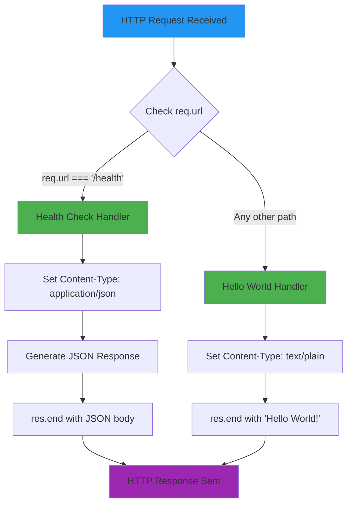
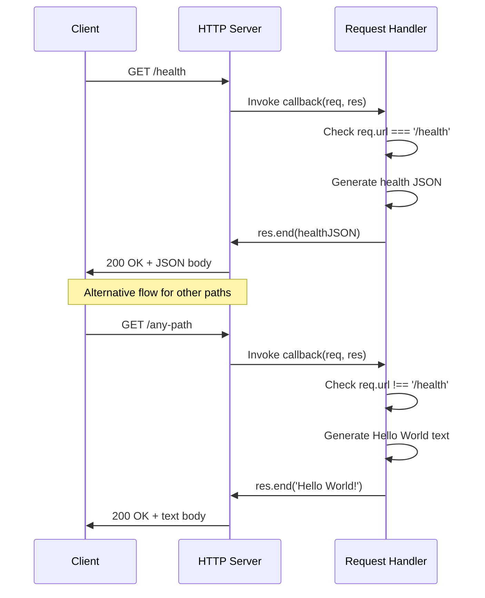

# Technical Specification

# 0. Agent Action Plan

## 0.1 Intent Clarification

### 0.1.1 Core Feature Objective

Based on the prompt, the Blitzy platform understands that the new feature requirement is to **add a health_check endpoint to the existing Node.js HTTP server** that enables easy verification that the service is running correctly.

**Primary Requirements:**

- **Health Check Endpoint Creation:** Implement a dedicated HTTP endpoint (e.g., `/health` or `/health_check`) that responds with service health status
- **Service Verification Capability:** Provide a mechanism for external monitoring tools, load balancers, and operators to verify the service is operational
- **Health Status Response:** Return appropriate HTTP status codes (200 OK for healthy) and a structured response body indicating service status

**Implicit Requirements Detected:**

- **Routing Logic Implementation:** The current server responds identically to all requests on all paths; routing logic must be added to differentiate between the health check endpoint and the existing "Hello World" response
- **JSON Response Format:** Health check endpoints typically return JSON with status information for machine-readable monitoring
- **Response Content Enhancement:** Include useful metadata such as service name, status, and timestamp for diagnostic purposes
- **Maintain Backward Compatibility:** The existing "Hello World!" response at the root path and other paths must continue to function as before

**Feature Dependencies and Prerequisites:**

| Dependency | Status | Notes |
|------------|--------|-------|
| Node.js >=14.0.0 | ✅ Met | Current environment has v20.19.6 |
| Built-in `http` module | ✅ Available | No new dependencies required |
| URL parsing capability | ✅ Available | Built-in `url` module available in Node.js |
| Existing server infrastructure | ✅ Exists | Hello_World_Node.js provides the base server |

### 0.1.2 Special Instructions and Constraints

**Critical Directives:**

- **Zero External Dependencies:** Maintain the project's zero-dependency architecture; implement using only Node.js built-in modules
- **Educational Simplicity:** Preserve the minimal, educational nature of the codebase while adding the new feature
- **CommonJS Compatibility:** Continue using `require()` syntax consistent with existing code style
- **Localhost Binding:** Maintain the localhost-only (127.0.0.1) binding for security

**Architectural Requirements:**

- Follow the existing single-file implementation pattern
- Use the existing request handler callback structure
- Implement URL-based routing within the existing server framework
- Maintain synchronous response pattern for consistency

**User Example:** The user's request states: *"Could you please add a health_check endpoint to the project so that we can easily verify that the service is running correctly?"*

**Web Search Research Requirements:**

| Research Topic | Status | Finding |
|----------------|--------|---------|
| Health check endpoint best practices | ✅ Completed | <cite index="5-2,5-3">Consistent naming recommended across micro-services; /readyz and /livez are common choices for the endpoints for the readiness and liveness probes</cite> |
| Node.js health check implementation | ✅ Completed | <cite index="7-13,7-14,7-15">Don't recommend the use of a module to add health checks; best to stick with a minimal implementation for most cases. The tradeoff between code needed versus costs of adding a new dependency leads to recommending adding the code directly</cite> |
| Response format standards | ✅ Completed | <cite index="1-9">Return a status code of 200 OK and a JSON payload of {"status":"ok"}</cite> |

### 0.1.3 Technical Interpretation

These feature requirements translate to the following technical implementation strategy:

**Requirement-to-Action Mapping:**

| User Requirement | Technical Implementation |
|-----------------|-------------------------|
| "Add a health_check endpoint" | Implement URL routing in request handler to match `/health` path and return health status JSON |
| "Verify that the service is running correctly" | Return HTTP 200 status code with JSON body containing `status: "ok"`, service uptime, and timestamp |
| "Easily verify" | Use standard JSON format compatible with monitoring tools and load balancers |

**Technical Implementation Strategy:**

- **To implement the health check endpoint**, we will modify `Hello_World_Node.js` by adding URL path parsing logic using Node.js built-in `url` module
- **To route requests appropriately**, we will add conditional logic in the request handler to check `req.url` against `/health` or `/health_check`
- **To generate health status response**, we will return a JSON response with Content-Type `application/json` containing status, uptime (using `process.uptime()`), and timestamp
- **To maintain backward compatibility**, we will ensure all non-health-check paths continue returning the "Hello World!" plain text response

**Response Structure Design:**

```json
{
  "status": "ok",
  "uptime": 123.45,
  "timestamp": "2024-01-01T00:00:00.000Z"
}
```

**Routing Logic Design:**

```javascript
// Simplified routing: check if path matches /health
if (req.url === '/health') {
  // Return health check response
} else {
  // Return existing Hello World response
}
```

## 0.2 Repository Scope Discovery

### 0.2.1 Comprehensive File Analysis

**Repository Structure Overview:**

The repository is a minimal Node.js project with exactly three files at the root level:

```
/
├── Hello_World_Node.js    (Main server implementation - 17 lines)
├── README.md              (Documentation)
└── package.json           (NPM package manifest)
```

**Existing Files Requiring Modification:**

| File Path | Purpose | Modification Required | Impact Level |
|-----------|---------|----------------------|--------------|
| `Hello_World_Node.js` | HTTP server implementation | Add URL routing and health check handler | **High** - Core feature implementation |
| `README.md` | User documentation | Document new `/health` endpoint usage | **Medium** - User guidance |
| `package.json` | Package manifest | Update description (optional) | **Low** - Metadata only |

**Detailed File Analysis:**

**1. Hello_World_Node.js (Primary Modification Target)**

Current implementation (lines 1-17):
- Line 3: Imports `http` module via CommonJS `require()`
- Lines 5-6: Defines constants `hostname = '127.0.0.1'` and `port = 3000`
- Lines 8-12: Request handler callback that returns "Hello World!" for ALL requests
- Lines 14-16: Server listen initialization with console logging

Modifications needed:
- Add URL parsing to identify request path
- Add conditional routing for `/health` endpoint
- Create health check response generation logic
- Maintain existing behavior for non-health paths

**2. README.md (Documentation Update)**

Current content:
- Prerequisites (Node.js installation)
- Usage instructions (run with `node server.js`)
- How it works explanation
- Configuration details

Additions needed:
- Document new `/health` endpoint
- Provide example health check response
- Update "How It Works" section to describe routing

**3. package.json (Optional Metadata Update)**

Current configuration:
- Entry point references `server.js` (mismatch with actual file `Hello_World_Node.js`)
- No dependencies or devDependencies
- Node.js engine constraint: `>=14.0.0`

Optional updates:
- Update description to mention health check capability
- Note: Entry point mismatch (`main: "server.js"`) is a pre-existing issue, not in scope

**Integration Point Discovery:**

| Integration Point | File | Line(s) | Description |
|-------------------|------|---------|-------------|
| Request Handler | Hello_World_Node.js | 8-12 | Primary integration point for health check routing |
| Response Generation | Hello_World_Node.js | 9-11 | Add alternative response path for health check |
| Server Listen Callback | Hello_World_Node.js | 14-16 | No modification needed; startup message remains unchanged |

### 0.2.2 Web Search Research Conducted

| Research Topic | Key Finding | Application to This Feature |
|----------------|-------------|----------------------------|
| Health check naming conventions | Common names: `/health`, `/livez`, `/readyz`, `/health_check` | Use `/health` as the endpoint path for simplicity and broad compatibility |
| Response format best practices | JSON with `status: "ok"` and HTTP 200 for healthy state | Implement JSON response with status, uptime, and timestamp |
| Implementation approach | Minimal code implementation preferred over adding dependencies | Implement directly using Node.js built-in modules only |
| Kubernetes compatibility | HTTP probe type recommended with consistent naming | `/health` endpoint compatible with Kubernetes liveness probes |
| Security considerations | Health endpoints may expose system information | Return only safe metadata (status, uptime, timestamp) |

### 0.2.3 New File Requirements

**New Source Files to Create:** None

The health check feature will be implemented within the existing `Hello_World_Node.js` file to maintain the project's single-file, minimal architecture. Creating new source files would contradict the educational simplicity mandate.

**New Test Files to Create:** None

Per Technical Specification Section 6.6.1.1, automated testing is explicitly out-of-scope for this educational project. Manual browser-based verification will be used.

**New Configuration Files to Create:** None

No additional configuration files are needed. The health check endpoint will use the existing server configuration (hostname: 127.0.0.1, port: 3000).

**File Creation Summary:**

| Category | Files to Create | Rationale |
|----------|-----------------|-----------|
| Source files | 0 | Maintain single-file architecture |
| Test files | 0 | Testing out-of-scope per spec |
| Configuration | 0 | Use existing server config |
| Documentation | 0 | Update existing README.md |

**Total Files Affected:** 2 (Hello_World_Node.js, README.md)
**Total New Files:** 0

## 0.3 Dependency Inventory

### 0.3.1 Private and Public Packages

**Current Dependency Status:**

The project maintains a **zero-dependency architecture** with no external npm packages:

```json
// From package.json
{
  "dependencies": {},     // None
  "devDependencies": {}   // None
}
```

**Packages Relevant to Health Check Feature:**

| Registry | Package Name | Version | Purpose | Status |
|----------|--------------|---------|---------|--------|
| Node.js Built-in | `http` | Bundled with Node.js | HTTP server creation | ✅ Already in use |
| Node.js Built-in | `url` | Bundled with Node.js | URL parsing for routing | ✅ Available (optional) |
| npm | None | N/A | No external packages required | ✅ Zero-dependency maintained |

**Implementation Note:**

The health check feature will be implemented using **only Node.js built-in modules**, preserving the project's zero-dependency philosophy. URL path extraction can be accomplished by:

1. **Direct string comparison:** `req.url === '/health'` (simplest approach)
2. **URL module parsing:** `new URL(req.url, 'http://localhost').pathname` (handles query strings)

The recommended approach is direct string comparison with `req.url` to maintain maximum simplicity.

### 0.3.2 Dependency Updates

**Import Updates Required:**

No new import statements are strictly required. The existing `http` module import is sufficient for implementing the health check endpoint.

| File | Current Imports | Additional Imports | Status |
|------|-----------------|-------------------|--------|
| Hello_World_Node.js | `const http = require('http');` | None required | No change |

**Optional Import (if query string handling needed):**

```javascript
// Optional: Only if URL parsing with query string support is desired
const url = require('url');
```

**External Reference Updates:**

| File Type | Files | Update Required | Description |
|-----------|-------|-----------------|-------------|
| Configuration | package.json | Optional | Update description to mention health check feature |
| Documentation | README.md | Yes | Document new `/health` endpoint |
| Build files | N/A | N/A | No build system in use |
| CI/CD | N/A | N/A | No CI/CD configured |

**Package.json Update (Optional):**

```json
{
  "description": "A simple Hello World Node.js HTTP server with health check endpoint"
}
```

**Version Compatibility:**

| Component | Minimum Version | Current Environment | Compatible |
|-----------|-----------------|---------------------|------------|
| Node.js | >=14.0.0 | v20.19.6 | ✅ Yes |
| npm | >=6.14.0 | 11.1.0 | ✅ Yes |
| http module | Stable since Node.js 0.x | Bundled | ✅ Yes |

**Dependency Change Summary:**

| Change Type | Count | Description |
|-------------|-------|-------------|
| New npm dependencies | 0 | Zero-dependency architecture preserved |
| Updated dependencies | 0 | No existing dependencies to update |
| New imports | 0 | Using existing `http` module only |
| Removed dependencies | 0 | N/A |

## 0.4 Integration Analysis

### 0.4.1 Existing Code Touchpoints

**Direct Modifications Required:**

| File | Location | Current Code | Modification Description |
|------|----------|--------------|--------------------------|
| `Hello_World_Node.js` | Lines 8-12 | Request handler callback | Add URL path check and conditional routing logic |
| `Hello_World_Node.js` | Line 9 | `res.statusCode = 200;` | Maintain for both responses; add conditional content-type |
| `Hello_World_Node.js` | Line 10 | `res.setHeader('Content-Type', 'text/plain');` | Add conditional: `application/json` for health, `text/plain` for Hello World |
| `Hello_World_Node.js` | Line 11 | `res.end('Hello World!\n');` | Add conditional: JSON response for health, plain text for Hello World |

**Integration Point Details:**

**1. Request Handler Integration (Primary Touchpoint)**

```javascript
// CURRENT (Hello_World_Node.js lines 8-12):
const server = http.createServer((req, res) => {
  res.statusCode = 200;
  res.setHeader('Content-Type', 'text/plain');
  res.end('Hello World!\n');
});

// MODIFIED: Add routing logic
const server = http.createServer((req, res) => {
  if (req.url === '/health') {
    // Health check response
  } else {
    // Existing Hello World response
  }
});
```

**2. Response Generation Integration**

| Response Type | Status Code | Content-Type | Body |
|--------------|-------------|--------------|------|
| Health Check | 200 | application/json | `{"status":"ok","uptime":X.XX,"timestamp":"ISO-8601"}` |
| Hello World | 200 | text/plain | `Hello World!\n` |

**Dependency Injections:** None Required

The project does not use dependency injection patterns. The health check implementation will be self-contained within the request handler callback.

**Database/Schema Updates:** None Required

| Category | Status | Notes |
|----------|--------|-------|
| Database connections | Not applicable | Project has no database |
| Schema migrations | Not applicable | No data persistence |
| ORM models | Not applicable | No ORM in use |

**Middleware/Interceptors:** None Required

The project does not use middleware patterns. Request handling is implemented directly in the `http.createServer()` callback.

### 0.4.2 Code Flow Integration

**Request Flow Diagram:**



**Integration Sequence:**



### 0.4.3 Backward Compatibility Analysis

**Existing Behavior Preservation:**

| Behavior | Before Change | After Change | Impact |
|----------|---------------|--------------|--------|
| GET / | Returns "Hello World!" | Returns "Hello World!" | ✅ No change |
| GET /any/path | Returns "Hello World!" | Returns "Hello World!" | ✅ No change |
| POST /endpoint | Returns "Hello World!" | Returns "Hello World!" | ✅ No change |
| GET /health | Returns "Hello World!" | Returns JSON health status | ⚠️ Intentional new behavior |
| Server startup message | Logs URL to console | Logs URL to console | ✅ No change |

**Breaking Change Assessment:** None

The only change in behavior is the `/health` endpoint returning JSON instead of "Hello World!", which is the intended feature addition. All other paths maintain existing behavior.

## 0.5 Technical Implementation

### 0.5.1 File-by-File Execution Plan

**CRITICAL:** Every file listed here MUST be created or modified.

**Group 1 - Core Feature Files:**

| Action | File Path | Purpose | Priority |
|--------|-----------|---------|----------|
| MODIFY | `Hello_World_Node.js` | Add health check endpoint with URL routing | **P0 - Critical** |

**Detailed Modification Plan for Hello_World_Node.js:**

```
Lines to modify:
- Lines 8-12: Replace simple response with conditional routing
- Total lines affected: ~5 (current) → ~15-20 (after modification)
```

**Implementation Requirements:**

1. **Add URL path detection** - Check if `req.url` equals `/health`
2. **Implement health check response** - Return JSON with status, uptime, timestamp
3. **Preserve Hello World response** - Return original response for all other paths
4. **Maintain code style** - Use CommonJS, const declarations, arrow functions

**Group 2 - Documentation Files:**

| Action | File Path | Purpose | Priority |
|--------|-----------|---------|----------|
| MODIFY | `README.md` | Document health check endpoint usage | **P1 - High** |

**Detailed Modification Plan for README.md:**

```
Sections to update:
- Add new "Health Check Endpoint" section
- Update "How It Works" section to mention routing
- Add example response format
```

**Group 3 - Optional Metadata Files:**

| Action | File Path | Purpose | Priority |
|--------|-----------|---------|----------|
| MODIFY (Optional) | `package.json` | Update description metadata | **P2 - Low** |

### 0.5.2 Implementation Approach per File

**File 1: Hello_World_Node.js (Core Implementation)**

**Current Code Structure:**
```javascript
const http = require('http');
const hostname = '127.0.0.1';
const port = 3000;
const server = http.createServer((req, res) => {
  res.statusCode = 200;
  res.setHeader('Content-Type', 'text/plain');
  res.end('Hello World!\n');
});
server.listen(port, hostname, () => {
  console.log(`Server running at http://${hostname}:${port}/`);
});
```

**Modified Code Structure:**
```javascript
const http = require('http');
const hostname = '127.0.0.1';
const port = 3000;
const server = http.createServer((req, res) => {
  if (req.url === '/health') {
    // Health check endpoint
    const healthStatus = {
      status: 'ok',
      uptime: process.uptime(),
      timestamp: new Date().toISOString()
    };
    res.statusCode = 200;
    res.setHeader('Content-Type', 'application/json');
    res.end(JSON.stringify(healthStatus));
  } else {
    // Default Hello World response
    res.statusCode = 200;
    res.setHeader('Content-Type', 'text/plain');
    res.end('Hello World!\n');
  }
});
server.listen(port, hostname, () => {
  console.log(`Server running at http://${hostname}:${port}/`);
});
```

**Implementation Steps:**

1. **Add conditional check for `/health` path**
   - Use `req.url === '/health'` for exact match
   - Place health check logic in the `if` block
   - Keep existing logic in the `else` block

2. **Create health status object**
   - `status`: String "ok" indicating healthy state
   - `uptime`: Number from `process.uptime()` (seconds since server start)
   - `timestamp`: ISO 8601 formatted current time

3. **Set appropriate headers for JSON response**
   - Content-Type: `application/json`
   - HTTP Status: 200 OK

4. **Serialize response body**
   - Use `JSON.stringify()` to convert health object to JSON string

**File 2: README.md (Documentation)**

**Sections to Add/Modify:**

```
## Health Check Endpoint

The server includes a health check endpoint for monitoring:

- **URL:** http://127.0.0.1:3000/health
- **Method:** GET
- **Response:** JSON

#### Example Response

\`\`\`json
{
  "status": "ok",
  "uptime": 123.456,
  "timestamp": "2024-01-01T12:00:00.000Z"
}
\`\`\`

#### Response Fields

| Field | Type | Description |
|-------|------|-------------|
| status | string | Service health status ("ok") |
| uptime | number | Server uptime in seconds |
| timestamp | string | Current server time (ISO 8601) |
```

**Update to "How It Works" Section:**

```
## How It Works

The application creates an HTTP server using Node.js's built-in `http` module. 
When a request is received:

1. If the URL path is `/health`, the server responds with a JSON health status
2. For all other paths, the server responds with "Hello World!" as plain text
```

### 0.5.3 Implementation Verification

**Manual Verification Steps:**

| Step | Action | Expected Result |
|------|--------|-----------------|
| 1 | Start server with `node Hello_World_Node.js` | Console shows "Server running at http://127.0.0.1:3000/" |
| 2 | Open browser to `http://127.0.0.1:3000/` | Browser displays "Hello World!" |
| 3 | Open browser to `http://127.0.0.1:3000/health` | Browser displays JSON with status, uptime, timestamp |
| 4 | Verify JSON format | Response should be valid JSON with all three fields |
| 5 | Test other paths (e.g., `/test`, `/api`) | All return "Hello World!" |

**Command-Line Verification:**

```bash
# Start server
node Hello_World_Node.js &

#### Test Hello World endpoint
curl http://127.0.0.1:3000/

#### Test health check endpoint
curl http://127.0.0.1:3000/health

#### Test JSON parsing
curl -s http://127.0.0.1:3000/health | python3 -m json.tool
```

## 0.6 Scope Boundaries

### 0.6.1 Exhaustively In Scope

**All Feature Source Files:**

| File Pattern | Files Matched | Modification Type |
|--------------|---------------|-------------------|
| `Hello_World_Node.js` | 1 file | MODIFY - Add health check routing |

**All Documentation Files:**

| File Pattern | Files Matched | Modification Type |
|--------------|---------------|-------------------|
| `README.md` | 1 file | MODIFY - Document health endpoint |

**Configuration Files:**

| File Pattern | Files Matched | Modification Type |
|--------------|---------------|-------------------|
| `package.json` | 1 file | OPTIONAL MODIFY - Update description |

**Complete In-Scope File Inventory:**

| # | File Path | Action | Lines Affected | Scope Description |
|---|-----------|--------|----------------|-------------------|
| 1 | `Hello_World_Node.js` | MODIFY | Lines 8-12 → Expand to ~20 lines | Add URL routing, health check handler, conditional response |
| 2 | `README.md` | MODIFY | Add ~30 lines | Document health endpoint, example response, field descriptions |
| 3 | `package.json` | OPTIONAL | Line 4 | Update description string |

**Integration Points In Scope:**

| Integration Point | Location | Change Required |
|-------------------|----------|-----------------|
| HTTP request handler | Hello_World_Node.js:8-12 | Add conditional routing logic |
| Response Content-Type | Hello_World_Node.js:10 | Add `application/json` for health endpoint |
| Response body | Hello_World_Node.js:11 | Add JSON response generation |

**Functionality In Scope:**

| Feature | Description | Status |
|---------|-------------|--------|
| Health check endpoint | `/health` path returns service status | ✅ In Scope |
| JSON response format | Return `{status, uptime, timestamp}` | ✅ In Scope |
| HTTP 200 OK status | Healthy status code for monitoring | ✅ In Scope |
| URL-based routing | Differentiate `/health` from other paths | ✅ In Scope |
| Backward compatibility | Maintain "Hello World!" for non-health paths | ✅ In Scope |
| Documentation update | Document new endpoint in README | ✅ In Scope |

### 0.6.2 Explicitly Out of Scope

**Features NOT Included:**

| Feature | Reason for Exclusion |
|---------|---------------------|
| Authentication/authorization for health endpoint | Not requested; violates simplicity principle |
| Detailed system metrics (memory, CPU) | Not requested; basic health check sufficient |
| Liveness/readiness separation | Not requested; single health endpoint sufficient |
| Database connectivity checks | No database in project |
| External service health checks | No external integrations exist |
| Health check caching | Not needed for this simple implementation |
| Configurable health check path | Fixed `/health` path sufficient |
| Multiple health endpoints (`/livez`, `/readyz`) | Single endpoint meets requirements |

**Files NOT Modified:**

| File/Pattern | Reason for Exclusion |
|--------------|---------------------|
| `.git/**/*` | Version control metadata; never modified |
| `node_modules/**/*` | Would be external dependencies; project has none |
| Test files (`**/*.test.js`) | Testing explicitly out-of-scope per tech spec |
| CI/CD files (`.github/**/*`) | No CI/CD pipeline exists |

**Architectural Changes NOT Included:**

| Change | Reason for Exclusion |
|--------|---------------------|
| Express.js framework adoption | Violates zero-dependency architecture |
| Separate route file/module | Violates single-file architecture |
| TypeScript conversion | Violates CommonJS/JavaScript simplicity |
| Environment variable configuration | Fixed configuration is sufficient |
| Logging framework integration | Console.log sufficient for educational project |

**Performance Optimizations NOT Included:**

| Optimization | Reason for Exclusion |
|--------------|---------------------|
| Response caching headers | Not needed for simple health check |
| Connection pooling | No database connections |
| Compression (gzip) | Minimal response size doesn't warrant |
| Rate limiting | Not requested; localhost-only deployment |

**Refactoring NOT Included:**

| Refactoring Item | Reason for Exclusion |
|------------------|---------------------|
| Fix package.json entry point mismatch | Pre-existing issue; not related to feature |
| Rename `Hello_World_Node.js` to `server.js` | Pre-existing naming; not in scope |
| Add error handling for server errors | Pre-existing gap; not requested |
| Add HTTP method filtering | All methods return same response by design |

### 0.6.3 Scope Summary

```
┌─────────────────────────────────────────────────────────────┐
│                    SCOPE BOUNDARIES                          │
├─────────────────────────────────────────────────────────────┤
│  IN SCOPE                                                   │
│  ─────────                                                  │
│  ✅ Health check endpoint at /health                        │
│  ✅ JSON response with status, uptime, timestamp            │
│  ✅ URL-based routing in request handler                    │
│  ✅ Maintain existing Hello World behavior                  │
│  ✅ README documentation update                             │
│                                                             │
│  FILES MODIFIED: 2 (Hello_World_Node.js, README.md)         │
│  FILES CREATED:  0                                          │
│  DEPENDENCIES:   0 new (zero-dependency maintained)         │
├─────────────────────────────────────────────────────────────┤
│  OUT OF SCOPE                                               │
│  ────────────                                               │
│  ❌ Authentication/authorization                            │
│  ❌ Detailed system metrics                                 │
│  ❌ External dependencies                                   │
│  ❌ Test file creation                                      │
│  ❌ CI/CD pipeline configuration                            │
│  ❌ Pre-existing issue fixes                                │
└─────────────────────────────────────────────────────────────┘
```

## 0.7 Special Instructions for Feature Addition

### 0.7.1 Feature-Specific Requirements

**Patterns and Conventions to Follow:**

| Convention | Existing Pattern | Apply to Health Check |
|------------|------------------|----------------------|
| Module system | CommonJS (`require()`) | Use `require()` for any imports |
| Variable declarations | `const` keyword | Use `const` for health status object |
| Function style | Arrow functions | Use arrow function in handler |
| String style | Single quotes | Use single quotes for strings |
| Response pattern | Synchronous `res.end()` | Use synchronous response for health check |

**Code Style Requirements:**

```javascript
// Follow existing patterns:
const variableName = value;           // const declarations
const handler = (req, res) => { };    // Arrow functions
res.setHeader('Header', 'value');     // Single quotes
```

**Integration Requirements with Existing Features:**

| Existing Feature | Integration Approach |
|------------------|---------------------|
| Hello World response | Preserve as default (else branch) |
| Server startup | No changes to listen callback |
| Console logging | No changes to startup log message |
| Port/hostname config | Use existing constants |

### 0.7.2 Performance Considerations

**Response Time Requirements:**

| Metric | Target | Rationale |
|--------|--------|-----------|
| Health check latency | <10ms | Match existing Hello World response time |
| Memory overhead | Negligible | Single object creation per request |
| CPU overhead | Minimal | Simple JSON serialization only |

**Implementation Efficiency:**

- **Avoid:** Complex health check logic that could slow response
- **Use:** Direct property assignment for health status object
- **Minimize:** Memory allocations (single object per request)

### 0.7.3 Security Requirements

**Health Endpoint Security:**

| Consideration | Implementation |
|---------------|----------------|
| Information disclosure | Return only safe metadata (status, uptime, timestamp) |
| Network exposure | Maintain localhost-only binding (127.0.0.1) |
| Authentication | Not required (localhost access only) |
| Rate limiting | Not required (simple demo application) |

**Data Exposed by Health Check:**

| Data Field | Security Risk | Mitigation |
|------------|---------------|------------|
| `status: "ok"` | None | Generic status indicator |
| `uptime` | Low (reveals restart time) | Acceptable for localhost demo |
| `timestamp` | None | Current time is public information |

### 0.7.4 Testing and Verification

**Manual Verification Checklist:**

- [ ] Server starts without errors
- [ ] `GET /health` returns HTTP 200
- [ ] `GET /health` returns valid JSON
- [ ] JSON contains `status`, `uptime`, `timestamp` fields
- [ ] `GET /` still returns "Hello World!"
- [ ] `GET /other-path` still returns "Hello World!"
- [ ] Server shutdown (Ctrl+C) works correctly

**Curl-Based Verification Commands:**

```bash
# Verify health endpoint JSON response
curl -i http://127.0.0.1:3000/health

#### Expected output:
## HTTP/1.1 200 OK
#### Content-Type: application/json
### {"status":"ok","uptime":XX.XXX,"timestamp":"YYYY-MM-DDTHH:mm:ss.sssZ"}

#### Verify Hello World still works
curl http://127.0.0.1:3000/
#### Expected: Hello World!
```

### 0.7.5 Documentation Requirements

**README Updates Required:**

| Section | Update Type | Content |
|---------|-------------|---------|
| New "Health Check Endpoint" section | ADD | Endpoint URL, method, response format |
| "How It Works" | MODIFY | Mention URL-based routing |
| Response example | ADD | JSON example with all fields |
| Field descriptions | ADD | Table explaining each response field |

### 0.7.6 Rollback Considerations

**Rollback Plan:**

If the health check feature causes issues:

1. Revert `Hello_World_Node.js` to original 17-line implementation
2. Remove health check documentation from README.md
3. Restart server to verify original behavior restored

**Original Code Backup:**

The original implementation should be preserved in version control (git) before modifications are made. The simple request handler can be restored by removing the routing conditional:

```javascript
// Original handler (for rollback reference)
const server = http.createServer((req, res) => {
  res.statusCode = 200;
  res.setHeader('Content-Type', 'text/plain');
  res.end('Hello World!\n');
});
```

### 0.7.7 Success Criteria

**Feature Complete When:**

| Criterion | Verification Method |
|-----------|---------------------|
| Health endpoint responds | `curl http://127.0.0.1:3000/health` returns 200 |
| Valid JSON returned | Response parses as valid JSON |
| Required fields present | JSON contains status, uptime, timestamp |
| Backward compatibility | All non-/health paths return "Hello World!" |
| Documentation complete | README describes health endpoint usage |
| Zero dependencies | No new npm packages added |

**Acceptance Criteria Summary:**

```
✓ GET /health returns HTTP 200 with JSON body
✓ JSON body contains: { status: "ok", uptime: <number>, timestamp: <ISO string> }
✓ GET / returns "Hello World!" (unchanged)
✓ GET /any/other/path returns "Hello World!" (unchanged)
✓ README.md documents the /health endpoint
✓ No external dependencies added
✓ Server starts and logs same message as before
```

