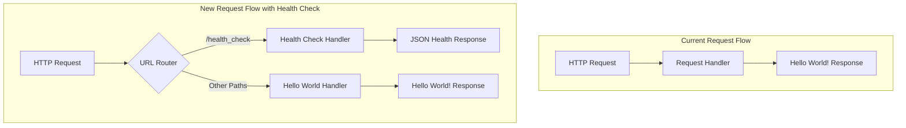

# Technical Specification

# 0. Agent Action Plan

## 0.1 Intent Clarification

This section translates the user's request into precise technical requirements and surfaces all implicit implementation needs for adding a health_check endpoint to the hello-world-nodejs application.

### 0.1.1 Core Feature Objective

Based on the prompt, the Blitzy platform understands that the new feature requirement is to:

| Requirement ID | Feature Requirement | Technical Interpretation |
|----------------|---------------------|--------------------------|
| REQ-001 | Add a health_check endpoint to the project | Implement HTTP route handling to respond to `/health_check` path with service status information |
| REQ-002 | Easily verify that the service is running correctly | Return HTTP 200 status code with structured health status data when service is operational |
| REQ-003 | Health verification capability | Provide response body containing service health metrics (status, uptime, timestamp) |

**Implicit Requirements Detected:**

| Implicit Requirement | Rationale | Impact |
|----------------------|-----------|--------|
| URL Routing Implementation | Current server responds identically to ALL requests; routing logic must be introduced to differentiate `/health_check` from other paths | Requires modification of request handler to inspect `req.url` |
| Structured Response Format | Health check endpoints conventionally return JSON for machine readability | Response should use `application/json` content-type instead of `text/plain` |
| Service Metrics Collection | "Running correctly" implies providing quantitative health data | Include `process.uptime()` for server uptime tracking |
| Backward Compatibility | Existing "Hello World!" functionality must continue working | Default route must preserve original behavior |

**Feature Dependencies and Prerequisites:**

| Dependency | Type | Status |
|------------|------|--------|
| Node.js Runtime >= 14.0.0 | System Dependency | ✅ Satisfied |
| Built-in `http` module | Module Dependency | ✅ Already in use |
| Built-in `process` module | Module Dependency | ✅ Available (for uptime) |
| TCP Port 3000 availability | Network Dependency | ✅ Required (unchanged) |

### 0.1.2 Special Instructions and Constraints

**Architectural Requirements:**

| Constraint | Requirement | Implementation Strategy |
|------------|-------------|------------------------|
| Zero External Dependencies | Maintain vanilla Node.js philosophy | Use only built-in modules (`http`, `process`) |
| Single File Architecture | Keep all logic in `Hello_World_Node.js` | Add routing logic within existing request handler |
| Educational Clarity | Preserve code simplicity and transparency | Implement minimal routing with clear conditional logic |
| Backward Compatibility | Existing `/` response must remain unchanged | Route `/health_check` separately, default to "Hello World!" |

**Naming Convention:**

The user explicitly requested the endpoint be named `health_check` (with underscore), which aligns with common REST API conventions. The implementation will use:
- **Endpoint Path:** `/health_check`
- **HTTP Method:** GET (implied for health checks)

### 0.1.3 Technical Interpretation

These feature requirements translate to the following technical implementation strategy:

| Goal | Technical Action | Target Component |
|------|------------------|------------------|
| To implement health_check endpoint | Add URL path checking logic in request handler callback | `Hello_World_Node.js` (lines 8-12) |
| To return health status data | Create JSON response with status, uptime, and timestamp | `Hello_World_Node.js` request handler |
| To support JSON responses | Set `Content-Type: application/json` header for health endpoint | Response headers configuration |
| To preserve existing behavior | Maintain "Hello World!" response for non-health-check routes | Default route handling |
| To track server uptime | Utilize `process.uptime()` for runtime duration | Health response payload |
| To document new functionality | Update README.md with health_check endpoint documentation | `README.md` |
| To align package scripts | Update package.json to reference correct entry file | `package.json` |

**Implementation Pattern:**

```javascript
// Routing logic pattern to be implemented
if (req.url === '/health_check') {
  // Health check response logic
} else {
  // Existing Hello World response
}
```

**Health Check Response Structure:**

```json
{
  "status": "healthy",
  "uptime": 12345.678,
  "timestamp": "2024-01-01T00:00:00.000Z"
}
```


## 0.2 Repository Scope Discovery

This section provides a comprehensive analysis of all repository files that require modification, integration points to address, and new files to be created for the health_check endpoint feature.

### 0.2.1 Comprehensive File Analysis

**Existing Repository Structure:**

| File Path | Type | Size | Purpose | Modification Required |
|-----------|------|------|---------|----------------------|
| `Hello_World_Node.js` | Source | 384 bytes | Main HTTP server implementation | ✅ MODIFY |
| `README.md` | Documentation | 1,281 bytes | User guide and documentation | ✅ MODIFY |
| `package.json` | Configuration | 398 bytes | NPM package manifest | ✅ MODIFY |
| `.git/` | Version Control | - | Git repository metadata | ❌ NO CHANGE |

**File-by-File Analysis:**

| File | Current State | Required Changes |
|------|---------------|------------------|
| `Hello_World_Node.js` | Single request handler responding to all paths with "Hello World!" | Add URL routing logic to handle `/health_check` path separately with JSON health response |
| `README.md` | Documents basic server usage with `server.js` reference | Add health_check endpoint documentation section, verify file name references |
| `package.json` | References `server.js` in `main` and `scripts` fields (mismatch) | Update entry point references to correct filename, add keywords |

**Search Patterns Applied:**

| Pattern | Files Found | Relevance |
|---------|-------------|-----------|
| `*.js` | `Hello_World_Node.js` | Primary source file requiring routing modification |
| `*.json` | `package.json` | Configuration requiring entry point correction |
| `*.md` | `README.md` | Documentation requiring health endpoint section |
| `**/*.config.*` | None | No configuration files present |
| `**/*.yaml`, `**/*.toml` | None | No additional configuration files |
| `Dockerfile*`, `docker-compose*` | None | No containerization files present |
| `.github/workflows/*` | None | No CI/CD workflows configured |
| `test/**/*`, `**/*test*.js` | None | No test infrastructure exists |

### 0.2.2 Integration Point Discovery

**API Endpoints Analysis:**

| Current Endpoint | Path | Method | Response | Status |
|------------------|------|--------|----------|--------|
| Hello World | `/*` (all paths) | ANY | `Hello World!\n` (text/plain) | Existing |
| Health Check | `/health_check` | GET | JSON health status | **NEW** |

**Code Integration Points:**

| Integration Point | File | Location | Description |
|-------------------|------|----------|-------------|
| Request Handler | `Hello_World_Node.js` | Lines 8-12 | Core modification point for URL routing logic |
| Response Headers | `Hello_World_Node.js` | Lines 9-11 | Conditional header setting based on route |
| Response Body | `Hello_World_Node.js` | Line 11 | Conditional body generation (text vs JSON) |
| Server Configuration | `Hello_World_Node.js` | Lines 5-6 | Unchanged - hostname and port constants |
| Startup Listener | `Hello_World_Node.js` | Lines 14-16 | Unchanged - server binding logic |

**Database Models/Migrations:** Not applicable - stateless application with no persistence layer.

**Service Classes:** Not applicable - single-file implementation with no service abstraction.

**Controllers/Handlers:** The `http.createServer()` callback function (lines 8-12) serves as the sole handler requiring modification.

**Middleware/Interceptors:** Not applicable - vanilla Node.js implementation without middleware pattern.

### 0.2.3 Web Search Research Conducted

| Research Topic | Key Findings | Application |
|----------------|--------------|-------------|
| Node.js health check best practices | Minimal implementation recommended without external dependencies | Align with zero-dependency philosophy |
| Common health check response formats | JSON with status, uptime, and timestamp fields | Structure health response payload |
| Kubernetes health probe patterns | `/livez` and `/readyz` endpoints for liveness/readiness | Future-proofing consideration (not required now) |
| HTTP health check conventions | Return HTTP 200 for healthy, 503 for unhealthy | Set appropriate status codes |
| Process uptime tracking | `process.uptime()` provides Node.js runtime seconds | Include in health response |

**Best Practices Research Summary:**

- <cite index="5-12,5-13,5-14">The Node.js Reference Architecture recommends not using a module to add health checks - "It's best to stick with a minimal implementation for most cases. The tradeoff between the amount of code you need to add to your application for a minimal implementation versus the costs of adding a new dependency leads us to recommend adding the code directly."</cite>
- <cite index="1-3">Health checks typically include: "the response time of the server, the uptime of the server, the status code of the server (as long as it is 200, we are going to get an 'OK' message), and the timestamp of the server."</cite>

### 0.2.4 New File Requirements

**New Source Files to Create:** None required - all functionality will be added to existing `Hello_World_Node.js`.

**New Test Files:** Not in scope - project maintains educational simplicity without test infrastructure.

**New Configuration Files:** None required - existing `package.json` will be updated.

**Rationale for No New Files:**

| Consideration | Decision | Justification |
|---------------|----------|---------------|
| Single-file architecture | Maintain | Preserves educational simplicity and transparency |
| Zero external dependencies | Maintain | Health check uses only built-in Node.js modules |
| Minimal complexity | Maintain | Feature addition should not fundamentally change project structure |


## 0.3 Dependency Inventory

This section documents all packages and dependencies relevant to the health_check endpoint feature implementation, maintaining the project's zero external dependency philosophy.

### 0.3.1 Private and Public Packages

**Current Dependency Status:**

| Dependency Type | Count | Status |
|-----------------|-------|--------|
| Production Dependencies | 0 | Zero external packages |
| Development Dependencies | 0 | No devDependencies defined |
| Built-in Node.js Modules | 1 | `http` module in use |

**Required Packages for Health Check Feature:**

| Registry | Package Name | Version | Purpose | Installation Required |
|----------|--------------|---------|---------|----------------------|
| Node.js Built-in | `http` | (bundled) | HTTP server creation and request handling | ❌ Already in use |
| Node.js Built-in | `process` | (bundled) | Global object for `process.uptime()` | ❌ Globally available |

**No External Packages Required:**

The health_check feature implementation requires **zero additional npm packages**. All functionality is achievable using:

| Built-in Capability | Module/Object | Usage |
|---------------------|---------------|-------|
| HTTP Request Handling | `http` module | URL routing via `req.url` property |
| Response Generation | `http` module | `res.statusCode`, `res.setHeader()`, `res.end()` |
| Server Uptime | `process` global | `process.uptime()` returns runtime in seconds |
| Timestamp Generation | `Date` global | `new Date().toISOString()` for ISO 8601 format |
| JSON Serialization | `JSON` global | `JSON.stringify()` for response body |

### 0.3.2 Dependency Updates

**No Dependency Updates Required:**

| Update Category | Required Changes | Status |
|-----------------|------------------|--------|
| New npm packages | None | ✅ Not applicable |
| Version updates | None | ✅ Not applicable |
| Peer dependencies | None | ✅ Not applicable |

### 0.3.3 Import Updates

**Current Import Statement:**

```javascript
const http = require('http');
```

**Required Import Changes:** None - the existing `http` module import is sufficient. The `process` object and `JSON` are globally available in Node.js without explicit import.

**Files Requiring Import Updates:** None

| File Pattern | Import Change Required | Status |
|--------------|------------------------|--------|
| `Hello_World_Node.js` | No changes needed | ✅ Current imports sufficient |

### 0.3.4 External Reference Updates

**Configuration File Updates:**

| File | Field | Current Value | Required Update |
|------|-------|---------------|-----------------|
| `package.json` | `main` | `"server.js"` | `"Hello_World_Node.js"` |
| `package.json` | `scripts.start` | `"node server.js"` | `"node Hello_World_Node.js"` |
| `package.json` | `scripts.dev` | `"node server.js"` | `"node Hello_World_Node.js"` |
| `package.json` | `keywords` | Current array | Add `"health-check"` |

**Documentation Updates:**

| File | Section | Current Reference | Required Update |
|------|---------|-------------------|-----------------|
| `README.md` | Usage | References `server.js` | Update to `Hello_World_Node.js` |
| `README.md` | Configuration | References `server.js` | Update to `Hello_World_Node.js` |
| `README.md` | (New Section) | N/A | Add "Health Check Endpoint" documentation |

**Build/CI Files:** Not applicable - no build system or CI/CD configuration exists in the repository.

### 0.3.5 Package.json Dependency Section

**Current package.json Structure:**

```json
{
  "name": "hello-world-nodejs",
  "version": "1.0.0",
  "engines": { "node": ">=14.0.0" }
}
```

**Updated package.json Requirements:**

| Field | Action | Value |
|-------|--------|-------|
| `version` | INCREMENT | `"1.1.0"` (minor version for new feature) |
| `main` | UPDATE | `"Hello_World_Node.js"` |
| `scripts.start` | UPDATE | `"node Hello_World_Node.js"` |
| `scripts.dev` | UPDATE | `"node Hello_World_Node.js"` |
| `keywords` | APPEND | `"health-check"` |
| `dependencies` | NO CHANGE | None (empty) |
| `devDependencies` | NO CHANGE | None (not present) |
| `engines` | NO CHANGE | `{ "node": ">=14.0.0" }` |


## 0.4 Integration Analysis

This section documents all existing code touchpoints, dependency injections, and integration points that must be addressed when implementing the health_check endpoint feature.

### 0.4.1 Existing Code Touchpoints

**Direct Modifications Required:**

| File | Location | Current Code | Required Change |
|------|----------|--------------|-----------------|
| `Hello_World_Node.js` | Lines 8-12 | Single-path request handler | Add URL routing conditional for `/health_check` |
| `Hello_World_Node.js` | Line 9 | `res.statusCode = 200;` | Conditional status code (200 for both routes) |
| `Hello_World_Node.js` | Line 10 | `res.setHeader('Content-Type', 'text/plain');` | Conditional header: `text/plain` vs `application/json` |
| `Hello_World_Node.js` | Line 11 | `res.end('Hello World!\n');` | Conditional body: text vs JSON health payload |

**Code Flow Integration Points:**



### 0.4.2 Request Handler Modification

**Current Implementation (Lines 8-12):**

```javascript
const server = http.createServer((req, res) => {
  res.statusCode = 200;
  res.setHeader('Content-Type', 'text/plain');
  res.end('Hello World!\n');
});
```

**Integration Strategy:**

| Aspect | Current Behavior | New Behavior |
|--------|------------------|--------------|
| URL Inspection | Not performed | Check `req.url` for `/health_check` |
| Response Type | Always `text/plain` | `text/plain` (default) or `application/json` (health) |
| Response Body | Static "Hello World!\n" | Conditional: text greeting or JSON health data |
| Status Code | Always 200 | Always 200 (healthy service assumption) |

**Request Object Properties Used:**

| Property | Usage | Purpose |
|----------|-------|---------|
| `req.url` | Route determination | Check if path equals `/health_check` |
| `req.method` | Not used (optional) | Could validate GET method for health check |

**Response Object Methods Used:**

| Method/Property | Health Check Route | Default Route |
|-----------------|-------------------|---------------|
| `res.statusCode` | 200 | 200 |
| `res.setHeader('Content-Type', ...)` | `application/json` | `text/plain` |
| `res.end(body)` | JSON string | `'Hello World!\n'` |

### 0.4.3 Dependency Injections

**Service Registration:** Not applicable - the application does not use dependency injection patterns.

**Module Dependencies:**

| Module | Injection Point | Status |
|--------|-----------------|--------|
| `http` | Top of file via `require()` | ✅ Already injected |
| `process` | Global object | ✅ Automatically available |
| `JSON` | Global object | ✅ Automatically available |
| `Date` | Global object | ✅ Automatically available |

### 0.4.4 Database/Schema Updates

**Not Applicable:** The hello-world-nodejs application is stateless with no database connectivity. The health_check endpoint will report runtime status only.

| Database Aspect | Status |
|-----------------|--------|
| Migration Required | ❌ No |
| Schema Changes | ❌ No |
| Data Model Updates | ❌ No |

### 0.4.5 Configuration Integration

**Server Configuration Constants:**

| Constant | Value | Change Required |
|----------|-------|-----------------|
| `hostname` | `'127.0.0.1'` | ❌ No change |
| `port` | `3000` | ❌ No change |

**New Constants/Configuration:** None required - the health check endpoint path (`/health_check`) will be a string literal in the routing logic for simplicity.

### 0.4.6 Integration Validation Criteria

| Validation Point | Expected Behavior | Test Method |
|------------------|-------------------|-------------|
| Health endpoint accessible | GET `/health_check` returns HTTP 200 | `curl http://127.0.0.1:3000/health_check` |
| Health response format | JSON with status, uptime, timestamp | Inspect response body |
| Content-Type header | `application/json` for health endpoint | Inspect response headers |
| Default route preserved | GET `/` returns "Hello World!" | `curl http://127.0.0.1:3000/` |
| Other paths preserved | GET `/anything` returns "Hello World!" | `curl http://127.0.0.1:3000/anything` |
| Startup message unchanged | Console shows server URL | Visual inspection on startup |


## 0.5 Technical Implementation

This section provides the file-by-file execution plan with specific implementation details for adding the health_check endpoint to the hello-world-nodejs application.

### 0.5.1 File-by-File Execution Plan

**CRITICAL:** Every file listed below MUST be created or modified as specified.

#### Group 1 - Core Feature Files

| Action | File | Specific Changes |
|--------|------|------------------|
| MODIFY | `Hello_World_Node.js` | Add URL routing logic and health check response handler |

**Implementation Details for `Hello_World_Node.js`:**

| Line Range | Current Code | New Code Purpose |
|------------|--------------|------------------|
| Lines 8-12 | Simple request handler | Enhanced request handler with URL routing |
| Line 8 | `const server = http.createServer((req, res) => {` | Add conditional URL check inside callback |
| Lines 9-11 | Fixed response logic | Split into health check vs default response branches |

**Health Check Response Payload Structure:**

```javascript
{
  status: 'healthy',
  uptime: process.uptime(),
  timestamp: new Date().toISOString()
}
```

#### Group 2 - Configuration Files

| Action | File | Specific Changes |
|--------|------|------------------|
| MODIFY | `package.json` | Fix entry point references, update version, add keyword |

**package.json Modifications:**

| Field | Current | Updated |
|-------|---------|---------|
| `version` | `"1.0.0"` | `"1.1.0"` |
| `main` | `"server.js"` | `"Hello_World_Node.js"` |
| `scripts.start` | `"node server.js"` | `"node Hello_World_Node.js"` |
| `scripts.dev` | `"node server.js"` | `"node Hello_World_Node.js"` |
| `keywords` | `["hello-world", "nodejs", "http-server", "example"]` | Add `"health-check"` |

#### Group 3 - Documentation

| Action | File | Specific Changes |
|--------|------|------------------|
| MODIFY | `README.md` | Add health check documentation section, fix file references |

**README.md Modifications:**

| Section | Change Type | Description |
|---------|-------------|-------------|
| Usage | UPDATE | Change `server.js` references to `Hello_World_Node.js` |
| Configuration | UPDATE | Change `server.js` reference to `Hello_World_Node.js` |
| Health Check | ADD NEW | New section documenting `/health_check` endpoint |
| How It Works | UPDATE | Add health check functionality description |

### 0.5.2 Implementation Approach per File

**Step 1: Establish Feature Foundation**

| Task | File | Implementation |
|------|------|----------------|
| Add URL routing | `Hello_World_Node.js` | Implement `req.url` conditional check |
| Add health response | `Hello_World_Node.js` | Create JSON response with health metrics |
| Preserve default behavior | `Hello_World_Node.js` | Keep original response for non-health routes |

**Step 2: Integrate with Existing Systems**

| Task | File | Implementation |
|------|------|----------------|
| Fix entry point | `package.json` | Update `main` and `scripts` fields |
| Bump version | `package.json` | Increment to 1.1.0 for new feature |
| Add keyword | `package.json` | Add "health-check" to keywords array |

**Step 3: Document Usage**

| Task | File | Implementation |
|------|------|----------------|
| Add endpoint docs | `README.md` | New "Health Check Endpoint" section |
| Fix file references | `README.md` | Update all `server.js` to `Hello_World_Node.js` |
| Update description | `README.md` | Mention health check in "How It Works" |

### 0.5.3 Technical Specifications

**Health Check Endpoint Specification:**

| Attribute | Value |
|-----------|-------|
| Path | `/health_check` |
| HTTP Method | GET (responds to all methods) |
| Content-Type | `application/json` |
| Status Code | `200 OK` |
| Response Format | JSON object |

**Response Schema:**

| Field | Type | Description | Example |
|-------|------|-------------|---------|
| `status` | string | Health status indicator | `"healthy"` |
| `uptime` | number | Server uptime in seconds | `123.456` |
| `timestamp` | string | ISO 8601 formatted timestamp | `"2024-01-01T12:00:00.000Z"` |

**Routing Logic:**

| URL Path | Response Type | Content-Type | Body |
|----------|---------------|--------------|------|
| `/health_check` | Health JSON | `application/json` | `{"status":"healthy",...}` |
| `/` | Text | `text/plain` | `Hello World!\n` |
| `/any/other/path` | Text | `text/plain` | `Hello World!\n` |

### 0.5.4 Code Implementation Pattern

**Request Handler Enhancement:**

```javascript
const server = http.createServer((req, res) => {
  if (req.url === '/health_check') {
    // Health check response
  } else {
    // Original Hello World response
  }
});
```

**Health Response Generation:**

```javascript
const healthData = {
  status: 'healthy',
  uptime: process.uptime(),
  timestamp: new Date().toISOString()
};
res.end(JSON.stringify(healthData));
```

### 0.5.5 Verification Commands

| Test Case | Command | Expected Result |
|-----------|---------|-----------------|
| Health endpoint | `curl http://127.0.0.1:3000/health_check` | JSON with status, uptime, timestamp |
| Default route | `curl http://127.0.0.1:3000/` | `Hello World!` |
| Random path | `curl http://127.0.0.1:3000/random` | `Hello World!` |
| Response headers | `curl -I http://127.0.0.1:3000/health_check` | `Content-Type: application/json` |
| npm start | `npm start` | Server starts on port 3000 |


## 0.6 Scope Boundaries

This section defines the exhaustive boundaries of what is included and excluded from the health_check endpoint feature implementation.

### 0.6.1 Exhaustively In Scope

**Source Files:**

| File Pattern | Specific Files | Modification Type |
|--------------|----------------|-------------------|
| `*.js` | `Hello_World_Node.js` | MODIFY - Add routing and health handler |

**Configuration Files:**

| File Pattern | Specific Files | Modification Type |
|--------------|----------------|-------------------|
| `package.json` | `package.json` | MODIFY - Fix entry point, update version |

**Documentation Files:**

| File Pattern | Specific Files | Modification Type |
|--------------|----------------|-------------------|
| `*.md` | `README.md` | MODIFY - Add health check documentation |

**Complete File Scope Table:**

| File | Action | Lines Affected | Change Description |
|------|--------|----------------|-------------------|
| `Hello_World_Node.js` | MODIFY | Lines 8-12 | Add URL routing for `/health_check` with JSON response |
| `package.json` | MODIFY | Lines 5-9, keywords | Fix `main`, `scripts`, bump version to 1.1.0 |
| `README.md` | MODIFY | Multiple sections | Add health check docs, fix file references |

### 0.6.2 Feature Functionality In Scope

| Feature Aspect | In Scope | Description |
|----------------|----------|-------------|
| Health check endpoint | ✅ | `/health_check` path returns JSON health data |
| Status field | ✅ | Returns `"healthy"` string |
| Uptime tracking | ✅ | Returns `process.uptime()` value |
| Timestamp | ✅ | Returns ISO 8601 formatted timestamp |
| JSON response | ✅ | `application/json` content type |
| HTTP 200 response | ✅ | Success status code for healthy service |
| Backward compatibility | ✅ | Existing routes continue to work |
| Documentation | ✅ | README updated with endpoint usage |
| Package alignment | ✅ | Fix `server.js` references in package.json |

### 0.6.3 Integration Points In Scope

| Integration Point | Location | Description |
|-------------------|----------|-------------|
| Request handler callback | `Hello_World_Node.js:8-12` | URL routing logic addition |
| Response generation | `Hello_World_Node.js:8-12` | Conditional JSON/text response |
| NPM scripts | `package.json:6-9` | Entry point correction |
| Package metadata | `package.json` | Version bump and keyword addition |

### 0.6.4 Explicitly Out of Scope

**Features NOT Included:**

| Out of Scope Item | Reason |
|-------------------|--------|
| HTTPS support | Not required for health check; educational simplicity |
| Authentication/authorization | Health endpoints conventionally unauthenticated |
| Database connectivity checks | Application has no database |
| External service health checks | No external dependencies exist |
| Kubernetes readiness/liveness separation | Single `/health_check` sufficient for requirements |
| Custom health check configuration | Static implementation meets requirements |
| Health check metrics aggregation | Beyond scope of simple health endpoint |
| Error state handling (503) | Service assumed healthy when running |
| Request method validation | Accept all HTTP methods on health endpoint |
| Rate limiting | Not required for educational project |
| Logging enhancements | Console startup message sufficient |

**Files NOT Modified:**

| File/Pattern | Reason |
|--------------|--------|
| `.git/**/*` | Version control metadata - never modify |
| `node_modules/**/*` | No external dependencies installed |
| `Dockerfile*` | No containerization files exist |
| `.github/**/*` | No CI/CD configuration exists |
| `test/**/*` | No test infrastructure exists |

**Structural Changes NOT Made:**

| Change Type | Reason for Exclusion |
|-------------|----------------------|
| New source files | Single-file architecture preserved |
| New configuration files | Existing package.json sufficient |
| New directories | Flat structure maintained |
| External dependencies | Zero-dependency philosophy maintained |
| Test suite addition | Out of scope per project design |
| CI/CD pipeline | Out of scope per project design |

### 0.6.5 Boundary Validation Matrix

| Boundary | In Scope | Out of Scope | Rationale |
|----------|----------|--------------|-----------|
| HTTP Protocol | ✅ | HTTPS | Educational simplicity |
| Response Format | JSON for health | XML, YAML | JSON is standard for health checks |
| Health Metrics | status, uptime, timestamp | memory, CPU | Minimal metrics sufficient |
| Routes | `/health_check` | `/health`, `/livez`, `/readyz` | User specifically requested `health_check` |
| Documentation | README update | Separate API docs | Single documentation file maintained |
| Error Handling | Basic (always 200) | 503 for degraded | Simplified implementation |

### 0.6.6 Scope Change Control

**Scope Additions Requiring Approval:**

| Potential Addition | Impact | Requires Review |
|--------------------|--------|-----------------|
| Additional health metrics | Medium | Yes |
| Alternative endpoint paths | Low | Yes |
| External dependency checks | High | Yes |
| Test suite implementation | High | Yes |
| CI/CD integration | High | Yes |

**Scope Locked Items:**

| Item | Reason |
|------|--------|
| Zero external dependencies | Core project philosophy |
| Single file architecture | Educational design principle |
| Localhost binding | Security-conscious default |
| Port 3000 | Established configuration |


## 0.7 Special Instructions

This section documents all special instructions, feature-specific requirements, and implementation constraints that must be followed during the health_check endpoint development.

### 0.7.1 Feature-Specific Requirements

**Naming Convention (User-Specified):**

| Aspect | Requirement | Rationale |
|--------|-------------|-----------|
| Endpoint path | `/health_check` (with underscore) | Explicitly specified by user in prompt |
| NOT `/health` | Avoided | User did not request this variant |
| NOT `/healthcheck` | Avoided | User explicitly used underscore separator |
| NOT `/health-check` | Avoided | Hyphen not specified |

**Response Behavior:**

| Requirement | Implementation |
|-------------|----------------|
| Service verification | Return data confirming service is operational |
| Easy verification | Simple JSON response parseable by monitoring tools |
| Running correctly indicator | `"status": "healthy"` field in response |

### 0.7.2 Architectural Patterns to Follow

**Existing Patterns to Maintain:**

| Pattern | Current Usage | Health Check Application |
|---------|---------------|--------------------------|
| CommonJS modules | `require('http')` | No change - continue using require |
| Const declarations | `const hostname`, `const port` | Use const for any new variables |
| Arrow functions | Request handler callback | Maintain arrow function style |
| Template literals | Startup message | Use for any string interpolation |
| Single-file implementation | All logic in one file | Add health check in same file |

**Code Style Consistency:**

| Style Element | Current Example | Apply To Health Check |
|---------------|-----------------|----------------------|
| Indentation | 2 spaces | Use 2 spaces for new code |
| Semicolons | Used | Include semicolons |
| String quotes | Single quotes | Use single quotes for strings |
| Line length | ~60 characters | Keep similar line lengths |

### 0.7.3 Integration Requirements

**Backward Compatibility (Critical):**

| Existing Behavior | Must Be Preserved |
|-------------------|-------------------|
| `GET /` returns "Hello World!\n" | ✅ Required |
| `GET /any/path` returns "Hello World!\n" | ✅ Required |
| Status code 200 for all requests | ✅ Required |
| Console startup message | ✅ Required |
| Server binds to 127.0.0.1:3000 | ✅ Required |

**npm Script Alignment:**

| Requirement | Action |
|-------------|--------|
| `npm start` must work | Update package.json scripts to reference correct file |
| `npm run dev` must work | Update package.json scripts to reference correct file |
| Entry point must be correct | Update `main` field to `Hello_World_Node.js` |

### 0.7.4 Performance Considerations

**Minimal Overhead:**

| Consideration | Approach |
|---------------|----------|
| No external dependencies | Use only built-in Node.js capabilities |
| Lightweight health response | Small JSON payload (~100 bytes) |
| No blocking operations | All health data derived from non-blocking calls |
| Fast response time | Target < 5ms response latency |

**Resource Efficiency:**

| Resource | Impact |
|----------|--------|
| Memory | Negligible - no additional state stored |
| CPU | Minimal - simple conditional and JSON serialization |
| I/O | None - no file or network operations for health data |

### 0.7.5 Security Requirements

**Security-Conscious Implementation:**

| Security Aspect | Implementation |
|-----------------|----------------|
| No sensitive data exposure | Health response contains only operational metrics |
| No credential leakage | No secrets in health response |
| Limited information disclosure | Status, uptime, timestamp only |
| Localhost binding maintained | External network access still restricted |

**Health Check Data Exposure:**

| Data Field | Sensitivity | Justification |
|------------|-------------|---------------|
| `status` | Low | Generic health indicator |
| `uptime` | Low | Non-sensitive operational metric |
| `timestamp` | Low | Current time (publicly available) |

### 0.7.6 Documentation Requirements

**README.md Updates Required:**

| Section | Requirement |
|---------|-------------|
| New "Health Check Endpoint" section | Document path, method, response format |
| Usage examples | Include curl command examples |
| Response format | Show sample JSON response |
| File reference fixes | Change `server.js` to `Hello_World_Node.js` |

**Code Comments:**

| Requirement | Approach |
|-------------|----------|
| Maintain existing comment | Keep "// Simple Hello World Node.js Application" |
| Add routing comment | Optional: brief comment explaining URL check |
| Keep code self-documenting | Use clear variable names |

### 0.7.7 Testing Verification

**Manual Verification Steps:**

| Step | Command | Expected Result |
|------|---------|-----------------|
| 1 | `node Hello_World_Node.js` | "Server running at http://127.0.0.1:3000/" |
| 2 | `curl http://127.0.0.1:3000/` | "Hello World!" |
| 3 | `curl http://127.0.0.1:3000/health_check` | JSON with status, uptime, timestamp |
| 4 | `curl -I http://127.0.0.1:3000/health_check` | Content-Type: application/json |
| 5 | `npm start` | Server starts successfully |

**Health Response Validation:**

| Check | Expected Value |
|-------|----------------|
| `status` field exists | Yes |
| `status` value | `"healthy"` |
| `uptime` field exists | Yes |
| `uptime` is number | Yes (seconds) |
| `timestamp` field exists | Yes |
| `timestamp` format | ISO 8601 |

### 0.7.8 Compliance Checklist

**Pre-Implementation Checklist:**

- [ ] Understand endpoint path requirement (`/health_check`)
- [ ] Plan URL routing implementation
- [ ] Design JSON response structure
- [ ] Identify package.json corrections needed
- [ ] Prepare README documentation updates

**Post-Implementation Checklist:**

- [ ] Health endpoint returns HTTP 200
- [ ] Health response is valid JSON
- [ ] Health response contains status, uptime, timestamp
- [ ] Default route still returns "Hello World!"
- [ ] npm start works correctly
- [ ] README documents new endpoint
- [ ] package.json version bumped to 1.1.0
- [ ] No external dependencies added


