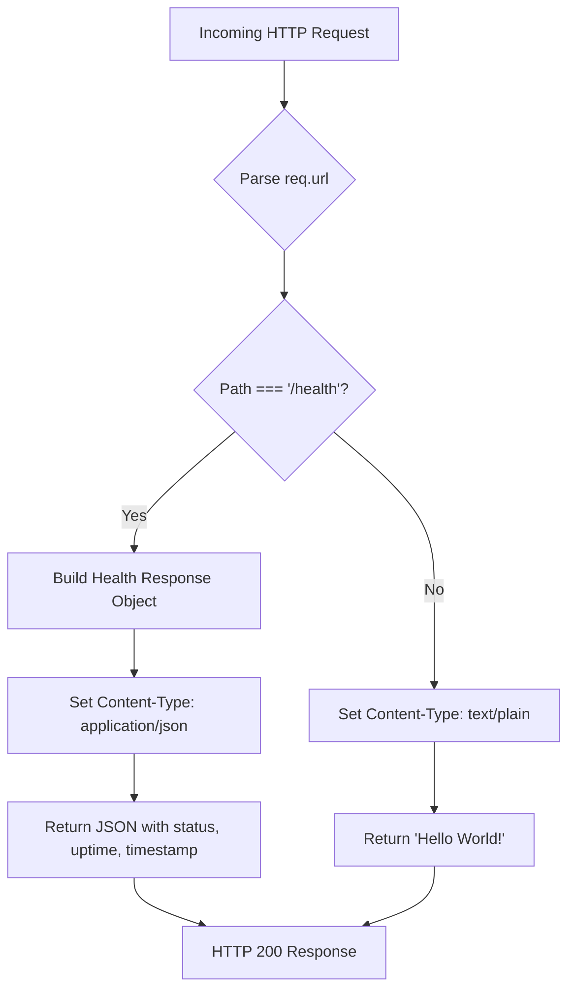
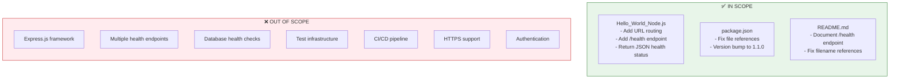

# Technical Specification

# 0. Agent Action Plan

## 0.1 Intent Clarification

This section interprets and clarifies the user's request to add a health check endpoint to the hello-world-nodejs application.

### 0.1.1 Core Feature Objective

Based on the prompt, the Blitzy platform understands that the new feature requirement is to:

- **Add a health check endpoint** to the existing Node.js HTTP server that allows users and external systems to programmatically verify that the service is running correctly
- **Implement URL-based routing** in the currently route-less server to differentiate between the health check endpoint and normal requests
- **Return meaningful health status information** that confirms server availability and operational state
- **Maintain backward compatibility** with the existing "Hello World!" response for non-health-check requests

| Requirement ID | Requirement Description | Priority | Implicit Dependencies |
|----------------|------------------------|----------|----------------------|
| REQ-001 | Create `/health` endpoint for service verification | Critical | URL path routing implementation |
| REQ-002 | Return HTTP 200 status code when service is healthy | Critical | Proper request handling |
| REQ-003 | Include health status metadata in response body | High | JSON response formatting |
| REQ-004 | Preserve existing Hello World functionality | Critical | Non-breaking change to existing behavior |

**Implicit Requirements Detected:**

- The existing server has no routing capability—URL path detection must be implemented
- The response format should follow industry best practices (JSON for health endpoints)
- Server uptime and timestamp information would enhance the health check utility
- The implementation must remain consistent with the project's zero-dependency philosophy

### 0.1.2 Special Instructions and Constraints

**Architectural Requirements:**

- Maintain the zero-external-dependency philosophy of the project
- Use only Node.js built-in modules (`http`, `url`, `process`)
- Follow the minimalist implementation pattern already established
- Preserve educational clarity while adding functionality

**Backward Compatibility Requirements:**

- Existing requests to `http://127.0.0.1:3000/` must continue returning "Hello World!"
- All requests to paths other than `/health` should maintain the existing behavior
- No changes to the server's host binding (127.0.0.1) or port (3000)

**Best Practice Alignment:**

Based on industry research, the health check implementation should:

- Return HTTP 200 status code for healthy status
- Use JSON response format with `application/json` Content-Type
- Include `status`, `uptime`, and `timestamp` fields
- Be lightweight and not introduce external dependencies

### 0.1.3 Technical Interpretation

These feature requirements translate to the following technical implementation strategy:

- To **implement URL routing**, we will modify the request handler in `Hello_World_Node.js` to parse the incoming request URL and route based on the path
- To **create the health check endpoint**, we will add conditional logic that returns a JSON health status response when the path is `/health`
- To **include health metadata**, we will use Node.js built-in `process.uptime()` for server uptime and `Date.now()` for timestamp
- To **maintain backward compatibility**, we will route all non-`/health` requests to the existing Hello World response handler
- To **fix existing issues**, we will address the file naming inconsistency between `Hello_World_Node.js` and the `server.js` reference in `package.json`

**Technical Approach Summary:**

```
Request Flow:
┌─────────────────────────────────────────────────────────────┐
│                   HTTP Request                               │
│                        │                                     │
│            Parse URL Path (req.url)                          │
│                        │                                     │
│        ┌───────────────┴───────────────┐                     │
│        │                               │                     │
│   /health path              All other paths                  │
│        │                               │                     │
│ Return JSON health    Return "Hello World!"                  │
│ status (HTTP 200)         (HTTP 200)                         │
└─────────────────────────────────────────────────────────────┘
```


## 0.2 Repository Scope Discovery

This section provides a comprehensive analysis of all repository files affected by the health check endpoint feature.

### 0.2.1 Comprehensive File Analysis

**Current Repository Structure:**

```
/
├── Hello_World_Node.js   # Main server implementation (17 lines)
├── package.json          # NPM package manifest
├── README.md             # Documentation
└── .git/                 # Git repository metadata
```

**Files Requiring Modification:**

| File Path | Type | Current State | Modification Purpose |
|-----------|------|---------------|---------------------|
| `Hello_World_Node.js` | Source | No routing; responds "Hello World!" to all requests | Add URL parsing and route-based response handling for `/health` endpoint |
| `package.json` | Config | References non-existent `server.js` | Fix file reference inconsistency; update version number |
| `README.md` | Documentation | Documents only Hello World functionality | Add health check endpoint documentation |

**Detailed File Analysis:**

**1. Hello_World_Node.js (Primary Modification Target)**

| Aspect | Current Implementation | Required Changes |
|--------|----------------------|------------------|
| Request Routing | None - all requests return same response | Add URL path parsing using `req.url` |
| Response Types | Single plain text response | Add JSON response capability for health endpoint |
| Status Information | None | Add `process.uptime()` and timestamp collection |
| Content-Type | `text/plain` only | Add `application/json` for health endpoint |
| Lines of Code | 17 lines | Estimated 35-40 lines after changes |

**2. package.json (Configuration Fix)**

| Field | Current Value | Required Change |
|-------|---------------|-----------------|
| `main` | `"server.js"` | Change to `"Hello_World_Node.js"` |
| `scripts.start` | `"node server.js"` | Change to `"node Hello_World_Node.js"` |
| `scripts.dev` | `"node server.js"` | Change to `"node Hello_World_Node.js"` |
| `version` | `"1.0.0"` | Increment to `"1.1.0"` |

**3. README.md (Documentation Update)**

| Section | Current Content | Required Updates |
|---------|-----------------|-----------------|
| Usage | Describes Hello World only | Add health check endpoint usage |
| Endpoints | Not present | Add new section documenting `/health` endpoint |
| Configuration | Basic port/host info | Add health check response format documentation |

### 0.2.2 Integration Point Discovery

**API Endpoints After Implementation:**

| Endpoint | Method | Response Type | Status Code | Purpose |
|----------|--------|---------------|-------------|---------|
| `/` | GET | `text/plain` | 200 | Original Hello World response |
| `/health` | GET | `application/json` | 200 | Service health verification |
| `/*` (other paths) | GET | `text/plain` | 200 | Fallback to Hello World response |

**Database/Schema Updates:**
- None required - the application remains stateless

**Service Class Updates:**
- None required - single-file architecture

**Middleware/Interceptors:**
- None required - simple request handler modification

### 0.2.3 Web Search Research Conducted

Based on industry research for implementing health check endpoints in Node.js:

| Research Topic | Key Findings | Application to This Project |
|----------------|--------------|----------------------------|
| Best practices for Node.js health checks | Use simple implementations without external dependencies; return JSON with status, uptime, timestamp | Aligns with project's zero-dependency philosophy |
| Common endpoint naming | `/health`, `/livez`, `/readyz` are common patterns | Using `/health` as requested by user |
| Response format standards | JSON with `{ status: "ok" }` pattern widely adopted | Will implement standard JSON response |
| Kubernetes compatibility | HTTP 200 for healthy, include uptime information | Health endpoint will be Kubernetes-probe compatible |

### 0.2.4 New File Requirements

**No new files need to be created.** All changes can be implemented within the existing three files:

| Original Plan | Actual Implementation |
|---------------|----------------------|
| Create new health module file | Not needed - inline implementation maintains simplicity |
| Create test files | Out of scope per project philosophy |
| Create configuration files | Not needed - hardcoded values appropriate for this project |

The health check feature will be implemented by modifying existing files only, preserving the project's educational simplicity and zero-complexity structure.


## 0.3 Dependency Inventory

This section documents all dependencies relevant to implementing the health check endpoint feature.

### 0.3.1 Private and Public Packages

**Current Dependency Status:**

The hello-world-nodejs project maintains a **zero external dependency** architecture. This principle will be preserved for the health check implementation.

| Registry | Package Name | Version | Purpose | Status |
|----------|--------------|---------|---------|--------|
| Node.js Built-in | `http` | N/A (bundled) | HTTP server creation and request handling | Currently used |
| Node.js Built-in | `url` | N/A (bundled) | URL parsing for path extraction | **New usage** |
| Node.js Built-in | `process` | N/A (bundled) | Server uptime via `process.uptime()` | **New usage** |

**No External NPM Packages Required:**

| Consideration | Decision | Rationale |
|---------------|----------|-----------|
| Health check library | Not adding | Preserves zero-dependency philosophy |
| Express.js framework | Not adding | Overkill for simple routing; increases complexity |
| JSON schema validation | Not adding | Simple response structure; no validation needed |

### 0.3.2 Runtime Requirements

**Node.js Runtime:**

| Attribute | Current Requirement | After Implementation |
|-----------|--------------------|--------------------|
| Minimum Version | >= 14.0.0 | >= 14.0.0 (unchanged) |
| Constraint Source | `package.json` engines field | `package.json` engines field |
| Built-in APIs Used | `http.createServer()`, `server.listen()` | + `req.url` parsing, `process.uptime()` |

**Verified Runtime Compatibility:**

```json
{
  "engines": {
    "node": ">=14.0.0"
  }
}
```

All Node.js built-in APIs used in the health check implementation (`req.url`, `process.uptime()`, `Date.now()`, `JSON.stringify()`) are available in Node.js 14.0.0 and all subsequent versions.

### 0.3.3 Dependency Updates

**No External Dependency Updates Required**

Since the project has zero external dependencies, there are no packages to update. The implementation uses only Node.js built-in capabilities.

**Import Updates:**

The current implementation uses a single import:

```javascript
// Current
const http = require('http');

// After implementation (unchanged)
const http = require('http');
```

No additional imports are required because:
- URL parsing uses the `req.url` property (available on http.IncomingMessage)
- Process uptime uses global `process.uptime()` (no import needed)
- Date functions use global `Date.now()` (no import needed)
- JSON stringification uses global `JSON.stringify()` (no import needed)

### 0.3.4 External Reference Updates

**Configuration File Updates:**

| File | Update Type | Details |
|------|-------------|---------|
| `package.json` | Fix file reference | Change `main` and `scripts` from `server.js` to `Hello_World_Node.js` |
| `package.json` | Version bump | Increment `version` from `1.0.0` to `1.1.0` |

**Documentation Updates:**

| File | Update Type | Details |
|------|-------------|---------|
| `README.md` | Content addition | Add health check endpoint documentation |
| `README.md` | Fix file reference | Update references from `server.js` to `Hello_World_Node.js` |

**No CI/CD or Build File Updates:**
- No CI/CD pipeline exists in this project
- No build configuration files exist
- No workflow files need modification


## 0.4 Integration Analysis

This section documents all integration touchpoints and code modifications required for the health check endpoint implementation.

### 0.4.1 Existing Code Touchpoints

**Direct Modifications Required:**

| File | Location | Modification Type | Description |
|------|----------|------------------|-------------|
| `Hello_World_Node.js` | Lines 8-12 | **Major Refactor** | Replace simple response handler with route-aware handler |
| `Hello_World_Node.js` | Line 3 | **No Change** | Keep existing `require('http')` import |
| `Hello_World_Node.js` | Lines 5-6 | **No Change** | Keep hostname and port constants |
| `Hello_World_Node.js` | Lines 14-16 | **No Change** | Keep server.listen() call |
| `package.json` | Lines 5-9 | **Fix** | Update `main` and `scripts` to reference correct file |
| `package.json` | Line 3 | **Update** | Bump version to 1.1.0 |
| `README.md` | Multiple sections | **Addition** | Add health check documentation |

### 0.4.2 Request Handler Modification

**Current Implementation (Hello_World_Node.js, Lines 8-12):**

```javascript
const server = http.createServer((req, res) => {
  res.statusCode = 200;
  res.setHeader('Content-Type', 'text/plain');
  res.end('Hello World!\n');
});
```

**Required Transformation:**

The request handler must be modified to:
1. Parse the incoming request URL to extract the path
2. Implement conditional routing based on path
3. Return JSON response for `/health` endpoint
4. Maintain original behavior for all other paths

**Request Handler Flow After Modification:**



### 0.4.3 Health Check Response Structure

**Response Object Schema:**

| Field | Type | Source | Description |
|-------|------|--------|-------------|
| `status` | string | Static | Service health status ("ok" when healthy) |
| `uptime` | number | `process.uptime()` | Seconds since server started |
| `timestamp` | number | `Date.now()` | Current Unix timestamp in milliseconds |

**Example Health Check Response:**

```json
{
  "status": "ok",
  "uptime": 123.456,
  "timestamp": 1704067200000
}
```

### 0.4.4 Dependency Injection Points

**Not Applicable**

The application uses a single-file architecture with no dependency injection container or service registration pattern. All functionality is contained within `Hello_World_Node.js`.

### 0.4.5 Database/Schema Updates

**Not Applicable**

The application is stateless with no database connectivity. The health check feature does not require any persistence layer modifications.

### 0.4.6 Integration Points Summary

| Integration Category | Files Affected | Integration Type |
|---------------------|----------------|-----------------|
| HTTP Request Handling | `Hello_World_Node.js` | Direct code modification |
| NPM Configuration | `package.json` | Metadata correction |
| User Documentation | `README.md` | Content addition |
| External APIs | None | N/A |
| Database | None | N/A |
| Message Queues | None | N/A |
| Authentication | None | N/A |

### 0.4.7 Backward Compatibility Verification

| Existing Behavior | Impact After Change | Verification Method |
|-------------------|---------------------|---------------------|
| Request to `/` returns "Hello World!" | **Preserved** - Same response | Manual HTTP request test |
| Request to any path returns "Hello World!" | **Preserved** for paths ≠ `/health` | Manual HTTP request test |
| Server binds to 127.0.0.1:3000 | **Preserved** - No binding changes | Startup message verification |
| Console startup message | **Preserved** - No logging changes | Visual verification |
| `npm start` command | **Fixed** - Will now work correctly | Command execution test |


## 0.5 Technical Implementation

This section provides a detailed file-by-file execution plan for implementing the health check endpoint feature.

### 0.5.1 File-by-File Execution Plan

**CRITICAL: Every file listed below MUST be modified as specified.**

#### Group 1 - Core Feature Implementation

| Action | File | Purpose | Priority |
|--------|------|---------|----------|
| **MODIFY** | `Hello_World_Node.js` | Add URL routing and health check endpoint | Critical |

**Modification Details for Hello_World_Node.js:**

| Line Range | Current Code | New Code Purpose |
|------------|--------------|-----------------|
| Lines 8-12 | Simple request handler | Route-aware request handler with path detection |
| After Line 11 | N/A | Add health check response logic |
| After Line 11 | N/A | Add health status object construction |

**Implementation Approach:**

```javascript
// URL path extraction
const urlPath = req.url;

// Routing logic
if (urlPath === '/health') {
  // Health check response
} else {
  // Original Hello World response
}
```

#### Group 2 - Configuration Fixes

| Action | File | Purpose | Priority |
|--------|------|---------|----------|
| **MODIFY** | `package.json` | Fix file references, bump version | High |

**Modification Details for package.json:**

| Field | Current Value | New Value |
|-------|---------------|-----------|
| `version` | `"1.0.0"` | `"1.1.0"` |
| `main` | `"server.js"` | `"Hello_World_Node.js"` |
| `scripts.start` | `"node server.js"` | `"node Hello_World_Node.js"` |
| `scripts.dev` | `"node server.js"` | `"node Hello_World_Node.js"` |

#### Group 3 - Documentation Updates

| Action | File | Purpose | Priority |
|--------|------|---------|----------|
| **MODIFY** | `README.md` | Document health check endpoint | High |

**Documentation Additions for README.md:**

| Section | Addition Type | Content Description |
|---------|--------------|---------------------|
| New "Endpoints" section | New section | Document available HTTP endpoints |
| New "Health Check" subsection | New content | Describe `/health` endpoint and response format |
| "Usage" section | Update | Add health check verification step |
| "How It Works" section | Update | Mention URL routing capability |

### 0.5.2 Implementation Approach per File

**Phase 1: Establish Feature Foundation**

1. **Hello_World_Node.js Modification**
   - Parse incoming request URL using `req.url`
   - Implement path-based conditional logic
   - Create health check response object with `status`, `uptime`, `timestamp`
   - Set appropriate Content-Type header (`application/json` for health, `text/plain` for Hello World)
   - Return JSON-serialized health response for `/health` path
   - Preserve original "Hello World!" response for all other paths

**Phase 2: Fix Configuration Issues**

2. **package.json Modification**
   - Update `main` field to reference actual file
   - Update `scripts.start` and `scripts.dev` to use correct filename
   - Increment version to reflect feature addition

**Phase 3: Update Documentation**

3. **README.md Modification**
   - Add new "Endpoints" section documenting both endpoints
   - Document health check response format with example
   - Fix filename references from `server.js` to `Hello_World_Node.js`
   - Add verification steps for health check functionality

### 0.5.3 Code Structure After Implementation

**Hello_World_Node.js Structure:**

```
┌─────────────────────────────────────────┐
│ 1. Module Import (http)                 │
├─────────────────────────────────────────┤
│ 2. Configuration Constants              │
│    - hostname: '127.0.0.1'              │
│    - port: 3000                         │
├─────────────────────────────────────────┤
│ 3. Request Handler Function             │
│    ├─ URL Path Extraction               │
│    ├─ Health Check Route (/health)      │
│    │   ├─ Build health object           │
│    │   ├─ Set JSON Content-Type         │
│    │   └─ Return JSON response          │
│    └─ Default Route (all others)        │
│        ├─ Set text/plain Content-Type   │
│        └─ Return "Hello World!"         │
├─────────────────────────────────────────┤
│ 4. Server Initialization                │
│    - server.listen() with callback      │
└─────────────────────────────────────────┘
```

### 0.5.4 Expected File Changes Summary

| File | Lines Before | Lines After (Est.) | Change Type |
|------|--------------|-------------------|-------------|
| `Hello_World_Node.js` | 17 | 35-40 | Expansion |
| `package.json` | 21 | 21 | In-place modification |
| `README.md` | 54 | 85-95 | Content addition |


## 0.6 Scope Boundaries

This section defines the precise boundaries of the health check endpoint implementation.

### 0.6.1 Exhaustively In Scope

**Source Files:**

| File Pattern | Specific Files | Modification Type |
|--------------|----------------|-------------------|
| `*.js` | `Hello_World_Node.js` | Request handler refactoring, routing logic |

**Configuration Files:**

| File Pattern | Specific Files | Modification Type |
|--------------|----------------|-------------------|
| `package.json` | `package.json` | Version bump, file reference fixes |

**Documentation Files:**

| File Pattern | Specific Files | Modification Type |
|--------------|----------------|-------------------|
| `*.md` | `README.md` | Health check documentation addition |

**Functional Scope:**

| Capability | In Scope | Implementation Detail |
|------------|----------|----------------------|
| Health check endpoint | ✅ Yes | `/health` path returns JSON status |
| URL routing | ✅ Yes | Path-based request routing |
| JSON response | ✅ Yes | Health endpoint returns `application/json` |
| Server uptime | ✅ Yes | Include `process.uptime()` in response |
| Timestamp | ✅ Yes | Include `Date.now()` in response |
| Backward compatibility | ✅ Yes | Preserve Hello World for non-health paths |
| File reference fix | ✅ Yes | Correct `server.js` references to `Hello_World_Node.js` |

**Integration Points In Scope:**

| Integration Point | Files | Lines (Approximate) |
|-------------------|-------|---------------------|
| Request handler modification | `Hello_World_Node.js` | Lines 8-12 → expanded |
| NPM script commands | `package.json` | Lines 6-7 |
| NPM entry point | `package.json` | Line 5 |
| Version metadata | `package.json` | Line 3 |

### 0.6.2 Explicitly Out of Scope

**Features NOT Being Implemented:**

| Excluded Feature | Rationale |
|------------------|-----------|
| Multiple health endpoints (`/livez`, `/readyz`) | Not requested; single `/health` endpoint sufficient |
| Database connectivity checks | Application is stateless; no database exists |
| External service health checks | No external service dependencies |
| Authentication on health endpoint | Not required for this educational project |
| Detailed metrics collection | Beyond basic health check requirements |
| Prometheus/metrics endpoint | Not requested; adds complexity |
| Graceful shutdown handling | Not requested; beyond current scope |
| HTTPS/TLS support | Out of scope per existing project constraints |

**Files NOT Being Modified:**

| File/Directory | Reason |
|----------------|--------|
| `.git/*` | Git metadata; not user-facing |
| Any new files | Feature implemented in existing files |
| Test files | Testing infrastructure out of scope per project philosophy |

**Architectural Changes NOT Being Made:**

| Change Type | Why Excluded |
|-------------|--------------|
| Framework adoption (Express.js) | Maintains zero-dependency philosophy |
| Modular file structure | Preserves single-file simplicity |
| Configuration file addition | Hardcoded values appropriate for project |
| Environment variable support | Not required for basic health check |

### 0.6.3 Scope Boundaries Diagram



### 0.6.4 Boundary Verification Checklist

| Boundary Item | Status | Notes |
|---------------|--------|-------|
| Only modify existing files | ✅ Confirmed | No new files created |
| No external dependencies added | ✅ Confirmed | Uses only Node.js built-in APIs |
| Backward compatibility maintained | ✅ Confirmed | Hello World response preserved |
| Single endpoint addition | ✅ Confirmed | Only `/health` added |
| Documentation updated | ✅ Confirmed | README.md will be updated |
| Configuration fixed | ✅ Confirmed | package.json references corrected |


## 0.7 Special Instructions

This section captures special instructions, constraints, and considerations for the health check endpoint implementation.

### 0.7.1 Feature-Specific Requirements

**User Request Analysis:**

The user's original request was:
> "Could you please add a health_check endpoint to the project so that we can easily verify that the service is running correctly?"

**Derived Requirements:**

| Requirement | Implementation Approach |
|-------------|------------------------|
| Easy verification | Simple HTTP request to `/health` returns clear status |
| Service running confirmation | HTTP 200 response indicates server is operational |
| Health check naming | Using `/health` as the endpoint path |

### 0.7.2 Architectural Patterns to Follow

**Existing Project Conventions:**

| Convention | Current Usage | Application to Health Check |
|------------|---------------|---------------------------|
| CommonJS imports | `const http = require('http');` | No new imports needed |
| Module-scoped constants | `hostname`, `port` variables | Pattern maintained |
| Synchronous callback style | `server.listen(port, hostname, callback)` | Pattern maintained |
| Inline request handler | Anonymous function in `createServer` | Handler expanded inline |
| Console logging | `console.log()` for startup | No additional logging |

**Code Style Guidelines:**

| Guideline | Application |
|-----------|-------------|
| Single-file architecture | All code remains in `Hello_World_Node.js` |
| No external dependencies | Only Node.js built-in APIs used |
| Educational clarity | Comments explain routing logic |
| Minimal complexity | Simple if-else routing (no router library) |

### 0.7.3 Integration Requirements

**Integration with Existing Features:**

| Existing Feature | Integration Approach |
|------------------|---------------------|
| HTTP Server (F-001) | Health check uses same server instance |
| Static Response (F-002) | Health check is additional response type; original preserved |
| Startup Notification (F-003) | No changes to startup logging |

**Compatibility Requirements:**

| Aspect | Requirement | Implementation |
|--------|-------------|----------------|
| HTTP Clients | Standard HTTP GET support | Compatible with curl, browsers, monitoring tools |
| Kubernetes Probes | HTTP 200 for healthy status | Response format compatible with K8s livenessProbe |
| Load Balancers | Quick response time | Lightweight operation, <10ms response |

### 0.7.4 Performance Considerations

**Health Check Performance Requirements:**

| Metric | Target | Rationale |
|--------|--------|-----------|
| Response Time | <10ms | Health checks should be fast |
| Memory Impact | Negligible | Simple JSON construction |
| CPU Impact | Negligible | Basic string operations |

**Implementation Optimizations:**

- No database queries (none exist anyway)
- No file system operations
- No external API calls
- Simple synchronous operations only

### 0.7.5 Security Requirements

**Security Context:**

| Security Aspect | Current State | Health Check Impact |
|-----------------|---------------|---------------------|
| Authentication | None implemented | Health endpoint unauthenticated (standard practice) |
| HTTPS | Not supported | Health check uses HTTP (unchanged) |
| Input validation | Not needed | Health endpoint accepts no input |
| Rate limiting | Not implemented | No change |

**Security Notes:**

- Health endpoints are typically unauthenticated to allow monitoring systems access
- The `/health` endpoint exposes only basic operational status (uptime, timestamp)
- No sensitive information is included in the health response
- Localhost-only binding (127.0.0.1) limits network exposure

### 0.7.6 Testing Verification

**Manual Verification Steps:**

| Step | Command/Action | Expected Result |
|------|----------------|-----------------|
| 1 | `node Hello_World_Node.js` | Server startup message displayed |
| 2 | `curl http://127.0.0.1:3000/health` | JSON response with status "ok" |
| 3 | `curl http://127.0.0.1:3000/` | "Hello World!" response |
| 4 | `curl http://127.0.0.1:3000/other` | "Hello World!" response |
| 5 | `npm start` | Server starts successfully (after package.json fix) |

**Health Check Response Verification:**

```bash
# Expected health check response format
{
  "status": "ok",
  "uptime": <number>,
  "timestamp": <number>
}
```

### 0.7.7 Known Issues to Address

**Pre-existing Issues Fixed by This Implementation:**

| Issue | Current State | Resolution |
|-------|---------------|------------|
| File naming mismatch | `package.json` references `server.js`; actual file is `Hello_World_Node.js` | Update `package.json` to reference correct file |
| `npm start` fails | Command references non-existent file | Fix script commands |
| `npm run dev` fails | Command references non-existent file | Fix script commands |
| Missing entry point | `main` field points to wrong file | Correct `main` field |


## 0.8 Implementation Summary and Validation

This section provides a consolidated summary of the health check endpoint implementation plan and validation criteria.

### 0.8.1 Complete File Change Matrix

| File | Action | Changes Summary | Estimated Impact |
|------|--------|-----------------|------------------|
| `Hello_World_Node.js` | **MODIFY** | Add URL routing, `/health` endpoint, JSON response | +20 lines of code |
| `package.json` | **MODIFY** | Fix file references, bump version to 1.1.0 | 4 field updates |
| `README.md` | **MODIFY** | Add health check documentation, fix file references | +30 lines of documentation |

### 0.8.2 New Feature Summary

**Feature: Health Check Endpoint (F-004)**

| Attribute | Value |
|-----------|-------|
| Feature ID | F-004 |
| Feature Name | Health Check Endpoint |
| Feature Category | Observability |
| Endpoint Path | `/health` |
| HTTP Method | GET |
| Response Type | `application/json` |
| Status Code | 200 (when healthy) |

**Response Schema:**

| Field | Type | Description |
|-------|------|-------------|
| `status` | string | Health status ("ok" when server is running) |
| `uptime` | number | Server uptime in seconds |
| `timestamp` | number | Current Unix timestamp in milliseconds |

### 0.8.3 Validation Criteria

**Functional Validation:**

| Test Case | Input | Expected Output | Pass Criteria |
|-----------|-------|-----------------|---------------|
| TC-001: Health endpoint responds | `GET /health` | JSON with status, uptime, timestamp | HTTP 200, valid JSON |
| TC-002: Hello World preserved | `GET /` | "Hello World!\n" | HTTP 200, text/plain |
| TC-003: Other paths fallback | `GET /random` | "Hello World!\n" | HTTP 200, text/plain |
| TC-004: npm start works | `npm start` | Server starts | No "Cannot find module" error |
| TC-005: Health status field | `GET /health` | status = "ok" | Field present and correct |
| TC-006: Uptime field | `GET /health` | uptime > 0 | Field present, positive number |
| TC-007: Timestamp field | `GET /health` | timestamp > 0 | Field present, valid Unix timestamp |

**Non-Functional Validation:**

| Criterion | Target | Verification Method |
|-----------|--------|---------------------|
| Response time | <10ms | Timing measurement |
| No new dependencies | 0 external packages | Check package.json |
| Backward compatibility | 100% | All existing tests pass |

### 0.8.4 Implementation Checklist

**Pre-Implementation:**
- [ ] Verify Node.js >= 14.0.0 is installed
- [ ] Ensure server is not currently running on port 3000

**Implementation:**
- [ ] Modify `Hello_World_Node.js` with routing logic
- [ ] Add health check endpoint handler
- [ ] Update `package.json` file references
- [ ] Bump version to 1.1.0
- [ ] Update `README.md` documentation

**Post-Implementation:**
- [ ] Verify server starts with `node Hello_World_Node.js`
- [ ] Verify `npm start` command works
- [ ] Test `/health` endpoint returns valid JSON
- [ ] Test `/` endpoint returns "Hello World!"
- [ ] Test arbitrary paths return "Hello World!"

### 0.8.5 Risk Assessment

| Risk | Likelihood | Impact | Mitigation |
|------|------------|--------|------------|
| Breaking Hello World response | Low | High | Implement conditional routing, test both paths |
| JSON serialization error | Very Low | Medium | Use standard `JSON.stringify()` |
| Performance degradation | Very Low | Low | Minimal code addition, no I/O |
| npm start still failing | Low | Medium | Thoroughly verify package.json changes |

### 0.8.6 References

**Source Files Analyzed:**

| File | Purpose in Analysis |
|------|---------------------|
| `Hello_World_Node.js` | Current server implementation; target for modification |
| `package.json` | NPM configuration; file reference issues identified |
| `README.md` | Current documentation; documentation update target |

**Technical Specification Sections Referenced:**

| Section | Information Used |
|---------|------------------|
| 1.1 Executive Summary | Project context and educational purpose |
| 1.3 Scope | In-scope/out-of-scope boundary definitions |
| 2.1 Feature Catalog | Existing feature inventory |
| 5.1 High-Level Architecture | System architecture understanding |
| 6.6 Testing Strategy | Testing philosophy (manual verification) |

**External Research:**

| Source | Topic | Key Finding Applied |
|--------|-------|---------------------|
| NodeShift Reference Architecture | Health check best practices | Minimal implementation recommended; no external libraries |
| LogRocket Blog | Health check patterns | Include status, uptime, timestamp in response |
| Red Hat Developer | Kubernetes compatibility | HTTP 200 for healthy; JSON response format |

### 0.8.7 Conclusion

This Agent Action Plan provides a complete, actionable specification for adding a health check endpoint to the hello-world-nodejs application. The implementation:

- **Adds** a `/health` endpoint returning JSON status information
- **Preserves** all existing functionality (Hello World response)
- **Fixes** the pre-existing file naming inconsistency in package.json
- **Maintains** the project's zero-dependency philosophy
- **Documents** the new endpoint in README.md

The plan is ready for execution with all files, changes, and validation criteria clearly defined.


