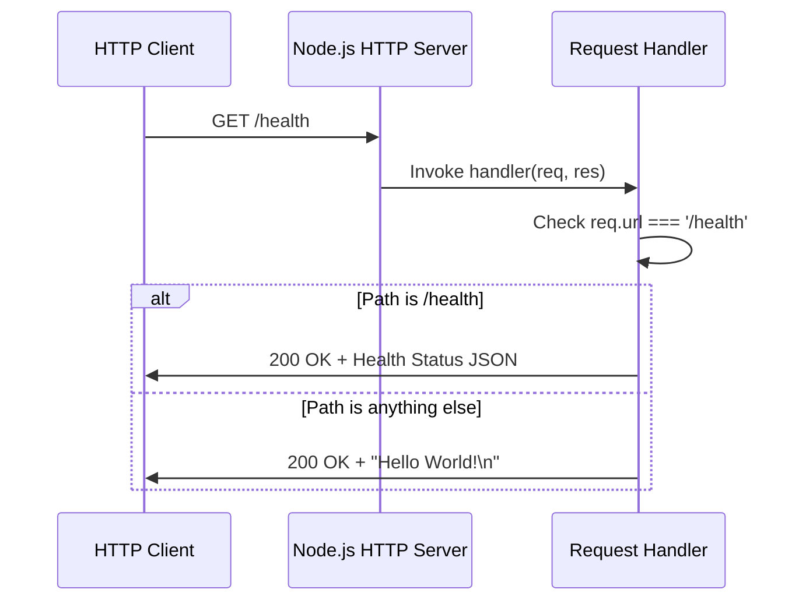

# Technical Specification

# 0. Agent Action Plan

## 0.1 Intent Clarification

### 0.1.1 Core Feature Objective

Based on the prompt, the Blitzy platform understands that the new feature requirement is to **add a health_check endpoint to the Hello World Node.js HTTP Server** to enable easy verification that the service is running correctly.

**Primary Requirement:**
- Implement an HTTP endpoint (e.g., `/health` or `/health_check`) that returns a response indicating the server's operational status
- This endpoint should allow clients (developers, monitoring systems, or load balancers) to verify the service is alive and responsive

**Implicit Requirements Detected:**

| Requirement | Description | Priority |
|-------------|-------------|----------|
| **URL Path Routing** | Current server responds identically to ALL paths; health check requires path-based routing to differentiate `/health` from other endpoints | Critical |
| **Status Response Format** | Health endpoint should return meaningful status information (not "Hello World!") | High |
| **HTTP Status Codes** | Health endpoint should return 200 for healthy state, potential for non-200 status if unhealthy | Medium |
| **Minimal Implementation** | Solution should maintain the educational simplicity philosophy of the project | Medium |
| **Backward Compatibility** | Existing `/` endpoint behavior (returning "Hello World!") must be preserved | High |

**Feature Dependencies and Prerequisites:**
- Node.js >=14.0.0 runtime (already satisfied - project uses Node.js built-in `http` module)
- No additional npm dependencies required (maintains zero-dependency architecture)
- URL parsing capability from Node.js core (`url` module or `req.url` property)

### 0.1.2 Special Instructions and Constraints

**Architectural Requirements:**
- Follow existing repository conventions using Node.js built-in `http` module
- Maintain the zero-dependency philosophy documented in Technical Specification Section 3.4
- Preserve the educational simplicity objective (currently 17 lines of code)
- Continue using CommonJS module system (`require` syntax)

**Integration Requirements:**
- Health check endpoint must integrate seamlessly with existing server initialization
- Must not break existing "Hello World!" response for non-health-check paths
- Console startup logging should remain unchanged

**No User-Provided Examples:** The user's request was straightforward - "add a health_check endpoint to the project."

**Web Search Requirements:** None required - implementing health check endpoints is a standard HTTP server pattern that requires no external research for this minimal implementation.

### 0.1.3 Technical Interpretation

These feature requirements translate to the following technical implementation strategy:

| Requirement | Technical Action | Target Component |
|-------------|------------------|------------------|
| **Add health_check endpoint** | Implement URL path routing in request handler to detect `/health` requests | `Hello_World_Node.js` - Request Handler (lines 8-12) |
| **Maintain backward compatibility** | Preserve "Hello World!" response for all non-health paths | `Hello_World_Node.js` - Request Handler |
| **Return health status** | Generate appropriate health response with status 200 and JSON or plain text body | `Hello_World_Node.js` - Request Handler |
| **Support service verification** | Include timestamp and status information in health response | `Hello_World_Node.js` - Request Handler |
| **Update documentation** | Document new `/health` endpoint and its response format | `README.md` |

**Implementation Approach Summary:**

To **implement the health_check feature**, we will **modify** the `Hello_World_Node.js` request handler by:
1. Adding URL path checking logic using `req.url`
2. Creating a conditional branch for `/health` path
3. Returning a health status response (JSON format recommended for programmatic consumption)
4. Preserving existing behavior for all other paths

To **maintain documentation accuracy**, we will **update** `README.md` by:
1. Adding a section documenting the new `/health` endpoint
2. Including the expected response format
3. Providing usage examples for health check verification

## 0.2 Repository Scope Discovery

### 0.2.1 Comprehensive File Analysis

**Repository Structure Analysis:**

The repository is a minimal Node.js project with exactly 3 files at the root level:

| File Path | Type | Current Purpose | Health Check Impact |
|-----------|------|-----------------|---------------------|
| `Hello_World_Node.js` | Source | Main HTTP server implementation (17 lines) | **MODIFY** - Add health check routing |
| `package.json` | Config | NPM manifest with project metadata | **REVIEW** - Consider adding test script |
| `README.md` | Documentation | User instructions and project documentation | **MODIFY** - Document health endpoint |

**Existing Module Analysis - Hello_World_Node.js:**

```
Lines 1-2:   Comment header
Line 3:      http module import
Lines 5-6:   Configuration constants (hostname, port)
Lines 8-12:  Request handler - universal response (MODIFY TARGET)
Lines 14-16: Server binding and startup logging
```

**Integration Point Discovery:**

| Integration Point | File Location | Modification Required |
|-------------------|---------------|----------------------|
| Request Handler Callback | `Hello_World_Node.js` lines 8-12 | Add URL routing logic for `/health` path |
| Server Initialization | `Hello_World_Node.js` line 8 | No modification (handler signature unchanged) |
| Response Generation | `Hello_World_Node.js` lines 9-11 | Add conditional health response |
| Configuration Constants | `Hello_World_Node.js` lines 5-6 | No modification required |
| Startup Logging | `Hello_World_Node.js` line 15 | No modification required |

**File Pattern Scan Results:**

| Pattern | Files Found | Relevance |
|---------|-------------|-----------|
| `**/*.js` | `Hello_World_Node.js` | Single source file - primary modification target |
| `**/*.json` | `package.json` | NPM manifest - optional test script addition |
| `**/*.md` | `README.md` | Documentation - must update with health endpoint info |
| `**/test*` | None | No existing tests |
| `**/.github/*` | None | No CI/CD configuration |
| `**/Dockerfile*` | None | No containerization |

### 0.2.2 New File Requirements

**No New Source Files Required:**

The health check feature can be implemented entirely within the existing `Hello_World_Node.js` file by modifying the request handler. Creating separate files would contradict the project's minimal single-file educational philosophy.

**New Test Files (Optional Enhancement):**

| File Path | Purpose | Priority |
|-----------|---------|----------|
| `Hello_World_Node.test.js` | Unit tests for health check endpoint | Optional |

**Note:** Per Technical Specification Section 6.6, automated testing is explicitly out of scope for this educational project. Test file creation is optional.

### 0.2.3 Files Requiring Modification

**Primary Modification Targets:**

| File | Modification Type | Specific Changes |
|------|-------------------|------------------|
| `Hello_World_Node.js` | MODIFY | Add URL path routing in request handler (lines 8-12) to detect `/health` requests and return health status response |
| `README.md` | MODIFY | Add documentation section for `/health` endpoint including response format and usage examples |

**Secondary Consideration:**

| File | Modification Type | Specific Changes |
|------|-------------------|------------------|
| `package.json` | OPTIONAL UPDATE | Consider adding description update to reflect new health check capability |

### 0.2.4 Current Request Handler Analysis

**Existing Implementation (Hello_World_Node.js lines 8-12):**
```javascript
const server = http.createServer((req, res) => {
  res.statusCode = 200;
  res.setHeader('Content-Type', 'text/plain');
  res.end('Hello World!\n');
});
```

**Current Behavior:**
- All HTTP requests (any method, any path) receive identical response
- No URL path inspection (`req.url` not used)
- No HTTP method inspection (`req.method` not used)
- Static response body: "Hello World!\n"

**Required Changes for Health Check:**
- Add `req.url` inspection to detect `/health` path
- Add conditional response logic
- Return health-specific response for `/health` requests
- Maintain existing response for all other paths

## 0.3 Dependency Inventory

### 0.3.1 Current Dependency State

**Package Manifest Analysis (package.json):**

```json
{
  "name": "hello-world-nodejs",
  "version": "1.0.0",
  "description": "A simple Hello World Node.js HTTP server application",
  "main": "server.js",
  "scripts": {
    "start": "node server.js",
    "dev": "node server.js"
  },
  "engines": {
    "node": ">=14.0.0"
  }
}
```

**Dependency Status:**
- **dependencies:** None (zero external packages)
- **devDependencies:** None (zero development packages)

### 0.3.2 Packages Relevant to Health Check Feature

| Registry | Package Name | Version | Purpose | Status |
|----------|--------------|---------|---------|--------|
| Node.js Built-in | `http` | N/A (ships with Node.js) | HTTP server creation | Already in use |
| Node.js Built-in | `url` | N/A (ships with Node.js) | URL parsing (optional) | Available, not required |

**No New Dependencies Required:**

The health check feature implementation requires NO additional npm packages. The feature can be implemented using:
- Existing `http` module (already imported)
- Native JavaScript string comparison (`req.url === '/health'`)

### 0.3.3 Zero-Dependency Architecture Preservation

**Design Decision:** Maintain the project's zero-dependency philosophy as documented in Technical Specification Section 3.4.

**Rationale:**
- Educational simplicity: No package installation required for new users
- Immediate executability: `node Hello_World_Node.js` works out-of-box
- No version conflicts: No `package-lock.json` or dependency resolution needed
- Smaller footprint: No `node_modules` directory

### 0.3.4 Import Updates

**Current Imports (Hello_World_Node.js line 3):**
```javascript
const http = require('http');
```

**Required Import Changes:** None

The `http` module's `IncomingMessage` object (`req`) already provides the `url` property needed for path routing. No additional imports are necessary.

### 0.3.5 Package.json Updates

**Recommended Updates (Optional):**

| Field | Current Value | Recommended Value | Rationale |
|-------|---------------|-------------------|-----------|
| `description` | "A simple Hello World Node.js HTTP server application" | "A simple Hello World Node.js HTTP server with health check endpoint" | Reflect new capability |
| `main` | "server.js" | "Hello_World_Node.js" | Fix filename mismatch |
| `scripts.start` | "node server.js" | "node Hello_World_Node.js" | Fix script to use actual filename |
| `scripts.dev` | "node server.js" | "node Hello_World_Node.js" | Fix script to use actual filename |

**Note:** The filename mismatch between `package.json` (references `server.js`) and actual file (`Hello_World_Node.js`) is a pre-existing issue documented in Technical Specification Section 1.2.3.2.

## 0.4 Integration Analysis

### 0.4.1 Existing Code Touchpoints

**Direct Modifications Required:**

| File | Location | Integration Point | Modification Description |
|------|----------|-------------------|-------------------------|
| `Hello_World_Node.js` | Lines 8-12 | Request Handler Callback | Add URL path routing logic to differentiate `/health` from other requests |
| `Hello_World_Node.js` | Lines 9-11 | Response Generation | Add conditional response: health status for `/health`, "Hello World!" for others |
| `README.md` | End of file | Documentation Section | Add new section documenting `/health` endpoint usage |

**Preserved Integration Points (No Changes):**

| File | Location | Integration Point | Reason for Preservation |
|------|----------|-------------------|------------------------|
| `Hello_World_Node.js` | Line 3 | Module Import (`http`) | Existing import sufficient for health check |
| `Hello_World_Node.js` | Lines 5-6 | Configuration Constants | Health check uses same hostname/port |
| `Hello_World_Node.js` | Line 8 | `http.createServer()` Call | Handler signature unchanged |
| `Hello_World_Node.js` | Lines 14-16 | Server Binding & Logging | Startup behavior unchanged |
| `package.json` | All fields | NPM Manifest | Core manifest structure preserved |

### 0.4.2 Request Flow Integration

**Current Request Flow:**
```
Client Request → HTTP Server → Request Handler → Static Response ("Hello World!")
```

**Updated Request Flow with Health Check:**
```
Client Request → HTTP Server → Request Handler → URL Path Check
                                                    ├─ /health → Health Status Response
                                                    └─ Other → "Hello World!" Response
```

**Integration Diagram:**



### 0.4.3 Database/Schema Updates

**Not Applicable:** The Hello World Node.js server is a stateless application with no database connectivity. No schema or migration changes required.

### 0.4.4 API Endpoint Integration

**New Endpoint Definition:**

| Method | Path | Response Type | Status Code | Description |
|--------|------|---------------|-------------|-------------|
| GET | `/health` | `application/json` | 200 | Returns server health status |
| * (all) | `/*` (all other paths) | `text/plain` | 200 | Returns "Hello World!\n" (existing behavior) |

**Health Check Response Schema:**

```json
{
  "status": "healthy",
  "timestamp": "2024-01-01T00:00:00.000Z",
  "uptime": 123.456
}
```

**Response Fields:**
- `status`: String indicating server health ("healthy")
- `timestamp`: ISO 8601 timestamp of the health check response
- `uptime`: Server uptime in seconds (optional, adds production value)

### 0.4.5 Backward Compatibility Verification

| Existing Behavior | Preservation Strategy | Verification |
|-------------------|----------------------|--------------|
| `GET /` returns "Hello World!\n" | Route only `/health` separately; all other paths use existing logic | Test: `curl http://127.0.0.1:3000/` returns "Hello World!" |
| `GET /any/path` returns "Hello World!\n" | Non-health paths fall through to default response | Test: `curl http://127.0.0.1:3000/test` returns "Hello World!" |
| Response Content-Type: text/plain | Preserve for non-health endpoints | Verify Content-Type header |
| HTTP 200 status code | Maintain 200 for all successful responses | Verify status codes |
| Console startup message | No changes to logging | Verify startup message appears |

## 0.5 Technical Implementation

### 0.5.1 File-by-File Execution Plan

**CRITICAL: Every file listed below MUST be modified as specified.**

#### Group 1 - Core Feature Implementation

| Action | File Path | Lines | Modification Details |
|--------|-----------|-------|---------------------|
| **MODIFY** | `Hello_World_Node.js` | 8-12 | Add URL routing in request handler to detect `/health` path and return health status JSON response |

**Implementation Approach:**

```javascript
// Modified request handler with health check routing
const server = http.createServer((req, res) => {
  if (req.url === '/health') {
    res.statusCode = 200;
    res.setHeader('Content-Type', 'application/json');
    res.end(JSON.stringify({ status: 'healthy', timestamp: new Date().toISOString() }));
  } else {
    res.statusCode = 200;
    res.setHeader('Content-Type', 'text/plain');
    res.end('Hello World!\n');
  }
});
```

#### Group 2 - Documentation Updates

| Action | File Path | Section | Modification Details |
|--------|-----------|---------|---------------------|
| **MODIFY** | `README.md` | New section after "How It Works" | Add "Health Check Endpoint" section documenting `/health` endpoint, response format, and usage examples |

**README.md Addition:**

Add new section with:
- Endpoint description (`GET /health`)
- Response format (JSON)
- Example usage with `curl`
- Expected response body

#### Group 3 - Optional Configuration Updates

| Action | File Path | Fields | Modification Details |
|--------|-----------|--------|---------------------|
| **OPTIONAL MODIFY** | `package.json` | `description`, `main`, `scripts` | Fix filename references and update description to reflect health check capability |

### 0.5.2 Implementation Sequence

**Phase 1: Core Implementation**
1. Modify `Hello_World_Node.js` request handler to add health check routing
2. Implement JSON response for `/health` endpoint
3. Preserve existing behavior for non-health paths

**Phase 2: Documentation**
1. Add "Health Check Endpoint" section to `README.md`
2. Document response format and usage

**Phase 3: Verification**
1. Start server: `node Hello_World_Node.js`
2. Verify health endpoint: `curl http://127.0.0.1:3000/health`
3. Verify backward compatibility: `curl http://127.0.0.1:3000/`

### 0.5.3 Code Transformation Details

**Before (Current Implementation):**

```javascript
const server = http.createServer((req, res) => {
  res.statusCode = 200;
  res.setHeader('Content-Type', 'text/plain');
  res.end('Hello World!\n');
});
```

**After (With Health Check):**

```javascript
const server = http.createServer((req, res) => {
  if (req.url === '/health') {
    const healthStatus = { status: 'healthy', timestamp: new Date().toISOString() };
    res.statusCode = 200;
    res.setHeader('Content-Type', 'application/json');
    res.end(JSON.stringify(healthStatus));
  } else {
    res.statusCode = 200;
    res.setHeader('Content-Type', 'text/plain');
    res.end('Hello World!\n');
  }
});
```

### 0.5.4 Validation Criteria

| Criterion | Validation Method | Expected Result |
|-----------|-------------------|-----------------|
| Health endpoint accessible | `curl http://127.0.0.1:3000/health` | Returns JSON health status |
| Health response format | Parse response body | Valid JSON with `status` and `timestamp` fields |
| Health response status code | Check HTTP status | 200 OK |
| Health response Content-Type | Check header | `application/json` |
| Backward compatibility (root) | `curl http://127.0.0.1:3000/` | Returns "Hello World!\n" |
| Backward compatibility (other paths) | `curl http://127.0.0.1:3000/test` | Returns "Hello World!\n" |
| Server startup unchanged | Observe console | Shows "Server running at http://127.0.0.1:3000/" |

### 0.5.5 Edge Case Handling

| Edge Case | Behavior | Implementation |
|-----------|----------|----------------|
| `/health` with query string (`/health?foo=bar`) | Match only exact `/health` | `req.url === '/health'` (query strings not matched) |
| `/HEALTH` (uppercase) | Treat as regular path, return "Hello World!" | Case-sensitive matching |
| `/health/` (trailing slash) | Treat as regular path, return "Hello World!" | Exact match only |
| POST/PUT/DELETE to `/health` | Return health status (all methods) | No method filtering in initial implementation |

**Note:** The simple exact-match routing (`req.url === '/health'`) provides predictable behavior while maintaining code simplicity. More sophisticated routing (query string stripping, case-insensitivity) would add complexity beyond the educational scope.

## 0.6 Scope Boundaries

### 0.6.1 Exhaustively In Scope

**Source Files:**

| File Pattern | Specific Files | Modification Type |
|--------------|----------------|-------------------|
| `Hello_World_Node.js` | Main server implementation | MODIFY - Add health check routing in request handler |

**Documentation Files:**

| File Pattern | Specific Files | Modification Type |
|--------------|----------------|-------------------|
| `README.md` | Project documentation | MODIFY - Add health check endpoint documentation |

**Configuration Files:**

| File Pattern | Specific Files | Modification Type |
|--------------|----------------|-------------------|
| `package.json` | NPM manifest | OPTIONAL MODIFY - Update description, fix filename references |

**Complete In-Scope File List:**

```
/Hello_World_Node.js    [MODIFY]     - Add /health endpoint routing
/README.md              [MODIFY]     - Document health check endpoint
/package.json           [OPTIONAL]   - Update description and fix references
```

### 0.6.2 Explicitly Out of Scope

**Features NOT Included:**

| Item | Reason for Exclusion |
|------|---------------------|
| Readiness probe endpoint (`/ready`) | Beyond minimal health check requirement; can be added as future enhancement |
| Liveness probe endpoint (`/live`) | Beyond minimal health check requirement |
| Detailed status endpoint (`/status`) | Complexity exceeds educational scope |
| Dependency health checks | No external dependencies to check |
| Database connectivity checks | No database in this project |
| Configurable health check path | Fixed `/health` path maintains simplicity |
| HTTP method filtering (GET-only) | All methods accepted to maintain simplicity |

**Infrastructure NOT Included:**

| Item | Reason for Exclusion |
|------|---------------------|
| Docker health check configuration | No Dockerfile exists |
| Kubernetes probes configuration | No Kubernetes manifests exist |
| CI/CD pipeline updates | No CI/CD configuration exists |
| Automated tests | Per Technical Specification Section 6.6, testing is out of scope |
| Monitoring integration | Per Technical Specification Section 6.5, monitoring is out of scope |

**Code NOT Modified:**

| File/Location | Reason for Preservation |
|---------------|------------------------|
| `Hello_World_Node.js` lines 1-6 | Import and configuration unchanged |
| `Hello_World_Node.js` lines 14-16 | Server binding and logging unchanged |
| Response behavior for non-health paths | Backward compatibility maintained |

### 0.6.3 Success Criteria Summary

| Criterion | Metric | Verification Method |
|-----------|--------|---------------------|
| Health endpoint responds | `GET /health` returns 200 | `curl -s -o /dev/null -w "%{http_code}" http://127.0.0.1:3000/health` |
| Health response is JSON | Content-Type: application/json | Check response headers |
| Health response has status field | JSON contains `status: "healthy"` | Parse and validate JSON |
| Backward compatibility | `GET /` returns "Hello World!" | `curl http://127.0.0.1:3000/` |
| Documentation updated | README includes health check section | Review README.md |
| Code simplicity maintained | Implementation under 25 lines | Line count of Hello_World_Node.js |

### 0.6.4 Special Instructions for Health Check Feature

**Feature-Specific Requirements:**

- **Simplicity First:** Implementation must maintain the educational philosophy with minimal code additions
- **Zero Dependencies:** No npm packages may be added; use only Node.js built-ins
- **JSON Response:** Health endpoint returns JSON for programmatic consumption by monitoring tools
- **Backward Compatible:** Existing "Hello World!" behavior must be preserved for all non-health paths

**Response Format Standard:**

```json
{
  "status": "healthy",
  "timestamp": "2024-01-01T00:00:00.000Z"
}
```

**Routing Convention:**
- Endpoint path: `/health` (exact match, case-sensitive)
- HTTP methods: All methods accepted (GET, POST, etc.)
- Content-Type: `application/json`

### 0.6.5 Implementation Checklist

| # | Task | File | Status |
|---|------|------|--------|
| 1 | Add URL path check for `/health` | Hello_World_Node.js | PENDING |
| 2 | Implement health status JSON response | Hello_World_Node.js | PENDING |
| 3 | Preserve "Hello World!" for other paths | Hello_World_Node.js | PENDING |
| 4 | Add health check documentation section | README.md | PENDING |
| 5 | (Optional) Fix filename references | package.json | PENDING |
| 6 | Test health endpoint | Manual verification | PENDING |
| 7 | Test backward compatibility | Manual verification | PENDING |

