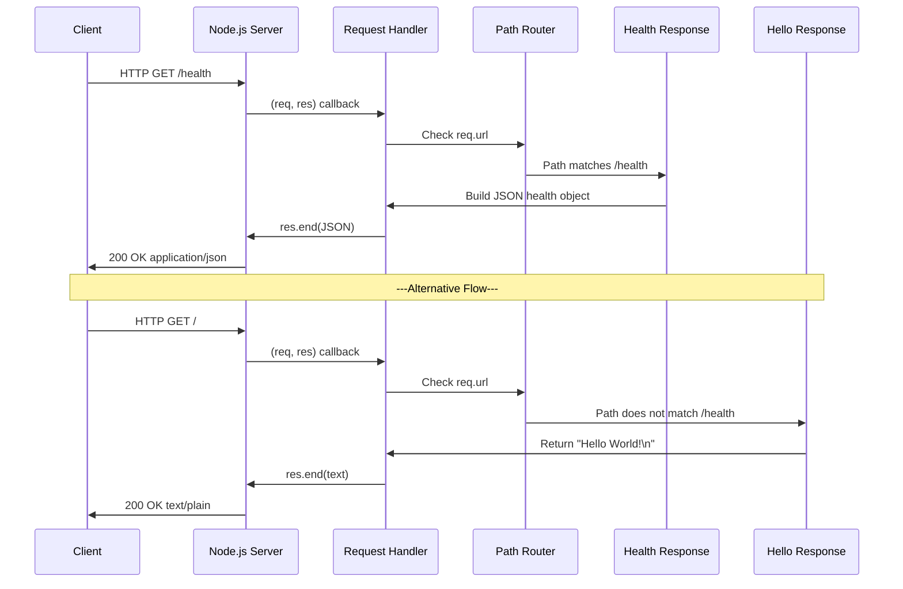
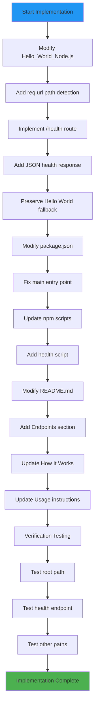
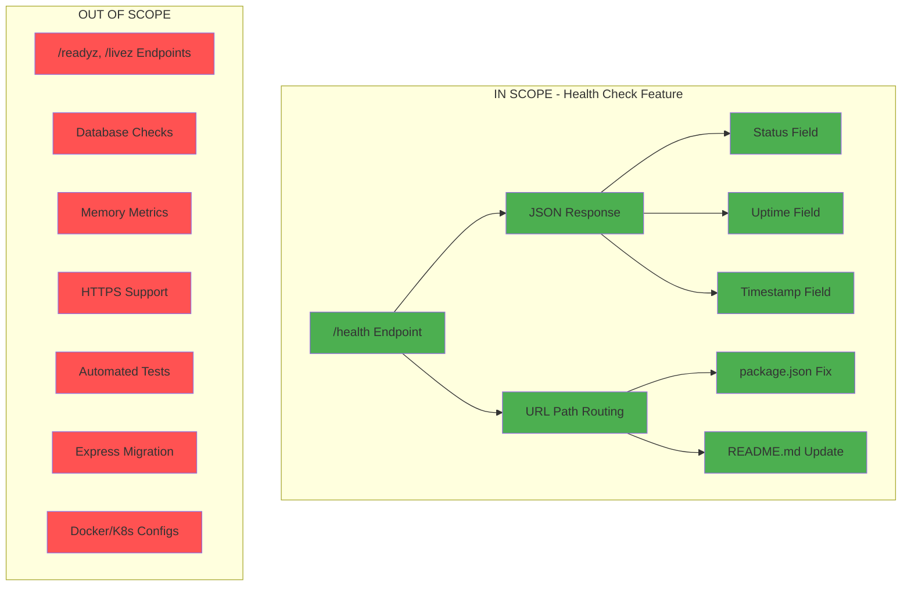

# Technical Specification

# 0. Agent Action Plan

## 0.1 Intent Clarification

Based on the prompt, the Blitzy platform understands that the new feature requirement is to add a health check endpoint to the existing Hello World Node.js HTTP server application. This endpoint will enable users to verify that the service is running correctly through a dedicated HTTP endpoint.

### 0.1.1 Core Feature Objective

**Primary Requirement:** Implement a `/health` endpoint that provides service availability verification for the existing Node.js HTTP server.

**Feature Requirements with Enhanced Clarity:**

- **Health Check Endpoint Creation:** Add a new HTTP endpoint (recommended: `/health`) that responds to HTTP GET requests with a status indicating the service is operational
- **Service Status Verification:** The endpoint must return an HTTP 200 OK status code when the service is running correctly
- **Response Content:** Provide a structured response containing service health information (status, uptime, timestamp)
- **Zero Downtime Integration:** Implement the health check without disrupting existing "Hello World" functionality
- **Routing Implementation:** Introduce basic URL path routing to differentiate between the existing root response and the new health check endpoint

**Implicit Requirements Detected:**

- The current server implementation responds identically to ALL HTTP requests regardless of path - this must be changed to implement routing
- The existing monolithic request handler needs to be refactored to support multiple endpoints
- The health check should follow industry best practices for Kubernetes liveness/readiness probes compatibility
- Response format should use JSON for structured health status information
- The implementation must maintain the zero-dependency philosophy by using only Node.js built-in modules

**Feature Dependencies and Prerequisites:**

| Prerequisite | Current State | Required Action |
|--------------|---------------|-----------------|
| URL Path Routing | Not implemented | Add path-based routing logic |
| JSON Response Capability | Not implemented | Add JSON content-type handling |
| Process Uptime Tracking | Available via `process.uptime()` | Integrate into health response |
| Request URL Parsing | Not implemented | Use `req.url` for path detection |

### 0.1.2 Special Instructions and Constraints

**Architectural Requirements:**

- **Maintain Zero-Dependency Philosophy:** The implementation must use only Node.js built-in modules (http, process)
- **Follow Repository Conventions:** Keep the code minimalist and educational in nature
- **Preserve Backward Compatibility:** The existing "Hello World!" response at the root path must continue to function identically

**Integration Requirements:**

- The health check endpoint should be the first check in the request handler to ensure fast response times
- <cite index="4-1">"Take a 'first and final' approach when implementing the health check endpoint: It should be the first thing an application does when responding to a request, and the result should be final"</cite>

**Best Practice Considerations:**

- <cite index="7-4,7-5,7-6">We don't recommend the use of a module to add health checks to your application. It's best to stick with a minimal implementation for most cases. The tradeoff between the amount of code you need to add to your application for a minimal implementation versus the costs of adding a new dependency leads us to recommend adding the code directly.</cite>
- <cite index="7-1,7-2">"Use consistent naming for your endpoints across micro-services. /readyz and /livez are common choices for the endpoints for the readiness and liveness probes, respectively."</cite>

**Response Format Standards:**

- Return HTTP 200 status code for healthy state
- Use `Content-Type: application/json` for structured response
- Include useful metrics: status, uptime, timestamp
- <cite index="1-27">"Here are some of the things we checked for: the response time of the server, the uptime of the server, the status code of the server (as long as it is 200, we are going to get an 'OK' message), and the timestamp of the server."</cite>

### 0.1.3 Technical Interpretation

These feature requirements translate to the following technical implementation strategy:

| Requirement | Technical Implementation |
|-------------|--------------------------|
| Health check endpoint | Add URL path routing in request handler to detect `/health` path |
| Service verification | Return JSON response with `status: "ok"`, `uptime`, and `timestamp` |
| Routing capability | Implement `req.url` parsing to differentiate between `/health` and other paths |
| JSON response | Use `res.setHeader('Content-Type', 'application/json')` and `JSON.stringify()` |
| Backward compatibility | Route all non-health-check paths to existing "Hello World!" response |

**Implementation Approach:**

- To **implement the health check endpoint**, we will **modify** `Hello_World_Node.js` to add URL path detection and conditional response handling
- To **maintain backward compatibility**, we will **implement** a routing switch that checks `req.url` before generating responses
- To **provide health information**, we will **use** Node.js built-in `process.uptime()` and `Date.now()` functions
- To **follow best practices**, we will **implement** the health check as the first path check in the request handler
- To **update documentation**, we will **modify** `README.md` to document the new endpoint
- To **fix configuration mismatch**, we will **update** `package.json` to reference the correct entry point filename

## 0.2 Repository Scope Discovery

This section provides a comprehensive analysis of ALL repository files that require modification or creation to implement the health check endpoint feature.

### 0.2.1 Comprehensive File Analysis

**Repository Structure Overview:**

```
hello-world-nodejs/
├── Hello_World_Node.js    # Main server file (MODIFY)
├── package.json           # Package manifest (MODIFY)
└── README.md              # Documentation (MODIFY)
```

**Total Files:** 3 files
**Files Requiring Modification:** 3 files
**New Files to Create:** 0 files (feature integrated into existing structure)

#### 0.2.1.1 Existing Files to Modify

| File Path | File Type | Current Purpose | Modification Required |
|-----------|-----------|-----------------|----------------------|
| `Hello_World_Node.js` | JavaScript | HTTP server implementation | Add health check routing and JSON response handling |
| `package.json` | JSON | Package manifest | Fix entry point mismatch (server.js → Hello_World_Node.js), add health-check script |
| `README.md` | Markdown | Documentation | Document new `/health` endpoint usage and response format |

#### 0.2.1.2 File-by-File Impact Assessment

**Hello_World_Node.js (Lines 1-17) - PRIMARY MODIFICATION**

| Line Range | Current Code | Required Change |
|------------|--------------|-----------------|
| Lines 8-12 | Single request handler returning "Hello World!" | Implement URL path routing with health check branch |
| Line 9 | `res.statusCode = 200;` | Conditionally set status based on path |
| Line 10 | `res.setHeader('Content-Type', 'text/plain');` | Conditionally set JSON content type for /health |
| Line 11 | `res.end('Hello World!\n');` | Return JSON health object for /health path |

**package.json (Lines 1-21) - CONFIGURATION FIX**

| Field | Current Value | Required Change | Reason |
|-------|---------------|-----------------|--------|
| `main` | `"server.js"` | `"Hello_World_Node.js"` | Fix entry point mismatch |
| `scripts.start` | `"node server.js"` | `"node Hello_World_Node.js"` | Align with actual filename |
| `scripts.dev` | `"node server.js"` | `"node Hello_World_Node.js"` | Align with actual filename |
| `scripts.health` | N/A (new) | `"curl http://127.0.0.1:3000/health"` | Add health check verification command |

**README.md (Lines 1-54) - DOCUMENTATION UPDATE**

| Section | Current Content | Required Addition |
|---------|-----------------|-------------------|
| Usage | Steps to run server and view "Hello World!" | Add steps to verify health check endpoint |
| How It Works | Describes single response pattern | Document routing and health check functionality |
| Endpoints | N/A (new section) | Add section documenting `/` and `/health` endpoints |

### 0.2.2 Integration Point Discovery

#### 0.2.2.1 API Endpoints Analysis

**Current Endpoint Pattern:**

| Method | Path | Response | Status |
|--------|------|----------|--------|
| ANY | ANY PATH | "Hello World!\n" | 200 OK |

**Proposed Endpoint Pattern After Modification:**

| Method | Path | Response Type | Response Body | Status |
|--------|------|---------------|---------------|--------|
| GET | `/health` | application/json | `{"status":"ok","uptime":N,"timestamp":T}` | 200 OK |
| ANY | `/*` (all other paths) | text/plain | "Hello World!\n" | 200 OK |

#### 0.2.2.2 Request Handler Touchpoints

**Direct Modifications Required in Request Handler:**

- **URL Path Detection:** Add `req.url` inspection at handler entry point
- **Conditional Response Logic:** Implement switch/if-else for path-based routing
- **JSON Response Generation:** Add JSON serialization for health response object
- **Content-Type Handling:** Set appropriate content type per endpoint

#### 0.2.2.3 Process Information Integration

**Node.js Built-in APIs to Integrate:**

| API | Purpose | Usage Location |
|-----|---------|----------------|
| `req.url` | Extract request path | Request handler (line 8) |
| `process.uptime()` | Server uptime in seconds | Health response object |
| `Date.now()` | Current timestamp | Health response object |
| `JSON.stringify()` | Serialize health object | Response body generation |

### 0.2.3 Web Search Research Conducted

**Research Areas Investigated:**

- **Best practices for implementing health check endpoints in Node.js**
  - Result: Minimal implementation recommended over external modules
  - Evidence: Node.js Reference Architecture recommends adding code directly
  
- **Industry standard health check response formats**
  - Result: JSON format with status, uptime, and timestamp fields
  - Evidence: Common pattern across Express, Kubernetes, and cloud platforms

- **Common endpoint naming conventions**
  - Result: `/health`, `/livez`, `/readyz` are standard choices
  - Evidence: Kubernetes z-pages pattern widely adopted

- **Security considerations for health endpoints**
  - Result: For localhost-only services, no authentication needed
  - Evidence: Network isolation provides sufficient security boundary

### 0.2.4 New File Requirements

**New Source Files to Create:** None required

The feature will be implemented by modifying existing files to maintain the project's minimalist, single-file architecture philosophy. Creating separate files would contradict the educational simplicity objective documented in the technical specification.

**Rationale for In-Place Modification:**

- The existing `Hello_World_Node.js` file is only 17 lines - adding routing logic maintains educational clarity
- Creating separate route files would introduce modular complexity inappropriate for this educational project
- The zero-dependency philosophy supports inline implementation over module extraction

### 0.2.5 Configuration and Documentation Files

**Configuration Files Requiring Updates:**

| File | Update Type | Specific Changes |
|------|-------------|------------------|
| `package.json` | Entry point fix | Update `main`, `scripts.start`, `scripts.dev` |
| `package.json` | New script | Add `scripts.health` for endpoint verification |

**Documentation Files Requiring Updates:**

| File | Update Type | Specific Changes |
|------|-------------|------------------|
| `README.md` | Feature documentation | Add Endpoints section, update How It Works section |
| `README.md` | Usage instructions | Add health check verification steps |

## 0.3 Dependency Inventory

This section documents all packages and dependencies relevant to the health check endpoint feature implementation.

### 0.3.1 Private and Public Packages

**Package Registry Analysis:**

| Registry | Package Name | Version | Purpose | Status |
|----------|--------------|---------|---------|--------|
| Node.js Built-in | `http` | (bundled with Node.js >=14.0.0) | HTTP server creation | EXISTING - No change |
| Node.js Built-in | `process` | (bundled with Node.js >=14.0.0) | Access uptime and memory info | NEW USAGE - For health metrics |
| Node.js Global | `console` | (bundled with Node.js >=14.0.0) | Logging to stdout | EXISTING - No change |
| Node.js Global | `JSON` | (bundled with Node.js >=14.0.0) | JSON serialization | NEW USAGE - For health response |

**External Dependencies:** None required

The health check implementation maintains the project's zero-dependency philosophy by using exclusively Node.js built-in modules.

### 0.3.2 Runtime Requirements

**Node.js Version Compatibility:**

| Requirement | Specified Version | Verified Compatible |
|-------------|-------------------|---------------------|
| Minimum Node.js | >=14.0.0 | Yes - All APIs used are stable since Node.js 14.x |
| Current Development | v20.19.6 | Yes - Fully compatible |

**API Stability Verification:**

| API | Stability Status | Available Since |
|-----|------------------|-----------------|
| `http.createServer()` | Stable | Node.js 0.1.0 |
| `req.url` | Stable | Node.js 0.1.0 |
| `res.setHeader()` | Stable | Node.js 0.1.0 |
| `res.end()` | Stable | Node.js 0.1.0 |
| `process.uptime()` | Stable | Node.js 0.5.0 |
| `Date.now()` | JavaScript Standard | All versions |
| `JSON.stringify()` | JavaScript Standard | All versions |

### 0.3.3 Dependency Updates

#### 0.3.3.1 Import Updates

**Files Requiring Import Updates:** None

The implementation uses only existing imports and Node.js global objects. No new `require()` statements are needed:

```javascript
// EXISTING - No change needed
const http = require('http');

// NEW USAGE - No import needed (global objects)
// process.uptime() - Global 'process' object
// JSON.stringify() - Global 'JSON' object
// Date.now() - Global 'Date' object
```

#### 0.3.3.2 Import Transformation Rules

Not applicable - No import changes required.

#### 0.3.3.3 External Reference Updates

**Configuration Files:**

| File | Field | Current Value | New Value |
|------|-------|---------------|-----------|
| `package.json` | `main` | `"server.js"` | `"Hello_World_Node.js"` |
| `package.json` | `scripts.start` | `"node server.js"` | `"node Hello_World_Node.js"` |
| `package.json` | `scripts.dev` | `"node server.js"` | `"node Hello_World_Node.js"` |
| `package.json` | `scripts.health` | N/A | `"curl http://127.0.0.1:3000/health"` |

**Documentation Updates:**

| File | Section | Update Type |
|------|---------|-------------|
| `README.md` | Usage | Add health endpoint verification |
| `README.md` | Endpoints | New section |

### 0.3.4 Build and Development Dependencies

**Current devDependencies:** None (zero-dependency project)

**Proposed devDependencies:** None

The health check feature maintains the zero-dependency architecture:

```json
{
  "dependencies": {},
  "devDependencies": {}
}
```

**Rationale:** Following the Node.js Reference Architecture recommendation that "the tradeoff between the amount of code you need to add to your application for a minimal implementation versus the costs of adding a new dependency leads us to recommend adding the code directly."

### 0.3.5 Dependency Verification Checklist

| Check | Status | Evidence |
|-------|--------|----------|
| No new npm packages required | ✅ Verified | Using only Node.js built-ins |
| All APIs stable and documented | ✅ Verified | All APIs available since Node.js 14.x |
| Backward compatible with Node.js >=14.0.0 | ✅ Verified | All APIs stable in supported range |
| Zero security vulnerabilities introduced | ✅ Verified | No third-party code added |
| No dependency version conflicts | ✅ N/A | No dependencies to conflict |

## 0.4 Integration Analysis

This section documents all existing code touchpoints and integration points affected by the health check endpoint implementation.

### 0.4.1 Existing Code Touchpoints

#### 0.4.1.1 Direct Modifications Required

**Hello_World_Node.js - Request Handler Modification**

| Location | Current Code | Modification |
|----------|--------------|--------------|
| Line 8 | `const server = http.createServer((req, res) => {` | Add URL path detection at handler entry |
| Line 9 | `res.statusCode = 200;` | Move inside conditional blocks |
| Line 10 | `res.setHeader('Content-Type', 'text/plain');` | Conditionally set content type |
| Line 11 | `res.end('Hello World!\n');` | Route to appropriate response |

**Code Flow Transformation:**

```
CURRENT FLOW:
┌─────────────────┐     ┌─────────────────┐
│  Any Request    │────▶│ "Hello World!"  │
│  (any path)     │     │   Response      │
└─────────────────┘     └─────────────────┘

PROPOSED FLOW:
┌─────────────────┐     ┌─────────────────┐     ┌─────────────────┐
│  HTTP Request   │────▶│  Path Router    │────▶│  /health?       │
└─────────────────┘     └─────────────────┘     └────────┬────────┘
                                                         │
                                    ┌────────────────────┼────────────────────┐
                                    ▼                                         ▼
                        ┌─────────────────────┐               ┌─────────────────────┐
                        │  YES: JSON Health   │               │  NO: Hello World    │
                        │  Status Response    │               │  Text Response      │
                        └─────────────────────┘               └─────────────────────┘
```

#### 0.4.1.2 Integration Points in Hello_World_Node.js

**Line-by-Line Analysis:**

| Line | Code | Integration Impact |
|------|------|--------------------|
| 1 | `// Simple Hello World...` | No change |
| 2 | (blank) | No change |
| 3 | `const http = require('http');` | No change - existing import sufficient |
| 4 | (blank) | No change |
| 5 | `const hostname = '127.0.0.1';` | No change - same binding |
| 6 | `const port = 3000;` | No change - same port |
| 7 | (blank) | No change |
| 8-12 | Request handler | **MAJOR MODIFICATION** - Add routing logic |
| 13 | (blank) | No change |
| 14-16 | `server.listen(...)` | No change - same listener |
| 17 | (blank) | No change |

### 0.4.2 Dependency Injections

**Status:** Not applicable

The system architecture uses no dependency injection patterns. All components are directly instantiated within the single file:

- HTTP server created via `http.createServer()`
- Request handler defined as inline arrow function
- No service containers or dependency resolution

### 0.4.3 Database/Schema Updates

**Status:** Not applicable

The system has no database connectivity:
- No SQL or NoSQL databases
- No migrations required
- No schema changes needed
- Health check operates entirely in-memory using `process` module

### 0.4.4 Configuration Integration

**package.json Configuration Updates:**

| Configuration Area | Current State | Required Integration |
|--------------------|---------------|----------------------|
| Entry Point | Misconfigured (`server.js`) | Fix to `Hello_World_Node.js` |
| NPM Scripts | Point to wrong file | Update `start` and `dev` scripts |
| Health Script | Not present | Add convenience script for health verification |

**Proposed package.json Changes:**

```json
{
  "main": "Hello_World_Node.js",
  "scripts": {
    "start": "node Hello_World_Node.js",
    "dev": "node Hello_World_Node.js",
    "health": "curl -s http://127.0.0.1:3000/health | json_pp"
  }
}
```

### 0.4.5 Request/Response Flow Integration

**HTTP Request Processing Integration:**



### 0.4.6 Logging Integration

**Console Logging Touchpoints:**

| Current Logging | Location | Health Check Impact |
|-----------------|----------|---------------------|
| Startup message | Line 15 | No modification needed |

**Potential Enhancement (Optional):**
- Add request logging for health check hits (not required for MVP)
- Current architecture has no request-level logging

### 0.4.7 Error Handling Integration

**Error Handling Strategy:**

The health check will inherit the existing "fail-fast" error handling pattern:
- No try-catch blocks (synchronous operations only)
- Process crashes on uncaught exceptions
- No custom error responses for health endpoint

**Health Check Error Scenarios:**

| Scenario | System Behavior | Health Endpoint Behavior |
|----------|-----------------|--------------------------|
| Server running | Normal operation | Returns 200 with health JSON |
| Port conflict (EADDRINUSE) | Process crashes before listen | Endpoint unreachable |
| Process not started | No server running | Connection refused |

### 0.4.8 Integration Validation Matrix

| Integration Point | Verification Method | Success Criteria |
|-------------------|---------------------|------------------|
| Health endpoint routing | `curl http://127.0.0.1:3000/health` | Returns JSON with status "ok" |
| Hello endpoint preservation | `curl http://127.0.0.1:3000/` | Returns "Hello World!\n" |
| Other paths preserved | `curl http://127.0.0.1:3000/anypath` | Returns "Hello World!\n" |
| Content-Type: JSON | Check response headers | `application/json` for /health |
| Content-Type: Text | Check response headers | `text/plain` for other paths |
| Uptime accuracy | Compare with process start time | Uptime in seconds, positive number |
| Timestamp accuracy | Compare with current time | Unix timestamp within 1 second |

## 0.5 Technical Implementation

This section provides the detailed file-by-file execution plan for implementing the health check endpoint feature.

### 0.5.1 File-by-File Execution Plan

**CRITICAL:** Every file listed below MUST be created or modified as specified.

#### 0.5.1.1 Group 1 - Core Feature Files

| Action | File | Purpose |
|--------|------|---------|
| MODIFY | `Hello_World_Node.js` | Add health check routing and JSON response generation |

**Hello_World_Node.js Modifications:**

**Implementation Requirements:**
- Add URL path detection using `req.url`
- Implement conditional routing for `/health` endpoint
- Generate JSON health response with status, uptime, and timestamp
- Preserve existing "Hello World!" response for all other paths
- Set appropriate Content-Type headers per endpoint

**Code Structure After Modification:**

```javascript
const server = http.createServer((req, res) => {
  // Health check - first and final approach
  if (req.url === '/health') {
    // Health endpoint logic
  } else {
    // Existing Hello World logic
  }
});
```

**Health Response Object Structure:**

```json
{
  "status": "ok",
  "uptime": 123.456,
  "timestamp": 1704067200000
}
```

#### 0.5.1.2 Group 2 - Configuration Files

| Action | File | Purpose |
|--------|------|---------|
| MODIFY | `package.json` | Fix entry point mismatch, add health verification script |

**package.json Modifications:**

| Field | Change Type | Before | After |
|-------|-------------|--------|-------|
| `main` | UPDATE | `"server.js"` | `"Hello_World_Node.js"` |
| `scripts.start` | UPDATE | `"node server.js"` | `"node Hello_World_Node.js"` |
| `scripts.dev` | UPDATE | `"node server.js"` | `"node Hello_World_Node.js"` |
| `scripts.health` | ADD | N/A | `"curl -s http://127.0.0.1:3000/health"` |

#### 0.5.1.3 Group 3 - Documentation

| Action | File | Purpose |
|--------|------|---------|
| MODIFY | `README.md` | Document new health endpoint and usage |

**README.md Additions:**

- **New Section:** "Endpoints" - Document both `/` and `/health` endpoints
- **Update Section:** "How It Works" - Add routing explanation
- **Update Section:** "Usage" - Add health check verification steps

### 0.5.2 Implementation Approach per File

#### 0.5.2.1 Hello_World_Node.js Implementation

**Step 1: Add Health Check Routing**

Modify the request handler to check `req.url` and route appropriately:

```javascript
if (req.url === '/health') {
  // Health check response
}
```

**Step 2: Implement Health Response**

Generate JSON response with health metrics:

```javascript
const healthData = {
  status: 'ok',
  uptime: process.uptime(),
  timestamp: Date.now()
};
res.setHeader('Content-Type', 'application/json');
res.end(JSON.stringify(healthData));
```

**Step 3: Preserve Existing Behavior**

Keep "Hello World!" response for non-health paths:

```javascript
} else {
  res.statusCode = 200;
  res.setHeader('Content-Type', 'text/plain');
  res.end('Hello World!\n');
}
```

#### 0.5.2.2 package.json Implementation

**Step 1: Fix Entry Point**

Update `main` field to reference correct filename.

**Step 2: Update Scripts**

Modify `start` and `dev` scripts to use correct filename.

**Step 3: Add Health Script**

Add convenience script for health verification.

#### 0.5.2.3 README.md Implementation

**Step 1: Add Endpoints Section**

Document available HTTP endpoints with response formats.

**Step 2: Update How It Works**

Explain the routing logic and health check functionality.

**Step 3: Update Usage Instructions**

Add steps for verifying the health check endpoint.

### 0.5.3 Implementation Sequence



### 0.5.4 Verification Procedures

**Manual Verification Steps:**

| Step | Command | Expected Result |
|------|---------|-----------------|
| 1 | `node Hello_World_Node.js` | Server starts, logs startup message |
| 2 | `curl http://127.0.0.1:3000/` | Returns "Hello World!\n" |
| 3 | `curl http://127.0.0.1:3000/health` | Returns JSON with status "ok" |
| 4 | `curl http://127.0.0.1:3000/anypath` | Returns "Hello World!\n" |
| 5 | `curl -I http://127.0.0.1:3000/health` | Content-Type: application/json |
| 6 | `curl -I http://127.0.0.1:3000/` | Content-Type: text/plain |

**Health Response Validation:**

```bash
# Verify health endpoint returns valid JSON
curl -s http://127.0.0.1:3000/health | python3 -m json.tool

#### Expected output structure:
{
    "status": "ok",
    "uptime": 42.123456789,
    "timestamp": 1704067200000
}
```

### 0.5.5 Code Quality Standards

**Implementation Constraints:**

| Constraint | Requirement | Verification |
|------------|-------------|--------------|
| Line Count | Keep total under 30 lines | Visual inspection |
| Dependencies | Zero external packages | Check package.json |
| Module System | CommonJS only | Use `require()` not `import` |
| ES Features | Compatible with Node.js 14+ | No experimental features |
| Error Handling | Synchronous operations only | No try-catch required |

**Code Style Requirements:**

- Use `const` for all variable declarations
- Use arrow functions for callbacks
- Use template literals for string interpolation
- Maintain consistent indentation (2 spaces)
- Include comment header for file purpose

## 0.6 Scope Boundaries

This section defines the explicit boundaries of what is included in and excluded from the health check endpoint feature implementation.

### 0.6.1 Exhaustively In Scope

#### 0.6.1.1 Source Files

| File Pattern | Purpose | Action |
|--------------|---------|--------|
| `Hello_World_Node.js` | Core server implementation | MODIFY - Add health routing |

#### 0.6.1.2 Configuration Files

| File Pattern | Purpose | Action |
|--------------|---------|--------|
| `package.json` | Package manifest | MODIFY - Fix entry point, add scripts |

#### 0.6.1.3 Documentation Files

| File Pattern | Purpose | Action |
|--------------|---------|--------|
| `README.md` | User documentation | MODIFY - Document endpoints |

#### 0.6.1.4 Feature Scope - Health Check Endpoint

| Component | Scope Status | Details |
|-----------|--------------|---------|
| `/health` endpoint | ✅ IN SCOPE | Primary feature deliverable |
| JSON response format | ✅ IN SCOPE | `{"status":"ok","uptime":N,"timestamp":T}` |
| `status` field | ✅ IN SCOPE | Always "ok" when server running |
| `uptime` field | ✅ IN SCOPE | Seconds since process start |
| `timestamp` field | ✅ IN SCOPE | Current Unix timestamp in milliseconds |
| HTTP 200 response | ✅ IN SCOPE | Standard success status |
| Content-Type header | ✅ IN SCOPE | `application/json` for health endpoint |

#### 0.6.1.5 Integration Scope

| Integration Point | Scope Status | Details |
|-------------------|--------------|---------|
| URL path routing | ✅ IN SCOPE | Route `/health` separately |
| Existing endpoint preservation | ✅ IN SCOPE | Maintain "Hello World!" at other paths |
| Process metrics access | ✅ IN SCOPE | Use `process.uptime()` |
| JSON serialization | ✅ IN SCOPE | Use `JSON.stringify()` |

#### 0.6.1.6 Configuration Scope

| Configuration Item | Scope Status | Details |
|--------------------|--------------|---------|
| Entry point fix | ✅ IN SCOPE | Fix `main` and scripts in package.json |
| Health verification script | ✅ IN SCOPE | Add `npm run health` convenience script |

#### 0.6.1.7 Documentation Scope

| Documentation Item | Scope Status | Details |
|--------------------|--------------|---------|
| Endpoints section | ✅ IN SCOPE | Document `/` and `/health` |
| Usage updates | ✅ IN SCOPE | Add health verification steps |
| How It Works update | ✅ IN SCOPE | Explain routing logic |

### 0.6.2 Explicitly Out of Scope

#### 0.6.2.1 Additional Endpoints

| Feature | Scope Status | Rationale |
|---------|--------------|-----------|
| `/readyz` endpoint | ❌ OUT OF SCOPE | Kubernetes-specific, not requested |
| `/livez` endpoint | ❌ OUT OF SCOPE | Kubernetes-specific, not requested |
| `/metrics` endpoint | ❌ OUT OF SCOPE | Prometheus metrics not requested |
| `/info` endpoint | ❌ OUT OF SCOPE | Application info not requested |
| `/ready` endpoint | ❌ OUT OF SCOPE | Not requested |

#### 0.6.2.2 Advanced Health Check Features

| Feature | Scope Status | Rationale |
|---------|--------------|-----------|
| Dependency health checks | ❌ OUT OF SCOPE | No external dependencies to check |
| Database connectivity check | ❌ OUT OF SCOPE | No database in system |
| Memory usage reporting | ❌ OUT OF SCOPE | Not requested |
| CPU usage reporting | ❌ OUT OF SCOPE | Not requested |
| Response time measurement | ❌ OUT OF SCOPE | Not requested |
| Custom health thresholds | ❌ OUT OF SCOPE | Not requested |
| Health check timeouts | ❌ OUT OF SCOPE | Synchronous response, no timeout needed |

#### 0.6.2.3 Infrastructure Features

| Feature | Scope Status | Rationale |
|---------|--------------|-----------|
| HTTPS/TLS support | ❌ OUT OF SCOPE | Not requested, localhost only |
| Authentication | ❌ OUT OF SCOPE | Not requested, localhost provides security |
| Rate limiting | ❌ OUT OF SCOPE | Not requested |
| CORS headers | ❌ OUT OF SCOPE | Not requested for localhost |
| Graceful shutdown | ❌ OUT OF SCOPE | Not requested |

#### 0.6.2.4 Testing and CI/CD

| Feature | Scope Status | Rationale |
|---------|--------------|-----------|
| Automated tests | ❌ OUT OF SCOPE | Explicitly excluded per tech spec |
| CI/CD pipeline | ❌ OUT OF SCOPE | Not configured in project |
| Test coverage | ❌ OUT OF SCOPE | No testing infrastructure |

#### 0.6.2.5 Code Refactoring

| Feature | Scope Status | Rationale |
|---------|--------------|-----------|
| Modular file structure | ❌ OUT OF SCOPE | Contradicts single-file architecture |
| Express.js migration | ❌ OUT OF SCOPE | Contradicts zero-dependency philosophy |
| TypeScript conversion | ❌ OUT OF SCOPE | Not requested |
| Error handling improvements | ❌ OUT OF SCOPE | Beyond health check scope |

#### 0.6.2.6 External Integrations

| Feature | Scope Status | Rationale |
|---------|--------------|-----------|
| Monitoring service integration | ❌ OUT OF SCOPE | Not requested |
| UptimeRobot/Pingdom setup | ❌ OUT OF SCOPE | External service configuration |
| Docker/Kubernetes configs | ❌ OUT OF SCOPE | No containerization in project |
| Cloud deployment | ❌ OUT OF SCOPE | Localhost-only by design |

### 0.6.3 Scope Summary Matrix

| Category | In Scope | Out of Scope |
|----------|----------|--------------|
| **Endpoints** | `/health` | `/readyz`, `/livez`, `/metrics`, `/info` |
| **Response Fields** | status, uptime, timestamp | memory, cpu, responseTime, dependencies |
| **Files Modified** | 3 files | No new files created |
| **Dependencies** | 0 added | Express, healthcheck modules |
| **Infrastructure** | HTTP only | HTTPS, auth, rate limiting |
| **Testing** | Manual verification | Automated tests, CI/CD |

### 0.6.4 Scope Boundary Diagram



## 0.7 Special Instructions

This section captures feature-specific requirements, patterns, and constraints explicitly emphasized for the health check endpoint implementation.

### 0.7.1 Feature-Specific Requirements

#### 0.7.1.1 User-Stated Requirements

**Original User Request:**
> "Could you please add a health_check endpoint to the project so that we can easily verify that the service is running correctly?"

**Key Requirements Extracted:**

| Requirement | Interpretation | Implementation |
|-------------|----------------|----------------|
| "health_check endpoint" | Single endpoint for health verification | `/health` route |
| "easily verify" | Simple, quick response | HTTP GET with JSON response |
| "service is running correctly" | Operational status indicator | `{"status":"ok"}` response |

#### 0.7.1.2 Architectural Patterns to Follow

**Pattern 1: First and Final Approach**

The health check endpoint must be implemented as the first route check in the request handler to ensure fast response times and prevent interference from other code paths.

```javascript
// Health check FIRST before any other processing
if (req.url === '/health') {
  // Return immediately - no other code modifies response
}
```

**Pattern 2: Zero-Dependency Implementation**

Following the project's existing architecture, the health check must use only Node.js built-in modules:

| Allowed | Not Allowed |
|---------|-------------|
| `http` module | `express` framework |
| `process` global | `@godaddy/terminus` |
| `JSON` global | `express-healthcheck` |
| `Date` global | Any npm package |

**Pattern 3: Synchronous Response**

The health check response must be generated synchronously without async/await or Promise chains:

```javascript
// CORRECT: Synchronous
const healthData = {
  status: 'ok',
  uptime: process.uptime(),
  timestamp: Date.now()
};
res.end(JSON.stringify(healthData));

// INCORRECT: Asynchronous (not needed)
// const healthData = await buildHealthResponse();
```

#### 0.7.1.3 Integration Requirements

**Backward Compatibility Mandate:**

The existing "Hello World!" endpoint MUST continue to function identically:

| Path | Before Implementation | After Implementation |
|------|----------------------|----------------------|
| `/` | "Hello World!\n" | "Hello World!\n" |
| `/health` | "Hello World!\n" | JSON health response |
| `/foo` | "Hello World!\n" | "Hello World!\n" |
| `/any/path` | "Hello World!\n" | "Hello World!\n" |

**Entry Point Consistency:**

Fix the mismatch between `package.json` and the actual source file:

- `package.json` references `server.js`
- Actual file is `Hello_World_Node.js`
- This must be corrected as part of the implementation

### 0.7.2 Performance Considerations

**Response Time Requirements:**

| Metric | Target | Rationale |
|--------|--------|-----------|
| Health endpoint latency | <10ms | Match existing endpoint performance |
| No blocking operations | Required | Synchronous code only |
| No external calls | Required | Zero dependencies, no network calls |

**Resource Impact:**

| Resource | Expected Impact |
|----------|-----------------|
| Memory | Negligible (~few bytes for routing logic) |
| CPU | Negligible (simple string comparison) |
| Network | No change (same localhost binding) |
| Startup time | No change (<1 second) |

### 0.7.3 Security Requirements

**Localhost-Only Access:**

The health check endpoint inherits the existing security model:

| Security Control | Status | Implementation |
|------------------|--------|----------------|
| Network binding | 127.0.0.1 only | Existing - no change |
| Authentication | None required | Localhost provides isolation |
| HTTPS | Not required | Localhost traffic not exposed |
| Rate limiting | Not required | Local access only |

**Information Disclosure:**

The health response contains minimal, non-sensitive information:

| Field | Sensitivity | Exposure Risk |
|-------|-------------|---------------|
| `status` | Public | None - operational indicator only |
| `uptime` | Low | Process age, not a security risk |
| `timestamp` | Public | Current time, widely available |

### 0.7.4 Code Conventions

**Naming Conventions:**

| Element | Convention | Example |
|---------|------------|---------|
| Endpoint path | Lowercase with hyphens | `/health` |
| JSON field names | camelCase | `uptime`, `timestamp` |
| Variables | camelCase | `healthData`, `req`, `res` |

**Code Style Requirements:**

| Requirement | Standard |
|-------------|----------|
| Indentation | 2 spaces |
| Quotes | Single quotes for strings |
| Semicolons | Required |
| Trailing commas | None |
| Line length | <80 characters |

### 0.7.5 Documentation Standards

**README.md Update Requirements:**

| Section | Content Required |
|---------|------------------|
| Endpoints | Table of all endpoints with response formats |
| Usage | Steps to verify health endpoint |
| How It Works | Explanation of routing logic |

**Inline Code Comments:**

| Location | Comment Required |
|----------|------------------|
| Health check block | Brief explanation of purpose |
| Response object | Document field meanings |

### 0.7.6 Validation Criteria

**Implementation Success Criteria:**

| Criterion | Validation Method | Pass Condition |
|-----------|-------------------|----------------|
| Health endpoint works | `curl http://127.0.0.1:3000/health` | Returns HTTP 200 with JSON |
| JSON response valid | Parse with JSON.parse() | No parse errors |
| Status field present | Check response body | Contains `"status":"ok"` |
| Uptime field present | Check response body | Contains numeric `uptime` |
| Timestamp field present | Check response body | Contains numeric `timestamp` |
| Hello World preserved | `curl http://127.0.0.1:3000/` | Returns "Hello World!\n" |
| Other paths preserved | `curl http://127.0.0.1:3000/test` | Returns "Hello World!\n" |
| Content-Type correct | Check headers | `application/json` for /health |
| Entry point fixed | `npm start` | Server starts without error |

### 0.7.7 Implementation Checklist

**Pre-Implementation:**
- [ ] Understand current server implementation
- [ ] Verify Node.js version compatibility
- [ ] Review zero-dependency constraint

**Core Implementation:**
- [ ] Add URL path detection in request handler
- [ ] Implement `/health` route with JSON response
- [ ] Preserve existing behavior for other paths
- [ ] Set appropriate Content-Type headers

**Configuration:**
- [ ] Fix `main` field in package.json
- [ ] Update `scripts.start` in package.json
- [ ] Update `scripts.dev` in package.json
- [ ] Add `scripts.health` in package.json

**Documentation:**
- [ ] Add Endpoints section to README.md
- [ ] Update How It Works section
- [ ] Add health check verification to Usage

**Verification:**
- [ ] Test health endpoint returns JSON
- [ ] Test root path returns Hello World
- [ ] Test other paths return Hello World
- [ ] Verify Content-Type headers
- [ ] Verify npm start works with fixed entry point

