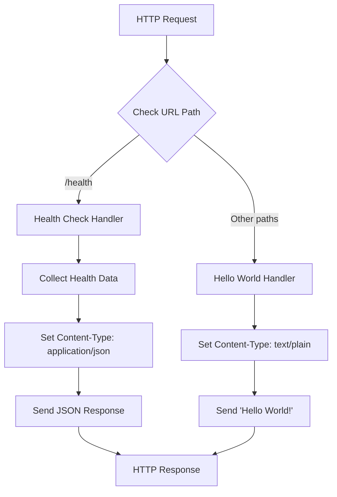
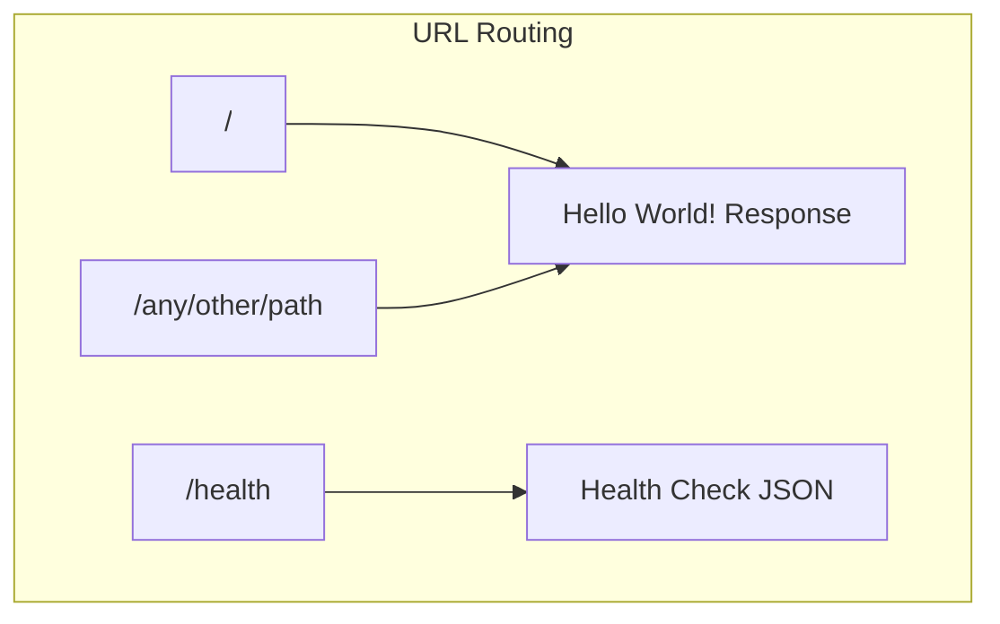

# Technical Specification

# 0. Agent Action Plan

## 0.1 Intent Clarification

This section captures and clarifies the user's requirements for adding a health check endpoint to the Hello World Node.js HTTP Server application.

### 0.1.1 Core Feature Objective

Based on the prompt, the Blitzy platform understands that the new feature requirement is to:

- **Add a dedicated health check endpoint** to the existing Node.js HTTP server that allows users and monitoring systems to verify the service is running correctly
- **Enable service availability verification** by providing a simple, standard mechanism to check if the server is responsive and functioning as expected
- **Maintain zero-dependency architecture** by implementing the health check using only Node.js built-in modules, consistent with the project's educational simplicity philosophy

**Implicit Requirements Detected:**

- The health check should return an HTTP 200 status code when the service is healthy
- The response should be in a standard format (JSON recommended) that includes status information
- The endpoint should be accessible via a standard health check path (e.g., `/health` or `/healthz`)
- The implementation must add URL-based routing to differentiate between the health check endpoint and the existing "Hello World" response
- The health check should provide useful diagnostic information such as uptime and timestamp
- The solution must not introduce external dependencies to maintain the project's zero-dependency philosophy

**Feature Dependencies and Prerequisites:**

| Prerequisite | Status | Notes |
|-------------|--------|-------|
| Node.js runtime ≥14.0.0 | Available | Uses built-in `http` module and `process` object |
| URL parsing capability | Available | Node.js built-in `url` module or direct path matching |
| Process uptime access | Available | `process.uptime()` is a built-in Node.js API |
| JSON serialization | Available | Native JavaScript `JSON.stringify()` |

### 0.1.2 Special Instructions and Constraints

**Architectural Requirements:**

- Maintain the existing single-file architecture pattern
- Preserve the educational simplicity of the codebase
- Follow the existing CommonJS module system (`require` syntax)
- Keep the implementation minimal and comprehensible
- Continue binding exclusively to localhost (127.0.0.1:3000)

**Integration Requirements:**

- The existing "Hello World" functionality at the root path (`/`) must remain unchanged
- The health check endpoint should be accessible alongside the existing functionality
- Console logging should be enhanced to indicate health check capability availability

**Backward Compatibility:**

- All existing behavior must be preserved
- The default response for the root path remains "Hello World!"
- Existing manual verification workflows continue to function

### 0.1.3 Technical Interpretation

These feature requirements translate to the following technical implementation strategy:

- **To implement URL-based routing**, we will modify the request handler callback in `Hello_World_Node.js` to inspect `req.url` and route requests to different handlers based on the URL path
- **To provide health status information**, we will create a response object containing status ("OK" or "healthy"), uptime (from `process.uptime()`), and timestamp (from `Date.now()`)
- **To return JSON responses for health checks**, we will set the `Content-Type` header to `application/json` and serialize the health data using `JSON.stringify()`
- **To maintain backward compatibility**, we will default all non-health-check paths to the existing "Hello World!" response
- **To document the new capability**, we will update README.md with instructions for using the health check endpoint

## 0.2 Repository Scope Discovery

This section provides a comprehensive analysis of all repository files affected by the health check endpoint feature addition.

### 0.2.1 Comprehensive File Analysis

**Repository Structure Overview:**

The repository is a minimal Node.js project containing three files at the root level:

```
/
├── Hello_World_Node.js   # Main server implementation (17 lines)
├── package.json          # NPM package manifest
└── README.md             # User documentation
```

**Existing Files Requiring Modification:**

| File Path | Type | Current Purpose | Required Changes |
|-----------|------|-----------------|------------------|
| `Hello_World_Node.js` | Source | HTTP server with single "Hello World" response | Add URL routing logic, health check handler, JSON response generation |
| `package.json` | Config | Package metadata and npm scripts | Fix entry point reference (server.js → Hello_World_Node.js), optionally add health check script |
| `README.md` | Docs | Usage instructions and documentation | Add health check endpoint documentation section |

**Detailed File Impact Analysis:**

**Hello_World_Node.js** - Primary Implementation File:
- Lines 8-12: Request handler callback requires complete rewrite to add routing
- Line 10: Content-Type header conditionally set based on endpoint
- Line 11: Response body generation conditional on URL path
- New code blocks needed: URL parsing, health data collection, JSON serialization

**package.json** - Configuration File:
- Line 5: `"main": "server.js"` needs correction to `"main": "Hello_World_Node.js"`
- Lines 6-8: Scripts reference `server.js`, should reference `Hello_World_Node.js`
- Optionally: Add `"health"` script for testing health endpoint

**README.md** - Documentation File:
- Add new section: "Health Check Endpoint"
- Update "How It Works" section to mention routing
- Add example output for health check response
- Update Configuration section with new endpoint information

### 0.2.2 Integration Point Discovery

**API Endpoints Affected:**

| Endpoint | HTTP Methods | Current Behavior | New Behavior |
|----------|--------------|------------------|--------------|
| `/` | ALL | Returns "Hello World!" | Returns "Hello World!" (unchanged) |
| `/health` | GET | Returns "Hello World!" | Returns JSON health status with HTTP 200 |
| `/*` (other paths) | ALL | Returns "Hello World!" | Returns "Hello World!" (unchanged) |

**Request Handler Integration Points:**

The request handler at lines 8-12 of `Hello_World_Node.js` is the sole integration point:

```javascript
// Current implementation (lines 8-12)
const server = http.createServer((req, res) => {
  res.statusCode = 200;
  res.setHeader('Content-Type', 'text/plain');
  res.end('Hello World!\n');
});
```

This monolithic handler must be refactored to support multiple response types based on URL routing.

**Console Logger Integration:**

The startup message at line 15 should be enhanced to indicate health check availability:
- Current: `Server running at http://${hostname}:${port}/`
- New: Include health check URL information

### 0.2.3 Web Search Research Conducted

Best practices research for implementing health check endpoints in Node.js yielded the following insights:

| Topic | Finding | Source |
|-------|---------|--------|
| Endpoint Naming | `/readyz` and `/livez` are Kubernetes standard; `/health` is commonly used for general health checks | Node.js Reference Architecture |
| Response Format | JSON with status, uptime, and timestamp fields recommended | LogRocket Blog |
| Implementation Approach | Recommend adding code directly rather than using external health check libraries | NodeShift Reference Architecture |
| Health Data | Should include: status code, uptime (seconds), timestamp, optional memory usage | LogRocket Blog |
| Zero Dependencies | Health check implementation should be minimal and not require external packages | NodeShift Reference Architecture |

### 0.2.4 New File Requirements

No new source files are required for this feature. The implementation follows the existing single-file architecture by extending `Hello_World_Node.js`. However, the following new content will be added:

**New Code Sections in Hello_World_Node.js:**

- Health check handler function or inline logic
- URL routing conditional (if/else or switch statement)
- Health data collection logic using `process.uptime()` and `Date.now()`
- JSON response serialization

**New Documentation Sections in README.md:**

- Health Check Endpoint section with usage instructions
- Example health check response output
- Updated Configuration section

## 0.3 Dependency Inventory

This section documents all dependencies relevant to the health check endpoint feature, maintaining the project's zero external dependency architecture.

### 0.3.1 Private and Public Packages

**External Dependencies: None Required**

The health check endpoint feature maintains the project's zero-dependency philosophy. No external packages are needed for implementation.

| Package Registry | Package Name | Version | Purpose |
|-----------------|--------------|---------|---------|
| N/A | None | N/A | Feature implemented using Node.js built-in modules only |

**Built-in Node.js Modules Used:**

| Module | Version | Purpose | Import Statement |
|--------|---------|---------|------------------|
| `http` | Node.js built-in | HTTP server creation and request/response handling | `const http = require('http');` |
| `process` | Node.js global | Access to uptime via `process.uptime()` | No import needed (global) |
| `JSON` | JavaScript built-in | Serialization of health check response data | No import needed (global) |
| `Date` | JavaScript built-in | Timestamp generation via `Date.now()` | No import needed (global) |

### 0.3.2 Dependency Updates

**Import Updates:**

No additional imports are required. The existing `require('http')` statement on line 3 of `Hello_World_Node.js` provides all necessary HTTP functionality. URL path matching will be performed using simple string comparison against `req.url`.

**Current Import (line 3):**
```javascript
const http = require('http');
```

**No additional imports needed** - all health check functionality uses:
- `req.url` - Request URL property from HTTP IncomingMessage
- `process.uptime()` - Global process object method
- `JSON.stringify()` - Global JSON object method
- `Date.now()` - Global Date object method

### 0.3.3 External Reference Updates

**Configuration Files:**

| File | Update Required | Change Description |
|------|-----------------|-------------------|
| `package.json` | Yes | Fix `main` field from `server.js` to `Hello_World_Node.js`; fix `scripts` to reference correct file |

**Documentation Files:**

| File | Update Required | Change Description |
|------|-----------------|-------------------|
| `README.md` | Yes | Add health check endpoint documentation; update "How It Works" section |

**Build/CI Files:**

| File | Status | Notes |
|------|--------|-------|
| Dockerfile | Not present | No changes needed |
| .github/workflows/* | Not present | No changes needed |
| .gitlab-ci.yml | Not present | No changes needed |

### 0.3.4 Version Compatibility

**Node.js Runtime Requirements:**

| Requirement | Specification | Verification |
|-------------|---------------|--------------|
| Minimum Version | ≥14.0.0 | Defined in `package.json` engines field |
| Current Environment | v20.19.6 | Verified via `node --version` |
| Compatibility | ✅ Fully Compatible | All built-in APIs used are available in Node.js 14+ |

**API Stability:**

| API Used | Available Since | Stability Status |
|----------|-----------------|------------------|
| `http.createServer()` | Node.js 0.1.13 | Stable |
| `req.url` | Node.js 0.1.90 | Stable |
| `process.uptime()` | Node.js 0.5.0 | Stable |
| `JSON.stringify()` | JavaScript ES5 | Stable (ECMAScript standard) |
| `Date.now()` | JavaScript ES5 | Stable (ECMAScript standard) |

All APIs used for the health check implementation have been stable for many years and are fully supported across all Node.js versions ≥14.0.0.

## 0.4 Integration Analysis

This section documents all existing code touchpoints and integration requirements for implementing the health check endpoint.

### 0.4.1 Existing Code Touchpoints

**Direct Modifications Required:**

| File | Location | Modification Type | Description |
|------|----------|-------------------|-------------|
| `Hello_World_Node.js` | Lines 8-12 | Refactor | Replace monolithic request handler with URL-routing handler |
| `Hello_World_Node.js` | Line 10 | Conditional | Content-Type header varies by endpoint (text/plain vs application/json) |
| `Hello_World_Node.js` | Line 11 | Conditional | Response body varies by endpoint |
| `Hello_World_Node.js` | Line 15 | Enhance | Update startup message to indicate health endpoint availability |
| `package.json` | Line 5 | Fix | Correct `main` field to `Hello_World_Node.js` |
| `package.json` | Lines 6-8 | Fix | Correct script references from `server.js` to `Hello_World_Node.js` |
| `README.md` | New Section | Add | Document health check endpoint usage |

**Detailed Code Touchpoint Analysis:**

**Hello_World_Node.js - Request Handler (Lines 8-12):**

Current implementation:
```javascript
const server = http.createServer((req, res) => {
  res.statusCode = 200;
  res.setHeader('Content-Type', 'text/plain');
  res.end('Hello World!\n');
});
```

Integration approach:
- Add conditional logic to check `req.url` value
- Route `/health` requests to health check response logic
- Route all other requests to existing "Hello World" response
- Maintain HTTP 200 status code for both endpoints

**Hello_World_Node.js - Startup Message (Line 15):**

Current implementation:
```javascript
console.log(`Server running at http://${hostname}:${port}/`);
```

Integration approach:
- Optionally enhance message to indicate health check availability
- Example: Include `Health check at /health` reference

### 0.4.2 Request Flow Integration

**Current Request Flow:**


**New Request Flow with Health Check:**



### 0.4.3 Response Format Integration

**Health Check Response Structure:**

The health check endpoint will return a JSON object with the following structure:

```json
{
  "status": "OK",
  "uptime": 123.456,
  "timestamp": 1703961600000
}
```

| Field | Type | Source | Description |
|-------|------|--------|-------------|
| `status` | String | Static | Service health status ("OK" when healthy) |
| `uptime` | Number | `process.uptime()` | Server uptime in seconds |
| `timestamp` | Number | `Date.now()` | Current Unix timestamp in milliseconds |

### 0.4.4 Dependency Injections

**No dependency injections required.** The project does not use a dependency injection pattern. All functionality is contained within the single `Hello_World_Node.js` file using inline code.

### 0.4.5 Database/Schema Updates

**Not applicable.** The project has no database connectivity or schema management. The health check feature does not introduce any data persistence requirements.

### 0.4.6 Configuration Integration

**No configuration file changes required for functionality.** The health check endpoint uses hardcoded defaults:

| Configuration | Value | Source |
|---------------|-------|--------|
| Health endpoint path | `/health` | Hardcoded in request handler |
| Response format | JSON | Hardcoded Content-Type header |
| Status value | "OK" | Hardcoded in response object |

**Optional package.json corrections:**

The existing mismatch between `package.json` references (`server.js`) and actual file (`Hello_World_Node.js`) should be corrected as part of this feature implementation to ensure npm scripts work correctly for testing the health check endpoint.

## 0.5 Technical Implementation

This section provides the file-by-file execution plan for implementing the health check endpoint feature.

### 0.5.1 File-by-File Execution Plan

**CRITICAL: Every file listed below MUST be modified as specified.**

**Group 1 - Core Feature Implementation:**

| Action | File | Description |
|--------|------|-------------|
| MODIFY | `Hello_World_Node.js` | Implement URL routing and health check endpoint logic |

**Specific changes for Hello_World_Node.js:**
- Add URL path inspection using `req.url`
- Implement conditional routing for `/health` endpoint
- Create health data object with status, uptime, and timestamp
- Set appropriate Content-Type header based on endpoint
- Serialize health data to JSON for `/health` responses
- Preserve existing "Hello World!" response for all other paths

**Group 2 - Configuration Updates:**

| Action | File | Description |
|--------|------|-------------|
| MODIFY | `package.json` | Fix entry point and script references |

**Specific changes for package.json:**
- Change `"main": "server.js"` to `"main": "Hello_World_Node.js"`
- Change `"start": "node server.js"` to `"start": "node Hello_World_Node.js"`
- Change `"dev": "node server.js"` to `"dev": "node Hello_World_Node.js"`

**Group 3 - Documentation:**

| Action | File | Description |
|--------|------|-------------|
| MODIFY | `README.md` | Document health check endpoint usage and response format |

**Specific changes for README.md:**
- Add "Health Check Endpoint" section with usage instructions
- Document the `/health` endpoint path
- Provide example health check response output
- Update "How It Works" section to mention routing

### 0.5.2 Implementation Approach per File

**Hello_World_Node.js - Detailed Implementation:**

The request handler callback must be refactored to include URL-based routing:

```javascript
const server = http.createServer((req, res) => {
  if (req.url === '/health') {
    // Health check endpoint
    const healthData = {
      status: 'OK',
      uptime: process.uptime(),
      timestamp: Date.now()
    };
    res.statusCode = 200;
    res.setHeader('Content-Type', 'application/json');
    res.end(JSON.stringify(healthData));
  } else {
    // Default Hello World response
    res.statusCode = 200;
    res.setHeader('Content-Type', 'text/plain');
    res.end('Hello World!\n');
  }
});
```

**Key implementation details:**
- URL matching: Simple string equality check against `/health`
- Health data collection: Uses `process.uptime()` for uptime in seconds
- Timestamp: Uses `Date.now()` for Unix timestamp in milliseconds
- JSON serialization: Uses `JSON.stringify()` for response body
- Content-Type: `application/json` for health check, `text/plain` for default

**package.json - Fix Entry Point:**

Update the main and scripts fields to reference the correct file:

```json
{
  "main": "Hello_World_Node.js",
  "scripts": {
    "start": "node Hello_World_Node.js",
    "dev": "node Hello_World_Node.js"
  }
}
```

**README.md - Documentation Updates:**

Add a new section documenting the health check endpoint:

```
## Health Check Endpoint

The server provides a health check endpoint for monitoring service availability.

#### Accessing the Health Check

Visit the following URL in your browser or use curl:
```
http://127.0.0.1:3000/health
```

#### Health Check Response

The endpoint returns a JSON response with the following format:
```json
{
  "status": "OK",
  "uptime": 123.456,
  "timestamp": 1703961600000
}
```

| Field | Description |
|-------|-------------|
| status | Service health status ("OK" when healthy) |
| uptime | Server uptime in seconds |
| timestamp | Current Unix timestamp in milliseconds |
```

### 0.5.3 Implementation Sequence

The implementation should follow this sequence to ensure proper integration:

| Step | File | Action | Verification |
|------|------|--------|--------------|
| 1 | `Hello_World_Node.js` | Implement health check routing and response | Run server, test both endpoints |
| 2 | `package.json` | Fix entry point references | Run `npm start` successfully |
| 3 | `README.md` | Add health check documentation | Review documentation completeness |

### 0.5.4 Code Quality Standards

**Maintain Existing Patterns:**
- Use `const` for all variable declarations
- Use CommonJS `require()` syntax (no ES Modules)
- Use template literals for string interpolation where appropriate
- Keep code minimal and educational in nature

**Response Standards:**
- Health check returns HTTP 200 with JSON body
- Default path returns HTTP 200 with plain text body
- Both responses complete successfully without errors

**Error Handling:**
- The implementation maintains the existing no-error-handling approach
- Health check will always return 200 OK (no degraded states for this simple application)
- Invalid URLs default to Hello World response (no 404 implementation required)

## 0.6 Scope Boundaries

This section defines the exhaustive boundaries of what is included in and excluded from the health check endpoint feature implementation.

### 0.6.1 Exhaustively In Scope

**Source Files:**

| Pattern | Files Matched | Modifications |
|---------|---------------|---------------|
| `Hello_World_Node.js` | Main server file | Add URL routing, health check handler, JSON response |

**Configuration Files:**

| Pattern | Files Matched | Modifications |
|---------|---------------|---------------|
| `package.json` | NPM manifest | Fix `main` field, fix `scripts` entries |

**Documentation Files:**

| Pattern | Files Matched | Modifications |
|---------|---------------|---------------|
| `README.md` | User documentation | Add Health Check Endpoint section, update How It Works |

**Complete In-Scope File List:**

| File Path | Type | Change Type | Lines Affected |
|-----------|------|-------------|----------------|
| `Hello_World_Node.js` | Source | Modify | Lines 8-12 (request handler), Line 15 (optional startup message) |
| `package.json` | Config | Modify | Lines 5-8 (main, scripts) |
| `README.md` | Docs | Modify | Add new section (~20-30 lines), update existing section (~2-3 lines) |

**Functional Scope:**

| Feature | In Scope | Description |
|---------|----------|-------------|
| Health check endpoint | ✅ | `/health` path returning JSON health data |
| URL-based routing | ✅ | Differentiate `/health` from other paths |
| JSON response format | ✅ | Content-Type: application/json with health data |
| Uptime reporting | ✅ | Include `process.uptime()` in health response |
| Timestamp reporting | ✅ | Include `Date.now()` in health response |
| Status indicator | ✅ | Include "OK" status string |
| Backward compatibility | ✅ | Preserve existing "Hello World!" response at `/` and other paths |
| Documentation | ✅ | Update README.md with health check usage |
| Entry point fix | ✅ | Correct package.json references to actual file |

### 0.6.2 Explicitly Out of Scope

**Not Included in This Implementation:**

| Item | Reason for Exclusion |
|------|---------------------|
| External health check libraries | Violates zero-dependency architecture |
| Express.js or other frameworks | Violates zero-dependency architecture |
| Separate liveness and readiness probes | Over-engineering for educational project |
| Database connectivity checks | No database in this project |
| Memory usage reporting | Beyond minimum viable health check |
| Detailed error states (503, etc.) | Application has no failure modes to report |
| Health check authentication | Not needed for localhost-only deployment |
| Kubernetes-specific endpoints (/livez, /readyz) | Over-engineering; /health is sufficient |
| Custom health check configuration | Hardcoded values maintain simplicity |
| Automated tests for health check | Testing infrastructure explicitly out of scope per tech spec |
| CI/CD pipeline additions | No CI/CD configured per project requirements |

**Files Explicitly Not Modified:**

| File/Pattern | Reason |
|--------------|--------|
| `.github/workflows/*` | No CI/CD pipeline exists |
| `Dockerfile*` | No containerization configured |
| `docker-compose*` | No containerization configured |
| `tests/**/*` | No test infrastructure exists |
| `node_modules/**/*` | No dependencies to install |

**Features Explicitly Not Implemented:**

| Feature | Reason |
|---------|--------|
| HTTP 503 Service Unavailable | No failure conditions exist in this simple application |
| Health check timeout | Not needed for synchronous in-memory health data |
| Health check caching | Response is fast enough without caching |
| Multiple health endpoints | Single `/health` endpoint is sufficient |
| Health check middleware | No middleware pattern in existing architecture |
| Metrics endpoint | Beyond scope of health check request |
| Structured logging | Not part of existing architecture |

### 0.6.3 Boundary Rationale

**Why these boundaries:**

The scope boundaries are designed to:

1. **Maintain Zero Dependencies:** All implementation uses only Node.js built-in APIs
2. **Preserve Educational Simplicity:** Changes are minimal and easy to understand
3. **Ensure Backward Compatibility:** Existing functionality remains unchanged
4. **Follow Existing Patterns:** New code follows the same style as existing code
5. **Provide Value:** Health check enables service monitoring without complexity

**Scope Validation Checklist:**

| Criterion | Met | Evidence |
|-----------|-----|----------|
| Zero new dependencies | ✅ | No `npm install` required |
| Single file architecture | ✅ | All logic remains in Hello_World_Node.js |
| Educational clarity | ✅ | Implementation under 15 additional lines |
| Localhost-only binding | ✅ | No changes to hostname/port configuration |
| CommonJS module system | ✅ | No ES Module syntax introduced |
| Minimal code changes | ✅ | Only 3 files modified with minimal changes |

## 0.7 Special Instructions

This section documents feature-specific requirements, conventions, and special considerations for the health check endpoint implementation.

### 0.7.1 Feature-Specific Requirements

**Patterns and Conventions to Follow:**

| Pattern | Requirement | Example |
|---------|-------------|---------|
| Variable declarations | Use `const` for all variables | `const healthData = {...}` |
| Module system | CommonJS `require()` | Already using `require('http')` |
| String formatting | Template literals | `` `Server running at http://${hostname}:${port}/` `` |
| Response format | JSON for health, plain text for default | `application/json` vs `text/plain` |
| URL matching | Simple string equality | `req.url === '/health'` |

**Coding Standards:**

- Maintain the existing synchronous, callback-based style
- No async/await patterns (consistent with existing code)
- No arrow functions for multi-line blocks (use existing style)
- Keep inline comments minimal and educational

### 0.7.2 Integration Requirements with Existing Features

**Existing Feature Preservation:**

| Feature | Requirement | Verification |
|---------|-------------|--------------|
| "Hello World!" response | Must remain at root path `/` | Access `http://127.0.0.1:3000/` returns "Hello World!" |
| Wildcard path handling | Non-health paths return Hello World | Access `http://127.0.0.1:3000/foo` returns "Hello World!" |
| Console startup message | Must display on server start | Run `node Hello_World_Node.js` shows message |
| Port binding | Must bind to 127.0.0.1:3000 | Cannot change hostname or port |

**Coexistence Requirements:**

The health check endpoint must coexist with existing functionality without breaking changes:



### 0.7.3 Performance Considerations

**Response Time Requirements:**

| Endpoint | Target Response Time | Rationale |
|----------|---------------------|-----------|
| `/health` | <10ms | Health checks must be fast; only in-memory operations |
| `/` | <10ms | Existing performance maintained |

**Performance Implementation Notes:**

- `process.uptime()` is a synchronous, fast operation
- `Date.now()` is a synchronous, fast operation
- `JSON.stringify()` on a small object is negligible overhead
- No I/O operations, database queries, or external calls

### 0.7.4 Security Requirements

**Security Considerations for Health Check:**

| Concern | Implementation | Status |
|---------|----------------|--------|
| Information exposure | Only expose status, uptime, timestamp | ✅ Minimal exposure |
| Authentication | Not required for localhost-only deployment | ✅ Acceptable |
| Rate limiting | Not implemented; low risk for localhost | ✅ Acceptable |
| Input validation | None needed; GET request with no body | ✅ N/A |

**Security Rationale:**

The health check endpoint is appropriate without additional security measures because:
- Server binds only to localhost (127.0.0.1), not accessible externally
- Health data exposed is non-sensitive (uptime, timestamp)
- Educational project not intended for production deployment

### 0.7.5 Testing and Verification

**Manual Verification Steps:**

| Step | Command/Action | Expected Result |
|------|----------------|-----------------|
| 1 | `node Hello_World_Node.js` | Console shows startup message |
| 2 | Visit `http://127.0.0.1:3000/` | Browser shows "Hello World!" |
| 3 | Visit `http://127.0.0.1:3000/health` | Browser shows JSON health data |
| 4 | Check JSON format | Contains status, uptime, timestamp fields |
| 5 | Press Ctrl+C | Server stops cleanly |

**Command-Line Verification (Alternative):**

```bash
# Start server in background
node Hello_World_Node.js &

#### Test default endpoint
curl http://127.0.0.1:3000/
#### Expected: Hello World!

#### Test health endpoint
curl http://127.0.0.1:3000/health
#### Expected: {"status":"OK","uptime":...,"timestamp":...}

#### Stop server
kill %1
```

### 0.7.6 Documentation Requirements

**README.md Updates Required:**

| Section | Action | Content |
|---------|--------|---------|
| Health Check Endpoint | Add new section | Usage instructions, endpoint URL, response format |
| How It Works | Update | Mention URL-based routing |
| Configuration | Update | Document `/health` endpoint availability |

**Example Health Check Section for README.md:**

```
## Health Check Endpoint

The server includes a health check endpoint for verifying service availability.

**Endpoint:** `http://127.0.0.1:3000/health`

**Response Format (JSON):**
| Field | Type | Description |
|-------|------|-------------|
| status | string | Service status ("OK" when healthy) |
| uptime | number | Server uptime in seconds |
| timestamp | number | Current Unix timestamp in milliseconds |

**Example Response:**
```json
{
  "status": "OK",
  "uptime": 42.123,
  "timestamp": 1703961600000
}
```
```

### 0.7.7 Rollback Considerations

**In case of issues, rollback by:**

| Step | Action | Result |
|------|--------|--------|
| 1 | Remove URL routing conditional from request handler | Single response for all paths |
| 2 | Restore original `res.end('Hello World!\n')` call | Original behavior restored |
| 3 | Revert package.json changes | Scripts reference server.js again |
| 4 | Revert README.md changes | Documentation returns to original state |

The implementation is minimal enough that manual rollback is straightforward if needed.

