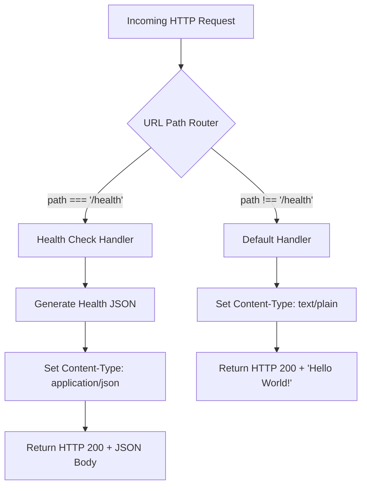
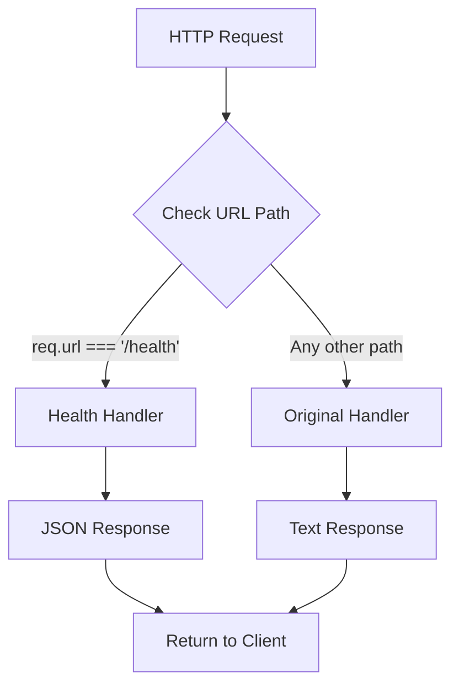

# Technical Specification

# 0. Agent Action Plan

## 0.1 Intent Clarification

### 0.1.1 Core Feature Objective

Based on the prompt, the Blitzy platform understands that the new feature requirement is to **add a health_check endpoint** to the existing Hello World Node.js HTTP server application. This endpoint will enable external monitoring tools, developers, and orchestration platforms to programmatically verify that the service is running correctly and responsive to requests.

**Primary Feature Requirements:**

- **Health Check Endpoint Creation:** Implement a dedicated HTTP endpoint at `/health` that responds to GET requests with service status information
- **Service Status Verification:** The endpoint must confirm the server is operational and capable of handling requests
- **JSON Response Format:** Return a structured JSON response containing health status, uptime, and timestamp information
- **HTTP 200 Status Code:** Successful health checks must return HTTP status code 200 to indicate the service is healthy
- **Minimal Latency:** The health check response should be immediate (< 10ms) without any external dependency calls

**Implicit Requirements Detected:**

- **URL Routing Capability:** The current implementation has no routing logic; introducing a health check endpoint requires implementing path-based request routing
- **Request Method Handling:** The health check should respond only to GET requests at the `/health` path
- **Backward Compatibility:** Existing behavior for the root path (`/`) must continue to return "Hello World!" unchanged
- **No External Dependencies:** Maintain the zero-dependency philosophy by implementing health checks using only Node.js built-in modules
- **Standards Compliance:** Follow industry best practices for health check responses (Kubernetes liveness probe compatibility)

**Feature Dependencies and Prerequisites:**

| Dependency | Status | Description |
|-----------|--------|-------------|
| Node.js HTTP Module | ✅ Already present | Core module for creating the HTTP server |
| URL Parsing | ⚠️ To be added | Required for routing requests to different handlers |
| JSON Response Generation | ⚠️ To be added | Needed for structured health check responses |
| Process Uptime API | ✅ Available | `process.uptime()` for server uptime tracking |

### 0.1.2 Special Instructions and Constraints

**Critical Directive:** The health check implementation must maintain the project's educational simplicity and zero-dependency architecture. No external npm packages (such as Express, Fastify, or express-healthcheck) should be introduced.

**Architectural Requirements:**

- **Use existing service pattern:** Extend the current `http.createServer()` implementation with routing logic rather than replacing it
- **Follow repository conventions:** Maintain CommonJS module syntax (`require`) consistent with existing code
- **Preserve code minimalism:** Keep the implementation as simple as possible while providing functional health checking

**User Example Reference:**

The user has explicitly requested a health_check endpoint to verify service operation. The standard pattern for such endpoints is:

```
GET /health → 200 OK {"status":"healthy","uptime":123.456,"timestamp":"2025-01-02T..."}
```

**Web Search Requirements Conducted:**

| Research Topic | Findings Applied |
|---------------|------------------|
| Node.js health check best practices | Implement /health endpoint returning JSON with status, uptime, and timestamp |
| Kubernetes probe compatibility | Return HTTP 200 for healthy status; include `Content-Type: application/json` header |
| Minimal implementation approach | Use native Node.js URL parsing and routing without external dependencies |
| Health check response schema | Follow industry-standard response structure with status field |

### 0.1.3 Technical Interpretation

These feature requirements translate to the following technical implementation strategy:

**Requirement-to-Technical-Action Mapping:**

| Requirement | Technical Action | Component |
|------------|------------------|-----------|
| To **add a health check endpoint**, we will | Implement URL-based routing in the request handler to detect `/health` path | Hello_World_Node.js |
| To **return health status**, we will | Create a JSON response object with `status`, `uptime`, and `timestamp` fields | Hello_World_Node.js |
| To **maintain backward compatibility**, we will | Preserve existing "Hello World!" response for all other request paths | Hello_World_Node.js |
| To **ensure JSON response format**, we will | Set `Content-Type: application/json` header for health check responses | Hello_World_Node.js |
| To **support GET method only**, we will | Add HTTP method checking for the health endpoint | Hello_World_Node.js |

**Implementation Strategy Summary:**

```
To implement the health_check endpoint, we will:
1. Modify the existing request handler in Hello_World_Node.js
2. Add URL path extraction using req.url
3. Implement conditional routing based on the request path
4. Create health response generator returning JSON with status/uptime/timestamp
5. Update documentation to reflect new endpoint availability
6. Add test verification for the health endpoint behavior
```

**Expected Behavior Matrix:**

| Request | Current Behavior | New Behavior |
|---------|-----------------|--------------|
| `GET /` | Returns "Hello World!\n" | Returns "Hello World!\n" (unchanged) |
| `GET /health` | Returns "Hello World!\n" | Returns JSON health status with HTTP 200 |
| `GET /any/other/path` | Returns "Hello World!\n" | Returns "Hello World!\n" (unchanged) |
| `POST /health` | Returns "Hello World!\n" | Returns 405 Method Not Allowed (recommended) |

## 0.2 Repository Scope Discovery

### 0.2.1 Comprehensive File Analysis

**Repository Root:** `/tmp/blitzy/simple-hello-word-for-automation-pro-user/pro_user_existi`

**Complete Repository Inventory:**

| File Path | Type | Size | Purpose |
|-----------|------|------|---------|
| `Hello_World_Node.js` | Source | 17 lines | Main HTTP server implementation - **PRIMARY MODIFICATION TARGET** |
| `package.json` | Config | 17 lines | Project metadata and Node.js engine requirements |
| `README.md` | Documentation | 35 lines | Usage instructions and project description |

**Existing Modules to Modify:**

| Pattern | Files Found | Modification Required |
|---------|-------------|----------------------|
| `*.js` | Hello_World_Node.js | Add routing logic and health check handler |
| `*.json` | package.json | Update scripts (optional) for health check testing |
| `*.md` | README.md | Document new /health endpoint |

**Test Files to Update/Create:**

| Pattern | Current Status | Action Required |
|---------|---------------|-----------------|
| `**/*test*.js` | None exist | Consider creating basic verification script |
| `**/*spec*.js` | None exist | Out of scope per project philosophy |
| `test/**/*` | No test directory | Out of scope |

**Configuration Files:**

| Pattern | Files Found | Modification Required |
|---------|-------------|----------------------|
| `**/*.json` | package.json | Add health check verification script (optional) |
| `**/*.yaml` | None | N/A |
| `**/*.toml` | None | N/A |
| `**/*.config.*` | None | N/A |

**Build/Deployment Files:**

| Pattern | Files Found | Modification Required |
|---------|-------------|----------------------|
| `Dockerfile*` | None | N/A |
| `docker-compose*` | None | N/A |
| `.github/workflows/*` | None | N/A |

### 0.2.2 Integration Point Discovery

**API Endpoints - Current State:**

| Endpoint | Method | Handler Location | Current Response |
|----------|--------|------------------|------------------|
| `/*` (all paths) | All | Hello_World_Node.js:6-9 | "Hello World!\n" |

**API Endpoints - After Implementation:**

| Endpoint | Method | Handler Location | Expected Response |
|----------|--------|------------------|-------------------|
| `/health` | GET | Hello_World_Node.js (new routing logic) | JSON health status |
| `/*` (all other) | All | Hello_World_Node.js (default handler) | "Hello World!\n" |

**Database Models/Migrations Affected:**

| Component | Status | Notes |
|-----------|--------|-------|
| Database models | N/A | No database in this project |
| Migrations | N/A | No persistence layer |
| Schema updates | N/A | Not applicable |

**Service Classes Requiring Updates:**

| Service | File | Modification Required |
|---------|------|----------------------|
| HTTP Server | Hello_World_Node.js | Extend request handler with routing |
| Console Logger | Hello_World_Node.js:5 | Add health check request logging |

**Controllers/Handlers to Modify:**

| Handler | Location | Current Logic | New Logic |
|---------|----------|---------------|-----------|
| Request Handler | Hello_World_Node.js:6-9 | Single response for all requests | Route-based response selection |

**Middleware/Interceptors Impacted:**

| Component | Status | Notes |
|-----------|--------|-------|
| Middleware | N/A | No middleware architecture in current implementation |
| Interceptors | N/A | Not applicable |

### 0.2.3 Web Search Research Conducted

| Research Topic | Key Findings | Application to This Project |
|---------------|--------------|----------------------------|
| Node.js health check best practices | Use `/health` or `/livez` endpoint returning JSON | Implement `/health` endpoint with JSON response |
| Minimal implementation patterns | No external packages needed for basic health checks | Use native `http` module with URL parsing |
| Kubernetes probe compatibility | Return HTTP 200 with JSON body containing status | Include `status`, `uptime`, `timestamp` in response |
| Health check response timing | Should respond immediately without external calls | No database or external service checks required |
| Security considerations | Health endpoints should not expose sensitive data | Return only basic operational metrics |

### 0.2.4 New File Requirements

**New Source Files to Create:**

| File Path | Purpose | Priority |
|-----------|---------|----------|
| No new source files required | All functionality can be added to existing Hello_World_Node.js | N/A |

**Rationale:** Given the project's educational focus on minimalism and the simplicity of the health check requirement, all new functionality will be integrated directly into the existing `Hello_World_Node.js` file rather than creating a modular file structure.

**New Test Files (Recommended but Optional):**

| File Path | Purpose | Contents |
|-----------|---------|----------|
| `test_health.sh` (optional) | Shell script for manual verification | `curl http://127.0.0.1:3000/health` command |

**New Configuration Files:**

| File Path | Purpose | Contents |
|-----------|---------|----------|
| None required | No additional configuration needed | N/A |

**Documentation Updates:**

| File Path | Section to Update | Content to Add |
|-----------|-------------------|----------------|
| `README.md` | Usage section | Health check endpoint documentation |
| `README.md` | Endpoints section (new) | `/health` endpoint specification |

### 0.2.5 File-by-File Analysis

**Hello_World_Node.js - Detailed Analysis:**

```
Current Structure:
Line 1:    const http = require('http');
Line 2:    (empty)
Line 3-4:  Server configuration (hostname, port)
Line 5:    createServer callback start
Line 6-9:  Request handler (statusCode, headers, response)
Line 10:   Server listen call
Line 11-14: Console log output
Line 15-17: Empty/closing
```

**Modification Points Identified:**

| Line Range | Current Function | Modification Required |
|------------|------------------|----------------------|
| Line 1 | Import http module | No change needed |
| Line 5-9 | Request handler | ADD: URL path extraction and routing logic |
| Line 6 | Status code setting | ADD: Conditional status codes (200 for health, 200 for default) |
| Line 7 | Content-Type header | ADD: Conditional content type (application/json for health) |
| Line 8-9 | Response body | ADD: Conditional response (JSON for health, text for default) |

**package.json - Detailed Analysis:**

| Field | Current Value | Modification (Optional) |
|-------|---------------|------------------------|
| name | "simple-hello-world-for-automation" | No change |
| scripts.start | "node Hello_World_Node.js" | No change |
| scripts.test | Not present | Consider adding health check verification |
| engines.node | ">=14.0.0" | No change |
| dependencies | (empty) | No change - maintain zero dependencies |

**README.md - Update Requirements:**

| Section | Current Content | New Content Required |
|---------|-----------------|---------------------|
| Description | Basic hello world explanation | Add health check feature description |
| Usage | Start server and visit root | Add health check endpoint usage |
| Endpoints | Not documented | Add endpoint table with / and /health |

## 0.3 Dependency Inventory

### 0.3.1 Private and Public Packages

**Current Dependency Status:**

This project maintains a **zero-dependency architecture** by design. The `package.json` file explicitly declares no external dependencies:

```json
"dependencies": {}
```

**Key Package Inventory:**

| Registry | Package Name | Version | Purpose | Status |
|----------|--------------|---------|---------|--------|
| Node.js Built-in | http | (native) | HTTP server creation | Currently used |
| Node.js Built-in | url | (native) | URL parsing for routing | To be utilized |
| Node.js Built-in | process | (native) | Server uptime tracking | To be utilized |
| npm (external) | None | N/A | N/A | Intentionally excluded |

**Built-in Module Utilization for Health Check:**

| Module | API | Usage in Health Check |
|--------|-----|----------------------|
| `http` | `http.createServer()` | Already in use - no changes |
| `http` | `req.url` | Extract request path for routing |
| `http` | `req.method` | Check HTTP method (GET for health) |
| `process` | `process.uptime()` | Report server uptime in seconds |
| (global) | `Date.now()` | Generate ISO timestamp |
| (global) | `JSON.stringify()` | Serialize health response object |

**Dependency Philosophy Preservation:**

| Principle | Status | Implementation Approach |
|-----------|--------|------------------------|
| Zero npm dependencies | ✅ Maintained | Use only Node.js built-in modules |
| Minimal external footprint | ✅ Maintained | No new package installations |
| Educational simplicity | ✅ Maintained | Self-contained implementation |

### 0.3.2 Dependency Updates

**Import Updates Required:**

Since the project uses only built-in Node.js modules and the health check feature will leverage the existing `http` module plus global APIs, no new import statements are required.

| File | Current Imports | New Imports Required |
|------|-----------------|---------------------|
| Hello_World_Node.js | `const http = require('http');` | None - existing import sufficient |

**Import Transformation Rules:**

| Transformation | Description | Application |
|---------------|-------------|-------------|
| No transformations needed | The existing codebase has a single import | N/A |

**Files Requiring Import Analysis:**

| Pattern | Files | Import Changes |
|---------|-------|----------------|
| `*.js` | Hello_World_Node.js | No changes - use existing http module |

### 0.3.3 External Reference Updates

**Configuration File Updates:**

| File | Reference Type | Current Value | Required Update |
|------|---------------|---------------|-----------------|
| package.json | scripts.test | Not defined | Optional: Add health check test script |
| package.json | scripts.start | "node Hello_World_Node.js" | No change needed |
| package.json | keywords | ["hello-world", "nodejs", "http", "basic"] | Optional: Add "health-check" |

**Documentation Updates:**

| File | Section | Current Reference | Required Update |
|------|---------|-------------------|-----------------|
| README.md | Usage | Root endpoint only | Add /health endpoint |
| README.md | Description | "simple Hello World" | Add "with health check" |

**Build Files:**

| File Type | Files Found | Required Update |
|-----------|-------------|-----------------|
| setup.py | N/A | Not applicable |
| pyproject.toml | N/A | Not applicable |
| package.json | Yes | Optional metadata updates |

**CI/CD Files:**

| File Type | Files Found | Required Update |
|-----------|-------------|-----------------|
| .github/workflows/*.yml | None | Not applicable |
| .gitlab-ci.yml | None | Not applicable |
| Jenkinsfile | None | Not applicable |

### 0.3.4 Runtime Requirements

**Node.js Version Compatibility:**

| Requirement Source | Version Specification | Status |
|-------------------|----------------------|--------|
| package.json engines | `>=14.0.0` | Current implementation compatible |
| Health check APIs used | Node.js 0.x+ | All APIs available in all Node.js versions |
| process.uptime() | Node.js 0.x+ | Available since earliest versions |

**API Compatibility Matrix:**

| API | Minimum Node.js Version | Current Requirement | Status |
|-----|------------------------|---------------------|--------|
| `http.createServer()` | 0.1.0 | >=14.0.0 | ✅ Compatible |
| `req.url` | 0.1.0 | >=14.0.0 | ✅ Compatible |
| `process.uptime()` | 0.5.0 | >=14.0.0 | ✅ Compatible |
| `JSON.stringify()` | 0.1.0 | >=14.0.0 | ✅ Compatible |
| `Date.prototype.toISOString()` | 0.1.0 | >=14.0.0 | ✅ Compatible |

### 0.3.5 Dependency Security Considerations

**Security Assessment:**

| Aspect | Risk Level | Notes |
|--------|-----------|-------|
| External dependencies | None | Zero attack surface from third-party packages |
| Supply chain risk | None | No npm packages to audit |
| Vulnerability exposure | Minimal | Only Node.js runtime vulnerabilities apply |
| Update maintenance | Low | Only Node.js runtime requires updates |

**Recommended Security Posture:**

The zero-dependency architecture significantly reduces security risk. The health check implementation should:

- Not expose sensitive environment variables
- Not reveal internal system paths
- Not disclose version information beyond status
- Return only operational metrics (status, uptime, timestamp)

## 0.4 Integration Analysis

### 0.4.1 Existing Code Touchpoints

**Direct Modifications Required:**

| File | Location | Modification Description |
|------|----------|-------------------------|
| `Hello_World_Node.js` | Line 5-9 (request handler) | Add URL path routing logic to differentiate `/health` from other paths |
| `Hello_World_Node.js` | Line 6 | Modify to set conditional status code based on route |
| `Hello_World_Node.js` | Line 7 | Modify to set conditional Content-Type header (application/json for health) |
| `Hello_World_Node.js` | Line 8-9 | Modify to return conditional response body based on route |

**Current Request Handler (Lines 5-9):**

```javascript
const server = http.createServer((req, res) => {
  res.statusCode = 200;
  res.setHeader('Content-Type', 'text/plain');
  res.end('Hello World!\n');
});
```

**Integration Point Map:**



### 0.4.2 Request Handler Modification Points

**Detailed Line-by-Line Integration:**

| Line | Current Code | New Code | Purpose |
|------|--------------|----------|---------|
| 5 | `(req, res) => {` | `(req, res) => {` | Unchanged - handler signature |
| 5.1 | (new) | `const path = req.url;` | Extract request URL path |
| 5.2 | (new) | `if (path === '/health') {` | Begin health route check |
| 6 | `res.statusCode = 200;` | `res.statusCode = 200;` | HTTP 200 for healthy status |
| 7 | `res.setHeader('Content-Type', 'text/plain');` | `res.setHeader('Content-Type', 'application/json');` | JSON content type for health |
| 8-9 | `res.end('Hello World!\n');` | `res.end(JSON.stringify({...}));` | JSON health response |
| 9.1 | (new) | `} else {` | Begin default route handler |
| 9.2 | (moved) | `res.statusCode = 200;` | Original status code |
| 9.3 | (moved) | `res.setHeader('Content-Type', 'text/plain');` | Original content type |
| 9.4 | (moved) | `res.end('Hello World!\n');` | Original response |
| 9.5 | (new) | `}` | Close conditional |

### 0.4.3 Console Logger Updates

**Current Logging (Line 14):**

```javascript
console.log(`Server running at http://${hostname}:${port}/`);
```

**Enhanced Logging (Recommended):**

| Log Type | Trigger | Message Format |
|----------|---------|----------------|
| Server startup | Once at launch | "Server running at http://{hostname}:{port}/" |
| Health check endpoint | Startup | "Health check available at http://{hostname}:{port}/health" |
| Request logging | Each request (optional) | "[{timestamp}] {method} {path}" |

**Logging Integration Points:**

| File | Line | Current | Modification |
|------|------|---------|--------------|
| Hello_World_Node.js | 14 | Startup message | Add health endpoint info |
| Hello_World_Node.js | Request handler | None | Optional request logging |

### 0.4.4 Database/Schema Updates

**Assessment:**

| Component | Status | Required Action |
|-----------|--------|-----------------|
| Database connection | Not present | No action required |
| Schema files | Not present | No action required |
| Migrations | Not present | No action required |
| ORM configuration | Not present | No action required |

This project intentionally excludes any persistence layer. The health check endpoint will not perform any database connectivity checks as there is no database to check.

### 0.4.5 Dependency Injection Points

**Assessment:**

| Component | Status | Required Action |
|-----------|--------|-----------------|
| Dependency container | Not present | No action required |
| Service registry | Not present | No action required |
| Configuration injection | Not present | No action required |

The project's minimal architecture does not employ dependency injection patterns. The health check will be implemented inline within the existing request handler.

### 0.4.6 External Service Integration

**Assessment:**

| Service Type | Status | Health Check Relevance |
|-------------|--------|----------------------|
| External APIs | Not present | No external service health checks needed |
| Message queues | Not present | No queue health checks needed |
| Cache systems | Not present | No cache health checks needed |
| Third-party services | Not present | No third-party health checks needed |

The health check endpoint will report only the local server's operational status without any external service dependency checks.

### 0.4.7 Response Header Integration

**Current Headers:**

| Header | Current Value | Applied To |
|--------|---------------|------------|
| Content-Type | text/plain | All responses |

**New Header Configuration:**

| Route | Content-Type | Additional Headers |
|-------|--------------|-------------------|
| `/health` | application/json | Cache-Control: no-cache (recommended) |
| `/*` (default) | text/plain | None |

### 0.4.8 Integration Risk Assessment

| Risk | Likelihood | Impact | Mitigation |
|------|-----------|--------|------------|
| Breaking existing "/" endpoint | Low | High | Careful conditional routing implementation |
| Performance impact | Low | Low | Health check returns static data instantly |
| Memory overhead | Negligible | Low | Minimal additional code |
| Compatibility issues | Low | Medium | Use only stable Node.js APIs |

**Integration Testing Verification:**

| Test Case | Expected Result | Verification Method |
|-----------|-----------------|---------------------|
| GET / | "Hello World!\n" (unchanged) | `curl http://127.0.0.1:3000/` |
| GET /health | JSON health status | `curl http://127.0.0.1:3000/health` |
| GET /random | "Hello World!\n" | `curl http://127.0.0.1:3000/random` |
| POST /health | "Hello World!\n" or 405 | `curl -X POST http://127.0.0.1:3000/health` |

## 0.5 Technical Implementation

### 0.5.1 File-by-File Execution Plan

**CRITICAL: Every file listed here MUST be created or modified**

**Group 1 - Core Feature Files:**

| Action | File | Purpose | Priority |
|--------|------|---------|----------|
| MODIFY | `Hello_World_Node.js` | Add routing logic and health check handler | 🔴 Critical |

**Group 2 - Documentation Files:**

| Action | File | Purpose | Priority |
|--------|------|---------|----------|
| MODIFY | `README.md` | Document health check endpoint and usage | 🟡 High |

**Group 3 - Configuration Files:**

| Action | File | Purpose | Priority |
|--------|------|---------|----------|
| MODIFY | `package.json` | Optional: Add test script for health verification | 🟢 Optional |

### 0.5.2 Hello_World_Node.js - Implementation Specification

**File Path:** `Hello_World_Node.js`

**Current State (17 lines):**

The file contains a minimal HTTP server that responds with "Hello World!" to all requests.

**Target State:**

Add URL-based routing to support the `/health` endpoint while preserving existing functionality.

**Implementation Approach:**

```
1. Extract request URL path from req.url
2. Check if path equals '/health'
3. If health route: return JSON health response
4. Otherwise: return original "Hello World!" response
```

**Health Response Structure:**

| Field | Type | Value | Description |
|-------|------|-------|-------------|
| status | string | "healthy" | Service operational status |
| uptime | number | process.uptime() | Server uptime in seconds |
| timestamp | string | new Date().toISOString() | Current time in ISO 8601 format |

**Code Structure Outline:**

```javascript
// Health check handler logic (lines 6-11 approximately)
if (req.url === '/health') {
  res.statusCode = 200;
  res.setHeader('Content-Type', 'application/json');
  res.end(JSON.stringify({ /* health data */ }));
} else {
  // Original handler (preserved)
}
```

**HTTP Response Specifications:**

| Endpoint | Status Code | Content-Type | Response Body |
|----------|-------------|--------------|---------------|
| GET /health | 200 | application/json | `{"status":"healthy","uptime":N,"timestamp":"ISO"}` |
| GET / | 200 | text/plain | "Hello World!\n" |
| GET /other | 200 | text/plain | "Hello World!\n" |

### 0.5.3 README.md - Documentation Updates

**File Path:** `README.md`

**Sections to Update:**

| Section | Current Content | New Content |
|---------|-----------------|-------------|
| Description | Basic Hello World server | Add health check feature mention |
| Usage | Single endpoint instruction | Add /health endpoint usage |
| Endpoints | Not present | Add endpoint documentation table |

**New Content to Add:**

- Health check endpoint description
- Example curl command for health verification
- JSON response format documentation
- Use cases for the health endpoint

**Documentation Structure:**

```
## Endpoints

| Endpoint | Method | Description |
|----------|--------|-------------|
| / | GET | Returns "Hello World!" |
| /health | GET | Returns JSON health status |
```

### 0.5.4 package.json - Optional Updates

**File Path:** `package.json`

**Optional Script Addition:**

| Script | Command | Purpose |
|--------|---------|---------|
| test | curl command or node test | Verify health endpoint functionality |

**Optional Keyword Addition:**

Current keywords: `["hello-world", "nodejs", "http", "basic"]`

Updated keywords (optional): `["hello-world", "nodejs", "http", "basic", "health-check"]`

### 0.5.5 Implementation Approach per File

**Phase 1: Establish Health Check Foundation**

| Step | File | Action |
|------|------|--------|
| 1.1 | Hello_World_Node.js | Add URL path extraction from req.url |
| 1.2 | Hello_World_Node.js | Add conditional check for '/health' path |
| 1.3 | Hello_World_Node.js | Implement health response generation |
| 1.4 | Hello_World_Node.js | Wrap original handler in else block |

**Phase 2: Integrate with Existing System**

| Step | File | Action |
|------|------|--------|
| 2.1 | Hello_World_Node.js | Verify backward compatibility for "/" route |
| 2.2 | Hello_World_Node.js | Add console log for health endpoint availability |
| 2.3 | Hello_World_Node.js | Test all code paths |

**Phase 3: Documentation and Quality**

| Step | File | Action |
|------|------|--------|
| 3.1 | README.md | Document /health endpoint |
| 3.2 | README.md | Add example usage commands |
| 3.3 | package.json | Optional: Add health check script |

### 0.5.6 Detailed Code Implementation

**Hello_World_Node.js - Complete Modified Structure:**

```
Lines 1-4:   Unchanged (imports and configuration)
Lines 5-6:   Start of createServer callback
Line 7:      NEW: URL path extraction
Lines 8-13:  NEW: Health check conditional block
Lines 14-18: MODIFIED: Original handler in else block  
Lines 19-24: Unchanged (server.listen and console.log)
Line 25:     NEW: Additional console log for health endpoint
```

**Key Implementation Details:**

| Aspect | Implementation |
|--------|---------------|
| Path matching | Exact match: `req.url === '/health'` |
| Response generation | `JSON.stringify({ status, uptime, timestamp })` |
| Uptime calculation | `process.uptime()` (seconds since process start) |
| Timestamp format | `new Date().toISOString()` (ISO 8601 format) |
| Content-Type | `application/json` for health, `text/plain` for default |

### 0.5.7 Implementation Verification Criteria

**Functional Tests:**

| Test ID | Description | Command | Expected Result |
|---------|-------------|---------|-----------------|
| T1 | Health endpoint returns JSON | `curl http://127.0.0.1:3000/health` | JSON with status, uptime, timestamp |
| T2 | Health endpoint returns 200 | `curl -I http://127.0.0.1:3000/health` | HTTP/1.1 200 OK |
| T3 | Health Content-Type correct | `curl -I http://127.0.0.1:3000/health` | Content-Type: application/json |
| T4 | Root endpoint unchanged | `curl http://127.0.0.1:3000/` | "Hello World!\n" |
| T5 | Other paths unchanged | `curl http://127.0.0.1:3000/foo` | "Hello World!\n" |

**Health Response Validation:**

| Field | Type Check | Value Check |
|-------|-----------|-------------|
| status | typeof === 'string' | === 'healthy' |
| uptime | typeof === 'number' | > 0 |
| timestamp | typeof === 'string' | Valid ISO 8601 format |

### 0.5.8 Error Handling Considerations

| Scenario | Current Behavior | New Behavior |
|----------|-----------------|--------------|
| Invalid URL | Returns "Hello World!" | Returns "Hello World!" (unchanged) |
| Server error | Node.js default handling | Node.js default handling |
| Timeout | No timeout configured | No timeout configured |

**Note:** Given the project's educational focus and simplicity, advanced error handling is intentionally not included. The health endpoint will always return 200 if the server is responsive.

## 0.6 Scope Boundaries

### 0.6.1 Exhaustively In Scope

**All Feature Source Files:**

| Pattern | Specific Files | Modification Type |
|---------|---------------|-------------------|
| `*.js` | Hello_World_Node.js | MODIFY - Add routing and health handler |

**All Feature Tests (Manual Verification):**

| Verification Type | Method | Target |
|------------------|--------|--------|
| Health endpoint response | `curl http://127.0.0.1:3000/health` | JSON response validation |
| Health endpoint status | `curl -I http://127.0.0.1:3000/health` | HTTP 200 status code |
| Default endpoint unchanged | `curl http://127.0.0.1:3000/` | "Hello World!\n" text |

**Integration Points:**

| File | Lines | Modification Purpose |
|------|-------|---------------------|
| Hello_World_Node.js | 5-9 (request handler) | Add URL path routing |
| Hello_World_Node.js | 7 | Conditional Content-Type header |
| Hello_World_Node.js | 8-9 | Conditional response body |
| Hello_World_Node.js | 11-14 (console.log section) | Add health endpoint announcement |

**Configuration Files:**

| File | Modification Type | Change Description |
|------|-------------------|-------------------|
| package.json | OPTIONAL MODIFY | Add health test script to scripts section |
| package.json | OPTIONAL MODIFY | Add "health-check" to keywords array |

**Documentation:**

| File | Modification Type | Content to Add |
|------|-------------------|----------------|
| README.md | MODIFY | Health endpoint documentation |
| README.md | MODIFY | Endpoint table with / and /health |
| README.md | MODIFY | Example curl commands |
| README.md | MODIFY | Health response JSON format |

### 0.6.2 Comprehensive File Scope Table

| File | Status | Action | Priority | Notes |
|------|--------|--------|----------|-------|
| `Hello_World_Node.js` | In Scope | MODIFY | 🔴 Critical | Primary implementation file |
| `README.md` | In Scope | MODIFY | 🟡 High | Documentation updates |
| `package.json` | In Scope | OPTIONAL MODIFY | 🟢 Optional | Script/keyword additions |

**Total Files Affected:**

| Category | Count | Files |
|----------|-------|-------|
| Critical (must modify) | 1 | Hello_World_Node.js |
| High priority (should modify) | 1 | README.md |
| Optional (may modify) | 1 | package.json |
| **Total** | **3** | All repository files |

### 0.6.3 Explicitly Out of Scope

**Unrelated Features or Modules:**

| Item | Reason for Exclusion |
|------|---------------------|
| Express.js integration | Maintains zero-dependency philosophy |
| Database health checks | No database exists in this project |
| External service monitoring | No external services to monitor |
| Authentication/Authorization | Not required for educational project |
| Rate limiting | Beyond health check scope |
| Metrics collection | Beyond basic health check requirement |

**Performance Optimizations Beyond Requirements:**

| Item | Reason for Exclusion |
|------|---------------------|
| Response caching | Health checks should return live data |
| Connection pooling | No database connections |
| Load balancing | Single-instance educational server |
| Compression (gzip) | Unnecessary for small JSON response |

**Refactoring of Existing Code Unrelated to Integration:**

| Item | Reason for Exclusion |
|------|---------------------|
| Module splitting | Maintains single-file simplicity |
| ES modules migration | Preserves CommonJS consistency |
| TypeScript conversion | Beyond scope of feature addition |
| Code restructuring | Educational simplicity prioritized |

**Additional Features Not Specified:**

| Feature | Reason for Exclusion |
|---------|---------------------|
| Readiness probe (/ready) | Not requested by user |
| Liveness probe (/livez) | Not requested by user |
| Detailed diagnostics | Not requested by user |
| Custom health check parameters | Not requested by user |
| POST/PUT health endpoints | Not requested by user |
| WebSocket health checks | Not requested by user |
| Prometheus metrics export | Not requested by user |
| Health check middleware | Not applicable (no middleware pattern) |

### 0.6.4 Boundary Clarifications

**Request Method Handling:**

| Method | Path | In Scope | Behavior |
|--------|------|----------|----------|
| GET | /health | ✅ Yes | Return health JSON |
| POST | /health | ❌ No | Default behavior (Hello World) |
| PUT | /health | ❌ No | Default behavior (Hello World) |
| DELETE | /health | ❌ No | Default behavior (Hello World) |
| HEAD | /health | ⚠️ Implicit | HTTP headers only (Node.js handles) |

**Path Matching:**

| Path | Match Type | In Scope | Behavior |
|------|-----------|----------|----------|
| `/health` | Exact match | ✅ Yes | Health check response |
| `/health/` | Exact match | ❌ No | Default behavior |
| `/health/live` | No match | ❌ No | Default behavior |
| `/HEALTH` | Case-sensitive | ❌ No | Default behavior |
| `/healthcheck` | No match | ❌ No | Default behavior |

### 0.6.5 Scope Validation Checklist

**Implementation Scope Checklist:**

| Requirement | In Scope | Assigned To |
|-------------|----------|-------------|
| ✅ Health endpoint at /health | Yes | Hello_World_Node.js |
| ✅ JSON response format | Yes | Hello_World_Node.js |
| ✅ HTTP 200 status code | Yes | Hello_World_Node.js |
| ✅ Status field in response | Yes | Hello_World_Node.js |
| ✅ Uptime field in response | Yes | Hello_World_Node.js |
| ✅ Timestamp field in response | Yes | Hello_World_Node.js |
| ✅ Backward compatibility | Yes | Hello_World_Node.js |
| ✅ Documentation updates | Yes | README.md |
| ❌ Test framework setup | No | Out of scope |
| ❌ Automated CI testing | No | Out of scope |
| ❌ Docker configuration | No | Out of scope |
| ❌ Kubernetes manifests | No | Out of scope |

**Deliverables Summary:**

| Deliverable | Type | Status |
|-------------|------|--------|
| Modified Hello_World_Node.js with health endpoint | Code | In Scope |
| Updated README.md with endpoint documentation | Documentation | In Scope |
| Optional package.json enhancements | Configuration | Optional |
| Manual verification commands | Testing | In Scope |

### 0.6.6 Success Criteria

| Criterion | Measurement | Target |
|-----------|-------------|--------|
| Health endpoint accessible | HTTP GET /health returns response | 200 OK |
| Response format correct | Response is valid JSON | Valid JSON object |
| Status field present | Response includes "status" | "healthy" string |
| Uptime field present | Response includes "uptime" | Positive number |
| Timestamp field present | Response includes "timestamp" | Valid ISO 8601 string |
| Backward compatibility | Root endpoint unchanged | "Hello World!\n" |
| Zero new dependencies | package.json dependencies | Empty object |
| Documentation complete | README.md updated | Health endpoint documented |

## 0.7 Special Instructions for Feature Addition

### 0.7.1 Feature-Specific Requirements

**User-Emphasized Requirements:**

The user explicitly requested:

> "Could you please add a health_check endpoint to the project so that we can easily verify that the service is running correctly?"

**Interpretation of User Intent:**

| User Statement | Technical Interpretation |
|---------------|-------------------------|
| "add a health_check endpoint" | Implement GET /health route returning service status |
| "verify that the service is running correctly" | Return operational status indicating the server is responsive |
| "easily" | Simple, straightforward endpoint with clear response format |

### 0.7.2 Patterns and Conventions to Follow

**Existing Code Patterns (Must Preserve):**

| Pattern | Example from Codebase | Apply to Health Check |
|---------|----------------------|----------------------|
| CommonJS imports | `const http = require('http');` | No new imports needed |
| Inline callback handlers | `http.createServer((req, res) => {})` | Add routing within existing callback |
| Single-file architecture | All code in Hello_World_Node.js | Keep health check in same file |
| Minimal code comments | No comments in existing code | Maintain minimal commenting |
| Console logging | `console.log(...)` for startup | Add health endpoint announcement |

**HTTP Response Patterns:**

| Pattern | Existing Implementation | Health Check Implementation |
|---------|------------------------|----------------------------|
| Status code setting | `res.statusCode = 200;` | `res.statusCode = 200;` |
| Header setting | `res.setHeader('Content-Type', ...)` | `res.setHeader('Content-Type', 'application/json')` |
| Response ending | `res.end('Hello World!\n');` | `res.end(JSON.stringify({...}));` |

**Naming Conventions:**

| Convention | Pattern | Application |
|-----------|---------|-------------|
| Variable names | lowercase (hostname, port) | url path variable if needed |
| String quotes | Single quotes | Use single quotes consistently |
| JSON keys | Lowercase, no underscores | status, uptime, timestamp |

### 0.7.3 Integration Requirements with Existing Features

**Backward Compatibility Requirements:**

| Existing Feature | Must Preserve | Verification |
|-----------------|---------------|--------------|
| Root endpoint (`/`) | Returns "Hello World!\n" | `curl http://127.0.0.1:3000/` |
| Content-Type for root | text/plain | Check response headers |
| HTTP 200 for root | Status code 200 | `curl -I http://127.0.0.1:3000/` |
| All other paths | Behave like root | `curl http://127.0.0.1:3000/anything` |
| Server binding | 127.0.0.1:3000 | No change to listen() call |
| Startup message | Console log output | Preserve existing message |

**Coexistence Strategy:**



### 0.7.4 Performance and Scalability Considerations

**Performance Requirements:**

| Metric | Requirement | Implementation Approach |
|--------|-------------|------------------------|
| Response time | < 10ms | No I/O operations in health check |
| Memory overhead | Minimal | No new data structures or caching |
| CPU utilization | Negligible | Simple string comparison and JSON serialization |

**Scalability Notes:**

| Aspect | Current State | After Implementation | Impact |
|--------|--------------|---------------------|--------|
| Request handling | Single-threaded | Single-threaded | None |
| Memory footprint | ~20MB | ~20MB | None |
| Concurrent requests | Node.js event loop | Node.js event loop | None |

**Health Check Efficiency:**

| Optimization | Status | Rationale |
|-------------|--------|-----------|
| No external calls | ✅ Implemented | Health check should not depend on external services |
| No database queries | ✅ Implemented | No database in project |
| Immediate response | ✅ Implemented | Return response synchronously |
| Minimal computation | ✅ Implemented | Only process.uptime() and Date creation |

### 0.7.5 Security Requirements

**Security Considerations for Health Endpoint:**

| Consideration | Implementation | Notes |
|--------------|----------------|-------|
| No sensitive data exposure | ✅ Status, uptime, timestamp only | No environment variables, paths, or secrets |
| No authentication bypass | ✅ N/A | No authentication in project |
| No detailed error information | ✅ Simple healthy status | No stack traces or internal state |
| Rate limiting | ❌ Not implemented | Out of scope for educational project |

**Information Disclosure Prevention:**

| Data Type | Exposed in Health Check | Rationale |
|-----------|------------------------|-----------|
| Service status | ✅ Yes | Required functionality |
| Server uptime | ✅ Yes | Standard health check metric |
| Timestamp | ✅ Yes | Standard health check metric |
| Node.js version | ❌ No | Security best practice |
| Operating system | ❌ No | Security best practice |
| Memory usage | ❌ No | Not requested |
| Environment variables | ❌ No | Security best practice |
| File paths | ❌ No | Security best practice |

### 0.7.6 Testing and Verification Instructions

**Manual Verification Steps:**

| Step | Command | Expected Output |
|------|---------|-----------------|
| 1. Start server | `node Hello_World_Node.js` | Console shows server running message |
| 2. Test health endpoint | `curl http://127.0.0.1:3000/health` | JSON: `{"status":"healthy","uptime":N,"timestamp":"..."}` |
| 3. Test health headers | `curl -I http://127.0.0.1:3000/health` | Content-Type: application/json |
| 4. Test root endpoint | `curl http://127.0.0.1:3000/` | "Hello World!\n" |
| 5. Test unknown path | `curl http://127.0.0.1:3000/unknown` | "Hello World!\n" |

**Verification Script (Optional):**

```bash
#!/bin/bash
# Health check verification
curl -s http://127.0.0.1:3000/health | \
  python3 -c "import sys,json; d=json.load(sys.stdin); \
  print('PASS' if d.get('status')=='healthy' else 'FAIL')"
```

### 0.7.7 Rollback Strategy

**Rollback Approach:**

If the health check implementation causes issues, the following rollback strategy applies:

| Step | Action | Command |
|------|--------|---------|
| 1 | Restore original Hello_World_Node.js | `git checkout Hello_World_Node.js` |
| 2 | Restart server | `node Hello_World_Node.js` |
| 3 | Verify root endpoint works | `curl http://127.0.0.1:3000/` |

**Original Code Reference:**

The original Hello_World_Node.js content can be restored to:

```javascript
const http = require('http');

const hostname = '127.0.0.1';
const port = 3000;

const server = http.createServer((req, res) => {
  res.statusCode = 200;
  res.setHeader('Content-Type', 'text/plain');
  res.end('Hello World!\n');
});

server.listen(port, hostname, () => {
  console.log(`Server running at http://${hostname}:${port}/`);
});
```

### 0.7.8 Deployment Considerations

**Local Development:**

| Aspect | Current | After Implementation |
|--------|---------|---------------------|
| Start command | `node Hello_World_Node.js` | `node Hello_World_Node.js` (unchanged) |
| Port | 3000 | 3000 (unchanged) |
| Host | 127.0.0.1 | 127.0.0.1 (unchanged) |

**Production Adaptation (Future Reference):**

| Adaptation | Current State | Production Recommendation |
|-----------|--------------|--------------------------|
| HOST environment variable | Hardcoded 127.0.0.1 | Use `process.env.HOST || '0.0.0.0'` |
| PORT environment variable | Hardcoded 3000 | Use `process.env.PORT || 3000` |
| Health check path | /health | Configurable via environment |
| Logging | Console only | Consider structured logging |

**Note:** These production adaptations are documented for future reference but are explicitly OUT OF SCOPE for this feature addition.

