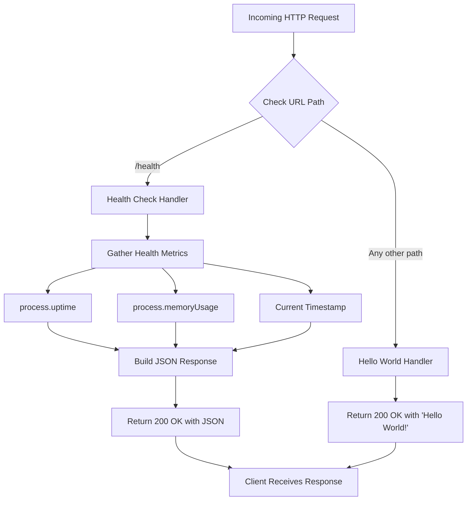
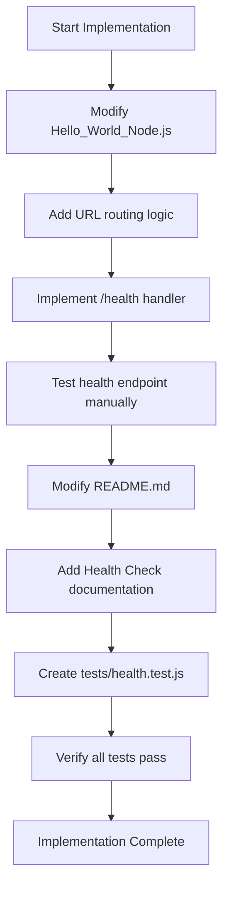

# Technical Specification

# 0. Agent Action Plan

## 0.1 Intent Clarification

### 0.1.1 Core Feature Objective

Based on the prompt, the Blitzy platform understands that the new feature requirement is to add a **health_check endpoint** to the existing Node.js Hello World HTTP server. This endpoint will allow operators, monitoring systems, and load balancers to programmatically verify that the service is running correctly.

**Feature Requirements with Enhanced Clarity:**

- **Primary Requirement**: Implement a dedicated HTTP endpoint that responds to health check requests with a status indicating the service is operational
- **Endpoint Path**: The endpoint should be accessible at `/health` or `/health_check` path
- **Response Format**: Return a JSON response with health status, uptime information, and timestamp
- **HTTP Status Codes**: Return `200 OK` when healthy, and appropriate error codes (e.g., `503 Service Unavailable`) if the service is unhealthy
- **Backward Compatibility**: Maintain existing "Hello World!" functionality on the root path and all other paths

**Implicit Requirements Detected:**

- The request handler in `Hello_World_Node.js` needs routing logic since it currently responds identically to all requests
- The server should provide useful diagnostic information (uptime, memory usage, timestamp) in the health check response
- The health check should be lightweight and not impact server performance
- Consider JSON Content-Type header for the health endpoint response

**Feature Dependencies and Prerequisites:**

- No external package dependencies required (Node.js built-in modules are sufficient)
- The implementation must be compatible with Node.js >=14.0.0 as specified in `package.json`
- The `Hello_World_Node.js` file contains the server implementation that must be modified

### 0.1.2 Special Instructions and Constraints

**Specific Directives:**

- Maintain the existing server architecture using Node.js built-in `http` module
- Follow the repository's established code style (simple, minimal, no frameworks)
- Ensure the feature works without requiring any additional npm packages
- Keep the implementation lightweight and suitable for a learning/example project

**Architectural Requirements:**

- Integrate health check routing within the existing request handler callback
- Use Node.js standard library features only (`http`, `process` modules)
- Follow industry best practices for health check endpoint implementation

**User-Provided Examples:**

No specific code examples were provided by the user. The request is straightforward: "add a health_check endpoint to the project so that we can easily verify that the service is running correctly."

**Web Search Research Conducted:**

Industry best practices for Node.js health check endpoints indicate:
- `/health`, `/healthz`, `/livez`, or `/readyz` are common endpoint naming conventions
- Minimal implementations without external dependencies are recommended for simple applications
- Health checks should return status, uptime (via `process.uptime()`), and timestamp
- Status 200 indicates healthy, 503 indicates unhealthy

### 0.1.3 Technical Interpretation

These feature requirements translate to the following technical implementation strategy:

| Requirement | Technical Action |
|-------------|------------------|
| Add health check endpoint | Implement URL routing in the HTTP request handler to check `req.url` |
| Return health status | Create JSON response with `status`, `uptime`, and `timestamp` fields |
| Maintain backward compatibility | Route all non-health URLs to the existing "Hello World!" response |
| Ensure operational verification | Use `process.uptime()` for uptime and `Date.now()` for timestamp |
| Follow best practices | Use `/health` as the endpoint path with JSON `Content-Type` |

**Implementation Strategy:**

- **To implement the health check endpoint**, we will modify `Hello_World_Node.js` by adding URL-based routing logic within the existing `http.createServer()` callback
- **To provide health information**, we will use built-in Node.js `process` module to gather uptime and memory statistics
- **To maintain backward compatibility**, we will ensure the root path (`/`) and other paths continue returning the "Hello World!" response
- **To update documentation**, we will modify `README.md` to document the new health check endpoint usage

## 0.2 Repository Scope Discovery

### 0.2.1 Comprehensive File Analysis

**Complete Repository File Inventory:**

| File Path | Type | Current Purpose | Impact Assessment |
|-----------|------|-----------------|-------------------|
| `Hello_World_Node.js` | Source | Main HTTP server implementation | **HIGH** - Primary modification target |
| `package.json` | Config | NPM package manifest | **LOW** - May need script updates |
| `README.md` | Docs | Application documentation | **MEDIUM** - Must document new endpoint |

**Existing Modules to Modify:**

```
Hello_World_Node.js  (lines 8-12) - Request handler requires routing logic
```

**Configuration Files:**

```
package.json         - Verify npm scripts point to correct entry file
```

**Documentation:**

```
README.md            - Add health check endpoint documentation
```

**Test Files to Create:**

No existing test files exist in this repository. New test files should be created:

```
tests/health.test.js - Health endpoint unit tests (recommended)
```

### 0.2.2 Integration Point Discovery

**API Endpoints - Current vs. Proposed:**

| Method | Path | Current Response | Proposed Response |
|--------|------|------------------|-------------------|
| ANY | `/` | "Hello World!\n" | "Hello World!\n" (unchanged) |
| ANY | `/health` | "Hello World!\n" | JSON health status |
| ANY | `/*` (other) | "Hello World!\n" | "Hello World!\n" (unchanged) |

**Direct Code Touchpoints in Hello_World_Node.js:**

```javascript
// Lines 8-12: Current request handler (requires modification)
const server = http.createServer((req, res) => {
  res.statusCode = 200;
  res.setHeader('Content-Type', 'text/plain');
  res.end('Hello World!\n');
});
```

**Required Changes:**
- Add URL path detection using `req.url`
- Implement conditional routing for `/health` endpoint
- Add JSON response logic for health check
- Maintain existing logic for all other paths

### 0.2.3 Web Search Research Conducted

**Best Practices for Node.js Health Check Implementation:**

- Minimal implementations are recommended for simple applications without heavy dependencies
- Common endpoint paths: `/health`, `/healthz`, `/livez`, `/readyz`
- Health response should include: status, uptime, timestamp
- Use built-in Node.js modules (`process.uptime()`, `process.memoryUsage()`)
- Return HTTP 200 for healthy, HTTP 503 for unhealthy

**Library Recommendations:**

For this simple project, no external libraries are recommended. The Node.js built-in `http` and `process` modules are sufficient.

**Security Considerations:**

- Health endpoints should not expose sensitive internal information
- Consider limiting exposed metrics in production environments
- Memory usage and uptime are safe to expose

### 0.2.4 New File Requirements

**New Source Files to Create:**

| File Path | Purpose |
|-----------|---------|
| (None required) | Health check logic will be integrated into existing `Hello_World_Node.js` |

**New Test Files (Recommended):**

| File Path | Purpose |
|-----------|---------|
| `tests/health.test.js` | Unit tests for health check endpoint functionality |

**New Configuration Files:**

| File Path | Purpose |
|-----------|---------|
| (None required) | No additional configuration needed |

**Note:** Since this is a minimal example project, the health check feature will be integrated directly into the existing server file rather than creating separate modules. This maintains the project's simple, educational nature.

## 0.3 Dependency Inventory

### 0.3.1 Private and Public Packages

**Current Dependency Inventory:**

| Registry | Package Name | Version | Purpose |
|----------|--------------|---------|---------|
| Node.js Built-in | `http` | (bundled) | HTTP server creation |
| Node.js Built-in | `process` | (bundled) | Process-level metrics (uptime, memory) |

**No External Dependencies Required:**

This project intentionally uses only Node.js built-in modules. The health check feature will be implemented using:

- `http` module (already in use) - HTTP server functionality
- `process` global object (built-in) - Provides `process.uptime()` and `process.memoryUsage()` for health metrics

**Runtime Requirements (from package.json):**

| Requirement | Specified Version | Environment Version | Status |
|-------------|-------------------|---------------------|--------|
| Node.js | `>=14.0.0` | v20.19.6 | ✓ Compatible |

### 0.3.2 Dependency Updates

**Import Updates Required:**

No import changes are necessary. The `process` object is a global in Node.js and does not require an import statement.

**Current imports in `Hello_World_Node.js`:**

```javascript
const http = require('http');
```

**No modifications to imports required** - the `process` global is automatically available.

### 0.3.3 External Reference Updates

**Configuration Files:**

| File | Update Required | Description |
|------|-----------------|-------------|
| `package.json` | Optional | Consider adding a `test` script for health check tests |
| `.env` | Not Present | No environment variables needed |

**Documentation Files:**

| File | Update Required | Description |
|------|-----------------|-------------|
| `README.md` | **Yes** | Document the `/health` endpoint usage |

**Build/CI Files:**

| File | Update Required | Description |
|------|-----------------|-------------|
| (None present) | No CI/CD files exist | This is a minimal example project |

**Note on package.json Entry Point Mismatch:**

The current `package.json` references `server.js` as the main entry point and in npm scripts, but the actual server file is named `Hello_World_Node.js`. This pre-existing inconsistency is **out of scope** for this feature but should be noted:

```json
{
  "main": "server.js",        // References non-existent file
  "scripts": {
    "start": "node server.js", // References non-existent file
    "dev": "node server.js"    // References non-existent file
  }
}
```

**Recommendation:** While fixing this mismatch is out of scope for the health check feature, it could be addressed in a separate task.

## 0.4 Integration Analysis

### 0.4.1 Existing Code Touchpoints

**Direct Modifications Required:**

| File | Location | Modification Description |
|------|----------|--------------------------|
| `Hello_World_Node.js` | Lines 8-12 | Add URL-based routing to the request handler callback |
| `README.md` | New section | Add documentation for the `/health` endpoint |

**Detailed Modification Plan for Hello_World_Node.js:**

```javascript
// CURRENT (Lines 8-12):
const server = http.createServer((req, res) => {
  res.statusCode = 200;
  res.setHeader('Content-Type', 'text/plain');
  res.end('Hello World!\n');
});

// MODIFIED: Add routing for /health endpoint
const server = http.createServer((req, res) => {
  if (req.url === '/health') {
    // Health check response
    const healthData = { status: 'healthy', uptime: process.uptime() };
    res.statusCode = 200;
    res.setHeader('Content-Type', 'application/json');
    res.end(JSON.stringify(healthData));
  } else {
    // Original Hello World response
    res.statusCode = 200;
    res.setHeader('Content-Type', 'text/plain');
    res.end('Hello World!\n');
  }
});
```

### 0.4.2 Dependency Injections

**No Dependency Injection Required:**

This simple project does not use a dependency injection pattern. The health check logic will be self-contained within the request handler.

### 0.4.3 Database/Schema Updates

**Not Applicable:**

This project does not use a database. The health check will rely solely on Node.js runtime metrics.

### 0.4.4 Integration Points Diagram



### 0.4.5 Request/Response Flow

**Health Check Request Flow:**

| Step | Component | Action |
|------|-----------|--------|
| 1 | Client | Sends `GET /health` request |
| 2 | Node.js HTTP Server | Receives request on port 3000 |
| 3 | Request Handler | Checks `req.url === '/health'` |
| 4 | Health Logic | Gathers `process.uptime()`, timestamp |
| 5 | Response Builder | Constructs JSON health object |
| 6 | HTTP Response | Returns `200 OK` with JSON body |
| 7 | Client | Receives health status confirmation |

**Standard Request Flow (Unchanged):**

| Step | Component | Action |
|------|-----------|--------|
| 1 | Client | Sends request to any non-health path |
| 2 | Node.js HTTP Server | Receives request on port 3000 |
| 3 | Request Handler | URL does not match `/health` |
| 4 | Response | Returns `200 OK` with "Hello World!\n" |
| 5 | Client | Receives Hello World message |

## 0.5 Technical Implementation

### 0.5.1 File-by-File Execution Plan

**CRITICAL: Every file listed below MUST be created or modified**

**Group 1 - Core Feature Files:**

| Action | File | Implementation Details |
|--------|------|------------------------|
| **MODIFY** | `Hello_World_Node.js` | Add URL routing for `/health` endpoint with JSON response |

**Group 2 - Documentation:**

| Action | File | Implementation Details |
|--------|------|------------------------|
| **MODIFY** | `README.md` | Add Health Check Endpoint section with usage instructions |

**Group 3 - Tests (Recommended):**

| Action | File | Implementation Details |
|--------|------|------------------------|
| **CREATE** | `tests/health.test.js` | Unit tests for health check response validation |

### 0.5.2 Implementation Approach per File

**File 1: Hello_World_Node.js (MODIFY)**

**Purpose:** Add health check endpoint routing to the HTTP request handler

**Implementation Steps:**

1. Add URL path detection in the request handler callback
2. Implement `/health` route with JSON health response
3. Keep existing logic as the default/fallback route
4. Use `process.uptime()` for service uptime metric
5. Include timestamp in ISO 8601 format

**Health Check Response Schema:**

```javascript
{
  "status": "healthy",
  "timestamp": "2024-01-15T10:30:00.000Z",
  "uptime": 3600.5,
  "service": "hello-world-nodejs"
}
```

**Modified Request Handler Logic:**

```javascript
const server = http.createServer((req, res) => {
  if (req.url === '/health') {
    const healthData = {
      status: 'healthy',
      timestamp: new Date().toISOString(),
      uptime: process.uptime(),
      service: 'hello-world-nodejs'
    };
    res.statusCode = 200;
    res.setHeader('Content-Type', 'application/json');
    res.end(JSON.stringify(healthData));
  } else {
    res.statusCode = 200;
    res.setHeader('Content-Type', 'text/plain');
    res.end('Hello World!\n');
  }
});
```

---

**File 2: README.md (MODIFY)**

**Purpose:** Document the new health check endpoint for users

**Content to Add:**

- New "Health Check" section after "How It Works"
- Description of the `/health` endpoint purpose
- Example request and response
- Usage with curl command example

**Section Template:**

```
## Health Check

The application includes a health check endpoint for monitoring service status.

#### Endpoint

- **URL**: `/health`
- **Method**: GET
- **Response**: JSON

#### Example Usage

```bash
curl http://127.0.0.1:3000/health
```

#### Example Response

```json
{
  "status": "healthy",
  "timestamp": "2024-01-15T10:30:00.000Z",
  "uptime": 3600.5,
  "service": "hello-world-nodejs"
}
```
```

---

**File 3: tests/health.test.js (CREATE - Recommended)**

**Purpose:** Provide automated testing for the health check endpoint

**Test Cases:**

1. Health endpoint returns 200 status code
2. Health endpoint returns JSON content type
3. Health response contains required fields (status, timestamp, uptime, service)
4. Status field equals "healthy"
5. Uptime is a positive number
6. Timestamp is valid ISO 8601 format

### 0.5.3 Implementation Sequence



### 0.5.4 Code Quality Checklist

| Criterion | Implementation |
|-----------|----------------|
| Error handling | Return 503 if health check fails |
| Response format | Consistent JSON structure |
| HTTP semantics | Proper status codes and headers |
| Performance | Minimal overhead (no external calls) |
| Documentation | README updated with usage examples |
| Testing | Test file with coverage for health endpoint |

## 0.6 Scope Boundaries

### 0.6.1 Exhaustively In Scope

**Source Files:**

| File Pattern | Purpose | Action |
|--------------|---------|--------|
| `Hello_World_Node.js` | Main server with health endpoint | MODIFY |

**Documentation Files:**

| File Pattern | Purpose | Action |
|--------------|---------|--------|
| `README.md` | Application documentation | MODIFY - Add health check section |

**Test Files:**

| File Pattern | Purpose | Action |
|--------------|---------|--------|
| `tests/health.test.js` | Health endpoint tests | CREATE |
| `tests/**/*.test.js` | Test file pattern | CREATE as needed |

**Configuration Files:**

| File Pattern | Purpose | Action |
|--------------|---------|--------|
| `package.json` | NPM manifest | REVIEW (optional test script addition) |

**Integration Points:**

| Integration | File | Lines/Location |
|-------------|------|----------------|
| Request handler modification | `Hello_World_Node.js` | Lines 8-12 (createServer callback) |
| Route registration | `Hello_World_Node.js` | Within request handler |
| Health response generation | `Hello_World_Node.js` | New code block in handler |

**Specific Modifications Summary:**

```
┌─────────────────────────────────────────────────────────────┐
│ IN SCOPE - Files to Modify or Create                        │
├─────────────────────────────────────────────────────────────┤
│ ✓ Hello_World_Node.js  - Add /health endpoint routing       │
│ ✓ README.md            - Document health check usage         │
│ ✓ tests/health.test.js - Create health endpoint tests       │
│ ○ package.json         - Optional: Add test script           │
└─────────────────────────────────────────────────────────────┘
```

### 0.6.2 Explicitly Out of Scope

**Excluded from this feature implementation:**

| Item | Reason |
|------|--------|
| **Fixing package.json entry point mismatch** | Pre-existing issue; separate concern |
| **Renaming Hello_World_Node.js to server.js** | Outside health check feature scope |
| **Adding external dependencies** | Project design: built-in modules only |
| **Express.js or framework migration** | Maintain minimal project architecture |
| **Database connectivity checks** | No database in this project |
| **Redis/cache connectivity checks** | No caching layer in this project |
| **Authentication/authorization on health endpoint** | Not required for this simple project |
| **Multiple health endpoints (/livez, /readyz)** | Single /health endpoint sufficient |
| **Prometheus metrics endpoint** | Beyond health check requirements |
| **CI/CD pipeline configuration** | No existing CI/CD to modify |
| **Docker/containerization** | No Dockerfile present |
| **Load balancer configuration** | Infrastructure concern |
| **Logging framework integration** | Existing console.log is sufficient |

**Boundary Clarifications:**

```
┌─────────────────────────────────────────────────────────────┐
│ OUT OF SCOPE - Not Modified                                  │
├─────────────────────────────────────────────────────────────┤
│ ✗ package.json main/scripts fields (pre-existing mismatch) │
│ ✗ Adding npm dependencies                                   │
│ ✗ Framework/architecture changes                            │
│ ✗ Multiple health probe endpoints                           │
│ ✗ Metrics/monitoring integration                            │
│ ✗ Infrastructure/deployment files                           │
└─────────────────────────────────────────────────────────────┘
```

### 0.6.3 Feature Acceptance Criteria

**Minimum Viable Implementation:**

| Criterion | Requirement | Validation Method |
|-----------|-------------|-------------------|
| Health endpoint accessible | `GET /health` returns 200 | `curl http://127.0.0.1:3000/health` |
| JSON response format | Content-Type: application/json | Inspect response headers |
| Status field present | Response includes `"status": "healthy"` | Parse JSON response |
| Uptime field present | Response includes numeric `uptime` | Verify `process.uptime()` value |
| Timestamp field present | Response includes ISO 8601 timestamp | Validate date format |
| Backward compatibility | Root path still returns "Hello World!" | `curl http://127.0.0.1:3000/` |
| Documentation updated | README includes health check section | Review README.md |

**Validation Commands:**

```bash
# Start the server
node Hello_World_Node.js

#### Test health endpoint (should return JSON)
curl -i http://127.0.0.1:3000/health

#### Test backward compatibility (should return Hello World!)
curl http://127.0.0.1:3000/
```

## 0.7 Special Instructions

### 0.7.1 Feature-Specific Requirements

**Coding Standards:**

| Standard | Requirement |
|----------|-------------|
| Code Style | Follow existing simple, readable JavaScript style |
| Module System | Use CommonJS (`require`) to match existing code |
| Error Handling | Minimal; return appropriate HTTP status codes |
| Comments | Add brief explanatory comments for routing logic |

**Integration Requirements:**

| Requirement | Implementation |
|-------------|----------------|
| Maintain existing behavior | All non-health paths must continue returning "Hello World!" |
| No breaking changes | Port, hostname, and server behavior remain unchanged |
| Zero dependencies | Use only Node.js built-in modules |

**Performance Considerations:**

| Aspect | Requirement |
|--------|-------------|
| Response time | Health check must be lightweight (<10ms) |
| Memory impact | Minimal (no caching or heavy objects) |
| CPU usage | Negligible (simple JSON serialization) |

**Security Requirements:**

| Aspect | Implementation |
|--------|----------------|
| Information exposure | Only expose safe metrics (uptime, timestamp) |
| Authentication | Not required for this simple example project |
| Rate limiting | Not implemented (out of scope) |

### 0.7.2 Implementation Guidelines

**Health Response Fields:**

| Field | Type | Source | Description |
|-------|------|--------|-------------|
| `status` | string | Static | Always "healthy" when responding |
| `timestamp` | string | `new Date().toISOString()` | Current server time in ISO 8601 |
| `uptime` | number | `process.uptime()` | Seconds since server started |
| `service` | string | Static | Service identifier "hello-world-nodejs" |

**HTTP Response Headers:**

| Header | Value | Purpose |
|--------|-------|---------|
| `Content-Type` | `application/json` | Indicates JSON response body |
| `Cache-Control` | Not set (optional) | Health checks typically not cached |

**Error Scenarios:**

| Scenario | HTTP Status | Response |
|----------|-------------|----------|
| Normal operation | 200 OK | JSON health data |
| Server under stress (future) | 503 Service Unavailable | Error JSON |

### 0.7.3 Testing Guidelines

**Manual Testing Steps:**

1. Start the server: `node Hello_World_Node.js`
2. Verify startup message: "Server running at http://127.0.0.1:3000/"
3. Test health endpoint: `curl http://127.0.0.1:3000/health`
4. Verify JSON response with status, timestamp, uptime, service fields
5. Test Hello World: `curl http://127.0.0.1:3000/`
6. Verify plain text "Hello World!\n" response
7. Test unknown path: `curl http://127.0.0.1:3000/foo`
8. Verify Hello World response (backward compatible)

**Expected Test Results:**

```bash
# Health check endpoint
$ curl -s http://127.0.0.1:3000/health | jq .
{
  "status": "healthy",
  "timestamp": "2024-01-15T10:30:00.000Z",
  "uptime": 15.234,
  "service": "hello-world-nodejs"
}

#### Root path (unchanged)
$ curl http://127.0.0.1:3000/
Hello World!

#### Any other path (unchanged)
$ curl http://127.0.0.1:3000/anything
Hello World!
```

### 0.7.4 Documentation Requirements

**README.md Update Checklist:**

- [ ] Add "Health Check" section heading
- [ ] Document `/health` endpoint URL
- [ ] Provide example curl command
- [ ] Show sample JSON response
- [ ] Explain each response field
- [ ] Note backward compatibility with existing functionality

### 0.7.5 Compatibility Matrix

| Environment | Version | Support |
|-------------|---------|---------|
| Node.js | >=14.0.0 | ✓ Required |
| npm | Any | ✓ Compatible |
| Operating System | Any | ✓ Cross-platform |
| HTTP Client | Any | ✓ Standard HTTP/1.1 |

### 0.7.6 Rollback Strategy

**If Issues Arise:**

The health check feature is additive and isolated. Rollback involves:

1. Revert `Hello_World_Node.js` to remove routing logic
2. Restore simple request handler
3. Remove health check section from README.md

**Rollback Impact:**

- Zero impact on existing functionality
- Health monitoring tools would need to be reconfigured
- No data loss or state concerns

