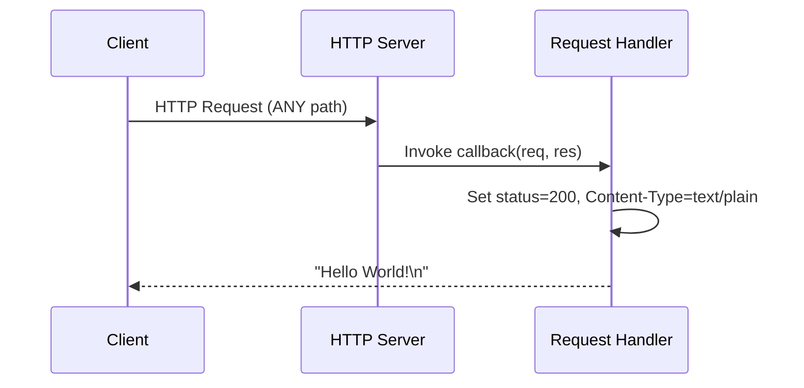
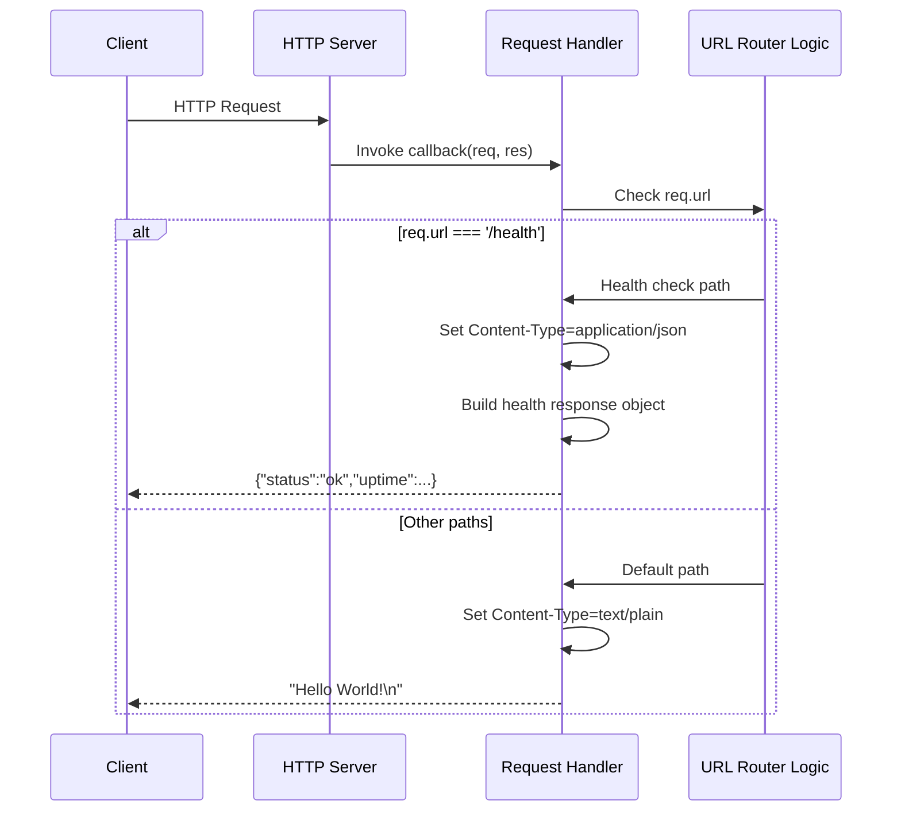
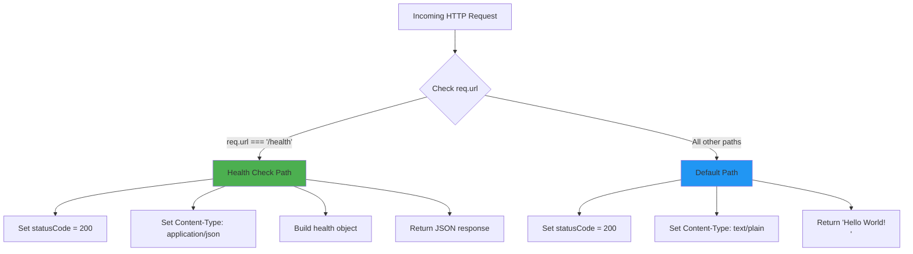

# Technical Specification

# 0. Agent Action Plan

## 0.1 Intent Clarification

### 0.1.1 Core Feature Objective

Based on the prompt, the Blitzy platform understands that the new feature requirement is to **add a health_check endpoint** to the existing Hello World Node.js HTTP server. This enhancement will enable external monitoring systems and operators to verify that the service is running correctly.

**Explicit Requirements Identified:**

- Add a `/health` or `/health_check` endpoint that responds to HTTP requests with service status information
- The endpoint must indicate whether the server is operational and healthy
- Enable easy verification of service availability through a dedicated URL path
- Maintain the existing "Hello World" functionality on all other routes

**Implicit Requirements Detected:**

- Implement URL path routing in the currently route-agnostic request handler (the existing handler responds identically to all paths)
- Return a structured JSON response with health status information following industry best practices
- Include diagnostic information such as uptime, timestamp, and service status
- Return appropriate HTTP status codes (200 for healthy, potentially 503 for unhealthy)
- Maintain backward compatibility with the existing "/" endpoint behavior

**Feature Dependencies and Prerequisites:**

| Dependency | Status | Impact |
|------------|--------|--------|
| Node.js >= 14.0.0 | ✅ Already satisfied | Runtime supports `process.uptime()` and JSON serialization |
| Built-in http module | ✅ Already in use | No new dependencies required |
| URL path parsing | ⚠️ Needs implementation | Currently, all requests receive identical response |
| JSON response support | ⚠️ Needs implementation | Health check should return application/json |

### 0.1.2 Special Instructions and Constraints

**Architectural Requirements:**

- <cite index="3-12,3-13,3-14">For health checks, it's best to stick with a minimal implementation for most cases. The tradeoff between the amount of code you need to add to your application for a minimal implementation versus the costs of adding a new dependency leads us to recommend adding the code directly.</cite>
- Follow the project's zero-dependency philosophy - implement without adding external npm packages
- Use only Node.js built-in APIs (http module, process object, Date)
- Keep the implementation simple and educational, consistent with the project's purpose

**Endpoint Naming Considerations:**

- <cite index="3-1,3-2">/readyz and /livez are common choices for the endpoints for the readiness and liveness probes, respectively.</cite>
- For simplicity in this educational project, `/health` is the recommended path as it directly aligns with the user's request for a "health_check" endpoint
- Alternative paths like `/healthcheck` or `/health_check` are also acceptable

**Response Format Best Practices:**

- <cite index="2-3">Health check response should include: the response time of the server, the uptime of the server, the status code of the server (as long as it is 200, we are going to get an "OK" message), and the timestamp of the server.</cite>
- Return HTTP 200 status code for healthy status
- Set Content-Type header to `application/json`
- Include meaningful diagnostic data for monitoring systems

**Backward Compatibility Requirement:**

- The existing "/" path must continue returning "Hello World!\n" with Content-Type: text/plain
- All non-health-check paths should retain their current behavior

### 0.1.3 Technical Interpretation

These feature requirements translate to the following technical implementation strategy:

- **To implement URL-based routing**, we will modify the request handler callback in `Hello_World_Node.js` to inspect `req.url` and conditionally respond based on the request path
- **To create the health check response**, we will construct a JSON object containing status, uptime (via `process.uptime()`), and timestamp information
- **To maintain backward compatibility**, we will preserve the existing response behavior for all paths except `/health`
- **To follow best practices**, we will implement a minimal, dependency-free health check that returns appropriate headers and status codes

**Technical Action Mapping:**

| Requirement | Technical Action | Component |
|-------------|------------------|-----------|
| Add health check endpoint | Implement URL routing in request handler | Hello_World_Node.js |
| Return service status | Return JSON with status="ok", uptime, timestamp | Hello_World_Node.js |
| Maintain Hello World | Keep existing response for non-health paths | Hello_World_Node.js |
| Document the endpoint | Add usage instructions | README.md |
| Update project metadata | Add health check to feature description | package.json |


## 0.2 Repository Scope Discovery

### 0.2.1 Comprehensive File Analysis

**Repository Structure:**

The Hello World Node.js project is a minimal, single-file application with the following structure:

```
simple-hello-word-for-automation-pro-user/
├── .git/                    # Git version control
├── Hello_World_Node.js      # Main application source (17 lines)
├── README.md                # Project documentation
└── package.json             # npm package manifest
```

**Existing Source Files to Modify:**

| File Path | Current Purpose | Modification Needed |
|-----------|-----------------|---------------------|
| `Hello_World_Node.js` | Single HTTP server file with route-agnostic handler | Add URL routing logic to distinguish `/health` from other paths |
| `README.md` | Documentation for running the server | Add section documenting the health check endpoint |
| `package.json` | npm manifest with project metadata | Update description to mention health check feature |

**Current Hello_World_Node.js Analysis (Lines 1-17):**

```javascript
// Current implementation - all paths return same response
const server = http.createServer((req, res) => {
  res.statusCode = 200;
  res.setHeader('Content-Type', 'text/plain');
  res.end('Hello World!\n');
});
```

The request handler (lines 8-12) currently:
- Ignores `req.url` completely
- Ignores `req.method` completely  
- Returns identical response for all requests
- Uses `text/plain` content type exclusively

**Integration Point Discovery:**

| Component | Current State | Required Changes |
|-----------|---------------|------------------|
| Request Handler (lines 8-12) | Route-agnostic, static response | Add conditional logic to check `req.url` |
| Response Generation | Single text/plain response | Add JSON response capability for health endpoint |
| Headers | Only Content-Type: text/plain | Support for Content-Type: application/json |
| Status Codes | Always returns 200 | Continue returning 200 (health is binary for this simple app) |

### 0.2.2 Web Search Research Conducted

**Best Practices Identified:**

- <cite index="3-11,3-12,3-13">We don't recommend the use of a module to add health checks. It's best to stick with a minimal implementation for most cases. The tradeoff between the amount of code you need to add versus the costs of adding a new dependency leads us to recommend adding the code directly.</cite>

- <cite index="1-1">The process.uptime() method is a built-in API of the process module which is used to get the number of seconds the Node.js process has been running.</cite>

- <cite index="7-2,7-3,7-4">A load balancer uses health checks to determine if an application instance is healthy and can accept requests. Kubernetes has two health checks: liveness, that determines when to restart a container, and readiness, that determines when a container is ready to start accepting traffic.</cite>

**Health Check Response Structure Recommendations:**

Based on industry best practices, the health check response should include:

| Field | Type | Description | Source |
|-------|------|-------------|--------|
| status | string | Service status ("ok" or "error") | Standard practice |
| uptime | number | Seconds since process started | process.uptime() |
| timestamp | number | Current Unix timestamp | Date.now() |
| message | string | Human-readable status description | Optional enhancement |

### 0.2.3 New File Requirements

**No New Source Files Required**

This feature can be implemented by modifying existing files only. The minimal nature of the project makes creating new files unnecessary. All changes will be contained within:

- `Hello_World_Node.js` - Core implementation changes
- `README.md` - Documentation updates
- `package.json` - Metadata updates (optional)

**New Test Files (Optional - Currently Out of Scope):**

Per the existing technical specification (Section 6.6), automated testing is explicitly out of scope for this educational project. However, if testing were to be implemented:

| Test File Path | Purpose |
|----------------|---------|
| `Hello_World_Node.test.js` | Unit tests for health check endpoint |
| `tests/health.test.js` | Integration tests for health response validation |

### 0.2.4 Configuration and Documentation Files

**Files Requiring Updates:**

| File | Update Type | Description |
|------|-------------|-------------|
| `README.md` | MODIFY | Add "Health Check Endpoint" section documenting `/health` path and expected response |
| `package.json` | MODIFY (optional) | Update description to mention health monitoring capability |

**No New Configuration Files Required:**

The health check feature requires no external configuration:
- Endpoint path (`/health`) will be hardcoded
- Response format will use sensible defaults
- No environment variables needed


## 0.3 Dependency Inventory

### 0.3.1 Private and Public Packages

**Current Package Registry Status:**

The project maintains a **zero-dependency architecture** as documented in the technical specification. This feature implementation will preserve this philosophy.

| Registry | Package Name | Version | Purpose | Status |
|----------|--------------|---------|---------|--------|
| npm | (none) | N/A | N/A | No dependencies currently |

**Node.js Built-in Modules Used:**

| Module | Current Usage | Feature Usage | Notes |
|--------|---------------|---------------|-------|
| `http` | Server creation and request handling | No changes needed | Already imported on line 3 |
| `process` | Not currently used | Will use `process.uptime()` | Global object, no import required |

**New Dependencies Required: None**

<cite index="3-12,3-13">We don't recommend the use of a module to add health checks to your application. It's best to stick with a minimal implementation for most cases.</cite>

The health check feature will be implemented using only:
- Node.js built-in `process.uptime()` method for uptime tracking
- Native JavaScript `Date.now()` for timestamp generation
- Native JavaScript `JSON.stringify()` for response formatting

### 0.3.2 Dependency Updates (Not Applicable)

**Import Updates:**

No import updates are required. The implementation uses:

```javascript
// Already imported in Hello_World_Node.js line 3
const http = require('http');

// No new imports needed - process and Date are globals
```

**External Reference Updates:**

| File Type | Pattern | Update Required |
|-----------|---------|-----------------|
| package.json | `dependencies` | No changes - stays empty |
| package.json | `devDependencies` | No changes - stays empty |
| package-lock.json | N/A | Does not exist (no dependencies) |

### 0.3.3 Runtime Requirements

**Node.js Version Compatibility:**

The feature uses only APIs available in Node.js 14.0.0 and later:

| API | Minimum Node.js Version | Current Requirement | Status |
|-----|-------------------------|---------------------|--------|
| `http.createServer()` | 0.1.0 | >=14.0.0 | ✅ Compatible |
| `process.uptime()` | 0.5.0 | >=14.0.0 | ✅ Compatible |
| `Date.now()` | JavaScript ES5 | >=14.0.0 | ✅ Compatible |
| `JSON.stringify()` | JavaScript ES5 | >=14.0.0 | ✅ Compatible |
| `req.url` property | 0.1.0 | >=14.0.0 | ✅ Compatible |

**Current package.json engines configuration:**

```json
{
  "engines": {
    "node": ">=14.0.0"
  }
}
```

No changes to engine requirements are necessary.

### 0.3.4 Development Dependencies

**Testing Frameworks (Out of Scope):**

Per Section 6.6 of the technical specification, automated testing is explicitly excluded. If testing were to be added in the future, recommended devDependencies would be:

| Package | Version | Purpose | Current Status |
|---------|---------|---------|----------------|
| jest | ^29.7.0 | Test runner | Not installed (out of scope) |
| supertest | ^6.3.4 | HTTP testing | Not installed (out of scope) |

**Linting/Formatting (Not Currently Used):**

| Package | Version | Purpose | Current Status |
|---------|---------|---------|----------------|
| eslint | - | Code linting | Not installed |
| prettier | - | Code formatting | Not installed |

The project's educational focus prioritizes simplicity over tooling infrastructure.


## 0.4 Integration Analysis

### 0.4.1 Existing Code Touchpoints

**Direct Modifications Required:**

| File | Location | Current Code | Change Description |
|------|----------|--------------|-------------------|
| `Hello_World_Node.js` | Lines 8-12 | Route-agnostic request handler | Add conditional routing for `/health` path |
| `Hello_World_Node.js` | Line 10 | `res.setHeader('Content-Type', 'text/plain')` | Dynamically set Content-Type based on route |
| `Hello_World_Node.js` | Line 11 | `res.end('Hello World!\n')` | Conditionally return JSON for health endpoint |

**Current Request Handler (Lines 8-12):**

```javascript
const server = http.createServer((req, res) => {
  res.statusCode = 200;
  res.setHeader('Content-Type', 'text/plain');
  res.end('Hello World!\n');
});
```

**Modified Request Handler (Conceptual):**

```javascript
const server = http.createServer((req, res) => {
  if (req.url === '/health') {
    // Health check response
  } else {
    // Original Hello World response
  }
});
```

### 0.4.2 Component Interaction Changes

**Before Health Check Implementation:**



**After Health Check Implementation:**



### 0.4.3 Database/Schema Updates

**Not Applicable**

This project has no database connectivity. The health check implementation:
- Uses no persistent storage
- Requires no schema changes
- Has no migration requirements
- Uses in-memory state only (`process.uptime()`)

### 0.4.4 Console Logger Impact

**Current Logging (Line 15):**

```javascript
console.log(`Server running at http://${hostname}:${port}/`);
```

**Optional Enhancement:**

The startup log could optionally be enhanced to indicate health check availability:

```javascript
console.log(`Server running at http://${hostname}:${port}/`);
console.log(`Health check available at http://${hostname}:${port}/health`);
```

This enhancement is optional but provides useful operational feedback.

### 0.4.5 API Endpoint Impact

**Endpoint Inventory:**

| Endpoint | Method | Before | After | Response |
|----------|--------|--------|-------|----------|
| `/*` (all paths) | ANY | Returns "Hello World!" | Returns "Hello World!" (except /health) | text/plain |
| `/health` | GET | Returns "Hello World!" | Returns health status JSON | application/json |

**Health Check Endpoint Specification:**

| Property | Value |
|----------|-------|
| Path | `/health` |
| Method | GET (will respond to any method) |
| Content-Type | application/json |
| Status Code | 200 (healthy) |
| Response Format | JSON object |

**Expected Response Body:**

```json
{
  "status": "ok",
  "uptime": 123.456,
  "timestamp": 1701936000000,
  "message": "Server is running"
}
```

### 0.4.6 External Integration Points

**Load Balancer Compatibility:**

<cite index="7-2,7-3">A load balancer uses health checks to determine if an application instance is healthy and can accept requests. Kubernetes has two health checks: liveness, that determines when to restart a container.</cite>

The implemented endpoint will be compatible with:

| Platform | Probe Configuration | Compatibility |
|----------|---------------------|---------------|
| Kubernetes | HTTP liveness/readiness probes | ✅ Compatible |
| AWS ALB | HTTP health check | ✅ Compatible |
| Docker HEALTHCHECK | curl/wget to /health | ✅ Compatible |
| Nginx upstream | health_check directive | ✅ Compatible |

**Monitoring System Compatibility:**

The JSON response format is compatible with common monitoring tools:

| Monitoring Tool | Integration Method |
|-----------------|-------------------|
| Prometheus | HTTP probe (via blackbox exporter) |
| Grafana | HTTP datasource |
| UptimeRobot | HTTP(s) monitor |
| Pingdom | HTTP check |


## 0.5 Technical Implementation

### 0.5.1 File-by-File Execution Plan

**CRITICAL: Every file listed below MUST be created or modified**

#### Group 1 - Core Feature Files

| Action | File Path | Change Description |
|--------|-----------|-------------------|
| MODIFY | `Hello_World_Node.js` | Add URL routing logic and health check response handler |

**Detailed Changes for Hello_World_Node.js:**

**Current State (17 lines):**
```javascript
const http = require('http');
const hostname = '127.0.0.1';
const port = 3000;
const server = http.createServer((req, res) => {
  res.statusCode = 200;
  res.setHeader('Content-Type', 'text/plain');
  res.end('Hello World!\n');
});
server.listen(port, hostname, () => {
  console.log(`Server running at http://${hostname}:${port}/`);
});
```

**Required Modifications:**

- **Line 8-12 (Request Handler):** Replace static response with conditional routing
- Add check for `req.url === '/health'`
- Implement health check JSON response with uptime and timestamp
- Preserve original "Hello World!" response for all other paths

**Implementation Pattern:**
```javascript
// Conditional routing based on URL
if (req.url === '/health') {
  // Health check endpoint logic
} else {
  // Original Hello World logic
}
```

#### Group 2 - Documentation Files

| Action | File Path | Change Description |
|--------|-----------|-------------------|
| MODIFY | `README.md` | Add "Health Check Endpoint" documentation section |
| MODIFY | `package.json` | Update description to mention health monitoring (optional) |

**Detailed Changes for README.md:**

Add a new section after "How It Works" with the following content:
- Health Check Endpoint heading
- Endpoint URL (`http://127.0.0.1:3000/health`)
- Expected JSON response format
- Use cases (monitoring, load balancers, Kubernetes probes)

**Detailed Changes for package.json (Optional):**

Update the description field:
```json
{
  "description": "A simple Hello World Node.js HTTP server with health check endpoint"
}
```

### 0.5.2 Implementation Approach per File

**Phase 1: Core Implementation (Hello_World_Node.js)**

The request handler will be restructured to:

1. **Check the request URL** using `req.url`
2. **For `/health` path:**
   - Set status code to 200
   - Set Content-Type to `application/json`
   - Build health object with status, uptime, timestamp
   - Serialize and return JSON response
3. **For all other paths:**
   - Preserve existing behavior (200 OK, text/plain, "Hello World!\n")

**Health Check Response Structure:**

```javascript
const healthcheck = {
  status: 'ok',
  uptime: process.uptime(),
  timestamp: Date.now(),
  message: 'Server is running'
};
```

**Phase 2: Documentation (README.md)**

Add comprehensive documentation for:
- What the health check endpoint does
- How to access it
- What response to expect
- Integration with monitoring tools

### 0.5.3 Code Change Specifications

**Request Handler Modification:**

| Line(s) | Current Code | New Code Purpose |
|---------|--------------|------------------|
| 8 | `const server = http.createServer((req, res) => {` | No change |
| 9 | `res.statusCode = 200;` | Move inside conditional blocks |
| 10 | `res.setHeader('Content-Type', 'text/plain');` | Dynamic based on path |
| 11 | `res.end('Hello World!\n');` | Conditional response body |
| 12 | `});` | No change |

**New Logic Flow:**



### 0.5.4 Response Format Specifications

**Health Check Response:**

| Field | Type | Value | Description |
|-------|------|-------|-------------|
| status | string | "ok" | Service health status |
| uptime | number | `process.uptime()` | Seconds since server started |
| timestamp | number | `Date.now()` | Current Unix timestamp in milliseconds |
| message | string | "Server is running" | Human-readable status message |

**HTTP Response Headers (Health Check):**

| Header | Value |
|--------|-------|
| Content-Type | application/json |
| Status Code | 200 OK |

**HTTP Response Headers (Hello World - unchanged):**

| Header | Value |
|--------|-------|
| Content-Type | text/plain |
| Status Code | 200 OK |

### 0.5.5 Validation Criteria

**Functional Requirements:**

| Requirement | Validation Method |
|-------------|-------------------|
| `/health` returns JSON | Check Content-Type header is application/json |
| Response contains status | Parse JSON, verify `status` field exists |
| Response contains uptime | Parse JSON, verify `uptime` is a number |
| Response contains timestamp | Parse JSON, verify `timestamp` is a number |
| Other paths return "Hello World!" | Request any non-/health path, verify text response |
| Original behavior preserved | Request "/" and verify "Hello World!\n" response |

**Manual Verification Steps:**

1. Start server: `node Hello_World_Node.js`
2. Verify startup message appears
3. Browser test: Navigate to `http://127.0.0.1:3000/` → Expect "Hello World!"
4. Browser test: Navigate to `http://127.0.0.1:3000/health` → Expect JSON response
5. CLI test: `curl http://127.0.0.1:3000/health` → Verify JSON format
6. Stop server: Ctrl+C


## 0.6 Scope Boundaries

### 0.6.1 Exhaustively In Scope

**Source Files:**

| File Pattern | Specific Files | Purpose |
|--------------|----------------|---------|
| `Hello_World_Node.js` | Main server file | Add health check routing logic and response |
| `README.md` | Project documentation | Document health check endpoint usage |
| `package.json` | npm manifest | Update description (optional) |

**Code Sections Within Files:**

| File | Section | Lines | Change Type |
|------|---------|-------|-------------|
| `Hello_World_Node.js` | Request handler callback | 8-12 | MODIFY - Add URL routing |
| `Hello_World_Node.js` | Server startup log | 15 | MODIFY (optional) - Add health endpoint info |
| `README.md` | How It Works section | After line 42 | ADD - New Health Check section |
| `package.json` | description field | Line 4 | MODIFY (optional) - Update description |

**New Functionality to Implement:**

| Functionality | Implementation Location |
|---------------|------------------------|
| URL path routing | `Hello_World_Node.js` request handler |
| Health check JSON response | `Hello_World_Node.js` request handler |
| `process.uptime()` usage | Health check response object |
| JSON serialization | Health check response generation |
| Content-Type switching | Dynamic header based on path |

**Documentation Updates:**

| Document | Section to Add/Modify |
|----------|----------------------|
| `README.md` | Add "## Health Check Endpoint" section |
| `README.md` | Add endpoint URL and response format |
| `README.md` | Add curl example for testing |

**HTTP Response Codes Used:**

| Endpoint | Status Code | Meaning |
|----------|-------------|---------|
| `/health` | 200 | Service is healthy |
| `/*` (other) | 200 | Normal response |

### 0.6.2 Explicitly Out of Scope

**Features NOT Being Implemented:**

| Feature | Rationale |
|---------|-----------|
| Separate liveness (`/livez`) and readiness (`/readyz`) endpoints | Over-engineering for this simple project; single `/health` endpoint is sufficient |
| Database health checks | Project has no database connectivity |
| External service dependency checks | Project has no external integrations |
| Configurable health check path | Hardcoded path maintains simplicity |
| Configurable response fields | Fixed response format is sufficient |
| Authentication/authorization for health endpoint | Educational project, localhost-only deployment |
| Health check libraries/frameworks | Maintaining zero-dependency philosophy |

**Files NOT Being Modified:**

| File/Directory | Reason |
|----------------|--------|
| `.git/` | Git internal files |
| `.github/` (if exists) | CI/CD configuration (none exists) |
| `node_modules/` | Does not exist (no dependencies) |
| Lock files | Do not exist (no dependencies) |

**Architecture Elements NOT Being Changed:**

| Element | Current State | After Implementation |
|---------|---------------|---------------------|
| Server binding | 127.0.0.1:3000 | No change |
| Port configuration | Hardcoded 3000 | No change |
| Module system | CommonJS (require) | No change |
| Dependencies | Zero | Still zero |
| Error handling | Minimal (none) | No change |
| Logging approach | console.log only | No change |

**Testing NOT Included:**

Per Technical Specification Section 6.6, automated testing remains out of scope:
- Unit tests for health endpoint
- Integration tests
- End-to-end tests
- Performance tests

**Performance Optimizations NOT Included:**

| Optimization | Reason for Exclusion |
|--------------|---------------------|
| Response caching | Unnecessary for health checks |
| Connection keep-alive tuning | Beyond feature scope |
| Clustering | Out of scope per spec |

### 0.6.3 Boundary Clarifications

**What "Health Check" Means in This Context:**

- Simple service availability verification (server is running)
- Process uptime reporting
- Does NOT include:
  - Deep health checks
  - Dependency availability
  - Performance metrics
  - Resource utilization

**Backward Compatibility Guarantee:**

All existing behavior will be preserved:

| Request | Before Feature | After Feature |
|---------|----------------|---------------|
| `GET /` | "Hello World!\n" | "Hello World!\n" |
| `GET /anything` | "Hello World!\n" | "Hello World!\n" |
| `POST /` | "Hello World!\n" | "Hello World!\n" |
| `GET /health` | "Hello World!\n" | JSON health response |

**URL Path Matching Specifics:**

| Path | Matches Health Check? | Response Type |
|------|----------------------|---------------|
| `/health` | ✅ Yes | JSON |
| `/health/` | ❌ No (trailing slash) | Hello World |
| `/healthcheck` | ❌ No | Hello World |
| `/HEALTH` | ❌ No (case sensitive) | Hello World |
| `/health?query=1` | ❌ No (has query string) | Hello World |

The implementation will use strict equality matching (`req.url === '/health'`) for simplicity and predictability.


## 0.7 Special Instructions

### 0.7.1 Feature-Specific Requirements

**Zero-Dependency Mandate:**

The implementation MUST NOT introduce any new npm dependencies. All functionality must be achieved using:
- Node.js built-in modules (`http` - already imported)
- Node.js global objects (`process`, `Date`, `JSON`)
- Native JavaScript language features

**Educational Purpose Preservation:**

The code should remain simple and readable:
- Minimal lines of code added (target: <15 new lines)
- Clear comments explaining the health check logic
- Avoid complex patterns or abstractions
- Keep the code accessible to Node.js beginners

**Consistency with Existing Code Style:**

| Aspect | Current Style | Requirement |
|--------|---------------|-------------|
| Variable declarations | `const` | Use `const` for new variables |
| String formatting | Template literals | Use template literals if needed |
| Arrow functions | Used for callbacks | Continue using arrow functions |
| Semicolons | Present | Include semicolons |
| Indentation | 2 spaces | Use 2-space indentation |

### 0.7.2 Integration Requirements with Existing Features

**Preserving F-001 through F-004 Feature Compliance:**

Per Technical Specification Section 2.3, the existing features must remain functional:

| Feature ID | Feature Name | Impact |
|------------|--------------|--------|
| F-001 | HTTP Server Initialization | No change |
| F-002 | HTTP Request Acceptance | Enhanced with routing |
| F-003 | HTTP Response Generation | Enhanced with JSON capability |
| F-004 | Console Status Logging | Minor enhancement (optional) |

**New Feature (F-005 - Health Check Endpoint):**

| Attribute | Value |
|-----------|-------|
| Feature ID | F-005 (suggested) |
| Feature Name | Health Check Endpoint |
| Path | `/health` |
| Method | ANY (responds to all HTTP methods) |
| Response | JSON with status, uptime, timestamp |
| Priority | Low (enhancement, not critical) |

### 0.7.3 Performance Considerations

**Response Time Expectations:**

| Endpoint | Target Response Time | Rationale |
|----------|---------------------|-----------|
| `/health` | <5ms | Simple object serialization, no I/O |
| `/*` (other) | <5ms | Unchanged from current |

**Memory Impact:**

| Change | Memory Impact |
|--------|---------------|
| URL routing logic | Negligible (<1KB) |
| Health response object | ~100 bytes per request |
| No persistent state added | Zero memory growth over time |

### 0.7.4 Security Considerations

**No Additional Security Requirements:**

| Consideration | Status | Rationale |
|---------------|--------|-----------|
| Authentication | Not needed | Localhost-only, educational project |
| Rate limiting | Not needed | Minimal attack surface |
| Input validation | Minimal needed | Only checking URL path equality |
| Information exposure | Acceptable | Uptime and timestamp are non-sensitive |

**Safe Information in Health Response:**

| Field | Security Risk | Assessment |
|-------|---------------|------------|
| status | None | Generic status indicator |
| uptime | Low | Process uptime is not sensitive |
| timestamp | None | Current time is public information |
| message | None | Static text, no dynamic data |

**What NOT to Include in Health Response:**

| Data | Reason to Exclude |
|------|-------------------|
| Environment variables | May contain secrets |
| File paths | System information disclosure |
| Node.js version | Version-specific vulnerability targeting |
| Memory usage | Resource information disclosure |
| Request count | Traffic pattern disclosure |

### 0.7.5 Monitoring and Observability Integration

**Health Check Usage Patterns:**

<cite index="1-10">It allows you to monitor this endpoint to get alerted when your API/application goes into trouble.</cite>

**Recommended Monitoring Integration:**

| Use Case | Configuration |
|----------|---------------|
| Kubernetes liveness probe | `httpGet: /health`, `port: 3000` |
| Kubernetes readiness probe | Same as liveness (simple app) |
| Docker HEALTHCHECK | `curl -f http://localhost:3000/health` |
| AWS ALB health check | Path: `/health`, Port: 3000 |

**Health Check Polling Recommendations:**

| Parameter | Recommended Value | Rationale |
|-----------|-------------------|-----------|
| Check interval | 30 seconds | Sufficient for simple app |
| Timeout | 5 seconds | Health response should be instant |
| Failure threshold | 3 consecutive failures | Avoid false positives |

### 0.7.6 Testing Verification Commands

**Manual Testing Commands:**

```bash
# Start the server
node Hello_World_Node.js

#### Test default endpoint (in new terminal)
curl http://127.0.0.1:3000/

#### Test health endpoint
curl http://127.0.0.1:3000/health

#### Test health endpoint with formatted JSON output
curl -s http://127.0.0.1:3000/health | jq .

#### Verify Content-Type header
curl -I http://127.0.0.1:3000/health
```

**Expected Test Results:**

| Command | Expected Output |
|---------|-----------------|
| `curl http://127.0.0.1:3000/` | `Hello World!` |
| `curl http://127.0.0.1:3000/health` | `{"status":"ok","uptime":...,"timestamp":...}` |
| `curl -I http://127.0.0.1:3000/health` | `Content-Type: application/json` |

### 0.7.7 Rollback Considerations

**If Health Check Causes Issues:**

The feature can be easily removed by:
1. Reverting `Hello_World_Node.js` to its original 17-line form
2. Removing health check documentation from README.md

**Minimal Risk Assessment:**

| Risk | Likelihood | Impact | Mitigation |
|------|------------|--------|------------|
| Code complexity increase | Low | Low | Keep implementation minimal |
| Breaking existing behavior | Very Low | Medium | Preserve else branch for Hello World |
| Performance degradation | Very Low | Low | No async operations added |
| Security vulnerability | Very Low | Low | No new attack vectors introduced |

### 0.7.8 File Modification Summary Table

| File | Action | Priority | Estimated Lines Changed |
|------|--------|----------|------------------------|
| `Hello_World_Node.js` | MODIFY | Required | ~10-15 lines modified |
| `README.md` | MODIFY | Required | ~15-20 lines added |
| `package.json` | MODIFY | Optional | 1 line modified |

**Total Implementation Effort:**
- Estimated time: 15-30 minutes
- Complexity: Low
- Risk: Very Low
- Testing effort: Manual verification only (~5 minutes)


