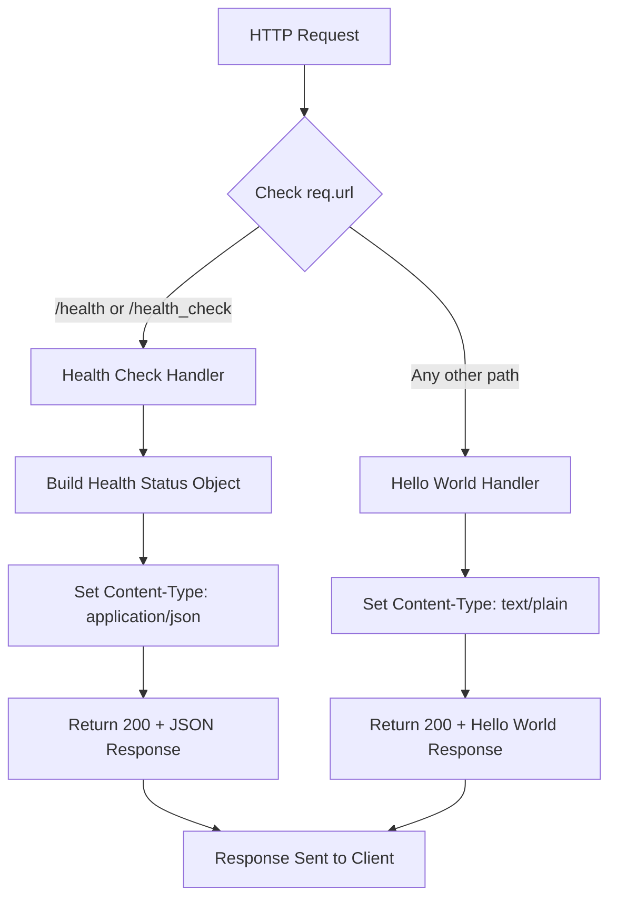

# Technical Specification

# 0. Agent Action Plan

## 0.1 Intent Clarification

### 0.1.1 Core Feature Objective

Based on the prompt, the Blitzy platform understands that the new feature requirement is to **add a health_check endpoint** to the existing Hello World Node.js HTTP server application. This enhancement will allow users and automated systems to easily verify that the service is running correctly.

**Explicit Requirements:**
- Add a dedicated `/health` or `/health_check` endpoint to the HTTP server
- The endpoint should respond with information indicating the service is running correctly
- The implementation must not disrupt the existing "Hello World!" functionality on other routes

**Implicit Requirements Detected:**
- The server currently responds with "Hello World!" to ALL HTTP requests regardless of path - this behavior must be changed to support URL-based routing
- The existing root path (`/`) functionality must be preserved while adding the new endpoint
- The health check response should follow industry standards (HTTP 200 status code for healthy, JSON response format)
- The implementation should maintain the project's zero-dependency philosophy by using only Node.js built-in modules
- Health check response should provide useful diagnostics such as uptime, status, and timestamp

**Feature Dependencies and Prerequisites:**
- Node.js runtime version >=14.0.0 (already specified in `package.json`)
- Node.js built-in `http` module (already used)
- No additional npm packages required - maintains zero-dependency architecture
- URL parsing capability from Node.js built-in modules (`url` module or `req.url` property)

### 0.1.2 Special Instructions and Constraints

**Architectural Requirements:**
- Maintain the existing educational simplicity and minimal codebase approach
- Continue using CommonJS module system (`require()`) for consistency
- Keep the server binding to localhost only (`127.0.0.1:3000`) for security
- Follow the existing synchronous response pattern

**Integration Requirements:**
- The health check endpoint must coexist with the existing Hello World response
- All non-health-check routes should continue returning "Hello World!"
- Response headers should be appropriate for the content type (JSON for health check, plain text for Hello World)

**Best Practice Guidelines Discovered via Research:**
- According to the Node.js Reference Architecture, "It's best to stick with a minimal implementation for most cases" rather than adding external libraries
- Common endpoint naming: `/health`, `/healthz`, `/livez`, or `/readyz`
- Health checks should return HTTP 200 status code with JSON payload including status information
- Include useful metrics: `status`, `uptime`, `timestamp`

**User Example Preserved:**
> "Could you please add a health_check endpoint to the project so that we can easily verify that the service is running correctly?"

### 0.1.3 Technical Interpretation

These feature requirements translate to the following technical implementation strategy:

- **To implement URL-based routing**, we will modify the request handler in `Hello_World_Node.js` to inspect `req.url` and conditionally respond based on the path
- **To implement the health check endpoint**, we will add conditional logic that checks if the URL matches `/health` or `/health_check` and returns appropriate health status information
- **To provide health status information**, we will create a JSON response object containing:
  - `status`: "OK" or "healthy" indicator
  - `uptime`: Server uptime using `process.uptime()`
  - `timestamp`: Current time using `Date.now()`
- **To maintain existing functionality**, we will ensure all other routes (including `/`) continue returning the "Hello World!" plain text response
- **To update documentation**, we will modify `README.md` to document the new endpoint and its usage
- **To fix existing inconsistency**, we will address the mismatch between `package.json` (references `server.js`) and the actual filename (`Hello_World_Node.js`)


## 0.2 Repository Scope Discovery

### 0.2.1 Comprehensive File Analysis

**Repository Structure Overview:**

The repository is a minimal, self-contained Node.js project with only three files at the root level and no nested subdirectories:

| File Path | Type | Lines | Purpose | Health Check Impact |
|-----------|------|-------|---------|---------------------|
| `Hello_World_Node.js` | Source | 17 | Main HTTP server implementation | **MODIFY** - Add URL routing and health check logic |
| `package.json` | Config | 21 | NPM package manifest | **MODIFY** - Update description, fix entry point mismatch |
| `README.md` | Docs | 53 | Project documentation | **MODIFY** - Document health check endpoint usage |

**Search Patterns Applied:**
- Source files: `*.js` → Found: `Hello_World_Node.js`
- Configuration: `*.json` → Found: `package.json`
- Documentation: `*.md`, `README*` → Found: `README.md`
- Test files: `*test*.js`, `*spec*.js` → None found
- Build/CI files: `.github/workflows/*`, `Dockerfile*` → None found

### 0.2.2 Existing Source File Analysis

**File: `Hello_World_Node.js` (Primary Modification Target)**

```javascript
// Current implementation (17 lines)
const http = require('http');
const server = http.createServer((req, res) => {
  // Currently responds to ALL requests the same way
  res.end('Hello World!\n');
});
```

**Current Behavior Limitations:**
- No URL path inspection - responds identically to all routes
- No Content-Type header differentiation
- Single hardcoded response for all HTTP methods and paths
- No health status information available

**Required Modifications:**
- Add URL path checking using `req.url`
- Implement conditional response logic for `/health` and `/health_check` paths
- Return JSON response with health status for health check endpoint
- Maintain "Hello World!" response for all other paths
- Add appropriate Content-Type headers (JSON vs plain text)

### 0.2.3 Configuration File Analysis

**File: `package.json`**

```json
{
  "name": "hello-world-nodejs",
  "version": "1.0.0",
  "main": "server.js",  // ⚠️ MISMATCH - actual file is Hello_World_Node.js
  "scripts": {
    "start": "node server.js",  // ⚠️ MISMATCH
    "dev": "node server.js"     // ⚠️ MISMATCH
  },
  "engines": { "node": ">=14.0.0" }
}
```

**Issues Identified:**
- Entry point mismatch: `main` references `server.js` but actual file is `Hello_World_Node.js`
- Scripts reference non-existent `server.js`
- No test scripts defined

**Required Modifications:**
- Update `main` field to `Hello_World_Node.js`
- Update `scripts.start` to `node Hello_World_Node.js`
- Update `scripts.dev` to `node Hello_World_Node.js`
- Update `description` to reflect new health check capability

### 0.2.4 Documentation File Analysis

**File: `README.md`**

Current documentation covers:
- Prerequisites (Node.js installation)
- Basic usage instructions
- How the server works
- Configuration defaults (hostname, port)

**Missing Documentation:**
- Health check endpoint documentation
- Health check response format
- Usage examples for health verification
- Updated file references (currently references `server.js`)

### 0.2.5 Integration Point Discovery

**API Endpoints (Current vs. Proposed):**

| Route | Current Behavior | Proposed Behavior |
|-------|------------------|-------------------|
| `/` | Returns "Hello World!" | Returns "Hello World!" (unchanged) |
| `/health` | Returns "Hello World!" | Returns JSON health status |
| `/health_check` | Returns "Hello World!" | Returns JSON health status |
| `/*` (any other) | Returns "Hello World!" | Returns "Hello World!" (unchanged) |

**Database Models/Migrations:** Not applicable - stateless application with no data persistence

**Service Classes:** Not applicable - single-file implementation with no service layer

**Middleware/Interceptors:** Not applicable - no middleware pattern used

### 0.2.6 New File Requirements

**No new source files required.** The feature can be implemented entirely within the existing `Hello_World_Node.js` file while maintaining the project's minimal, single-file architecture.

**Rationale:**
- The health check logic is simple (< 15 lines of additional code)
- Creating separate files would contradict the educational simplicity objective
- All routing logic can be cleanly integrated into the existing request handler
- Maintains the project's "comprehensible in a single reading" design principle

### 0.2.7 Web Search Research Conducted

**Research Topics Investigated:**
- Node.js health check endpoint best practices
- Kubernetes liveness and readiness probe patterns
- Standard health check response formats

**Key Findings:**
- The Node.js Reference Architecture recommends minimal implementations without external libraries
- Standard endpoint paths: `/health`, `/healthz`, `/livez`, `/readyz`
- Common response fields: `status`, `uptime`, `timestamp`
- HTTP 200 for healthy, HTTP 503 for unhealthy
- JSON Content-Type for health check responses


## 0.3 Dependency Inventory

### 0.3.1 Private and Public Packages

**Current Dependency Status:** Zero external dependencies

The project maintains a deliberate zero-dependency architecture, using only Node.js built-in modules. This philosophy will be preserved for the health check feature implementation.

**Packages Relevant to Health Check Implementation:**

| Registry | Package Name | Version | Type | Purpose |
|----------|--------------|---------|------|---------|
| Node.js Built-in | `http` | (bundled with Node.js >=14.0.0) | Built-in Module | HTTP server creation, request/response handling |
| Node.js Built-in | `process` | (bundled with Node.js >=14.0.0) | Global Object | `process.uptime()` for server uptime measurement |
| Node.js Built-in | `Date` | (bundled with Node.js >=14.0.0) | Global Object | `Date.now()` for timestamp generation |

**No External NPM Packages Required:**

The health check feature will be implemented using only:
- `req.url` - URL path extraction (available on http.IncomingMessage)
- `process.uptime()` - Server uptime in seconds (global)
- `Date.now()` - Current timestamp in milliseconds (global)
- `JSON.stringify()` - JSON serialization (global)

### 0.3.2 Dependency Updates

**Import Updates:**

No import changes required. The current import statement remains unchanged:

```javascript
// Current import (no changes needed)
const http = require('http');
```

**New Built-in APIs to Utilize:**

| API | Already Available | Usage in Health Check |
|-----|-------------------|----------------------|
| `req.url` | Yes (via http module) | Extract URL path for routing |
| `process.uptime()` | Yes (global) | Report server uptime |
| `Date.now()` | Yes (global) | Generate response timestamp |
| `JSON.stringify()` | Yes (global) | Serialize health status object |

### 0.3.3 External Reference Updates

**Configuration Files:**

| File | Field | Current Value | Updated Value | Reason |
|------|-------|---------------|---------------|--------|
| `package.json` | `main` | `"server.js"` | `"Hello_World_Node.js"` | Fix entry point mismatch |
| `package.json` | `scripts.start` | `"node server.js"` | `"node Hello_World_Node.js"` | Fix script reference |
| `package.json` | `scripts.dev` | `"node server.js"` | `"node Hello_World_Node.js"` | Fix script reference |
| `package.json` | `description` | `"A simple Hello World..."` | `"A Hello World Node.js HTTP server with health check endpoint"` | Reflect new capability |
| `package.json` | `version` | `"1.0.0"` | `"1.1.0"` | Version bump for new feature |

**Documentation Files:**

| File | Section | Update Required |
|------|---------|-----------------|
| `README.md` | Usage | Add health check endpoint documentation |
| `README.md` | How It Works | Describe URL routing and health check response |
| `README.md` | Configuration | Document health check paths |

### 0.3.4 Version Constraints

**Runtime Version Requirements:**

| Component | Minimum Version | Verified In | Status |
|-----------|----------------|-------------|--------|
| Node.js | >=14.0.0 | `package.json` engines field | ✅ Sufficient for health check |

**Feature Availability by Node.js Version:**

| Feature | Available Since | Required For |
|---------|-----------------|--------------|
| `http.createServer()` | Node.js 0.1.0 | HTTP server |
| `req.url` | Node.js 0.1.0 | URL routing |
| `process.uptime()` | Node.js 0.5.0 | Uptime reporting |
| `JSON.stringify()` | Node.js 0.1.0 | JSON response |
| Arrow functions | Node.js 4.0.0 | Syntax (already used) |
| Template literals | Node.js 4.0.0 | Syntax (already used) |

**Conclusion:** All required APIs are available in Node.js >=14.0.0. No version constraint changes needed.

### 0.3.5 Dependency Philosophy Alignment

The health check implementation strictly adheres to the project's dependency philosophy:

**Maintained Principles:**
- ✅ Zero external npm packages
- ✅ Only Node.js built-in modules
- ✅ No package-lock.json changes required
- ✅ No `npm install` steps for new functionality
- ✅ Immediate executability preserved

**Rejected Alternatives:**
- ❌ Express.js framework (would add dependencies)
- ❌ @hmcts/nodejs-healthcheck package (contradicts zero-dependency philosophy)
- ❌ Any npm-based health check libraries


## 0.4 Integration Analysis

### 0.4.1 Existing Code Touchpoints

**Direct Modifications Required:**

| File | Location | Modification Type | Description |
|------|----------|-------------------|-------------|
| `Hello_World_Node.js` | Lines 8-12 | **MODIFY** | Add URL path checking and conditional response logic |
| `Hello_World_Node.js` | Line 3 | **NO CHANGE** | Keep existing `http` require statement |
| `Hello_World_Node.js` | Lines 5-6 | **NO CHANGE** | Keep hostname/port configuration |
| `Hello_World_Node.js` | Lines 14-16 | **NO CHANGE** | Keep server.listen() call |

**Request Handler Modification Details:**

```
Current: Lines 8-12 in Hello_World_Node.js
─────────────────────────────────────────
const server = http.createServer((req, res) => {
  res.statusCode = 200;
  res.setHeader('Content-Type', 'text/plain');
  res.end('Hello World!\n');
});

Required Changes:
─────────────────────────────────────────
- Add URL path extraction: const path = req.url;
- Add conditional check: if (path === '/health' || path === '/health_check')
- Add health response: JSON with status, uptime, timestamp
- Add else block: preserve original Hello World response
- Differentiate Content-Type: 'application/json' vs 'text/plain'
```

### 0.4.2 Integration Points Map

**Request Flow Integration:**



**Code Integration Points:**

| Integration Point | Current Code | New Code | Line Reference |
|-------------------|--------------|----------|----------------|
| Request entry | `(req, res) =>` | `(req, res) =>` (unchanged) | Line 8 |
| URL routing | None | `const path = req.url;` | New: Line 9 |
| Health check branch | None | `if (path === '/health' ...)` | New: Lines 10-17 |
| Default response | Direct response | Moved to `else` block | Lines 18-21 |

### 0.4.3 Dependency Injections

**Not Applicable** - The project uses a simple, monolithic single-file architecture without:
- Dependency injection containers
- Service registries
- Configuration managers
- Module loaders

All functionality is self-contained within the request handler callback.

### 0.4.4 Database/Schema Updates

**Not Applicable** - The application is completely stateless with:
- No database connections
- No persistent storage
- No schema definitions
- No migrations required

The health check will report runtime status only, not data layer health.

### 0.4.5 External System Integration

**Current External Integrations:** None

**Health Check Integration Opportunities (Future):**
- Kubernetes liveness probes can be configured to hit `/health` endpoint
- Load balancers can use `/health_check` for backend health verification
- Monitoring tools can poll the health endpoint for uptime tracking
- CI/CD pipelines can verify deployment success via health endpoint

### 0.4.6 Response Format Integration

**Health Check Response Structure:**

```json
{
  "status": "OK",
  "uptime": 123.456,
  "timestamp": 1704067200000,
  "service": "hello-world-nodejs"
}
```

**Response Field Mapping:**

| Field | Source | Type | Description |
|-------|--------|------|-------------|
| `status` | Hardcoded | String | "OK" when server is responsive |
| `uptime` | `process.uptime()` | Number | Seconds since server started |
| `timestamp` | `Date.now()` | Number | Unix timestamp in milliseconds |
| `service` | Hardcoded | String | Service identifier for multi-service environments |

### 0.4.7 HTTP Response Integration

**Content-Type Differentiation:**

| Endpoint | Content-Type | Status Code | Body Format |
|----------|--------------|-------------|-------------|
| `/health` | `application/json` | 200 | JSON object |
| `/health_check` | `application/json` | 200 | JSON object |
| `/` | `text/plain` | 200 | Plain text |
| `/*` (other) | `text/plain` | 200 | Plain text |

### 0.4.8 Console Logging Integration

**Current Logging:** Single startup message

```javascript
console.log(`Server running at http://${hostname}:${port}/`);
```

**Enhanced Logging (Optional):**
- Log health check availability: `Health check available at /health`
- No per-request logging (maintains simplicity)


## 0.5 Technical Implementation

### 0.5.1 File-by-File Execution Plan

**CRITICAL:** Every file listed below MUST be created or modified as specified.

#### Group 1 - Core Feature Files

| Action | File | Purpose | Priority |
|--------|------|---------|----------|
| **MODIFY** | `Hello_World_Node.js` | Add URL routing and health check endpoint logic | P0 - Critical |

**Modification Details for `Hello_World_Node.js`:**

```
Lines to Modify: 8-12 (request handler)
Changes Required:
  - Extract URL path from request
  - Add conditional routing for /health and /health_check
  - Create health status response object
  - Set appropriate Content-Type headers
  - Return JSON for health endpoints
  - Preserve Hello World response for other routes
```

#### Group 2 - Configuration Files

| Action | File | Purpose | Priority |
|--------|------|---------|----------|
| **MODIFY** | `package.json` | Fix entry point mismatch, update version/description | P1 - High |

**Modification Details for `package.json`:**

| Field | Current | New | Reason |
|-------|---------|-----|--------|
| `version` | `"1.0.0"` | `"1.1.0"` | New feature version bump |
| `description` | Current text | `"A Hello World Node.js HTTP server with health check endpoint"` | Reflect capability |
| `main` | `"server.js"` | `"Hello_World_Node.js"` | Fix mismatch |
| `scripts.start` | `"node server.js"` | `"node Hello_World_Node.js"` | Fix mismatch |
| `scripts.dev` | `"node server.js"` | `"node Hello_World_Node.js"` | Fix mismatch |

#### Group 3 - Documentation

| Action | File | Purpose | Priority |
|--------|------|---------|----------|
| **MODIFY** | `README.md` | Document health check endpoint and usage | P1 - High |

**Modification Details for `README.md`:**

| Section | Update Required |
|---------|-----------------|
| Title/Description | Mention health check capability |
| Usage | Add health check verification step |
| Endpoints | New section documenting available endpoints |
| How It Works | Describe URL routing logic |
| API Reference | Document health check response format |

### 0.5.2 Implementation Approach

**Step 1: Establish Health Check Logic Foundation**

Modify `Hello_World_Node.js` request handler to:
- Extract the URL path from incoming requests
- Implement conditional branching based on path

```javascript
// Conceptual structure (not final code)
const path = req.url;
if (path === '/health' || path === '/health_check') {
  // Health check response
} else {
  // Original Hello World response
}
```

**Step 2: Create Health Status Response Object**

Build a comprehensive health status object using built-in APIs:

```javascript
// Health status structure
const healthStatus = {
  status: 'OK',
  uptime: process.uptime(),
  timestamp: Date.now(),
  service: 'hello-world-nodejs'
};
```

**Step 3: Implement Dual Response Handling**

Configure appropriate headers and responses for each path type:

| Path Type | Content-Type | Response Body |
|-----------|--------------|---------------|
| Health check | `application/json` | `JSON.stringify(healthStatus)` |
| All others | `text/plain` | `'Hello World!\n'` |

**Step 4: Update Configuration Files**

Fix `package.json` entry point mismatch to ensure:
- `npm start` works correctly
- `main` field points to actual entry file
- Description reflects new capabilities

**Step 5: Document Feature Usage**

Update `README.md` with:
- Health check endpoint documentation
- Example curl/browser verification commands
- Response format specification

### 0.5.3 Code Implementation Pattern

**Request Handler Implementation Pattern:**

```
┌──────────────────────────────────────────────────────────────┐
│  http.createServer((req, res) => {                           │
│    const path = req.url;                                     │
│                                                              │
│    if (path === '/health' || path === '/health_check') {     │
│      ┌────────────────────────────────────────────────────┐  │
│      │  HEALTH CHECK BRANCH                               │  │
│      │  - Set status: 200                                 │  │
│      │  - Set Content-Type: application/json              │  │
│      │  - Build health status object                      │  │
│      │  - Return JSON response                            │  │
│      └────────────────────────────────────────────────────┘  │
│    } else {                                                  │
│      ┌────────────────────────────────────────────────────┐  │
│      │  HELLO WORLD BRANCH (Original behavior)            │  │
│      │  - Set status: 200                                 │  │
│      │  - Set Content-Type: text/plain                    │  │
│      │  - Return "Hello World!\n"                         │  │
│      └────────────────────────────────────────────────────┘  │
│    }                                                         │
│  });                                                         │
└──────────────────────────────────────────────────────────────┘
```

### 0.5.4 Expected Line Count Changes

| File | Current Lines | Expected New Lines | Net Change |
|------|---------------|-------------------|------------|
| `Hello_World_Node.js` | 17 | ~30-35 | +13-18 lines |
| `package.json` | 21 | 21 | No change (field updates) |
| `README.md` | 53 | ~80-90 | +27-37 lines |

**Total Code Impact:** Approximately 40-55 new/modified lines across all files

### 0.5.5 Quality Assurance Verification

**Manual Verification Steps After Implementation:**

1. **Server Startup Test:**
   - Run: `node Hello_World_Node.js`
   - Verify: Console shows "Server running at http://127.0.0.1:3000/"

2. **Hello World Endpoint Test:**
   - Navigate: `http://127.0.0.1:3000/`
   - Verify: Returns "Hello World!" as plain text

3. **Health Check Endpoint Test:**
   - Navigate: `http://127.0.0.1:3000/health`
   - Verify: Returns JSON with status, uptime, timestamp

4. **Alternative Health Path Test:**
   - Navigate: `http://127.0.0.1:3000/health_check`
   - Verify: Returns same JSON health response

5. **Other Paths Test:**
   - Navigate: `http://127.0.0.1:3000/any/other/path`
   - Verify: Returns "Hello World!" (fallback behavior)

6. **NPM Scripts Test:**
   - Run: `npm start`
   - Verify: Server starts correctly


## 0.6 Scope Boundaries

### 0.6.1 Exhaustively In Scope

**Source Files:**

| File Pattern | Specific Files | Modification Type |
|--------------|----------------|-------------------|
| `*.js` | `Hello_World_Node.js` | **MODIFY** - Add health check logic |

**Configuration Files:**

| File Pattern | Specific Files | Modification Type |
|--------------|----------------|-------------------|
| `package.json` | `package.json` | **MODIFY** - Fix entry point, update metadata |

**Documentation Files:**

| File Pattern | Specific Files | Modification Type |
|--------------|----------------|-------------------|
| `README.md` | `README.md` | **MODIFY** - Document health check endpoint |

**Complete In-Scope File Inventory:**

| # | File Path | Lines Affected | Change Summary |
|---|-----------|----------------|----------------|
| 1 | `Hello_World_Node.js` | Lines 8-12 (expand to ~25 lines) | Add URL routing, health check response |
| 2 | `package.json` | Lines 4-9 | Fix `main`, `scripts`, update `version`, `description` |
| 3 | `README.md` | Add new sections | Document endpoints, response format |

### 0.6.2 In-Scope Code Changes Detail

**`Hello_World_Node.js` - Specific Changes:**

| Line Range | Current Content | New Content |
|------------|-----------------|-------------|
| 8 | `const server = http.createServer((req, res) => {` | `const server = http.createServer((req, res) => {` |
| 9 | `res.statusCode = 200;` | `const path = req.url;` |
| 10-17 | (not applicable) | Health check conditional block |
| 18-21 | (not applicable) | Else block with Hello World response |
| 10-12 (old) | Original response logic | Moved to else block |

**`package.json` - Specific Field Updates:**

| Field Path | Current Value | New Value |
|------------|---------------|-----------|
| `version` | `"1.0.0"` | `"1.1.0"` |
| `description` | `"A simple Hello World Node.js HTTP server application"` | `"A Hello World Node.js HTTP server with health check endpoint"` |
| `main` | `"server.js"` | `"Hello_World_Node.js"` |
| `scripts.start` | `"node server.js"` | `"node Hello_World_Node.js"` |
| `scripts.dev` | `"node server.js"` | `"node Hello_World_Node.js"` |

**`README.md` - New Sections to Add:**

| Section Title | Content |
|---------------|---------|
| Endpoints | List of available HTTP endpoints |
| Health Check | Documentation of `/health` and `/health_check` |
| API Response | JSON response format specification |

### 0.6.3 In-Scope Functional Changes

| Feature | Description | Affected Files |
|---------|-------------|----------------|
| URL Routing | Parse `req.url` and route to appropriate handler | `Hello_World_Node.js` |
| Health Check Endpoint | Return JSON status at `/health` and `/health_check` | `Hello_World_Node.js` |
| Content-Type Differentiation | JSON for health, plain text for Hello World | `Hello_World_Node.js` |
| Uptime Reporting | Include `process.uptime()` in health response | `Hello_World_Node.js` |
| Timestamp Reporting | Include `Date.now()` in health response | `Hello_World_Node.js` |
| Entry Point Fix | Correct `main` and `scripts` to match actual file | `package.json` |
| Documentation Update | Document new endpoint and response format | `README.md` |

### 0.6.4 Explicitly Out of Scope

**NOT INCLUDED in this implementation:**

| Category | Excluded Item | Reason |
|----------|---------------|--------|
| **External Dependencies** | Express.js framework | Maintains zero-dependency philosophy |
| **External Dependencies** | Health check npm packages | Unnecessary for minimal implementation |
| **New Files** | Separate route handler files | Contradicts single-file architecture |
| **New Files** | Test files (`*.test.js`) | Testing explicitly out of scope per project requirements |
| **New Files** | CI/CD configuration (`.github/workflows/*`) | Not in current project scope |
| **Database Health** | Database connectivity checks | No database exists in this application |
| **Redis/Cache Health** | Cache connectivity checks | No caching layer exists |
| **Authentication** | Health endpoint protection | Educational project, not production |
| **Metrics** | Prometheus/OpenMetrics format | Beyond simple health verification |
| **Logging** | Per-request logging | Maintains simplicity |
| **HTTPS** | TLS/SSL support | Localhost-only deployment |
| **Error Handling** | Comprehensive error middleware | Beyond minimal implementation |
| **Readiness Probe** | Separate `/readyz` endpoint | Single health check sufficient |
| **Liveness Probe** | Separate `/livez` endpoint | Single health check sufficient |
| **Performance** | Response time optimization | Not required for educational project |
| **Refactoring** | Code restructuring beyond feature | Only feature-related changes |

### 0.6.5 Boundary Decisions

**Included with Rationale:**

| Decision | Rationale |
|----------|-----------|
| Support both `/health` and `/health_check` paths | Common conventions; flexibility for integrators |
| Include `uptime` in response | Useful diagnostic without external dependencies |
| Include `timestamp` in response | Aids in debugging; no performance impact |
| Include `service` name in response | Helpful for multi-service environments |
| Fix `package.json` entry point | Discovered bug should be fixed alongside feature |

**Excluded with Rationale:**

| Decision | Rationale |
|----------|-----------|
| No readiness/liveness separation | Single health endpoint sufficient for educational project |
| No database checks | Application has no database to check |
| No authentication | Educational project, localhost-only |
| No Express.js | Maintains zero-dependency architecture |
| No test files | Testing explicitly excluded from project scope |

### 0.6.6 Integration Touchpoint Summary

**Files Requiring Modification:**

```
/
├── Hello_World_Node.js  ← MODIFY (core feature implementation)
├── package.json         ← MODIFY (configuration fixes)
└── README.md            ← MODIFY (documentation)
```

**Total Files:** 3 files to modify, 0 files to create, 0 files to delete


## 0.7 Special Instructions

### 0.7.1 Feature-Specific Requirements

**User Request Preserved:**
> "Could you please add a health_check endpoint to the project so that we can easily verify that the service is running correctly?"

**Interpreted Requirements:**

| Requirement | Implementation |
|-------------|----------------|
| Add health_check endpoint | Implement `/health` and `/health_check` routes |
| Easy verification | Return clear JSON response with status |
| Service running correctly | Include uptime and timestamp diagnostics |

### 0.7.2 Patterns and Conventions to Follow

**Code Style Conventions (from existing codebase):**

| Convention | Example | Apply To |
|------------|---------|----------|
| `const` for variables | `const http = require('http');` | All new variable declarations |
| Arrow functions | `(req, res) => { ... }` | Callback functions |
| Template literals | `` `Server running at http://${hostname}:${port}/` `` | String interpolation |
| Single quotes | `'text/plain'` | String literals |
| Semicolons | Required at end of statements | All statements |
| 2-space indentation | Observed in existing code | All new code |
| CommonJS modules | `require()` syntax | Any new imports |

**Naming Conventions:**

| Element | Convention | Example |
|---------|------------|---------|
| Variables | camelCase | `healthStatus`, `requestPath` |
| Constants | camelCase | `hostname`, `port` |
| Object keys | camelCase | `{ status: 'OK', uptime: 123 }` |

### 0.7.3 Integration Requirements

**Preserve Existing Functionality:**
- All routes except `/health` and `/health_check` must return "Hello World!"
- Root path `/` must continue working identically
- Server startup behavior unchanged
- Console logging unchanged
- Port and hostname configuration unchanged

**Health Check Response Contract:**

```json
{
  "status": "OK",
  "uptime": <number>,
  "timestamp": <number>,
  "service": "hello-world-nodejs"
}
```

**HTTP Response Requirements:**

| Endpoint | Status | Content-Type | Body |
|----------|--------|--------------|------|
| `/health` | 200 | `application/json` | JSON health status |
| `/health_check` | 200 | `application/json` | JSON health status |
| `/*` (other) | 200 | `text/plain` | `Hello World!\n` |

### 0.7.4 Performance Considerations

**Response Time Requirements:**
- Health check response: < 10ms (matches existing Hello World performance)
- No database queries or external calls
- Synchronous response generation only

**Resource Utilization:**
- No additional memory allocation beyond response object
- No file I/O operations
- No network calls to external services

### 0.7.5 Security Requirements

**Maintained Security Posture:**
- Server remains bound to localhost only (`127.0.0.1`)
- No sensitive data exposed in health response
- No authentication required (educational project)
- No input validation needed (path matching only)

**Health Response Security:**
- Do not expose internal error details
- Do not expose environment variables
- Do not expose file paths or system information
- Only expose: status, uptime, timestamp, service name

### 0.7.6 Backward Compatibility

**Guaranteed Compatibility:**

| Behavior | Before | After |
|----------|--------|-------|
| `GET /` | "Hello World!" | "Hello World!" (unchanged) |
| `GET /any/path` | "Hello World!" | "Hello World!" (unchanged) |
| `POST /` | "Hello World!" | "Hello World!" (unchanged) |
| Server startup | Logs message | Logs message (unchanged) |
| `npm start` | Error (file mismatch) | Works (fixed) |

**New Behavior:**

| Behavior | Before | After |
|----------|--------|-------|
| `GET /health` | "Hello World!" | JSON health status |
| `GET /health_check` | "Hello World!" | JSON health status |

### 0.7.7 Documentation Requirements

**README.md Must Include:**
- Description of health check feature
- Available endpoints table
- Example curl commands for health check
- Health response JSON format
- Verification instructions

**Example Documentation Content:**

```
## Endpoints

| Endpoint | Method | Response |
|----------|--------|----------|
| `/` | GET | "Hello World!" |
| `/health` | GET | JSON health status |
| `/health_check` | GET | JSON health status |

#### Health Check

To verify the service is running:
- curl http://127.0.0.1:3000/health
```

### 0.7.8 Testing Guidance

**Manual Testing Checklist:**

- [ ] Server starts without errors
- [ ] `GET /` returns "Hello World!" with Content-Type: text/plain
- [ ] `GET /health` returns JSON with Content-Type: application/json
- [ ] `GET /health_check` returns JSON with Content-Type: application/json
- [ ] Health response contains `status`, `uptime`, `timestamp`, `service`
- [ ] `uptime` value increases on subsequent requests
- [ ] Other paths still return "Hello World!"
- [ ] `npm start` works correctly

### 0.7.9 Error Handling Approach

**Minimal Error Handling (Consistent with Project Philosophy):**
- No try-catch blocks required (no throwable operations)
- No error status codes (server is healthy if responding)
- No error logging (maintains simplicity)
- Rely on Node.js default behavior for edge cases

**If Server Cannot Respond:**
- Node.js process crash = service unhealthy (process-level monitoring)
- Connection refused = service unhealthy (network-level monitoring)
- No explicit 503 responses needed for this simple implementation


## 0.8 Validation Criteria

### 0.8.1 Feature Acceptance Criteria

**Primary Acceptance Criteria:**

| ID | Criterion | Validation Method |
|----|-----------|-------------------|
| AC-01 | Health check endpoint responds at `/health` | HTTP GET request returns 200 |
| AC-02 | Health check endpoint responds at `/health_check` | HTTP GET request returns 200 |
| AC-03 | Health response is valid JSON | JSON.parse() succeeds |
| AC-04 | Health response contains `status: "OK"` | Inspect response body |
| AC-05 | Health response contains numeric `uptime` | Verify typeof uptime === 'number' |
| AC-06 | Health response contains numeric `timestamp` | Verify typeof timestamp === 'number' |
| AC-07 | Hello World response preserved at `/` | Returns "Hello World!\n" |
| AC-08 | Content-Type is `application/json` for health | Check response header |
| AC-09 | Content-Type is `text/plain` for Hello World | Check response header |
| AC-10 | `npm start` command works | Server starts without errors |

### 0.8.2 Verification Commands

**Server Startup Verification:**
```bash
node Hello_World_Node.js
# Expected: Server running at http://127.0.0.1:3000/
```

**Health Check Verification:**
```bash
curl -i http://127.0.0.1:3000/health
# Expected: HTTP/1.1 200 OK
# Content-Type: application/json
# {"status":"OK","uptime":...,"timestamp":...,"service":"hello-world-nodejs"}
```

**Alternative Health Path Verification:**
```bash
curl -i http://127.0.0.1:3000/health_check
# Expected: Same JSON response as /health
```

**Hello World Verification:**
```bash
curl -i http://127.0.0.1:3000/
# Expected: HTTP/1.1 200 OK
# Content-Type: text/plain
# Hello World!
```

**Fallback Path Verification:**
```bash
curl -i http://127.0.0.1:3000/any/other/path
# Expected: Hello World! (plain text)
```

### 0.8.3 Implementation Completeness Checklist

**Source Code Changes:**
- [ ] `Hello_World_Node.js` modified with URL routing
- [ ] Health check conditional logic implemented
- [ ] Health status object construction implemented
- [ ] JSON response for health endpoints
- [ ] Plain text response for other paths
- [ ] Correct Content-Type headers set

**Configuration Changes:**
- [ ] `package.json` version bumped to 1.1.0
- [ ] `package.json` description updated
- [ ] `package.json` main field corrected
- [ ] `package.json` scripts.start corrected
- [ ] `package.json` scripts.dev corrected

**Documentation Changes:**
- [ ] `README.md` updated with health check info
- [ ] Endpoint documentation added
- [ ] Response format documented
- [ ] Verification examples provided

### 0.8.4 Non-Functional Validation

**Performance Criteria:**

| Metric | Target | Validation |
|--------|--------|------------|
| Health check response time | < 10ms | Time curl request |
| Memory footprint | < 50MB | Check process.memoryUsage() |
| Server startup time | < 1 second | Time node command to log output |

**Compatibility Criteria:**

| Criterion | Validation |
|-----------|------------|
| Works on Node.js 14.x | Test with nvm |
| Works on Node.js 16.x | Test with nvm |
| Works on Node.js 18.x | Test with nvm |
| Works on Node.js 20.x | Test with nvm |

### 0.8.5 Regression Prevention

**Existing Functionality Must Pass:**

| Test | Command | Expected Result |
|------|---------|-----------------|
| Root path | `curl http://127.0.0.1:3000/` | "Hello World!\n" |
| Random path | `curl http://127.0.0.1:3000/foo/bar` | "Hello World!\n" |
| POST request | `curl -X POST http://127.0.0.1:3000/` | "Hello World!\n" |
| Server startup | `node Hello_World_Node.js` | Console log message |

### 0.8.6 Definition of Done

**Feature is complete when:**

1. ✅ All acceptance criteria (AC-01 through AC-10) pass
2. ✅ All three files modified as specified
3. ✅ No regressions in existing functionality
4. ✅ Documentation accurately describes new feature
5. ✅ `npm start` works correctly
6. ✅ Server maintains localhost-only binding
7. ✅ Zero new external dependencies added


## 0.9 References

### 0.9.1 Repository Files Analyzed

| File Path | Purpose | Analysis Outcome |
|-----------|---------|------------------|
| `Hello_World_Node.js` | Main HTTP server implementation | Identified as primary modification target |
| `package.json` | NPM package manifest | Identified entry point mismatch to fix |
| `README.md` | Project documentation | Identified documentation updates needed |

### 0.9.2 Technical Specification Sections Referenced

| Section | Title | Relevance |
|---------|-------|-----------|
| 1.1 | Executive Summary | Project context and educational purpose |
| 3.2 | Programming Languages | Node.js version constraints (>=14.0.0) |
| 5.1 | High-Level Architecture | Minimal architecture, zero dependencies |
| 6.6 | Testing Strategy | Manual verification approach |

### 0.9.3 External References

**Best Practices Research:**

| Source | Key Insight |
|--------|-------------|
| <cite index="5-12,5-13,5-14">Node.js Reference Architecture (nodeshift)</cite> | "We don't recommend the use of a module to add health checks... It's best to stick with a minimal implementation for most cases. The tradeoff between the amount of code you need to add... versus the costs of adding a new dependency leads us to recommend adding the code directly." |
| <cite index="5-1,5-2">Node.js Reference Architecture</cite> | "We recommend that you use consistent naming for your endpoints across micro-services. /readyz and /livez are common choices for the endpoints." |
| <cite index="1-3">LogRocket Health Check Guide</cite> | Health checks should verify "the response time of the server, the uptime of the server, the status code of the server... and the timestamp of the server." |
| <cite index="2-1">Hyperping Blog</cite> | "The process.uptime() method is a built in API of the process module which is used to get the number of seconds the Node.js process has been running." |

### 0.9.4 Node.js API References

| API | Documentation | Usage |
|-----|---------------|-------|
| `http.createServer()` | nodejs.org/api/http.html | Server creation |
| `req.url` | nodejs.org/api/http.html#messageurl | URL path extraction |
| `process.uptime()` | nodejs.org/api/process.html#processuptime | Uptime measurement |
| `Date.now()` | developer.mozilla.org/docs/Web/JavaScript/Reference/Global_Objects/Date/now | Timestamp generation |
| `JSON.stringify()` | developer.mozilla.org/docs/Web/JavaScript/Reference/Global_Objects/JSON/stringify | JSON serialization |

### 0.9.5 Implementation Summary

**Feature:** Health Check Endpoint

**User Request:** Add a health_check endpoint to verify service is running correctly

**Implementation Approach:**
- Modify existing request handler in `Hello_World_Node.js`
- Add URL-based routing for `/health` and `/health_check` paths
- Return JSON response with status, uptime, timestamp, and service name
- Preserve "Hello World!" response for all other paths
- Fix `package.json` entry point mismatch
- Update `README.md` documentation

**Files Modified:** 3 (Hello_World_Node.js, package.json, README.md)

**Files Created:** 0

**Dependencies Added:** 0 (maintains zero-dependency architecture)

**Estimated LOC Change:** +40-55 lines across all files


