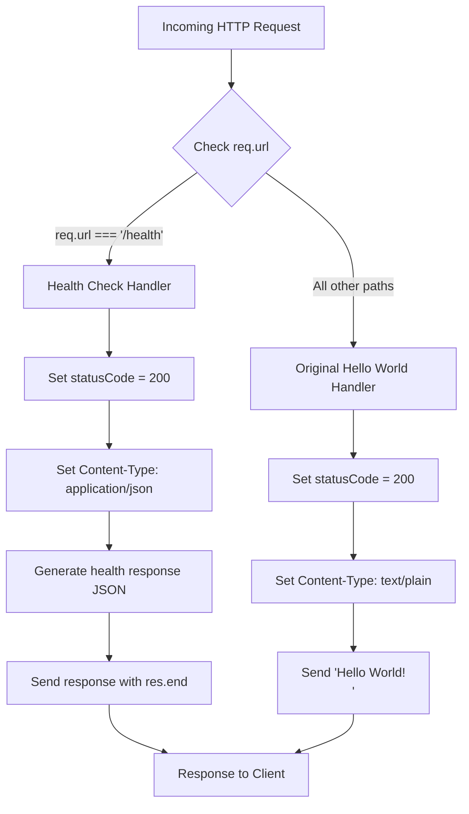
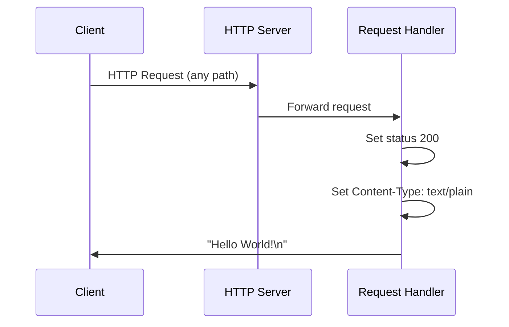
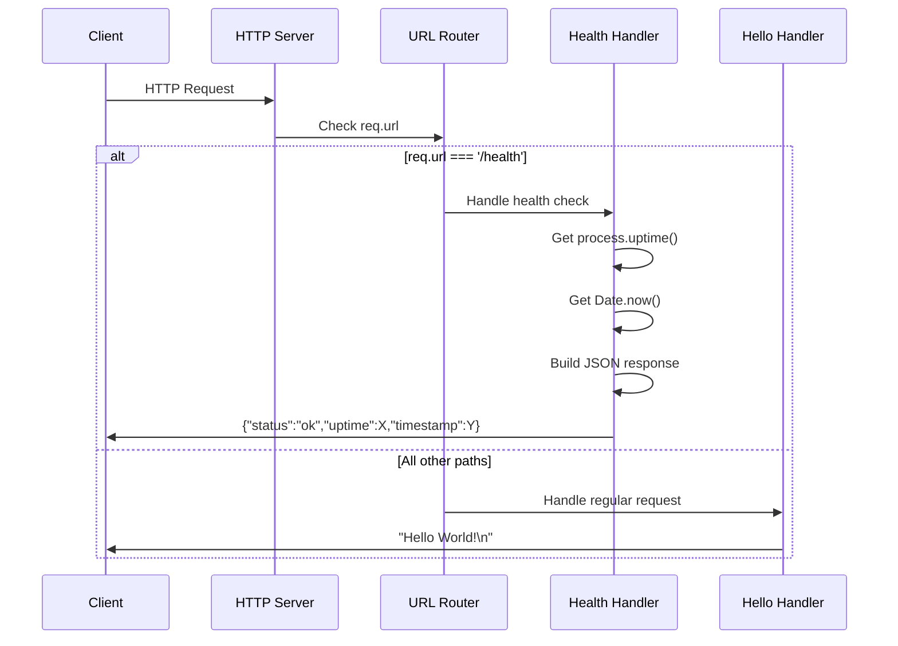

# Technical Specification

# 0. Agent Action Plan

## 0.1 Intent Clarification

### 0.1.1 Core Feature Objective

Based on the prompt, the Blitzy platform understands that the new feature requirement is to **add a health_check endpoint to the Hello World Node.js HTTP Server** so that users and monitoring systems can easily verify that the service is running correctly.

**Feature Requirements with Enhanced Clarity:**

- **Primary Requirement:** Implement a dedicated `/health` or `/health_check` HTTP endpoint that responds with a status indicating the server is operational
- **Response Format:** Return an HTTP 200 OK status code with a structured response body containing health status information
- **Information Content:** Include server status ("ok"/"healthy"), process uptime, and timestamp for monitoring purposes
- **Backward Compatibility:** The existing "Hello World!" functionality on all other paths must remain unchanged
- **Zero-Dependency Preservation:** Implementation must use only Node.js built-in modules to maintain the project's zero-dependency philosophy

**Implicit Requirements Detected:**

- URL-based routing must be introduced to differentiate between health check requests and regular requests
- The request handler callback in `Hello_World_Node.js` must be modified to inspect the incoming request URL
- Response Content-Type should change from `text/plain` to `application/json` for the health endpoint to follow REST API conventions
- The health endpoint should provide meaningful diagnostics that monitoring tools can parse

**Feature Dependencies and Prerequisites:**

- Node.js runtime version >=14.0.0 (already satisfied)
- Understanding of HTTP `IncomingMessage` object's `url` property for routing
- Knowledge of `process.uptime()` for reporting server uptime
- JSON serialization for structured response body

### 0.1.2 Special Instructions and Constraints

**User-Provided Directives:**

- No specific architectural requirements were provided
- No explicit naming convention specified for the endpoint (standard conventions apply)
- No performance requirements explicitly stated

**Architectural Requirements (Inferred from Existing Codebase):**

- Follow existing CommonJS module system (`require()` syntax)
- Maintain single-file architecture for simplicity
- Preserve localhost-only binding (127.0.0.1:3000)
- Continue using Node.js built-in `http` module only
- Maintain the educational clarity and minimal code philosophy

**Web Search Research Requirements:**

Health check endpoint best practices research was conducted and key findings include:
- Use `process.uptime()` to report how long the Node.js process has been running
- Return HTTP 200 for healthy status with JSON payload containing `{ status: "ok" }`
- Common endpoint names include `/health`, `/healthcheck`, `/livez`, and `/readyz`
- Keep implementation minimal without adding external dependencies

### 0.1.3 Technical Interpretation

These feature requirements translate to the following technical implementation strategy:

- **To implement URL-based routing**, we will modify the existing request handler callback to inspect `req.url` and conditionally branch the response logic
- **To provide health status information**, we will create a JSON response object containing status, uptime (via `process.uptime()`), and timestamp (via `Date.now()`)
- **To maintain backward compatibility**, we will ensure all requests NOT matching the health endpoint path continue to return the original "Hello World!\n" response
- **To follow REST API conventions**, we will set `Content-Type: application/json` for the health endpoint response while preserving `Content-Type: text/plain` for other responses

**Technical Implementation Approach:**

```javascript
// URL routing logic to add
if (req.url === '/health') {
  // Health check response (JSON)
} else {
  // Original "Hello World!" response
}
```


## 0.2 Repository Scope Discovery

### 0.2.1 Comprehensive File Analysis

**Repository Structure Overview:**

The repository is a minimal, self-contained Node.js "Hello World" example consisting of three first-order children with no nested subfolders:

| File Path | Type | Current Purpose | Feature Impact |
|-----------|------|-----------------|----------------|
| `Hello_World_Node.js` | Source | Main HTTP server implementation (17 lines) | **MODIFY** - Add routing logic and health endpoint |
| `package.json` | Config | NPM manifest with scripts and metadata | **MODIFY** - Update description, potentially fix entry point mismatch |
| `README.md` | Docs | User documentation and usage instructions | **MODIFY** - Document new health endpoint |

**Existing Modules to Modify:**

- `Hello_World_Node.js` - Primary modification target
  - Current implementation: Single request handler returns "Hello World!" for ALL requests
  - Required changes: Add URL-based routing to differentiate `/health` from other paths
  - Lines affected: Lines 8-12 (request handler callback)

**Configuration Files Analysis:**

- `package.json` - Current state:
  - Entry point mismatch: `"main": "server.js"` but actual file is `Hello_World_Node.js`
  - Scripts point to `server.js` which doesn't exist
  - Keywords may need updating to include "health-check"
  - No dependencies to modify (zero-dependency architecture maintained)

**Documentation Files:**

- `README.md` - Current state:
  - References `server.js` instead of `Hello_World_Node.js`
  - No mention of health check functionality
  - Usage section needs updating to document new endpoint

**Integration Point Discovery:**

- **API Endpoints:** Single endpoint currently handles all paths; new `/health` endpoint introduces routing
- **Database Models:** None (stateless application)
- **Service Classes:** None (single-file architecture)
- **Controllers/Handlers:** Request handler at line 8 requires modification
- **Middleware:** None present

### 0.2.2 Web Search Research Conducted

**Best Practices for Health Check Endpoints (Node.js):**

- Return HTTP 200 OK with JSON `{ "status": "ok" }` for healthy state
- Include `process.uptime()` to report server uptime in seconds
- Include timestamp for correlation with monitoring systems
- Common endpoint naming: `/health`, `/healthz`, `/livez`, `/readyz`
- Keep implementation minimal without external modules
- For Kubernetes compatibility, return 200 for liveness/readiness probes

**Security Considerations:**

- Health endpoints on localhost-only binding (127.0.0.1) have minimal security risk
- No sensitive information should be exposed in health response
- Authentication not required for basic health checks in development context

### 0.2.3 New File Requirements

**New Source Files to Create:**

No new source files required. The health check functionality will be integrated directly into `Hello_World_Node.js` to maintain the single-file architecture that defines this educational project.

**New Test Files (Recommended but Out-of-Scope per existing architecture):**

Per Technical Specification Section 6.6, automated testing is explicitly out-of-scope. However, for future consideration:
- `Hello_World_Node.test.js` - Would contain unit tests for health endpoint

**New Configuration Files:**

No new configuration files required. Health check configuration (endpoint path, response format) will be implemented as code constants within `Hello_World_Node.js`.

### 0.2.4 Complete File Inventory

| File | Action | Modification Summary |
|------|--------|---------------------|
| `Hello_World_Node.js` | MODIFY | Add URL routing, health endpoint handler, JSON response |
| `package.json` | MODIFY | Update description/keywords, fix entry point reference |
| `README.md` | MODIFY | Document health endpoint usage, update usage instructions |

**Files NOT Requiring Modification:**

- No build files present (no Dockerfile, CI/CD workflows)
- No test files present (automated testing out-of-scope)
- No environment configuration files present


## 0.3 Dependency Inventory

### 0.3.1 Private and Public Packages

**Current Package Dependencies:**

| Registry | Package Name | Version | Purpose |
|----------|--------------|---------|---------|
| Built-in | `http` | Node.js core | HTTP server creation (existing) |
| Built-in | `process` | Node.js core | Access uptime via `process.uptime()` (new usage) |

**Key Principle:** This feature implementation requires **ZERO new external dependencies**. The health check endpoint will be implemented using only Node.js built-in modules to preserve the project's zero-dependency philosophy.

**Node.js Built-in Modules Used:**

| Module | Current Usage | New Usage for Health Check |
|--------|---------------|---------------------------|
| `http` | Server creation, request/response handling | Same - no changes |
| `process` | Not explicitly required (available globally) | `process.uptime()` for server uptime reporting |

**Package.json Current State:**

```json
{
  "dependencies": {},
  "devDependencies": {}
}
```

**Package.json After Feature (No Changes to Dependencies):**

```json
{
  "dependencies": {},
  "devDependencies": {}
}
```

### 0.3.2 Dependency Updates

**Import Updates:**

No import updates required. The `http` module import at line 3 of `Hello_World_Node.js` remains unchanged:

```javascript
const http = require('http');
```

The `process` object is a global in Node.js and does not require explicit import.

**External Reference Updates:**

| File Pattern | Update Required | Description |
|--------------|-----------------|-------------|
| `package.json` | YES | Update `description` field to mention health check capability |
| `package.json` | YES | Add "health-check" to keywords array |
| `package.json` | RECOMMENDED | Fix `main` and `scripts` entry point to match actual filename |
| `README.md` | YES | Document health check endpoint |

**Import Transformation Rules:**

- No import transformations needed
- All required functionality available through Node.js built-ins

### 0.3.3 Runtime Requirements

**Node.js Version Compatibility:**

| Feature | Minimum Node.js Version | Current Constraint |
|---------|------------------------|-------------------|
| `http.createServer()` | 0.1.0 | >=14.0.0 ✓ |
| `process.uptime()` | 0.5.0 | >=14.0.0 ✓ |
| `JSON.stringify()` | 0.1.0 | >=14.0.0 ✓ |
| `Date.now()` | 0.1.0 | >=14.0.0 ✓ |

All required functionality is available in Node.js >=14.0.0 as specified in `package.json`.


## 0.4 Integration Analysis

### 0.4.1 Existing Code Touchpoints

**Direct Modifications Required:**

| File | Location | Modification Description |
|------|----------|-------------------------|
| `Hello_World_Node.js` | Lines 8-12 | Modify request handler to add URL-based routing |
| `Hello_World_Node.js` | Line 8 | Add conditional check for `req.url === '/health'` |
| `Hello_World_Node.js` | Lines 9-11 | Preserve original response logic in `else` branch |
| `Hello_World_Node.js` | New code block | Add health check response generation in `if` branch |

**Request Handler Current State (Lines 8-12):**

```javascript
const server = http.createServer((req, res) => {
  res.statusCode = 200;
  res.setHeader('Content-Type', 'text/plain');
  res.end('Hello World!\n');
});
```

**Request Handler Target State:**

The handler will be expanded to include URL routing with conditional response generation.

### 0.4.2 Integration Points Mapping

**HTTP Request Flow:**



**Dependency Injection Points:**

- Not applicable - Single-file architecture with no dependency injection container
- No service registration required
- No configuration dependencies to wire

**Database/Schema Updates:**

- Not applicable - Stateless application with no database connectivity

### 0.4.3 Component Interaction Analysis

**Before Feature Implementation:**



**After Feature Implementation:**



### 0.4.4 Backward Compatibility Analysis

**Existing Behavior Preservation:**

| Request Type | Current Behavior | After Implementation |
|--------------|------------------|---------------------|
| GET / | Returns "Hello World!\n" | **UNCHANGED** - Returns "Hello World!\n" |
| GET /any/path | Returns "Hello World!\n" | **UNCHANGED** - Returns "Hello World!\n" |
| POST /api | Returns "Hello World!\n" | **UNCHANGED** - Returns "Hello World!\n" |
| GET /health | Returns "Hello World!\n" | **NEW** - Returns JSON health status |

**Breaking Changes:** None - All existing functionality preserved; only `/health` path gains new behavior.


## 0.5 Technical Implementation

### 0.5.1 File-by-File Execution Plan

**CRITICAL:** Every file listed below MUST be created or modified as specified.

**Group 1 - Core Feature Files:**

| Action | File Path | Implementation Details |
|--------|-----------|----------------------|
| MODIFY | `Hello_World_Node.js` | Add URL-based routing in request handler |
| MODIFY | `Hello_World_Node.js` | Implement `/health` endpoint response logic |
| MODIFY | `Hello_World_Node.js` | Preserve original "Hello World!" response for non-health paths |

**Group 2 - Configuration Files:**

| Action | File Path | Implementation Details |
|--------|-----------|----------------------|
| MODIFY | `package.json` | Update `description` to include health check capability |
| MODIFY | `package.json` | Add "health-check" and "monitoring" to keywords |
| MODIFY | `package.json` | Fix `main` field from "server.js" to "Hello_World_Node.js" |
| MODIFY | `package.json` | Update `scripts.start` and `scripts.dev` to use correct filename |

**Group 3 - Documentation:**

| Action | File Path | Implementation Details |
|--------|-----------|----------------------|
| MODIFY | `README.md` | Add "Health Check Endpoint" section documenting `/health` |
| MODIFY | `README.md` | Update filename references from server.js to Hello_World_Node.js |
| MODIFY | `README.md` | Add example health check response |

### 0.5.2 Implementation Approach per File

**Hello_World_Node.js - Detailed Implementation:**

The request handler callback will be modified to include URL-based routing:

```javascript
const server = http.createServer((req, res) => {
  if (req.url === '/health') {
    // Health check endpoint
    const healthData = {
      status: 'ok',
      uptime: process.uptime(),
      timestamp: Date.now()
    };
    res.statusCode = 200;
    res.setHeader('Content-Type', 'application/json');
    res.end(JSON.stringify(healthData));
  } else {
    // Original Hello World response
    res.statusCode = 200;
    res.setHeader('Content-Type', 'text/plain');
    res.end('Hello World!\n');
  }
});
```

**package.json - Detailed Changes:**

```json
{
  "name": "hello-world-nodejs",
  "version": "1.0.0",
  "description": "A simple Hello World Node.js HTTP server with health check endpoint",
  "main": "Hello_World_Node.js",
  "scripts": {
    "start": "node Hello_World_Node.js",
    "dev": "node Hello_World_Node.js"
  },
  "keywords": [
    "hello-world",
    "nodejs",
    "http-server",
    "example",
    "health-check",
    "monitoring"
  ]
}
```

**README.md - New Section to Add:**

A new "Health Check Endpoint" section should be added after the "How It Works" section, documenting:
- Endpoint path: `/health`
- HTTP method: GET (or any method)
- Response format: JSON
- Response fields: status, uptime, timestamp
- Example response and usage

### 0.5.3 Code Change Summary

**Hello_World_Node.js Changes:**

| Line Range | Change Type | Description |
|------------|-------------|-------------|
| 8 | MODIFY | Add conditional check for `req.url === '/health'` |
| 9-11 | MOVE | Existing response code moves to `else` block |
| NEW | ADD | Health check response block (5-6 lines) |
| Total | ~10 lines added | Approximately doubles file size from 17 to 27 lines |

**Health Check Response Structure:**

```json
{
  "status": "ok",
  "uptime": 123.456,
  "timestamp": 1702345678901
}
```

| Field | Type | Description |
|-------|------|-------------|
| `status` | string | Always "ok" when server is responding |
| `uptime` | number | Seconds since server process started (from `process.uptime()`) |
| `timestamp` | number | Unix timestamp in milliseconds (from `Date.now()`) |


## 0.6 Scope Boundaries

### 0.6.1 Exhaustively In Scope

**Source Files:**

| File Pattern | Scope Details |
|--------------|---------------|
| `Hello_World_Node.js` | Lines 8-12 modification for routing; new health handler block |

**Configuration Files:**

| File Pattern | Scope Details |
|--------------|---------------|
| `package.json` | `description` field update |
| `package.json` | `main` field correction (server.js → Hello_World_Node.js) |
| `package.json` | `scripts.start` and `scripts.dev` corrections |
| `package.json` | `keywords` array additions |

**Documentation Files:**

| File Pattern | Scope Details |
|--------------|---------------|
| `README.md` | New "Health Check Endpoint" section |
| `README.md` | Filename corrections throughout document |
| `README.md` | Example health check response |

**Integration Points:**

| Component | Scope Details |
|-----------|---------------|
| Request Handler | Add URL routing conditional (`req.url === '/health'`) |
| Response Generation | New JSON response builder for health endpoint |
| Content-Type Headers | Add `application/json` for health endpoint |

**HTTP Endpoints:**

| Endpoint | Method | Response | Status |
|----------|--------|----------|--------|
| `/health` | ANY | JSON health status | NEW |
| `/*` (all other) | ANY | "Hello World!\n" | EXISTING - UNCHANGED |

### 0.6.2 Explicitly Out of Scope

**Features NOT Included:**

| Out of Scope Item | Rationale |
|-------------------|-----------|
| Authentication/Authorization | Educational project; localhost-only deployment |
| Automated testing infrastructure | Per Tech Spec Section 6.6, testing is explicitly out-of-scope |
| CI/CD pipeline configuration | No existing CI/CD; out-of-scope per project constraints |
| Graceful shutdown handling | Beyond basic health check requirements |
| Database connectivity checks | No database present in application |
| External service health checks | No external integrations exist |
| Separate `/livez` and `/readyz` endpoints | Single `/health` endpoint sufficient for requirements |
| Health check configuration via environment variables | Maintain hardcoded simplicity |
| Health endpoint rate limiting | Unnecessary for localhost deployment |
| Logging/telemetry infrastructure | Beyond minimal implementation |
| Express.js or other framework adoption | Maintain zero-dependency architecture |

**Files NOT Modified:**

| Exclusion Pattern | Reason |
|-------------------|--------|
| New source files | Single-file architecture preserved |
| Test files | Automated testing out-of-scope |
| `.gitignore` | No changes needed |
| CI/CD workflows | None exist; out-of-scope |
| Docker configurations | None exist; out-of-scope |

**Code Refactoring Exclusions:**

| Item | Rationale |
|------|-----------|
| Extracting routing to separate module | Contradicts single-file architecture |
| Converting to ES Modules | Maintain CommonJS compatibility |
| Adding TypeScript | Beyond feature requirements |
| Restructuring folder hierarchy | Project has no folders |

### 0.6.3 Scope Validation Criteria

**Acceptance Criteria for Health Check Endpoint:**

| Criterion | Validation Method |
|-----------|------------------|
| `/health` returns HTTP 200 | Manual browser/curl test |
| Response is valid JSON | Parse response with `JSON.parse()` |
| Response contains `status` field | Verify field exists and equals "ok" |
| Response contains `uptime` field | Verify field exists and is numeric |
| Response contains `timestamp` field | Verify field exists and is numeric |
| Content-Type is `application/json` | Check response headers |
| Other paths still return "Hello World!" | Test `/`, `/test`, `/any/path` |

**Backward Compatibility Validation:**

| Existing Behavior | Must Be Preserved |
|-------------------|-------------------|
| GET / returns "Hello World!\n" | ✓ Yes |
| Any HTTP method works on all paths | ✓ Yes |
| Server starts in <1 second | ✓ Yes |
| Console log shows startup message | ✓ Yes |
| Binds to 127.0.0.1:3000 | ✓ Yes |


## 0.7 Special Instructions for Feature Addition

### 0.7.1 Feature-Specific Requirements

**Architectural Patterns to Follow:**

| Pattern | Application |
|---------|-------------|
| Single-file architecture | All health check logic in `Hello_World_Node.js` |
| Zero-dependency philosophy | Use only Node.js built-in modules |
| CommonJS module system | Use `require()` syntax, no ES modules |
| Synchronous response pattern | No async/await needed for health check |
| Localhost-only binding | Health endpoint accessible only via 127.0.0.1 |

**Integration Requirements with Existing Features:**

| Existing Feature | Integration Approach |
|------------------|---------------------|
| F-001: HTTP Server Initialization | No changes - server initialization unchanged |
| F-002: HTTP Request Acceptance | Enhanced - now routes based on URL path |
| F-003: HTTP Response Generation | Enhanced - conditional response format |
| F-004: Console Status Logging | No changes - startup log unchanged |

**Code Style Requirements:**

| Requirement | Specification |
|-------------|---------------|
| Indentation | 2 spaces (match existing code) |
| Variable declarations | Use `const` for all declarations |
| String quotes | Single quotes (match existing code) |
| Line endings | Unix (LF) |
| Trailing newlines | One newline at end of file |

### 0.7.2 Performance Considerations

**Performance Requirements:**

| Metric | Requirement | Implementation Impact |
|--------|-------------|----------------------|
| Health check response time | <10ms | Synchronous implementation; no database calls |
| Memory overhead | Minimal | No additional data structures persist |
| CPU impact | Negligible | Simple URL comparison and JSON serialization |

**Health Check Response Efficiency:**

- URL comparison (`req.url === '/health'`) is O(1) string comparison
- `process.uptime()` is a synchronous built-in call with negligible overhead
- `Date.now()` is a synchronous built-in call with negligible overhead
- `JSON.stringify()` on small object (<100 bytes) is sub-millisecond

### 0.7.3 Security Requirements

**Security Measures:**

| Security Aspect | Implementation |
|-----------------|----------------|
| Network exposure | Localhost-only (127.0.0.1) - no external access |
| Information disclosure | Only non-sensitive operational data exposed |
| Authentication | Not required for localhost health checks |
| Input validation | Health endpoint ignores request body/headers |

**Health Response Data Classification:**

| Field | Sensitivity | Exposure Risk |
|-------|-------------|---------------|
| `status` | Public | None - static "ok" value |
| `uptime` | Low | Process runtime; non-sensitive |
| `timestamp` | Public | Server time; non-sensitive |

### 0.7.4 Manual Verification Procedure

**Post-Implementation Testing Steps:**

1. **Server Startup Verification:**
   ```bash
   node Hello_World_Node.js
   ```
   Expected: Console displays "Server running at http://127.0.0.1:3000/"

2. **Health Endpoint Verification:**
   ```bash
   curl http://127.0.0.1:3000/health
   ```
   Expected: JSON response with status, uptime, timestamp

3. **Backward Compatibility Verification:**
   ```bash
   curl http://127.0.0.1:3000/
   ```
   Expected: "Hello World!\n"

4. **Content-Type Verification:**
   ```bash
   curl -I http://127.0.0.1:3000/health
   ```
   Expected: `Content-Type: application/json`

### 0.7.5 Implementation Checklist

| Step | Task | Validation |
|------|------|------------|
| 1 | Modify `Hello_World_Node.js` request handler | Code compiles without errors |
| 2 | Add URL routing conditional | `/health` detected correctly |
| 3 | Implement health response JSON | Valid JSON returned |
| 4 | Preserve original response in else block | `/` returns "Hello World!" |
| 5 | Update `package.json` description | Reflects health check capability |
| 6 | Fix `package.json` entry points | `npm start` works correctly |
| 7 | Update `README.md` with health section | Documentation complete |
| 8 | Manual testing all endpoints | All tests pass |


