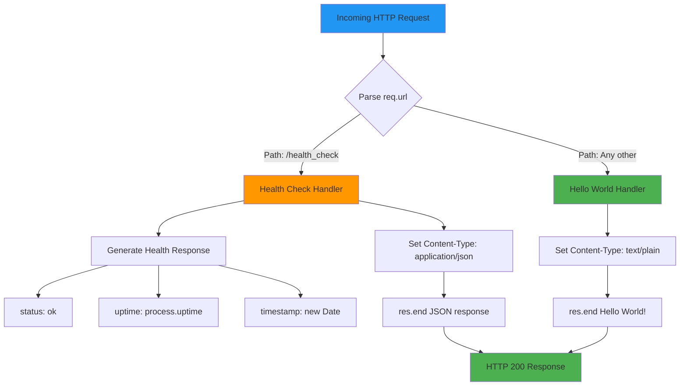
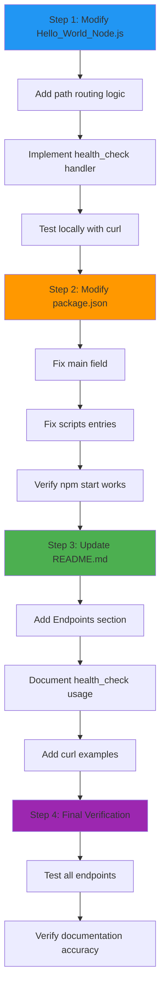

# Technical Specification

# 0. Agent Action Plan

## 0.1 Intent Clarification

### 0.1.1 Core Feature Objective

Based on the prompt, the Blitzy platform understands that the new feature requirement is to **add a health_check endpoint** to the existing Hello World Node.js HTTP server application. This endpoint will enable external systems and developers to programmatically verify that the service is operational and functioning correctly.

**Primary Requirements:**

- Implement a `/health_check` HTTP endpoint that responds to GET requests
- Return a meaningful response indicating the server's health status
- Provide additional diagnostic information such as server uptime and timestamp
- Maintain the existing "Hello World" functionality for all other routes
- Preserve the zero-dependency philosophy by using only Node.js built-in modules

**Implicit Requirements Detected:**

- URL path routing must be introduced to distinguish between `/health_check` and other paths
- The response should follow health check best practices (JSON format with status indicators)
- The endpoint should be lightweight and respond quickly without external dependencies
- The implementation must align with the project's educational and minimalist architecture

**Feature Dependencies and Prerequisites:**

| Prerequisite | Description | Status |
|--------------|-------------|--------|
| Node.js Runtime | Version ≥14.0.0 as specified in package.json | Available |
| Built-in `http` Module | Core HTTP server functionality | Already in use |
| Built-in `url` Module | URL parsing for path routing | Available (built-in) |
| Existing Server Code | `Hello_World_Node.js` as integration point | Present |

### 0.1.2 Special Instructions and Constraints

**Architectural Requirements:**

- **Maintain Zero Dependencies:** The implementation must use only Node.js built-in modules (`http`, `url`) without adding npm packages
- **Preserve Educational Clarity:** Code modifications should remain simple and understandable for learners
- **Follow Existing Patterns:** Use the same coding style and conventions present in the current implementation
- **Localhost Binding:** Maintain the 127.0.0.1:3000 binding for security

**Health Check Response Best Practices:**

Based on web search research, the health check endpoint should:
- Return HTTP 200 status code when healthy
- Include `process.uptime()` to indicate server runtime
- Provide a timestamp for monitoring systems
- Return JSON format for programmatic consumption
- Respond quickly without external service dependencies

**Documentation Requirements:**

- Update README.md to document the new `/health_check` endpoint
- Include usage examples and expected response format
- Document the response fields (status, uptime, timestamp)

### 0.1.3 Technical Interpretation

These feature requirements translate to the following technical implementation strategy:

**To implement the health_check endpoint, we will:**

- **MODIFY** `Hello_World_Node.js` by adding URL path parsing using Node.js built-in `url` module to inspect the request URL
- **MODIFY** `Hello_World_Node.js` by implementing conditional routing logic to differentiate between `/health_check` and other paths
- **MODIFY** `Hello_World_Node.js` by creating a health check response handler that returns JSON with status, uptime, and timestamp
- **MODIFY** `README.md` by adding documentation for the new endpoint including usage instructions and response format
- **MODIFY** `package.json` to fix the `main` and `scripts` mismatch (currently references `server.js` but file is `Hello_World_Node.js`)

**Implementation Mapping:**

| Requirement | Technical Action | Target File |
|-------------|------------------|-------------|
| Add URL routing | Parse `req.url` to determine path | Hello_World_Node.js |
| Health check response | Return JSON with status, uptime, timestamp | Hello_World_Node.js |
| Set correct Content-Type | Use `application/json` for health endpoint | Hello_World_Node.js |
| Preserve Hello World | Default response for non-health-check paths | Hello_World_Node.js |
| Document new feature | Add endpoint documentation section | README.md |
| Fix manifest mismatch | Update main and scripts entries | package.json |

**Expected Health Check Response Format:**

```json
{
  "status": "ok",
  "uptime": 123.456,
  "timestamp": "2024-01-01T12:00:00.000Z"
}
```


## 0.2 Repository Scope Discovery

### 0.2.1 Comprehensive File Analysis

**Repository Structure Discovered:**

The repository is a minimal, self-contained Node.js project with three files at the root level:

```
/
├── Hello_World_Node.js    # Main HTTP server implementation (17 lines)
├── package.json           # NPM manifest and project metadata
└── README.md              # User documentation
```

**Existing Files Requiring Modification:**

| File Path | Type | Current Purpose | Modification Required |
|-----------|------|-----------------|----------------------|
| `Hello_World_Node.js` | Source | HTTP server with static "Hello World!" response | Add URL routing and health_check endpoint handler |
| `package.json` | Config | NPM manifest with incorrect `main` entry | Fix `main` and `scripts` to reference correct filename |
| `README.md` | Documentation | Usage instructions for basic server | Add health_check endpoint documentation section |

**File-by-File Analysis:**

**1. Hello_World_Node.js (Lines 1-17)**
- Current state: Single request handler returning "Hello World!" for ALL requests regardless of path
- Integration point: Request handler callback at line 8 (`http.createServer` callback)
- Modification location: Lines 8-12 (request handler function body)
- Required changes:
  - Add URL path parsing using `req.url`
  - Implement conditional routing for `/health_check` path
  - Create health status response generator
  - Maintain default "Hello World!" response for other paths

**2. package.json**
- Current state: References `server.js` in `main` field and `scripts` section
- Issue detected: Filename mismatch - actual file is `Hello_World_Node.js`, not `server.js`
- Required changes:
  - Update `"main": "server.js"` to `"main": "Hello_World_Node.js"`
  - Update `"scripts.start"` to `"node Hello_World_Node.js"`
  - Update `"scripts.dev"` to `"node Hello_World_Node.js"`

**3. README.md**
- Current state: Documents basic server usage without endpoint-specific information
- Required changes:
  - Add "Endpoints" section documenting available routes
  - Document `/health_check` endpoint with request/response examples
  - Add curl command examples for testing health check

**Configuration Files Examined:**

| File | Status | Relevance |
|------|--------|-----------|
| `package.json` | Present | Needs correction for filename reference |
| `.npmrc` | Not present | Not required for this feature |
| `.nvmrc` | Not present | Not required - Node version in package.json engines |
| `tsconfig.json` | Not present | Not applicable - JavaScript project |
| `.env` | Not present | Not required - no environment variables |

**Integration Point Discovery:**

| Integration Point | Location | Purpose |
|-------------------|----------|---------|
| HTTP Request Handler | Hello_World_Node.js:8-12 | Primary modification point for routing logic |
| Server Initialization | Hello_World_Node.js:14-16 | No changes required - binding unchanged |
| Module Import | Hello_World_Node.js:3 | May add `url` module import (optional) |
| Console Logger | Hello_World_Node.js:15 | No changes required |

### 0.2.2 Web Search Research Conducted

**Research Topics Investigated:**

| Topic | Key Findings | Application to Implementation |
|-------|--------------|------------------------------|
| Node.js health check best practices | Return 200 status with JSON body containing status, uptime, timestamp | Implement standard health response format |
| `process.uptime()` usage | Returns server uptime in seconds as a floating-point number | Include in health response for monitoring |
| HTTP health check endpoint naming | Common names: `/health`, `/healthz`, `/health_check`, `/livez` | Use `/health_check` as requested by user |
| JSON response best practices | Use `Content-Type: application/json` header | Set appropriate header for health endpoint |
| Kubernetes liveness/readiness | Health endpoints should respond quickly without external dependencies | Keep implementation lightweight |

**Best Practice Recommendations Applied:**

- Health check endpoint should return HTTP 200 for healthy status
- Response should be JSON formatted for programmatic parsing
- Include server uptime via `process.uptime()` for runtime monitoring
- Include ISO timestamp for correlation with monitoring systems
- Endpoint should not depend on external services (database, APIs)

### 0.2.3 New File Requirements

**New Source Files to Create:** None required

The feature can be implemented entirely by modifying existing files. The minimal architecture of this educational project does not warrant creating separate modules for a single endpoint.

**Rationale for No New Files:**

| Consideration | Decision |
|---------------|----------|
| Educational clarity | Single-file implementation maintains simplicity |
| Zero-dependency philosophy | No module separation needed without framework |
| Code volume | Health check adds ~15 lines - insufficient to justify separate file |
| Project scope | Educational demonstration, not production application |

**Alternative Considered (Not Recommended):**

A modular approach would create:
- `routes/health.js` - Health check route handler
- `routes/index.js` - Route aggregator
- `middleware/router.js` - Request routing logic

This approach is **not recommended** as it contradicts the project's educational mission of demonstrating minimal HTTP server concepts without framework abstractions.


## 0.3 Dependency Inventory

### 0.3.1 Private and Public Packages

**Current Package Dependencies (from package.json):**

| Registry | Package Name | Version | Purpose | Status |
|----------|--------------|---------|---------|--------|
| npm (public) | None | N/A | No external dependencies | Zero dependencies maintained |
| npm (devDependencies) | None | N/A | No development dependencies | Zero devDependencies maintained |

**Built-in Node.js Modules Used:**

| Module | Current Usage | Post-Implementation Usage | Purpose |
|--------|---------------|---------------------------|---------|
| `http` | Yes (line 3) | Yes (unchanged) | HTTP server creation and request handling |
| `url` | No | Optional | URL parsing for path extraction (alternative: direct `req.url` string parsing) |

**Package.json Current State:**

```json
{
  "name": "hello-world-nodejs",
  "version": "1.0.0",
  "description": "A simple Hello World Node.js HTTP server application",
  "main": "server.js",
  "scripts": {
    "start": "node server.js",
    "dev": "node server.js"
  },
  "engines": {
    "node": ">=14.0.0"
  }
}
```

**Dependency Addition Assessment:**

| Potential Dependency | Recommendation | Rationale |
|---------------------|----------------|-----------|
| Express.js | **NOT RECOMMENDED** | Violates zero-dependency philosophy; overkill for single endpoint |
| Fastify | **NOT RECOMMENDED** | Framework complexity contradicts educational purpose |
| `url` (built-in) | **OPTIONAL** | Built-in module; provides cleaner URL parsing but string parsing is sufficient |

**Zero Dependency Philosophy Maintained:**

The health_check feature will be implemented using only Node.js built-in capabilities:
- `req.url` property for path detection (native to `http.IncomingMessage`)
- `process.uptime()` for server uptime (global process object)
- `Date` for timestamp generation (native JavaScript)
- `JSON.stringify()` for response serialization (native JavaScript)

### 0.3.2 Dependency Updates

**Import Updates Required:**

| File Pattern | Current Imports | Updated Imports | Change Type |
|--------------|-----------------|-----------------|-------------|
| `Hello_World_Node.js` | `const http = require('http');` | `const http = require('http');` | No change required |

**Import Transformation Rules:**

No import transformations are required for this feature. The implementation uses:
- Existing `http` module already imported
- Native JavaScript globals (`JSON`, `Date`, `process`)
- No additional module imports necessary

**Alternative Implementation (if URL module preferred):**

```javascript
// Optional import addition (NOT REQUIRED)
const http = require('http');
const { URL } = require('url');  // Built-in, zero external dependency
```

**External Reference Updates:**

| File Pattern | Update Required | Description |
|--------------|-----------------|-------------|
| `package.json` | Yes | Fix `main` and `scripts` filename references |
| `README.md` | Yes | Add endpoint documentation |
| `.github/workflows/*` | N/A | No CI/CD workflows present |
| `Dockerfile*` | N/A | No Docker configuration present |

**Package.json Corrections Required:**

| Field | Current Value | Corrected Value | Reason |
|-------|---------------|-----------------|--------|
| `main` | `"server.js"` | `"Hello_World_Node.js"` | Match actual filename |
| `scripts.start` | `"node server.js"` | `"node Hello_World_Node.js"` | Match actual filename |
| `scripts.dev` | `"node server.js"` | `"node Hello_World_Node.js"` | Match actual filename |

**Version Compatibility Matrix:**

| Component | Minimum Version | Tested Version | Compatibility |
|-----------|-----------------|----------------|---------------|
| Node.js | >=14.0.0 | 20.19.6 | ✅ Compatible |
| npm | >=6.14.0 | 11.1.0 | ✅ Compatible |
| `http` module | Built-in | N/A | ✅ Always available |
| `process` global | Built-in | N/A | ✅ Always available |


## 0.4 Integration Analysis

### 0.4.1 Existing Code Touchpoints

**Direct Modifications Required:**

| File | Location | Modification Description |
|------|----------|-------------------------|
| `Hello_World_Node.js` | Line 8-12 | Replace static response handler with routing-aware handler |
| `Hello_World_Node.js` | Line 9-11 | Add conditional path checking and health response logic |
| `package.json` | Line 5 | Update `main` field from `server.js` to `Hello_World_Node.js` |
| `package.json` | Line 7-8 | Update `scripts.start` and `scripts.dev` commands |
| `README.md` | After line 42 | Add new "Endpoints" section with health_check documentation |

**Code Integration Point Analysis:**

**Primary Integration Point: Request Handler (Hello_World_Node.js:8-12)**

```javascript
// CURRENT CODE (lines 8-12)
const server = http.createServer((req, res) => {
  res.statusCode = 200;
  res.setHeader('Content-Type', 'text/plain');
  res.end('Hello World!\n');
});
```

**Transformation Required:**

The request handler callback must be expanded to:
1. Inspect `req.url` to determine the requested path
2. Route `/health_check` requests to health status response
3. Route all other requests to the existing "Hello World!" response
4. Set appropriate `Content-Type` headers based on route

**Request Flow Integration:**



**Dependency Injection Points:**

| Location | Current State | Post-Implementation |
|----------|---------------|---------------------|
| No service container | N/A | N/A - No DI framework used |
| No configuration injection | N/A | N/A - Hardcoded values maintained |

**Database/Schema Updates:**

| Category | Status | Details |
|----------|--------|---------|
| Database migrations | Not applicable | No database in project |
| Schema modifications | Not applicable | No data persistence layer |
| Data model changes | Not applicable | Stateless application |

**Middleware/Interceptor Impact:**

| Component | Status | Details |
|-----------|--------|---------|
| Request middleware | Not present | No middleware architecture |
| Response interceptors | Not present | Direct response handling |
| Logging middleware | Not present | Console logging only |
| Error handlers | Not present | No error handling middleware |

### 0.4.2 API Contract Changes

**New Endpoint Specification:**

| Attribute | Value |
|-----------|-------|
| Path | `/health_check` |
| Method | GET (responds to all HTTP methods) |
| Request Body | None required |
| Content-Type | `application/json` |
| Response Code | 200 OK |

**Response Schema:**

```json
{
  "status": "string",
  "uptime": "number",
  "timestamp": "string (ISO 8601)"
}
```

**Endpoint Behavior Matrix:**

| Scenario | Request | Response |
|----------|---------|----------|
| Health check request | `GET /health_check` | `{"status":"ok","uptime":123.45,"timestamp":"..."}` |
| Root path | `GET /` | `Hello World!\n` |
| Any other path | `GET /any/path` | `Hello World!\n` |
| POST to health_check | `POST /health_check` | `{"status":"ok","uptime":123.45,"timestamp":"..."}` |

**Backward Compatibility:**

| Existing Behavior | Impact |
|-------------------|--------|
| All paths return "Hello World!" | Preserved for non-health_check paths |
| HTTP 200 status code | Preserved |
| `text/plain` Content-Type | Preserved for non-health_check paths |
| Server startup message | Unchanged |
| Port 3000 binding | Unchanged |
| Localhost-only access | Unchanged |


## 0.5 Technical Implementation

### 0.5.1 File-by-File Execution Plan

**CRITICAL: Every file listed here MUST be created or modified**

**Group 1 - Core Feature Files:**

| Action | File | Modification Details |
|--------|------|---------------------|
| MODIFY | `Hello_World_Node.js` | Add URL path routing logic in request handler |
| MODIFY | `Hello_World_Node.js` | Implement `/health_check` endpoint response |
| MODIFY | `Hello_World_Node.js` | Maintain "Hello World!" response for other paths |

**Group 2 - Configuration Files:**

| Action | File | Modification Details |
|--------|------|---------------------|
| MODIFY | `package.json` | Update `main` field to `Hello_World_Node.js` |
| MODIFY | `package.json` | Update `scripts.start` to `node Hello_World_Node.js` |
| MODIFY | `package.json` | Update `scripts.dev` to `node Hello_World_Node.js` |

**Group 3 - Documentation:**

| Action | File | Modification Details |
|--------|------|---------------------|
| MODIFY | `README.md` | Add "Endpoints" documentation section |
| MODIFY | `README.md` | Document `/health_check` endpoint usage |
| MODIFY | `README.md` | Add curl command examples for testing |

### 0.5.2 Implementation Approach per File

**File 1: Hello_World_Node.js**

**Current Implementation (17 lines):**
```javascript
const http = require('http');
const hostname = '127.0.0.1';
const port = 3000;
const server = http.createServer((req, res) => {
  res.statusCode = 200;
  res.setHeader('Content-Type', 'text/plain');
  res.end('Hello World!\n');
});
server.listen(port, hostname, () => {
  console.log(`Server running at http://${hostname}:${port}/`);
});
```

**Implementation Strategy:**

The request handler callback (lines 8-12) will be modified to:

1. **Add Path Detection:** Check `req.url` against `/health_check`
2. **Implement Health Handler:** Generate JSON response with status, uptime, and timestamp
3. **Preserve Default Handler:** Maintain "Hello World!" for all non-health-check paths

**Modified Request Handler Logic:**

```javascript
const server = http.createServer((req, res) => {
  if (req.url === '/health_check') {
    const healthData = {
      status: 'ok',
      uptime: process.uptime(),
      timestamp: new Date().toISOString()
    };
    res.statusCode = 200;
    res.setHeader('Content-Type', 'application/json');
    res.end(JSON.stringify(healthData));
  } else {
    res.statusCode = 200;
    res.setHeader('Content-Type', 'text/plain');
    res.end('Hello World!\n');
  }
});
```

**Line Count Impact:** 17 lines → ~25 lines (maintaining educational simplicity)

---

**File 2: package.json**

**Fields Requiring Update:**

| Field Path | Current Value | New Value |
|------------|---------------|-----------|
| `main` | `"server.js"` | `"Hello_World_Node.js"` |
| `scripts.start` | `"node server.js"` | `"node Hello_World_Node.js"` |
| `scripts.dev` | `"node server.js"` | `"node Hello_World_Node.js"` |

**Updated package.json Structure:**

```json
{
  "name": "hello-world-nodejs",
  "version": "1.0.0",
  "description": "A simple Hello World Node.js HTTP server application",
  "main": "Hello_World_Node.js",
  "scripts": {
    "start": "node Hello_World_Node.js",
    "dev": "node Hello_World_Node.js"
  },
  "keywords": ["hello-world", "nodejs", "http-server", "example"],
  "author": "",
  "license": "MIT",
  "engines": {
    "node": ">=14.0.0"
  }
}
```

---

**File 3: README.md**

**New Section to Add (After "How It Works" section):**

```
## Endpoints

The server exposes the following endpoints:

#### Root Endpoint (/)

- **URL:** `http://127.0.0.1:3000/`
- **Method:** Any HTTP method
- **Response:** Plain text "Hello World!"

#### Health Check Endpoint (/health_check)

- **URL:** `http://127.0.0.1:3000/health_check`
- **Method:** Any HTTP method
- **Response:** JSON object with server health status

**Example Response:**
{
  "status": "ok",
  "uptime": 123.456,
  "timestamp": "2024-01-01T12:00:00.000Z"
}

**Response Fields:**
- `status`: Server health status (always "ok" when server is running)
- `uptime`: Server uptime in seconds since startup
- `timestamp`: Current server time in ISO 8601 format

**Testing the Health Check:**

curl http://127.0.0.1:3000/health_check
```

### 0.5.3 Implementation Sequence

**Execution Order:**



**Verification Commands:**

| Step | Command | Expected Result |
|------|---------|-----------------|
| 1 | `node Hello_World_Node.js` | Server starts on port 3000 |
| 2 | `curl http://127.0.0.1:3000/` | Returns "Hello World!" |
| 3 | `curl http://127.0.0.1:3000/health_check` | Returns JSON health status |
| 4 | `npm start` | Server starts (after package.json fix) |


## 0.6 Scope Boundaries

### 0.6.1 Exhaustively In Scope

**All Feature Source Files:**

| File Pattern | Specific Files | Purpose |
|--------------|----------------|---------|
| `Hello_World_Node.js` | Main server file | Add routing and health_check endpoint |

**All Configuration Files:**

| File Pattern | Specific Files | Purpose |
|--------------|----------------|---------|
| `package.json` | Root manifest | Fix filename references in main and scripts |

**All Documentation Files:**

| File Pattern | Specific Files | Purpose |
|--------------|----------------|---------|
| `README.md` | Root documentation | Add Endpoints section with health_check docs |

**Complete In-Scope File List:**

| File Path | Action | Lines Affected | Description |
|-----------|--------|----------------|-------------|
| `Hello_World_Node.js` | MODIFY | Lines 8-12 → Lines 8-18 | Expand request handler with routing |
| `package.json` | MODIFY | Lines 5, 7-8 | Fix main and scripts references |
| `README.md` | MODIFY | Insert after line 42 | Add Endpoints documentation section |

**In-Scope Code Changes:**

| Component | Location | Change Type |
|-----------|----------|-------------|
| Request Handler | `Hello_World_Node.js:8-12` | Expand with conditional routing |
| Health Response Generator | `Hello_World_Node.js` (new code) | Add JSON response construction |
| Path Detection | `Hello_World_Node.js` (new code) | Add `req.url` comparison |
| Content-Type Header | `Hello_World_Node.js` | Add `application/json` for health endpoint |
| Main Entry Point | `package.json:5` | Update to correct filename |
| Start Script | `package.json:7` | Update to correct filename |
| Dev Script | `package.json:8` | Update to correct filename |
| Endpoint Documentation | `README.md` | Add new section |

**In-Scope Functionality:**

| Functionality | Status | Details |
|---------------|--------|---------|
| `/health_check` endpoint | IN SCOPE | Primary feature deliverable |
| JSON response format | IN SCOPE | Standard health check response |
| Server uptime reporting | IN SCOPE | Via `process.uptime()` |
| Timestamp reporting | IN SCOPE | Via `new Date().toISOString()` |
| URL path routing | IN SCOPE | Required for endpoint differentiation |
| Package.json corrections | IN SCOPE | Fix existing configuration issues |
| README documentation | IN SCOPE | Document new endpoint |

### 0.6.2 Explicitly Out of Scope

**Functionality NOT Included:**

| Feature | Reason for Exclusion |
|---------|---------------------|
| Readiness probe endpoint (`/readyz`) | Not requested; single health endpoint sufficient |
| Liveness probe endpoint (`/livez`) | Not requested; single health endpoint sufficient |
| Database connectivity checks | No database in project |
| External service health checks | No external integrations exist |
| Authentication/authorization | Contradicts educational simplicity |
| Rate limiting | Not required for localhost demonstration |
| HTTPS/TLS support | Out of scope per original project design |
| Request logging middleware | Adds complexity beyond feature scope |
| Error handling middleware | Not part of health_check feature request |
| Graceful shutdown handling | Enhancement beyond feature scope |
| Cluster/multi-process support | Contradicts single-process educational design |

**Files NOT Modified:**

| Category | Files | Reason |
|----------|-------|--------|
| CI/CD Workflows | None present | No GitHub Actions, GitLab CI, etc. |
| Docker Configuration | None present | No Dockerfile or docker-compose |
| Environment Configuration | None present | No .env files |
| TypeScript Configuration | None present | JavaScript-only project |
| Test Files | None present | No test framework installed |
| Build Scripts | None present | No build process required |

**Architecture Changes NOT Included:**

| Change | Reason for Exclusion |
|--------|---------------------|
| Module separation | Contradicts single-file educational design |
| Router abstraction | Adds unnecessary complexity |
| Middleware pattern | Framework-level concept beyond scope |
| Service layer | Overkill for static response server |
| Configuration management | No configurable values beyond constants |

**Performance Optimizations NOT Included:**

| Optimization | Reason for Exclusion |
|--------------|---------------------|
| Response caching | Static responses don't benefit |
| Connection pooling | No external connections |
| Compression | Minimal response size (< 100 bytes) |
| Load balancing | Localhost-only deployment |

**Documentation NOT Updated:**

| Document | Reason |
|----------|--------|
| API specification (OpenAPI/Swagger) | None exists; not required for educational project |
| Architecture diagrams | None exist; no architectural changes |
| Deployment guides | None exist; localhost-only deployment |

### 0.6.3 Scope Change Governance

**Criteria for Scope Expansion:**

Any feature additions beyond the defined scope would require:
- Explicit user request with clear requirements
- Assessment of impact on educational simplicity
- Evaluation against zero-dependency philosophy
- Review of backwards compatibility implications

**Boundary Enforcement:**

| Boundary | Enforcement |
|----------|-------------|
| Zero external npm dependencies | All new code uses Node.js built-ins only |
| Single-file architecture | No new JavaScript files created |
| Educational clarity | Code remains readable in under 5 minutes |
| Localhost-only binding | No network configuration changes |


## 0.7 Special Instructions

### 0.7.1 Feature-Specific Requirements

**User Request Analysis:**

The user explicitly requested:
> "Could you please add a health_check endpoint to the project so that we can easily verify that the service is running correctly?"

**Key Requirements Extracted:**

| Requirement | Implementation Approach |
|-------------|------------------------|
| Endpoint name: `health_check` | Use exact path `/health_check` (with underscore as specified) |
| Purpose: Verify service is running | Return meaningful status indicating operational state |
| Ease of use: "easily verify" | Simple JSON response parseable by scripts and monitoring tools |

### 0.7.2 Patterns and Conventions to Follow

**Existing Code Style (from Hello_World_Node.js):**

| Convention | Example | Application to New Code |
|------------|---------|------------------------|
| `const` for immutables | `const http = require('http');` | Use `const` for health data object |
| Single-line callbacks | `res.end('Hello World!\n');` | Keep response logic concise |
| Template literals | `` `Server running at http://${hostname}:${port}/` `` | Use for any string interpolation |
| No semicolon enforcement | Mixed usage | Follow existing style |
| Lowercase variable names | `hostname`, `port`, `server` | Use `healthData` for response object |

**Response Consistency:**

| Endpoint | Status Code | Content-Type | Body Format |
|----------|-------------|--------------|-------------|
| `/` (existing) | 200 | `text/plain` | Plain text |
| `/health_check` (new) | 200 | `application/json` | JSON object |

### 0.7.3 Integration Requirements with Existing Features

**Preserving Existing Behavior:**

| Feature | Requirement | Verification |
|---------|-------------|--------------|
| F-001: Server Initialization | Must start on 127.0.0.1:3000 | No changes to initialization code |
| F-002: Request Acceptance | Must accept all HTTP methods | New routing maintains method-agnostic behavior |
| F-003: Response Generation | Root path returns "Hello World!" | Explicit else branch maintains default response |
| F-004: Console Logging | Startup message unchanged | No modifications to listen callback |

**Backward Compatibility Matrix:**

| Scenario | Before Implementation | After Implementation |
|----------|----------------------|---------------------|
| `GET /` | Returns "Hello World!" | Returns "Hello World!" ✓ |
| `GET /foo` | Returns "Hello World!" | Returns "Hello World!" ✓ |
| `POST /api` | Returns "Hello World!" | Returns "Hello World!" ✓ |
| `GET /health_check` | Returns "Hello World!" | Returns JSON health status ⚡ NEW |
| Server startup time | < 1 second | < 1 second ✓ |

### 0.7.4 Security Requirements

**Security Considerations for Health Endpoint:**

| Consideration | Implementation | Rationale |
|---------------|----------------|-----------|
| No sensitive data exposure | Only expose status, uptime, timestamp | Prevent information leakage |
| No authentication bypass | Endpoint publicly accessible | Consistent with project's open design |
| No server internals exposed | Exclude memory usage, PID, environment | Minimize attack surface |
| Localhost-only binding | Maintain 127.0.0.1 binding | Prevent external access |

**Security Anti-Patterns to Avoid:**

| Anti-Pattern | Why Avoid | Alternative |
|--------------|-----------|-------------|
| Exposing `process.env` | Leaks environment variables | Only expose safe metrics |
| Exposing file paths | Reveals server structure | Exclude path information |
| Exposing stack traces | Aids attackers | Simple status messages only |
| Exposing versions | Helps identify vulnerabilities | Generic "ok" status |

### 0.7.5 Performance Considerations

**Health Check Performance Requirements:**

| Metric | Target | Implementation Approach |
|--------|--------|------------------------|
| Response latency | < 10ms | Synchronous code, no external calls |
| Memory overhead | Minimal | No caching, generate response per-request |
| CPU usage | Minimal | Simple object creation, JSON stringify |

**Performance Characteristics:**

```mermaid
graph LR
    A[Request Received] --> B{Path Check}
    B -->|String comparison: O(1)| C[Route Decision]
    C --> D[Object Creation: O(1)]
    D --> E[JSON.stringify: O(n), n=3 fields]
    E --> F[Response Sent]
    
    style A fill:#2196F3
    style F fill:#4CAF50
```

**No Performance Degradation:**

The health check implementation adds negligible overhead:
- Single string comparison for path routing
- Three property object creation
- Small JSON serialization (< 100 bytes)

### 0.7.6 Testing and Verification

**Manual Verification Steps:**

| Step | Command | Expected Output |
|------|---------|-----------------|
| 1 | `node Hello_World_Node.js` | "Server running at http://127.0.0.1:3000/" |
| 2 | `curl http://127.0.0.1:3000/` | "Hello World!" |
| 3 | `curl http://127.0.0.1:3000/health_check` | `{"status":"ok","uptime":...,"timestamp":"..."}` |
| 4 | `curl -X POST http://127.0.0.1:3000/health_check` | Same JSON response (method-agnostic) |

**Verification Checklist:**

- [ ] Server starts without errors
- [ ] Root path returns "Hello World!"
- [ ] `/health_check` returns valid JSON
- [ ] JSON contains `status` field with value "ok"
- [ ] JSON contains `uptime` field with numeric value
- [ ] JSON contains `timestamp` field with ISO date string
- [ ] Response Content-Type is `application/json` for health endpoint
- [ ] Response Content-Type is `text/plain` for root path
- [ ] `npm start` command works after package.json fix

### 0.7.7 Rollback Considerations

**Rollback Strategy:**

If issues are discovered, the implementation can be reverted by:
1. Restoring original `Hello_World_Node.js` (17 lines, no routing)
2. Reverting `package.json` changes (optional, as they fix existing issues)
3. Removing new README.md sections

**Rollback Risk Assessment:**

| Risk | Likelihood | Impact | Mitigation |
|------|------------|--------|------------|
| Breaking existing behavior | Low | High | Explicit else branch preserves default |
| JSON response errors | Low | Medium | Use native JSON.stringify |
| Performance degradation | Very Low | Low | Minimal code addition |
| Security issues | Very Low | Medium | No sensitive data exposed |


